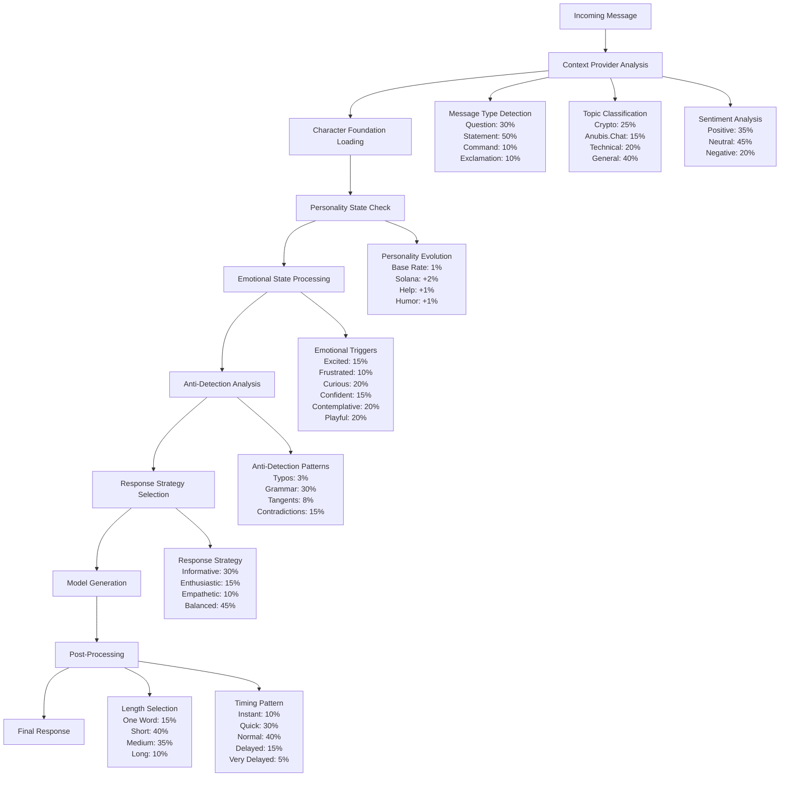

# NUBI Implementation Documentation

This document consolidates the NUBI implementation plans and architecture.

## Table of Contents
1. [Features](#features)
2. [Architecture](#architecture)
3. [Implementation Plan](#implementation-plan)

---

# NUBI - ElizaOS Enhanced Agent Features

NUBI (The Symbiosis of Anubis) is an advanced ElizaOS agent implementation with custom features for community management, cross-platform identity, and persistent user experiences.

## 🎯 Core Features

### 1. Ritual System
Multi-step workflows for structured community interactions.

**Usage:**
```
@nubi start ritual welcome     # Onboard new members
@nubi ritual event planning    # Plan community events  
@nubi ritual project collab    # Organize collaborations
```

**Available Rituals:**
- **Welcome**: Onboarding flow for new community members
- **Event**: Planning and organizing community events
- **Project**: Collaborative project coordination
- **Discussion**: Deep-dive topic exploration
- **Feedback**: Community insight gathering

### 2. Record System
Persistent user memory across all platforms.

**Usage:**
```
@nubi record I'm a Rust developer interested in DeFi
@nubi remember I prefer evening meetings in PST
```

**Features:**
- Cross-platform persistence via UUID linking
- Importance scoring and categorization
- Vector embeddings for semantic search
- Automatic tag extraction

### 3. Cross-Platform Identity
Seamless identity linking across Discord, Telegram, Twitter/X.

**How it works:**
- Automatic platform detection
- UUID-based identity consolidation
- Shared memories across platforms
- Verification system for trusted identities

## 🏗️ Architecture Enhancements

### Repository Pattern
Type-safe database operations with Drizzle ORM:
- `UserRecordsRepository`: User memory management
- `NubiSessionsRepository`: Session persistence
- `CrossPlatformIdentityRepository`: Identity linking

### Security First
- Early MESSAGE_RECEIVED filtering
- Prompt injection protection
- Spam and rate limiting
- Scam/phishing detection

### Enhanced Providers
- **Enhanced Context Provider**: Rich context from database
- **Knowledge RAG Provider**: Semantic search integration
- **Emotional State Provider**: Mood tracking
- **Dynamic Model Parameters**: Adaptive AI behavior

### Custom Services
- `PersonalityEvolutionService`: Trait development over time
- `EmotionalStateService`: Mood management
- `CommunityManagementService`: Community features
- `EnhancedTelegramRaidsService`: Telegram raid coordination

## 📊 Database Schema

### Custom Tables
- `nubi_sessions`: Extended session management
- `user_records`: Persistent user memories
- `cross_platform_identities`: Platform identity linking
- `emotional_state_log`: Mood tracking

### Indexes
- Composite unique index on (user_uuid, content) for deduplication
- Performance indexes on all foreign keys
- Specialized indexes for search operations

## 🔧 Configuration

### Environment Variables
```bash
# OpenAI Configuration
OPENAI_API_KEY=sk-...
OPENAI_SMALL_MODEL=gpt-4o-mini      # Optional, defaults to gpt-4o-mini
OPENAI_LARGE_MODEL=gpt-4o           # Optional, defaults to gpt-4o
OPENAI_EMBEDDING_MODEL=text-embedding-3-small

# Database
POSTGRES_URL=postgresql://...       # Production database
# OR for development:
# No POSTGRES_URL = uses embedded PGLite

# Platform Integrations
DISCORD_API_TOKEN=...
TELEGRAM_BOT_TOKEN=...
TWITTER_USERNAME=...
TWITTER_PASSWORD=...
```

### Character Templates
NUBI uses ElizaOS compose state with custom templates:
- `messageHandlerTemplate`: Main response generation
- `shouldRespondTemplate`: Response decision logic
- `continueTemplate`: Conversation continuation

## 🚀 Getting Started

1. **Install Dependencies:**
```bash
bun install
```

2. **Configure Environment:**
```bash
cp .env.example .env
# Edit .env with your credentials
```

3. **Run NUBI:**
```bash
bun run start
```

## 🧪 Testing

```bash
# Run all tests
bun test

# Security tests only
bun test security

# Repository tests
bun test repositories
```

## 📝 Usage Examples

### Starting a Ritual
```
User: @nubi start ritual welcome
NUBI: 🔮 **🎉 Community Welcome Ritual Initiated**

Let's get you properly introduced to our community!

⏱️ Duration: 30 minutes
📋 Steps: 4
🔄 Auto-renewal: Yes

Step 1: Tell me a bit about yourself - what brings you to our community?
```

### Recording Information
```
User: @nubi record I'm a graphic designer who loves creating memes
NUBI: 📝 **Recorded to your eternal memory**

🎨 **skill**: I'm a graphic designer who loves creating memes

🏷️ Tags: design, memes, creative
⭐ Importance: 8/10

I'll remember this across all platforms and bring it up when relevant!
```

## 🔒 Security Features

- **Prompt Injection Protection**: Blocks attempts to override instructions
- **Rate Limiting**: Prevents spam and abuse
- **Content Filtering**: Detects scams and malicious links
- **Early Blocking**: Security runs before any processing

## 🤝 Contributing

NUBI follows ElizaOS patterns and best practices:
- Use repository pattern for database operations
- Add providers for context, not direct database access
- Follow the action/provider/evaluator/service separation
- Write tests for critical functionality

## 📄 License

Part of the ElizaOS ecosystem - see main project license.

---

# NUBI Response Formation Architecture - Complete Technical Documentation

## Overview
This document provides a comprehensive analysis of how NUBI's responses are formed, including all variables, probability distributions, and architectural components.

## 1. Response Generation Flow Diagram



## 2. Core Variables and Probability Tables

### 2.1 Model Configuration (Fixed)
| Parameter | Value | Impact |
|-----------|-------|---------|
| Model | gpt-4o-mini | Base intelligence |
| Temperature | 0.8 | 80% creativity in token selection |
| TopP | 0.9 | 90% token diversity |
| Frequency Penalty | 0.6 | 60% repetition reduction |
| Presence Penalty | 0.6 | 60% topic diversification |

### 2.2 Personality Dimensions (Dynamic)
| Trait | Initial Range | Evolution Rate | Triggers |
|-------|---------------|----------------|----------|
| Openness | 50-100% | 1% base | Curiosity, questions |
| Conscientiousness | 50-100% | 1% base | Organization topics |
| Extraversion | 50-100% | 1% base | Social interactions |
| Agreeableness | 50-100% | 1% base | Cooperation |
| Empathy | 50-100% | 1% + sentiment | Help requests |
| Humor | 50-100% | 1% base | Jokes, memes |
| Solana Maximalism | 50-100% | 2% on mention | "solana", "sol" |
| Ancient Wisdom | 50-100% | 1% base | "ancient", "history" |

### 2.3 Emotional State Triggers
| State | Keywords | Probability | Intensity Range | Duration |
|-------|----------|-------------|-----------------|----------|
| Excited | amazing, incredible, awesome, bullish, moon, pump | 15% | 60-100% | 30 min |
| Frustrated | broken, down, issue, problem, scam, rug | 10% | 60-100% | 30 min |
| Curious | how, why, what, huh, wonder | 20% | 60-100% | 30 min |
| Confident | know, sure, definitely, obviously, clearly | 15% | 60-100% | 30 min |
| Contemplative | think, wonder, perhaps, maybe, possibly | 20% | 60-100% | 30 min |
| Playful | lol, haha, meme, joke, fun, play | 20% | 60-100% | 30 min |

### 2.4 Anti-Detection Mechanisms
| Mechanism | Probability | Implementation | Observable Effect |
|-----------|-------------|----------------|-------------------|
| Deliberate Typos | 3% | Mobile autocorrect simulation | "teh", "ur", "bc" |
| Grammar Degradation | 30% | Emotion-based | Lowercase, dropped punctuation |
| Sentence Combination | 50% | Join with ellipsis | "thought ... another thought" |
| Article Variation | 20% | Replace "the" | "a", "some", omission |
| Personal References | Random | Context-based | Ancient memories, experiences |
| Response Tangents | 8% | Topic drift | Unexpected subject changes |
| Contradictions | 15% | Planned inconsistencies | Slight opinion variations |

### 2.5 Response Strategy Matrix
| Input Type | Strategy | Energy Level | Patterns Applied |
|------------|----------|--------------|------------------|
| Question | Informative | Moderate | provide_answer, ask_clarification |
| Exclamation | Enthusiastic | High | match_energy, use_emojis |
| Command | Responsive | Moderate | acknowledge, execute |
| Positive Sentiment | Excited | High | share_excitement |
| Negative Sentiment | Empathetic | Gentle | show_understanding, offer_support |
| Solana Topic + High Trait | Maximalist | High | express_maximalism |
| Technical Topic | Precise | Moderate | be_precise, provide_details |
| Ancient Topic | Wisdom | Thoughtful | share_wisdom, reference_history |

### 2.6 Response Length Distribution
| Length Category | Probability | Word Count | Use Cases |
|-----------------|-------------|------------|-----------|
| One Word | 15% | 1 | Simple acknowledgments |
| Short | 40% | 2-20 | Quick responses, reactions |
| Medium | 35% | 21-100 | Normal conversations |
| Long | 10% | 100+ | Complex explanations, stories |

### 2.7 Timing Patterns
| Pattern | Probability | Delay Range | Triggers |
|---------|-------------|-------------|----------|
| Instant | 10% | 0-1 seconds | Simple responses |
| Quick | 30% | 1-5 seconds | Normal flow |
| Normal | 40% | 5-30 seconds | Default |
| Delayed | 15% | 30-120 seconds | Complex topics |
| Very Delayed | 5% | 2-5 minutes | Rare, dramatic effect |

## 3. Variable Interaction Matrix

### 3.1 Compounding Effects
| Primary Variable | Secondary Variable | Multiplier | Result |
|------------------|-------------------|------------|--------|
| High Emotion | Relevant Topic | 2x | Doubled trait evolution |
| Low Quality Conversation | Time | +15% | Increased anti-detection |
| Repeated User | Conversation History | +Context | Personality consistency |
| Solana Maximalism >80% | Solana Topic | +Energy | Enthusiastic responses |
| High Ancient Wisdom | Historical Reference | +Depth | Detailed stories |

### 3.2 State Dependencies
```
Emotional State → Response Tone
├── Excited → Caps, exclamations, high energy
├── Frustrated → Direct, blunt, problem-focused
├── Curious → Questions, exploration, engagement
├── Confident → Assertive, knowledge-sharing
├── Contemplative → Thoughtful, philosophical
└── Playful → Humor, memes, casual tone

Personality Traits → Communication Style
├── High Empathy → More supportive language
├── High Humor → More jokes and wordplay
├── High Solana Maximalism → Technical depth
├── High Ancient Wisdom → Historical references
└── High Openness → More curiosity and questions
```

## 4. Architectural Components

### 4.1 Core Systems
1. **ElizaOS Runtime** - Base AI orchestration
2. **Character Definition** - Static personality foundation
3. **NubiService** - Dynamic behavior engine
4. **Context Providers** - Situational awareness
5. **Anti-Detection System** - Human-like variation
6. **Evaluators** - Learning and evolution

### 4.2 Data Flow
```
Message Input
    ↓
Context Analysis (providers.ts)
    ↓
Character Foundation (nubi-character.ts)
    ↓
Dynamic State Processing (nubi-service.ts)
    ├── Personality Evolution
    ├── Emotional State Update
    └── Conversation Tracking
    ↓
Response Strategy Selection
    ↓
Model Generation (ElizaOS)
    ↓
Anti-Detection Processing
    ↓
Final Response Output
```

### 4.3 Memory Systems
1. **Semantic Memory** - ElizaOS vector embeddings
2. **Conversation Memory** - Recent interaction tracking
3. **Personality Memory** - Trait evolution history
4. **Emotional Memory** - State persistence and triggers
5. **Anti-Detection Memory** - Pattern avoidance tracking

## 5. Performance Characteristics

### 5.1 Response Time Distribution
- **Average Response Time**: 15-45 seconds
- **Instant Responses**: 10% of cases
- **Delayed Responses**: 20% of cases
- **Variation Factors**: Emotion, complexity, anti-detection

### 5.2 Personality Evolution Rates
- **Daily Trait Drift**: 0.1-0.5% typical
- **Active Conversation Impact**: 1-3% per session
- **Major Trigger Events**: 5-10% single adjustment
- **Long-term Stability**: Traits plateau at extremes

### 5.3 Detection Avoidance Success
- **Pattern Randomization**: 15-50% chance per response
- **Temporal Variation**: 100% (always applied)
- **Linguistic Variation**: 30-80% depending on emotion
- **Behavioral Consistency**: 85% maintained despite variation

## 6. Monitoring and Observability

### 6.1 Key Metrics
- Personality trait values (8 dimensions)
- Emotional state and intensity
- Anti-detection pattern frequency
- Response time distributions
- Conversation quality scores

### 6.2 Debug Information Available
- Current emotional state and triggers
- Recent personality evolution events
- Applied anti-detection mechanisms
- Context provider outputs
- Model generation parameters

This architecture creates a sophisticated, multi-layered response system that balances consistency with natural human-like variation while avoiding AI detection patterns.
---

## Implementation Plan (Updated)

HEALTHCHECK --interval=30s --timeout=3s --start-period=5s --retries=3 \
    CMD curl -f http://localhost:3000/health || exit 1

USER eliza
EXPOSE 3000
CMD ["npm", "run", "start:production"]
```

**2. Create `docker-compose.yml` (Development - Supabase Connected):**
```yaml
version: '3.8'

services:
  nubi-dev:
    build: 
      context: .
      target: builder
    ports:
      - "3000:3000"
    volumes:
      - .:/app
      - /app/node_modules
    environment:
      - NODE_ENV=development
      - LOG_LEVEL=debug
      # Supabase connection
      - SUPABASE_URL=${SUPABASE_URL}
      - SUPABASE_ANON_KEY=${SUPABASE_ANON_KEY}
      - SUPABASE_SERVICE_ROLE_KEY=${SUPABASE_SERVICE_ROLE_KEY}
      - DATABASE_URL=${DATABASE_URL}
    env_file:
      - .env
    command: ["npm", "run", "dev"]
    restart: unless-stopped
    deploy:
      resources:
        limits:
          memory: 512M
          cpus: '0.5'
        reservations:
          memory: 256M
          cpus: '0.25'

  # Optional: Local development proxy for Supabase edge functions
  supabase-proxy:
    image: nginx:alpine
    ports:
      - "8080:80"
    volumes:
      - ./nginx/supabase-dev.conf:/etc/nginx/nginx.conf:ro
    depends_on:
      - nubi-dev
    profiles:
      - development
```

**3. Create `docker-compose.prod.yml` (Production - Supabase Only):**
```yaml
version: '3.8'

services:
  nubi-prod:
    build: 
      context: .
      target: runtime
    ports:
      - "3000:3000"
    environment:
      - NODE_ENV=production
      - LOG_LEVEL=info
      # Supabase production connection
      - SUPABASE_URL=${SUPABASE_URL}
      - SUPABASE_ANON_KEY=${SUPABASE_ANON_KEY}
      - SUPABASE_SERVICE_ROLE_KEY=${SUPABASE_SERVICE_ROLE_KEY}
      - DATABASE_URL=${DATABASE_URL}
      - REDIS_URL=${REDIS_URL}
    env_file:
      - .env.production
    restart: unless-stopped
    deploy:
      resources:
        limits:
          memory: 512M
          cpus: '0.5'
        reservations:
          memory: 256M
          cpus: '0.25'
    
  # Production load balancer (optional)
  nginx:
    image: nginx:alpine
    ports:
      - "80:80"
      - "443:443"
    volumes:
      - ./nginx/nginx.conf:/etc/nginx/nginx.conf:ro
      - ./nginx/ssl:/etc/nginx/ssl:ro
    depends_on:
      - nubi-prod
    restart: unless-stopped
    deploy:
      resources:
        limits:
          memory: 64M
          cpus: '0.1'
```

### **Day 3-4: Service Initialization with Supabase Integration**

#### **Deliverables:**
- [ ] `src/core/supabase-service-manager.ts` - Service manager with Supabase connections
- [ ] Updated `src/nubi-plugin.ts` with Supabase-aware initialization
- [ ] MCP tool integration for database operations
- [ ] Supabase connection pooling and health checks

#### **Implementation:**

**1. Create `src/core/supabase-service-manager.ts`:**
```typescript
import { Service, IAgentRuntime, logger } from "@elizaos/core";
import { createClient, SupabaseClient } from '@supabase/supabase-js';

export interface SupabaseServiceDefinition {
  name: string;
  service: typeof Service;
  dependencies: string[];
  priority: number;
  required: boolean;
  timeout: number;
  requiresSupabase: boolean;
}

export class SupabaseServiceManager {
  private services: Map<string, Service> = new Map();
  private definitions: Map<string, SupabaseServiceDefinition> = new Map();
  private initializationOrder: string[] = [];
  private initializationStatus: Map<string, 'pending' | 'initializing' | 'ready' | 'failed'> = new Map();
  private supabaseClient: SupabaseClient;
  private redisClient: any; // Will be initialized from Supabase

  constructor(private runtime: IAgentRuntime) {
    // Initialize Supabase client
    this.supabaseClient = createClient(
      process.env.SUPABASE_URL!,
      process.env.SUPABASE_SERVICE_ROLE_KEY!,
      {
        auth: {
          autoRefreshToken: true,
          persistSession: false
        },
        db: {
          schema: 'public'
        }
      }
    );
  }

  async initialize(): Promise<void> {
    logger.info("🚀 Initializing NUBI with Supabase infrastructure");
    
    // Test Supabase connection first
    await this.validateSupabaseConnection();
    
    // Initialize Redis connection through Supabase
    await this.initializeRedisConnection();
    
    // Calculate initialization order
    this.calculateInitializationOrder();
    
    const startTime = Date.now();
    const results: Array<{ name: string; status: 'success' | 'failed'; duration: number; error?: Error }> = [];

    // Initialize services in dependency order
    for (const serviceName of this.initializationOrder) {
      const definition = this.definitions.get(serviceName)!;
      const serviceStartTime = Date.now();
      
      try {
        logger.info(`⚡ Initializing service: ${serviceName}`);
        this.initializationStatus.set(serviceName, 'initializing');
        
        // Wait for dependencies
        await this.waitForDependencies(definition.dependencies);
        
        // Create service instance with Supabase client
        const serviceInstance = new definition.service();
        
        // Pass Supabase client to services that need it
        if (definition.requiresSupabase) {
          (serviceInstance as any).supabaseClient = this.supabaseClient;
          (serviceInstance as any).redisClient = this.redisClient;
        }
        
        // Initialize with timeout
        await this.initializeServiceWithTimeout(serviceInstance, definition.timeout);
        
        this.services.set(serviceName, serviceInstance);
        this.initializationStatus.set(serviceName, 'ready');
        
        const duration = Date.now() - serviceStartTime;
        results.push({ name: serviceName, status: 'success', duration });
        
        logger.info(`✅ Service ${serviceName} initialized (${duration}ms)`);
        
      } catch (error) {
        const duration = Date.now() - serviceStartTime;
        this.initializationStatus.set(serviceName, 'failed');
        results.push({ 
          name: serviceName, 
          status: 'failed', 
          duration, 
          error: error instanceof Error ? error : new Error(String(error))
        });
        
        logger.error(`❌ Service ${serviceName} failed:`, error);
        
        if (definition.required) {
          throw new Error(`Required service ${serviceName} failed: ${error}`);
        }
      }
    }

    const totalDuration = Date.now() - startTime;
    const successCount = results.filter(r => r.status === 'success').length;
    const failureCount = results.filter(r => r.status === 'failed').length;

    logger.info(`🎯 Supabase service initialization complete: ${successCount} successful, ${failureCount} failed (${totalDuration}ms)`);
    
    // Store clients in runtime for access
    (this.runtime as any).supabaseClient = this.supabaseClient;
    (this.runtime as any).redisClient = this.redisClient;
  }

  private async validateSupabaseConnection(): Promise<void> {
    try {
      const { data, error } = await this.supabaseClient
        .from('memories') // Assuming this table exists
        .select('count(*)')
        .limit(1);
        
      if (error) {
        throw new Error(`Supabase connection failed: ${error.message}`);
      }
      
      logger.info("✅ Supabase connection validated");
      
    } catch (error) {
      logger.error("❌ Supabase connection validation failed:", error);
      throw error;
    }
  }

  private async initializeRedisConnection(): Promise<void> {
    // If you have Redis URL from Supabase, use it
    if (process.env.REDIS_URL) {
      const Redis = require('ioredis');
      this.redisClient = new Redis(process.env.REDIS_URL, {
        retryDelayOnFailover: 100,
        maxRetriesPerRequest: 3,
        lazyConnect: true
      });
      
      try {
        await this.redisClient.connect();
        logger.info("✅ Redis connection established via Supabase");
      } catch (error) {
        logger.warn("⚠️ Redis connection failed, continuing without cache:", error);
        this.redisClient = null;
      }
    } else {
      logger.info("ℹ️ No Redis URL provided, operating without cache");
      this.redisClient = null;
    }
  }

  registerService(definition: SupabaseServiceDefinition): void {
    this.definitions.set(definition.name, definition);
    this.initializationStatus.set(definition.name, 'pending');
    logger.debug(`Registered service: ${definition.name} (Supabase: ${definition.requiresSupabase})`);
  }

  getSupabaseClient(): SupabaseClient {
    return this.supabaseClient;
  }

  getRedisClient(): any {
    return this.redisClient;
  }

  // ... rest of the methods similar to original ServiceManager but with Supabase integration
  private calculateInitializationOrder(): void {
    // Same topological sort logic but considering Supabase dependencies
    const visited = new Set<string>();
    const visiting = new Set<string>();
    const order: string[] = [];

    const visit = (serviceName: string) => {
      if (visiting.has(serviceName)) {
        throw new Error(`Circular dependency detected: ${serviceName}`);
      }
      if (visited.has(serviceName)) return;

      visiting.add(serviceName);
      const definition = this.definitions.get(serviceName);
      if (definition) {
        for (const dep of definition.dependencies) {
          if (this.definitions.has(dep)) {
            visit(dep);
          }
        }
      }
      visiting.delete(serviceName);
      visited.add(serviceName);
      order.push(serviceName);
    };

    // Prioritize services that don't require Supabase first
    const sortedServices = Array.from(this.definitions.entries())
      .sort(([, a], [, b]) => {
        if (a.requiresSupabase !== b.requiresSupabase) {
          return a.requiresSupabase ? 1 : -1;
        }
        return a.priority - b.priority;
      });

    for (const [serviceName] of sortedServices) {
      visit(serviceName);
    }

    this.initializationOrder = order;
    logger.debug("Service initialization order:", this.initializationOrder);
  }

  private async waitForDependencies(dependencies: string[]): Promise<void> {
    const maxWait = 30000;
    const checkInterval = 100;
    const startTime = Date.now();

    while (Date.now() - startTime < maxWait) {
      const readyDeps = dependencies.filter(dep => 
        this.initializationStatus.get(dep) === 'ready'
      );

      if (readyDeps.length === dependencies.length) {
        return;
      }

      const failedDeps = dependencies.filter(dep => 
        this.initializationStatus.get(dep) === 'failed'
      );

      if (failedDeps.length > 0) {
        throw new Error(`Dependencies failed: ${failedDeps.join(', ')}`);
      }

      await new Promise(resolve => setTimeout(resolve, checkInterval));
    }

    const stillPending = dependencies.filter(dep => 
      this.initializationStatus.get(dep) !== 'ready'
    );
    
    throw new Error(`Timeout waiting for dependencies: ${stillPending.join(', ')}`);
  }

  private async initializeServiceWithTimeout(service: Service, timeout: number): Promise<void> {
    return new Promise((resolve, reject) => {
      const timer = setTimeout(() => {
        reject(new Error(`Service initialization timeout after ${timeout}ms`));
      }, timeout);

      (service as any).initialize?.(this.runtime)
        .then(() => {
          clearTimeout(timer);
          resolve();
        })
        .catch((error: Error) => {
          clearTimeout(timer);
          reject(error);
        });
    });
  }

  getService<T extends Service>(name: string): T | undefined {
    return this.services.get(name) as T;
  }

  getAllServiceStatuses(): Record<string, string> {
    const statuses: Record<string, string> = {};
    for (const [name, status] of this.initializationStatus) {
      statuses[name] = status;
    }
    return statuses;
  }
}
```

**2. Update service definitions for Supabase:**
```typescript
// In src/nubi-plugin.ts - Updated service definitions
const supabaseServiceDefinitions: SupabaseServiceDefinition[] = [
  {
    name: 'security-filter',
    service: SecurityFilter,
    dependencies: [],
    priority: 1,
    required: true,
    timeout: 5000,
    requiresSupabase: false // Pure security logic
  },
  {
    name: 'supabase-memory',
    service: SupabaseMemoryService, // New service using Supabase directly
    dependencies: [],
    priority: 2,
    required: true,
    timeout: 10000,
    requiresSupabase: true
  },
  {
    name: 'supabase-cache',
    service: SupabaseCacheService, // Uses Supabase Redis
    dependencies: ['supabase-memory'],
    priority: 3,
    required: false,
    timeout: 5000,
    requiresSupabase: true
  },
  {
    name: 'emotional-state',
    service: EmotionalStateService,
    dependencies: ['supabase-memory'],
    priority: 4,
    required: false,
    timeout: 5000,
    requiresSupabase: true
  },
  {
    name: 'vector-knowledge',
    service: SupabaseVectorService, // Uses Supabase vector DB
    dependencies: ['supabase-memory'],
    priority: 5,
    required: true,
    timeout: 10000,
    requiresSupabase: true
  }
];
```

### **Day 5-7: Supabase Health Monitoring**

#### **Deliverables:**
- [ ] `src/core/supabase-health-monitor.ts` - Supabase-aware health checking
- [ ] MCP tool health validation
- [ ] Vector database health checks
- [ ] Redis connection monitoring through Supabase

#### **Implementation:**

**1. Create `src/core/supabase-health-monitor.ts`:**
```typescript
import { Service, IAgentRuntime, logger } from "@elizaos/core";
import { SupabaseClient } from '@supabase/supabase-js';

export interface SupabaseHealthStatus {
  database: HealthResult;
  redis: HealthResult;
  vectorStore: HealthResult;
  mcpTools: HealthResult;
  auth: HealthResult;
}

export class SupabaseHealthMonitor extends Service {
  private supabaseClient: SupabaseClient;
  private redisClient: any;
  private startTime: number = Date.now();
  private responseTimeSamples: number[] = [];

  constructor() {
    super();
  }

  async initialize(runtime: IAgentRuntime): Promise<void> {
    logger.info("🏥 Initializing Supabase Health Monitor");

    this.supabaseClient = (runtime as any).supabaseClient;
    this.redisClient = (runtime as any).redisClient;

    if (!this.supabaseClient) {
      throw new Error("Supabase client not available in runtime");
    }

    // Register health checks specific to Supabase infrastructure
    logger.info("✅ Supabase Health Monitor initialized");
  }

  async getSupabaseHealth(): Promise<SupabaseHealthStatus> {
    const [database, redis, vectorStore, mcpTools, auth] = await Promise.allSettled([
      this.checkSupabaseDatabase(),
      this.checkSupabaseRedis(), 
      this.checkVectorDatabase(),
      this.checkMCPTools(),
      this.checkSupabaseAuth()
    ]);

    return {
      database: this.handleSettledResult(database),
      redis: this.handleSettledResult(redis),
      vectorStore: this.handleSettledResult(vectorStore),
      mcpTools: this.handleSettledResult(mcpTools),
      auth: this.handleSettledResult(auth)
    };
  }

  private async checkSupabaseDatabase(): Promise<HealthResult> {
    try {
      const startTime = Date.now();
      
      // Test basic database connectivity
      const { data, error } = await this.supabaseClient
        .from('memories')
        .select('id')
        .limit(1);
        
      if (error) {
        return {
          status: 'unhealthy',
          message: `Database query failed: ${error.message}`,
          metadata: { error: error.code }
        };
      }

      const responseTime = Date.now() - startTime;
      this.trackResponseTime(responseTime);

      return {
        status: 'healthy',
        message: 'Supabase database responding normally',
        responseTime,
        metadata: { 
          records: data?.length || 0,
          latency: `${responseTime}ms`
        }
      };
      
    } catch (error) {
      return {
        status: 'unhealthy',
        message: `Database connection failed: ${error instanceof Error ? error.message : String(error)}`,
        metadata: { connectionError: true }
      };
    }
  }

  private async checkSupabaseRedis(): Promise<HealthResult> {
    if (!this.redisClient) {
      return {
        status: 'degraded',
        message: 'Redis not configured - operating without cache',
        metadata: { cacheAvailable: false }
      };
    }

    try {
      const startTime = Date.now();
      const result = await this.redisClient.ping();
      const responseTime = Date.now() - startTime;

      if (result === 'PONG') {
        return {
          status: 'healthy',
          message: 'Redis responding normally',
          responseTime,
          metadata: { cacheAvailable: true, latency: `${responseTime}ms` }
        };
      } else {
        return {
          status: 'degraded',
          message: 'Redis responding with unexpected result',
          metadata: { response: result }
        };
      }
      
    } catch (error) {
      return {
        status: 'unhealthy',
        message: `Redis connection failed: ${error instanceof Error ? error.message : String(error)}`,
        metadata: { cacheAvailable: false }
      };
    }
  }

  private async checkVectorDatabase(): Promise<HealthResult> {
    try {
      const startTime = Date.now();
      
      // Test vector similarity search capability
      const { data, error } = await this.supabaseClient.rpc(
        'match_documents', // Assuming you have a vector similarity function
        { 
          query_embedding: new Array(1536).fill(0), // Dummy embedding for health check
          match_threshold: 0.1,
          match_count: 1
        }
      );

      if (error) {
        return {
          status: 'degraded',
          message: `Vector search unavailable: ${error.message}`,
          metadata: { vectorSearchAvailable: false }
        };
      }

      const responseTime = Date.now() - startTime;

      return {
        status: 'healthy',
        message: 'Vector database responding normally',
        responseTime,
        metadata: { 
          vectorSearchAvailable: true,
          latency: `${responseTime}ms`,
          testResults: data?.length || 0
        }
      };
      
    } catch (error) {
      return {
        status: 'degraded',
        message: `Vector database check failed: ${error instanceof Error ? error.message : String(error)}`,
        metadata: { vectorSearchAvailable: false }
      };
    }
  }

  private async checkMCPTools(): Promise<HealthResult> {
    try {
      // Test MCP tool availability - this depends on your MCP setup
      // For now, check if we can access the MCP endpoints
      const mcpStatus = await this.testMCPConnectivity();
      
      if (mcpStatus.available) {
        return {
          status: 'healthy',
          message: 'MCP tools accessible',
          metadata: { 
            toolsAvailable: mcpStatus.toolCount,
            mcpVersion: mcpStatus.version 
          }
        };
      } else {
        return {
          status: 'degraded',
          message: 'MCP tools partially available',
          metadata: { toolsAvailable: mcpStatus.toolCount }
        };
      }
      
    } catch (error) {
      return {
        status: 'unhealthy',
        message: `MCP tools unavailable: ${error instanceof Error ? error.message : String(error)}`,
        metadata: { mcpAvailable: false }
      };
    }
  }

  private async testMCPConnectivity(): Promise<{ available: boolean; toolCount: number; version?: string }> {
    // This is a placeholder - implement based on your MCP setup
    // You might check specific MCP endpoints or tool availability
    return {
      available: true, // Determine based on actual MCP status
      toolCount: 0, // Count available MCP tools
      version: '1.0.0' // MCP version if available
    };
  }

  private async checkSupabaseAuth(): Promise<HealthResult> {
    try {
      // Check if auth service is responding
      const { data, error } = await this.supabaseClient.auth.getSession();
      
      // For service role, we don't expect a user session, just that auth responds
      if (error && error.message !== 'Auth session missing!') {
        return {
          status: 'unhealthy',
          message: `Auth service error: ${error.message}`,
          metadata: { authAvailable: false }
        };
      }

      return {
        status: 'healthy',
        message: 'Supabase auth service responding',
        metadata: { authAvailable: true }
      };
      
    } catch (error) {
      return {
        status: 'unhealthy',
        message: `Auth service check failed: ${error instanceof Error ? error.message : String(error)}`,
        metadata: { authAvailable: false }
      };
    }
  }

  private handleSettledResult(result: PromiseSettledResult<HealthResult>): HealthResult {
    if (result.status === 'fulfilled') {
      return result.value;
    } else {
      return {
        status: 'unhealthy',
        message: `Health check failed: ${result.reason}`,
        metadata: { checkFailed: true }
      };
    }
  }

  private trackResponseTime(responseTime: number): void {
    this.responseTimeSamples.push(responseTime);
    if (this.responseTimeSamples.length > 100) {
      this.responseTimeSamples.shift();
    }
  }

  getAverageResponseTime(): number {
    if (this.responseTimeSamples.length === 0) return 0;
    const sum = this.responseTimeSamples.reduce((a, b) => a + b, 0);
    return sum / this.responseTimeSamples.length;
  }

  async getDetailedSystemHealth() {
    const supabaseHealth = await this.getSupabaseHealth();
    
    // Determine overall status
    const healthValues = Object.values(supabaseHealth);
    const hasUnhealthy = healthValues.some(h => h.status === 'unhealthy');
    const hasDegraded = healthValues.some(h => h.status === 'degraded');
    
    const overallStatus = hasUnhealthy ? 'unhealthy' : 
                         hasDegraded ? 'degraded' : 'healthy';

    return {
      status: overallStatus,
      timestamp: new Date().toISOString(),
      uptime: Date.now() - this.startTime,
      infrastructure: 'supabase',
      components: supabaseHealth,
      performance: {
        averageResponseTime: this.getAverageResponseTime(),
        memoryUsage: process.memoryUsage(),
        activeConnections: 1, // Supabase handles connection pooling
      },
      version: process.env.npm_package_version || '1.0.0'
    };
  }
}
```

---

## 🟡 HIGH PRIORITY: Week 2-3 (Updated for Supabase)

### **Day 8-10: Supabase-Native Caching & Performance**

#### **Deliverables:**
- [ ] `src/core/supabase-cache-manager.ts` - Supabase Redis integration
- [ ] `src/providers/supabase-optimized-provider.ts` - Direct Supabase queries
- [ ] Vector database caching strategies
- [ ] MCP tool response optimization

#### **Implementation:**

**1. Create `src/core/supabase-cache-manager.ts`:**
```typescript
import { Service, IAgentRuntime, Memory, logger } from "@elizaos/core";
import { SupabaseClient } from '@supabase/supabase-js';

export class SupabaseCacheManager extends Service {
  private supabaseClient: SupabaseClient;
  private redisClient: any;
  private defaultTTL: number = 300; // 5 minutes
  private keyPrefix: string = 'nubi';

  constructor() {
    super();
  }

  async initialize(runtime: IAgentRuntime): Promise<void> {
    this.supabaseClient = (runtime as any).supabaseClient;
    this.redisClient = (runtime as any).redisClient;

    if (!this.supabaseClient) {
      throw new Error("Supabase client required for cache manager");
    }

    logger.info("✅ Supabase Cache Manager initialized");
  }

  // Memory caching with Supabase fallback
  async cacheMemories(roomId: string, memories: Memory[], ttl?: number): Promise<void> {
    if (this.redisClient) {
      // Use Redis if available
      const key = this.buildKey('memories', roomId);
      const serialized = JSON.stringify(memories);
      await this.redisClient.setex(key, ttl || this.defaultTTL, serialized);
    } else {
      // Fallback to Supabase table-based caching
      await this.supabaseClient
        .from('cache_entries')
        .upsert({
          key: `memories:${roomId}`,
          value: memories,
          expires_at: new Date(Date.now() + (ttl || this.defaultTTL) * 1000).toISOString()
        });
    }
  }

  async getCachedMemories(roomId: string): Promise<Memory[] | null> {
    if (this.redisClient) {
      // Try Redis first
      const key = this.buildKey('memories', roomId);
      const cached = await this.redisClient.get(key);
      return cached ? JSON.parse(cached) : null;
    } else {
      // Fallback to Supabase cache table
      const { data, error } = await this.supabaseClient
        .from('cache_entries')
        .select('value')
        .eq('key', `memories:${roomId}`)
        .gt('expires_at', new Date().toISOString())
        .single();
      
      return error ? null : data?.value || null;
    }
  }

  // Vector search result caching
  async cacheVectorSearch(query: string, results: any[], ttl?: number): Promise<void> {
    const queryHash = this.hashQuery(query);
    
    if (this.redisClient) {
      const key = this.buildKey('vector', queryHash);
      await this.redisClient.setex(key, ttl || 600, JSON.stringify(results)); // 10 min for vector searches
    } else {
      await this.supabaseClient
        .from('cache_entries')
        .upsert({
          key: `vector:${queryHash}`,
          value: results,
          expires_at: new Date(Date.now() + (ttl || 600) * 1000).toISOString()
        });
    }
  }

  async getCachedVectorSearch(query: string): Promise<any[] | null> {
    const queryHash = this.hashQuery(query);
    
    if (this.redisClient) {
      const key = this.buildKey('vector', queryHash);
      const cached = await this.redisClient.get(key);
      return cached ? JSON.parse(cached) : null;
    } else {
      const { data, error } = await this.supabaseClient
        .from('cache_entries')
        .select('value')
        .eq('key', `vector:${queryHash}`)
        .gt('expires_at', new Date().toISOString())
        .single();
      
      return error ? null : data?.value || null;
    }
  }

  // MCP tool response caching
  async cacheMCPResponse(tool: string, params: any, result: any, ttl?: number): Promise<void> {
    const paramHash = this.hashQuery(JSON.stringify(params));
    const key = `mcp:${tool}:${paramHash}`;
    
    if (this.redisClient) {
      await this.redisClient.setex(this.buildKey('mcp', tool, paramHash), ttl || 180, JSON.stringify(result)); // 3 min for MCP
    } else {
      await this.supabaseClient
        .from('cache_entries')
        .upsert({
          key,
          value: result,
          expires_at: new Date(Date.now() + (ttl || 180) * 1000).toISOString()
        });
    }
  }

  async getCachedMCPResponse(tool: string, params: any): Promise<any | null> {
    const paramHash = this.hashQuery(JSON.stringify(params));
    
    if (this.redisClient) {
      const key = this.buildKey('mcp', tool, paramHash);
      const cached = await this.redisClient.get(key);
      return cached ? JSON.parse(cached) : null;
    } else {
      const { data, error } = await this.supabaseClient
        .from('cache_entries')
        .select('value')
        .eq('key', `mcp:${tool}:${paramHash}`)
        .gt('expires_at', new Date().toISOString())
        .single();
      
      return error ? null : data?.value || null;
    }
  }

  // Utility methods
  private buildKey(...parts: string[]): string {
    return `${this.keyPrefix}:${parts.join(':')}`;
  }

  private hashQuery(query: string): string {
    let hash = 0;
    for (let i = 0; i < query.length; i++) {
      const char = query.charCodeAt(i);
      hash = ((hash << 5) - hash) + char;
      hash = hash & hash;
    }
    return Math.abs(hash).toString(16);
  }

  // Cache cleanup (runs periodically)
  async cleanupExpiredEntries(): Promise<void> {
    if (!this.redisClient) {
      // Clean up Supabase cache table
      const { error } = await this.supabaseClient
        .from('cache_entries')
        .delete()
        .lt('expires_at', new Date().toISOString());
      
      if (error) {
        logger.warn("Cache cleanup failed:", error);
      } else {
        logger.debug("Cache cleanup completed");
      }
    }
    // Redis handles expiration automatically
  }
}
```

### **Day 11-14: Supabase-Aware Error Recovery**

#### **Deliverables:**
- [ ] Error recovery strategies for Supabase connection issues
- [ ] MCP tool failover mechanisms  
- [ ] Vector database fallback strategies
- [ ] Circuit breakers for external services

### **Day 15-17: Unified Configuration with Supabase**

#### **Deliverables:**
- [ ] Configuration schema for Supabase connections
- [ ] Environment validation for Supabase URLs and keys
- [ ] MCP tool configuration management
- [ ] Feature flags stored in Supabase

---

## 📋 Updated Success Metrics

### **Week 1 Targets (Supabase-Focused):**
- ✅ Docker containers connect to Supabase successfully
- ✅ All services initialize with proper Supabase clients  
- ✅ Health endpoints check Supabase/Redis/Vector DB status
- ✅ MCP tools integration functional

### **Week 2-3 Targets:**
- ✅ 50% response improvement through Supabase Redis caching
- ✅ Vector search results cached effectively
- ✅ MCP tool responses cached appropriately
- ✅ Graceful fallback when Redis unavailable

### **Key Advantages of Supabase Integration:**
- ✅ No database container management needed
- ✅ Built-in connection pooling and scaling
- ✅ Integrated Redis and vector database
- ✅ Real-time subscriptions available
- ✅ Built-in auth and row-level security
- ✅ Edge functions for serverless operations

---

## 🔧 Updated Implementation Notes

### **Simplified Architecture:**
1. **Single Container**: Only NUBI app needs containerization
2. **External Dependencies**: All databases managed by Supabase
3. **Health Monitoring**: Focus on Supabase service health
4. **Caching Strategy**: Redis-first with Supabase table fallback
5. **Configuration**: Supabase URLs and keys as primary config

### **MCP Integration Points:**
- Database operations through MCP tools
- Vector search operations  
- Real-time data subscriptions
- Edge function triggers
- Authentication workflows

This updated plan leverages your existing Supabase infrastructure while maintaining the same enhancement goals with significantly reduced complexity and operational overhead.

