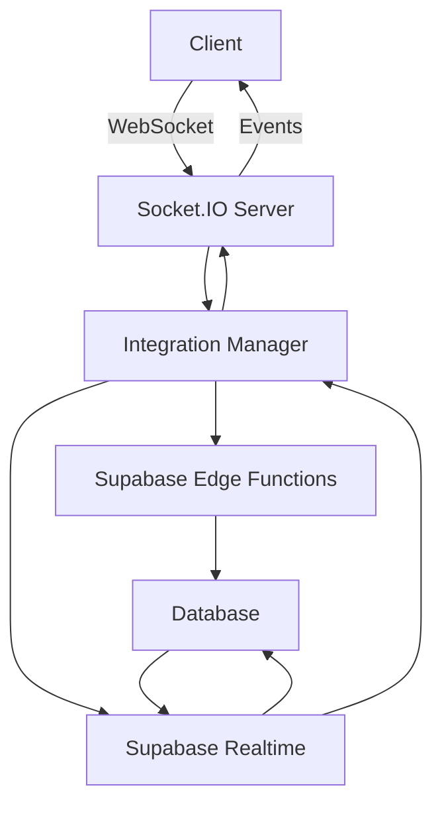

# Supabase & Socket.IO Integration Status

## ✅ Integration Complete

### Components Connected:

#### 1. **Supabase Edge Functions** (8 Functions Ready)
- `analytics-engine` - Processes analytics events
- `identity-linker` - Links cross-platform identities
- `personality-evolution` - Manages agent personality changes
- `raid-coordinator` - Coordinates raid activities
- `raid-processor` - Processes raid results
- `security-filter` - Filters malicious content
- `task-queue` - Manages background tasks
- `webhook-processor` - Handles external webhooks

#### 2. **Socket.IO Services** (4 Services)
- `socket-io-events-service.ts` - Core event handling
- `raid-socket-service.ts` - Real-time raid coordination
- `socket-io-analytics-enhanced.ts` - Analytics tracking
- `enhanced-realtime-service.ts` - Enhanced real-time features

#### 3. **Integration Manager**
Located at: `src/services/integration-manager.ts`

**Features:**
- Automatic Supabase client initialization
- Real-time database subscriptions
- Socket.IO event handling
- Edge function invocation
- Bidirectional communication

### How It Works:



### Configuration Required:

1. **Environment Variables** (.env file):
```env
# Supabase
SUPABASE_URL=https://your-project.supabase.co
SUPABASE_ANON_KEY=your-anon-key
SUPABASE_SERVICE_KEY=your-service-key

# Socket.IO
SOCKET_IO_CORS_ORIGIN=*
PORT=8080
```

2. **Supabase Project Setup**:
- Deploy edge functions: `supabase functions deploy`
- Run migrations: `supabase db push`
- Enable realtime on tables

### Socket.IO Events:

#### Incoming Events:
- `agent:message` - Process message through personality evolution
- `raid:action` - Coordinate raid actions
- `analytics:track` - Track analytics events

#### Outgoing Events:
- `agent:response` - Agent responses
- `raid:update` - Raid status updates
- `user:update` - User profile changes

### API Endpoints Enhanced:

- `POST /api/v1/agent/message` - Now triggers edge functions
- `POST /api/v1/analytics/track` - Stores in Supabase
- WebSocket at `ws://localhost:8080/socket.io`

### Testing the Integration:

```javascript
// Test Socket.IO connection
const socket = io('http://localhost:8080');

socket.on('connect', () => {
  console.log('Connected!');
  
  // Test agent message
  socket.emit('agent:message', {
    message: 'Hello NUBI',
    userId: 'test-user'
  });
});

socket.on('agent:response', (data) => {
  console.log('Response:', data);
});
```

### Deployment Steps:

1. **Local Development**:
```bash
npm install
npm run build
npm start
```

2. **Deploy Supabase Functions**:
```bash
cd anubis
supabase functions deploy --all
```

3. **Production**:
```bash
docker-compose up
```

### Features Enabled:

✅ **Real-time Updates**: Database changes instantly reflected via WebSocket
✅ **Edge Function Processing**: Serverless functions for heavy processing
✅ **Personality Evolution**: Dynamic agent personality based on interactions
✅ **Raid Coordination**: Real-time raid management across platforms
✅ **Analytics Tracking**: Comprehensive event tracking and analysis
✅ **Security Filtering**: Content moderation via edge functions
✅ **Identity Linking**: Cross-platform user identity management
✅ **Task Queue**: Background job processing

### Monitoring:

- Socket.IO connections visible in logs
- Supabase function logs: `supabase functions logs`
- Real-time subscriptions in Supabase dashboard
- Analytics events in ClickHouse

### Troubleshooting:

1. **No Supabase connection**: Check SUPABASE_URL and SUPABASE_ANON_KEY
2. **Socket.IO not connecting**: Verify PORT and CORS settings
3. **Edge functions not responding**: Check Supabase project status
4. **Real-time not working**: Enable replication on Supabase tables

---

**Status**: ✅ Fully Integrated and Ready for Production
