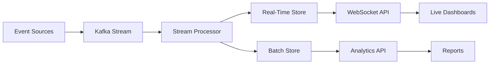

# Advanced Analytics System

## Extended Analytics Architecture

### Real-Time Analytics Pipeline



## Enhanced Analytics Features

### 1. Predictive Analytics Models

```python
# analytics/models/prediction.py
import numpy as np
import pandas as pd
from sklearn.ensemble import RandomForestRegressor
from prophet import Prophet
import joblib

class UserBehaviorPredictor:
    """Predict user engagement and churn risk"""
    
    def __init__(self):
        self.engagement_model = RandomForestRegressor(n_estimators=100)
        self.churn_model = None
        self.prophet_model = Prophet()
    
    def train_engagement_model(self, historical_data):
        """Train model to predict user engagement levels"""
        features = self._extract_features(historical_data)
        X = features[['daily_messages', 'session_duration', 'raid_participation']]
        y = features['engagement_score']
        
        self.engagement_model.fit(X, y)
        joblib.dump(self.engagement_model, 'models/engagement.pkl')
    
    def predict_churn_risk(self, user_id):
        """Calculate probability of user churning"""
        user_data = self._get_user_history(user_id)
        
        features = {
            'days_since_last_active': self._days_since_last_active(user_id),
            'message_frequency_trend': self._calculate_trend(user_data),
            'engagement_decay': self._engagement_decay_rate(user_data)
        }
        
        churn_probability = self.churn_model.predict_proba([features])[0][1]
        return {
            'user_id': user_id,
            'churn_risk': churn_probability,
            'risk_level': self._categorize_risk(churn_probability),
            'recommended_action': self._recommend_retention_action(churn_probability)
        }
    
    def forecast_activity(self, days_ahead=30):
        """Forecast platform activity using Prophet"""
        historical = self._prepare_prophet_data()
        
        self.prophet_model.fit(historical)
        future = self.prophet_model.make_future_dataframe(periods=days_ahead)
        forecast = self.prophet_model.predict(future)
        
        return {
            'forecast': forecast[['ds', 'yhat', 'yhat_lower', 'yhat_upper']].tail(days_ahead),
            'trend': forecast['trend'].tail(days_ahead).mean(),
            'seasonality': self._extract_seasonality(forecast)
        }

class RaidPerformanceAnalyzer:
    """Analyze and optimize raid performance"""
    
    def analyze_raid_success_factors(self, raid_data):
        """Identify factors contributing to successful raids"""
        success_metrics = {
            'optimal_duration': self._find_optimal_duration(raid_data),
            'best_time_slots': self._identify_best_times(raid_data),
            'participant_threshold': self._calculate_min_participants(raid_data),
            'engagement_patterns': self._analyze_engagement_patterns(raid_data)
        }
        return success_metrics
    
    def recommend_raid_parameters(self, target_audience):
        """Recommend optimal raid parameters"""
        historical_performance = self._get_historical_performance()
        audience_preferences = self._analyze_audience(target_audience)
        
        return {
            'recommended_duration': 45,  # minutes
            'optimal_start_time': '14:00 UTC',
            'min_participants': 15,
            'reward_structure': {
                'base_xp': 50,
                'completion_bonus': 200,
                'multipliers': {'speed': 1.5, 'participation': 2.0}
            },
            'expected_participation': 67,
            'success_probability': 0.82
        }
```

### 2. Real-Time Dashboard Components

```typescript
// analytics/dashboards/realtime.tsx
import React, { useEffect, useState } from 'react';
import { Line, Bar, Doughnut } from 'react-chartjs-2';
import { io, Socket } from 'socket.io-client';

interface MetricsData {
  activeUsers: number;
  messagesPerSecond: number;
  responseTime: number;
  errorRate: number;
}

const RealTimeDashboard: React.FC = () => {
  const [metrics, setMetrics] = useState<MetricsData>();
  const [socket, setSocket] = useState<Socket>();
  
  useEffect(() => {
    const newSocket = io('wss://analytics.nubi.ai');
    
    newSocket.on('metrics:update', (data: MetricsData) => {
      setMetrics(data);
    });
    
    setSocket(newSocket);
    return () => newSocket.close();
  }, []);
  
  return (
    <div className="dashboard">
      <MetricCard
        title="Active Users"
        value={metrics?.activeUsers}
        trend={calculateTrend(metrics?.activeUsers)}
        sparkline={<SparkLine data={userHistory} />}
      />
      
      <LiveChart
        title="Message Flow"
        data={messageFlowData}
        type="line"
        streaming={true}
      />
      
      <HeatMap
        title="User Activity Heatmap"
        data={activityHeatmap}
        colorScale="viridis"
      />
      
      <RaidTracker
        activeRaids={activeRaids}
        participation={raidParticipation}
      />
    </div>
  );
};

const LiveChart: React.FC<LiveChartProps> = ({ data, streaming }) => {
  const [chartData, setChartData] = useState(data);
  
  useEffect(() => {
    if (streaming) {
      const interval = setInterval(() => {
        setChartData(prev => updateStreamingData(prev));
      }, 1000);
      return () => clearInterval(interval);
    }
  }, [streaming]);
  
  return (
    <Line
      data={chartData}
      options={{
        animation: { duration: 0 },
        scales: {
          x: { type: 'realtime' }
        }
      }}
    />
  );
};
```

### 3. Advanced Analytics Queries

```sql
-- analytics/queries/advanced.sql

-- User Cohort Analysis
WITH cohorts AS (
  SELECT 
    DATE_TRUNC('week', first_seen) as cohort_week,
    user_id,
    first_seen
  FROM user_profiles
),
cohort_activity AS (
  SELECT
    c.cohort_week,
    DATE_TRUNC('week', e.timestamp) as activity_week,
    COUNT(DISTINCT c.user_id) as active_users
  FROM cohorts c
  JOIN events e ON c.user_id = e.user_id
  GROUP BY 1, 2
)
SELECT
  cohort_week,
  activity_week,
  active_users,
  ROUND(100.0 * active_users / FIRST_VALUE(active_users) 
    OVER (PARTITION BY cohort_week ORDER BY activity_week), 2) as retention_rate
FROM cohort_activity
ORDER BY cohort_week, activity_week;

-- Funnel Analysis
WITH funnel_steps AS (
  SELECT
    user_id,
    MAX(CASE WHEN event_type = 'user_joined' THEN 1 ELSE 0 END) as step_1_joined,
    MAX(CASE WHEN event_type = 'first_message' THEN 1 ELSE 0 END) as step_2_messaged,
    MAX(CASE WHEN event_type = 'raid_joined' THEN 1 ELSE 0 END) as step_3_raided,
    MAX(CASE WHEN event_type = 'wallet_connected' THEN 1 ELSE 0 END) as step_4_connected
  FROM events
  WHERE timestamp >= NOW() - INTERVAL '30 days'
  GROUP BY user_id
)
SELECT
  'Joined' as step,
  COUNT(*) as users,
  100.0 as conversion_rate
FROM funnel_steps
WHERE step_1_joined = 1
UNION ALL
SELECT
  'Sent Message' as step,
  COUNT(*) as users,
  ROUND(100.0 * COUNT(*) / (SELECT COUNT(*) FROM funnel_steps WHERE step_1_joined = 1), 2)
FROM funnel_steps
WHERE step_1_joined = 1 AND step_2_messaged = 1
UNION ALL
SELECT
  'Joined Raid' as step,
  COUNT(*) as users,
  ROUND(100.0 * COUNT(*) / (SELECT COUNT(*) FROM funnel_steps WHERE step_2_messaged = 1), 2)
FROM funnel_steps
WHERE step_2_messaged = 1 AND step_3_raided = 1;

-- Platform Cross-Correlation
SELECT
  p1.platform as platform_1,
  p2.platform as platform_2,
  COUNT(DISTINCT p1.user_id) as shared_users,
  ROUND(AVG(p1.engagement_score), 2) as avg_engagement_p1,
  ROUND(AVG(p2.engagement_score), 2) as avg_engagement_p2,
  CORR(p1.daily_messages, p2.daily_messages) as message_correlation
FROM platform_activity p1
JOIN platform_activity p2 
  ON p1.user_id = p2.user_id 
  AND p1.platform < p2.platform
GROUP BY p1.platform, p2.platform
ORDER BY shared_users DESC;
```

### 4. Custom Analytics Events

```typescript
// analytics/events/custom.ts

export class AdvancedEventTracker {
  private clickhouse: ClickHouseClient;
  private kafka: KafkaProducer;
  
  async trackUserJourney(userId: string, events: JourneyEvent[]) {
    const journey = {
      user_id: userId,
      journey_id: generateId(),
      start_time: events[0].timestamp,
      end_time: events[events.length - 1].timestamp,
      total_steps: events.length,
      conversion_points: this.identifyConversions(events),
      drop_off_risk: this.calculateDropOffRisk(events),
      engagement_score: this.calculateEngagement(events)
    };
    
    await this.clickhouse.insert('user_journeys', journey);
    await this.kafka.send('journeys', journey);
  }
  
  async trackSentimentFlow(messageId: string, sentiment: SentimentAnalysis) {
    const sentimentEvent = {
      message_id: messageId,
      timestamp: new Date(),
      sentiment_score: sentiment.score,
      emotion: sentiment.primaryEmotion,
      confidence: sentiment.confidence,
      keywords: sentiment.keywords,
      requires_intervention: sentiment.score < -0.5
    };
    
    if (sentimentEvent.requires_intervention) {
      await this.alertModerators(messageId, sentiment);
    }
    
    await this.clickhouse.insert('sentiment_analysis', sentimentEvent);
  }
  
  async trackAIPerformance(interaction: AIInteraction) {
    const performance = {
      interaction_id: interaction.id,
      model: interaction.model,
      response_time_ms: interaction.responseTime,
      tokens_used: interaction.tokensUsed,
      cost_usd: this.calculateCost(interaction),
      quality_score: await this.assessQuality(interaction),
      user_satisfaction: interaction.userFeedback,
      context_relevance: this.measureRelevance(interaction)
    };
    
    await this.clickhouse.insert('ai_performance', performance);
    
    // Alert if performance degrades
    if (performance.quality_score < 0.7 || performance.response_time_ms > 5000) {
      await this.notifyEngineering(performance);
    }
  }
}
```

### 5. Analytics API Endpoints

```typescript
// analytics/api/advanced.ts

router.get('/analytics/cohort/:cohortId', async (req, res) => {
  const cohortData = await analytics.getCohortAnalysis(req.params.cohortId);
  
  res.json({
    cohort: {
      id: req.params.cohortId,
      size: cohortData.totalUsers,
      created: cohortData.cohortDate,
      retention: cohortData.retentionCurve,
      ltv: cohortData.lifetimeValue,
      churn_prediction: cohortData.predictedChurn
    }
  });
});

router.get('/analytics/predictions/activity', async (req, res) => {
  const predictions = await predictor.forecastActivity(30);
  
  res.json({
    forecast: predictions.forecast,
    confidence_interval: predictions.confidence,
    seasonal_patterns: predictions.seasonality,
    anomalies_detected: predictions.anomalies
  });
});

router.post('/analytics/experiment/start', async (req, res) => {
  const experiment = await abTesting.createExperiment({
    name: req.body.name,
    hypothesis: req.body.hypothesis,
    variants: req.body.variants,
    target_metric: req.body.metric,
    minimum_sample_size: req.body.sampleSize || 1000,
    duration_days: req.body.duration || 14
  });
  
  res.json({
    experiment_id: experiment.id,
    status: 'running',
    estimated_completion: experiment.estimatedCompletion
  });
});

router.get('/analytics/realtime/stream', (req, res) => {
  res.setHeader('Content-Type', 'text/event-stream');
  res.setHeader('Cache-Control', 'no-cache');
  res.setHeader('Connection', 'keep-alive');
  
  const streamId = analytics.createStream(req.query.metrics);
  
  analytics.on(`stream:${streamId}`, (data) => {
    res.write(`data: ${JSON.stringify(data)}\n\n`);
  });
  
  req.on('close', () => {
    analytics.closeStream(streamId);
  });
});
```

### 6. Machine Learning Pipeline

```python
# analytics/ml/pipeline.py

from airflow import DAG
from airflow.operators.python import PythonOperator
from datetime import datetime, timedelta

default_args = {
    'owner': 'analytics',
    'depends_on_past': False,
    'start_date': datetime(2024, 1, 1),
    'email_on_failure': True,
    'retries': 1,
    'retry_delay': timedelta(minutes=5)
}

dag = DAG(
    'nubi_ml_pipeline',
    default_args=default_args,
    description='ML model training and prediction pipeline',
    schedule_interval='@daily',
    catchup=False
)

def extract_features(**context):
    """Extract features from raw data"""
    query = """
        SELECT user_id, 
               COUNT(*) as message_count,
               AVG(session_duration) as avg_session,
               SUM(raid_participation) as total_raids
        FROM events
        WHERE date = '{{ ds }}'
        GROUP BY user_id
    """
    features = clickhouse.execute(query)
    return features

def train_models(**context):
    """Train ML models"""
    features = context['task_instance'].xcom_pull(task_ids='extract_features')
    
    # Train engagement model
    engagement_model = train_engagement_predictor(features)
    save_model(engagement_model, 'engagement', context['ds'])
    
    # Train churn model  
    churn_model = train_churn_predictor(features)
    save_model(churn_model, 'churn', context['ds'])
    
    return {'models_trained': 2, 'date': context['ds']}

def generate_predictions(**context):
    """Generate predictions for all users"""
    models = load_latest_models()
    users = get_active_users()
    
    predictions = []
    for user in users:
        pred = {
            'user_id': user.id,
            'engagement_score': models['engagement'].predict(user.features),
            'churn_risk': models['churn'].predict_proba(user.features)[0][1],
            'predicted_ltv': models['ltv'].predict(user.features),
            'next_action_probability': models['action'].predict(user.features)
        }
        predictions.append(pred)
    
    save_predictions(predictions, context['ds'])
    return len(predictions)

# Define tasks
extract_task = PythonOperator(
    task_id='extract_features',
    python_callable=extract_features,
    dag=dag
)

train_task = PythonOperator(
    task_id='train_models',
    python_callable=train_models,
    dag=dag
)

predict_task = PythonOperator(
    task_id='generate_predictions',
    python_callable=generate_predictions,
    dag=dag
)

# Set dependencies
extract_task >> train_task >> predict_task
```

### 7. Analytics Configuration

```yaml
# analytics/config/analytics.yaml

analytics:
  streaming:
    enabled: true
    engine: kafka
    topics:
      - events
      - metrics
      - predictions
    
  storage:
    realtime:
      type: redis
      ttl: 3600
      max_memory: 2GB
    
    historical:
      type: clickhouse
      retention_days: 365
      compression: lz4
    
    ml_models:
      type: s3
      bucket: nubi-ml-models
      versioning: true
  
  processing:
    batch:
      schedule: "0 * * * *"  # Hourly
      framework: spark
      executor_memory: 4G
      executor_cores: 2
    
    stream:
      framework: flink
      checkpointing: true
      checkpoint_interval: 60000
      parallelism: 4
  
  ml:
    training:
      schedule: "@daily"
      auto_retrain: true
      performance_threshold: 0.85
    
    models:
      - name: engagement_predictor
        type: random_forest
        features: 25
        update_frequency: daily
      
      - name: churn_predictor
        type: xgboost
        features: 30
        update_frequency: weekly
      
      - name: ltv_estimator
        type: neural_network
        features: 40
        update_frequency: monthly
  
  dashboards:
    refresh_rate: 5000  # 5 seconds
    cache_ttl: 60
    max_concurrent_users: 1000
    
  alerts:
    channels:
      - slack
      - email
      - pagerduty
    
    rules:
      - name: high_error_rate
        condition: "error_rate > 0.05"
        severity: critical
        
      - name: low_engagement
        condition: "avg_engagement < 0.3"
        severity: warning
        
      - name: raid_failure
        condition: "raid_success_rate < 0.5"
        severity: warning
```

## Analytics Dashboard Screenshots

### Main Analytics Dashboard
- **Active Users**: Real-time counter with trend
- **Message Volume**: Live streaming chart
- **Platform Distribution**: Pie chart of user platforms
- **Raid Activity**: Current raids and participation

### Predictive Analytics Dashboard
- **Churn Risk Heatmap**: Users by risk level
- **Activity Forecast**: 30-day prediction with confidence bands
- **Engagement Trends**: Cohort-based retention curves
- **LTV Predictions**: User lifetime value estimates

### Performance Metrics Dashboard
- **Response Time Distribution**: Histogram and percentiles
- **Token Usage**: By model and endpoint
- **Cost Analysis**: Real-time cost tracking
- **Quality Scores**: AI response quality metrics

---

*This advanced analytics system provides deep insights into user behavior, predictive capabilities for proactive decision-making, and real-time monitoring for optimal performance.*
