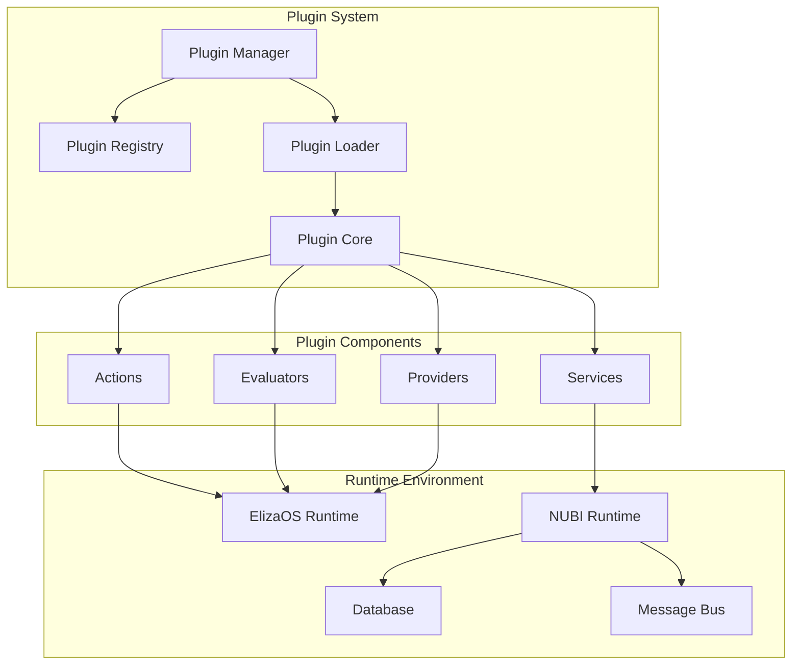

import { Tabs, TabItem } from '@astrojs/starlight/components';

NUBI's plugin system provides a powerful extensibility framework built on ElizaOS, enabling developers to create custom actions, evaluators, providers, and complete plugin packages.

## Plugin Architecture

### Core Plugin Structure

NUBI plugins follow the ElizaOS plugin architecture with enhanced capabilities:



<Tabs>
  <TabItem label="Plugin Interface">
```typescript
import { Plugin } from "@elizaos/core"

interface NubiPlugin extends Plugin {
  // Standard ElizaOS plugin properties
  name: string
  description: string
  version: string
  
  // NUBI-specific extensions
  nubiVersion: string
  category: PluginCategory
  permissions: PluginPermission[]
  dependencies: PluginDependency[]
  
  // Component definitions
  actions?: Action[]
  evaluators?: Evaluator[]
  providers?: Provider[]
  services?: Service[]
  
  // Lifecycle hooks
  onLoad?(runtime: NubiRuntime): Promise<void>
  onUnload?(runtime: NubiRuntime): Promise<void>
  onConfigUpdate?(config: PluginConfig): Promise<void>
  
  // Health and monitoring
  healthCheck?(): Promise<PluginHealth>
  getMetrics?(): Promise<PluginMetrics>
}

interface PluginMetadata {
  author: string
  license: string
  repository?: string
  homepage?: string
  keywords: string[]
  compatibility: {
    elizaos: string
    nubi: string
    node: string
  }
}

enum PluginCategory {
  COMMUNICATION = 'communication',
  ANALYTICS = 'analytics',
  AUTOMATION = 'automation',
  SECURITY = 'security',
  INTEGRATION = 'integration',
  UTILITY = 'utility',
  ENTERTAINMENT = 'entertainment'
}
```
  </TabItem>
  
  <TabItem label="Plugin Example">
```typescript
import { 
  Plugin, 
  Action, 
  Evaluator, 
  Provider,
  elizaLogger as logger 
} from "@elizaos/core"
import type { 
  NubiPlugin, 
  NubiRuntime, 
  PluginConfig 
} from "../types"

class CustomRaidPlugin implements NubiPlugin {
  name = "custom-raid-coordinator"
  description = "Advanced raid coordination with custom strategies"
  version = "1.0.0"
  nubiVersion = "^2.0.0"
  category = PluginCategory.AUTOMATION
  
  permissions = [
    'raids:create',
    'raids:coordinate', 
    'messaging:broadcast',
    'analytics:read'
  ]
  
  dependencies = [
    { name: 'nubi-core', version: '^2.0.0' },
    { name: 'message-bus', version: '^1.5.0' }
  ]
  
  actions = [
    new CustomRaidAction(),
    new AdvancedCoordinationAction()
  ]
  
  evaluators = [
    new RaidEffectivenessEvaluator(),
    new ParticipantQualityEvaluator()
  ]
  
  providers = [
    new RaidStrategyProvider(),
    new CoordinationMetricsProvider()
  ]
  
  private config: PluginConfig
  private runtime: NubiRuntime
  
  async onLoad(runtime: NubiRuntime): Promise<void> {
    this.runtime = runtime
    this.config = await runtime.getPluginConfig(this.name)
    
    // Initialize plugin services
    await this.initializeServices()
    
    // Register event listeners
    this.registerEventListeners()
    
    logger.info(`${this.name} v${this.version} loaded successfully`)
  }
  
  async onUnload(runtime: NubiRuntime): Promise<void> {
    // Cleanup resources
    await this.cleanup()
    logger.info(`${this.name} unloaded`)
  }
  
  async healthCheck(): Promise<PluginHealth> {
    return {
      status: 'healthy',
      checks: {
        database: await this.checkDatabase(),
        services: await this.checkServices(),
        dependencies: await this.checkDependencies()
      },
      timestamp: new Date().toISOString()
    }
  }
  
  private async initializeServices(): Promise<void> {
    // Plugin-specific initialization logic
    await this.setupCustomCoordination()
    await this.initializeMetricsCollection()
  }
  
  private registerEventListeners(): void {
    this.runtime.on('raid:created', this.handleRaidCreated.bind(this))
    this.runtime.on('raid:participant_joined', this.handleParticipantJoined.bind(this))
  }
  
  private async handleRaidCreated(event: RaidCreatedEvent): Promise<void> {
    // Custom raid creation handling
    logger.info(`Custom raid coordination activated for ${event.raidId}`)
  }
}

export default new CustomRaidPlugin()
```
  </TabItem>
  
  <TabItem label="Plugin Configuration">
```yaml
# plugin-config.yaml
plugins:
  custom-raid-coordinator:
    enabled: true
    version: "1.0.0"
    config:
      # Plugin-specific configuration
      coordination:
        advanced_strategies: true
        multi_platform_sync: true
        real_time_analytics: true
      
      strategies:
        default_approach: "moderate"
        quality_threshold: 0.75
        participation_limits:
          min_participants: 5
          max_participants: 200
      
      notifications:
        coordinator_alerts: true
        performance_reports: true
        quality_warnings: true
      
      integrations:
        analytics_endpoint: "https://analytics.example.com"
        webhook_url: "https://webhooks.example.com/raid-events"
        api_keys:
          analytics: "${ANALYTICS_API_KEY}"
          webhook: "${WEBHOOK_SECRET}"
    
    permissions:
      - "raids:create"
      - "raids:coordinate"
      - "messaging:broadcast"
      - "analytics:read"
    
    resources:
      memory_limit: "256MB"
      cpu_limit: "0.5"
      network_timeout: 30000
    
    monitoring:
      health_check_interval: 60000
      metrics_collection: true
      error_reporting: true
```
  </TabItem>
</Tabs>

## Custom Actions

### Action Development

Create custom actions that extend NUBI's capabilities:

<Tabs>
  <TabItem label="Action Structure">
```typescript
import { Action, ActionExample } from "@elizaos/core"
import type { 
  Memory, 
  Message, 
  Handler, 
  HandlerCallback,
  IAgentRuntime,
  State
} from "@elizaos/core"

interface CustomActionConfig {
  name: string
  description: string
  examples: ActionExample[]
  handler: Handler
  validate: (runtime: IAgentRuntime, message: Message) => Promise<boolean>
}

class AdvancedRaidAction implements Action {
  name = "ADVANCED_RAID_COORDINATE"
  description = "Coordinate complex multi-platform raids with advanced strategies"
  
  examples: ActionExample[] = [
    [
      {
        user: "{{user1}}",
        content: {
          text: "Let's coordinate a strategic raid on that viral post about AI innovation"
        }
      },
      {
        user: "{{agent}}",
        content: {
          text: "I'll set up an advanced coordination strategy. Analyzing target engagement patterns and optimal timing windows...",
          action: "ADVANCED_RAID_COORDINATE"
        }
      }
    ]
  ]
  
  async validate(
    runtime: IAgentRuntime, 
    message: Message,
    state?: State
  ): Promise<boolean> {
    // Validate user permissions
    const hasPermission = await this.checkUserPermissions(
      runtime, 
      message.userId, 
      ['raids:coordinate', 'advanced:strategies']
    )
    
    if (!hasPermission) {
      return false
    }
    
    // Validate message contains raid coordination request
    const coordinationKeywords = [
      'coordinate raid', 'strategic raid', 'advanced raid',
      'multi-platform raid', 'synchronized attack'
    ]
    
    return coordinationKeywords.some(keyword => 
      message.content.text.toLowerCase().includes(keyword)
    )
  }
  
  async handler(
    runtime: IAgentRuntime,
    message: Message,
    state?: State,
    options?: any,
    callback?: HandlerCallback
  ): Promise<boolean> {
    try {
      // Extract raid parameters from message
      const raidParams = await this.extractRaidParameters(message.content.text)
      
      // Analyze target for optimal strategy
      const targetAnalysis = await this.analyzeTarget(raidParams.target)
      
      // Generate advanced coordination strategy
      const strategy = await this.generateAdvancedStrategy(
        targetAnalysis, 
        raidParams
      )
      
      // Create raid with advanced configuration
      const raid = await this.createAdvancedRaid({
        ...raidParams,
        strategy,
        coordinator: message.userId,
        createdAt: new Date()
      })
      
      // Send coordination response
      const response = await this.generateCoordinationResponse(raid, strategy)
      
      if (callback) {
        callback({
          text: response,
          action: this.name,
          metadata: {
            raidId: raid.id,
            strategy: strategy.name,
            expectedParticipants: strategy.targetParticipants,
            platforms: strategy.platforms
          }
        })
      }
      
      return true
    } catch (error) {
      console.error('Advanced raid coordination failed:', error)
      
      if (callback) {
        callback({
          text: "I encountered an issue setting up the advanced raid coordination. Let me try a simpler approach or check with the technical team.",
          error: error.message
        })
      }
      
      return false
    }
  }
  
  private async extractRaidParameters(text: string): Promise<RaidParameters> {
    // Use NLP to extract raid parameters from natural language
    const nlpService = await this.getNLPService()
    return nlpService.extractRaidParams(text)
  }
  
  private async analyzeTarget(target: RaidTarget): Promise<TargetAnalysis> {
    // Advanced target analysis
    const analysisService = await this.getAnalysisService()
    return analysisService.deepAnalyze(target)
  }
  
  private async generateAdvancedStrategy(
    analysis: TargetAnalysis,
    params: RaidParameters
  ): Promise<AdvancedStrategy> {
    // Generate sophisticated raid strategy
    const strategyEngine = await this.getStrategyEngine()
    return strategyEngine.generateAdvanced(analysis, params)
  }
}
```
  </TabItem>
  
  <TabItem label="Action Registration">
```typescript
// actions/index.ts
import { Action } from "@elizaos/core"
import { AdvancedRaidAction } from "./advanced-raid-action"
import { CustomEngagementAction } from "./custom-engagement-action"
import { IntelligentCoordinationAction } from "./intelligent-coordination-action"

export const customActions: Action[] = [
  new AdvancedRaidAction(),
  new CustomEngagementAction(),
  new IntelligentCoordinationAction()
]

// Plugin registration
export class ActionPlugin implements NubiPlugin {
  name = "custom-actions"
  description = "Collection of advanced custom actions"
  version = "1.0.0"
  
  actions = customActions
  
  async onLoad(runtime: NubiRuntime): Promise<void> {
    // Register all actions with runtime
    for (const action of this.actions) {
      await runtime.registerAction(action)
      logger.info(`Registered action: ${action.name}`)
    }
  }
}

// Usage in main plugin system
import { ActionPlugin } from "./actions"

const actionPlugin = new ActionPlugin()
await runtime.loadPlugin(actionPlugin)
```
  </TabItem>
  
  <TabItem label="Action Testing">
```typescript
// actions/__tests__/advanced-raid-action.test.ts
import { describe, it, expect, beforeEach, jest } from 'bun:test'
import { AdvancedRaidAction } from '../advanced-raid-action'
import { createMockRuntime, createMockMessage } from '../../test-utils'

describe('AdvancedRaidAction', () => {
  let action: AdvancedRaidAction
  let mockRuntime: any
  let mockMessage: any
  
  beforeEach(() => {
    action = new AdvancedRaidAction()
    mockRuntime = createMockRuntime()
    mockMessage = createMockMessage({
      content: { text: "Let's coordinate a strategic raid on this viral AI post" },
      userId: "user_123"
    })
  })
  
  describe('validate', () => {
    it('should validate valid coordination requests', async () => {
      // Mock user permissions
      mockRuntime.checkUserPermissions = jest.fn().mockResolvedValue(true)
      
      const isValid = await action.validate(mockRuntime, mockMessage)
      expect(isValid).toBe(true)
    })
    
    it('should reject requests without proper permissions', async () => {
      mockRuntime.checkUserPermissions = jest.fn().mockResolvedValue(false)
      
      const isValid = await action.validate(mockRuntime, mockMessage)
      expect(isValid).toBe(false)
    })
    
    it('should reject messages without coordination keywords', async () => {
      mockRuntime.checkUserPermissions = jest.fn().mockResolvedValue(true)
      mockMessage.content.text = "Just a regular message"
      
      const isValid = await action.validate(mockRuntime, mockMessage)
      expect(isValid).toBe(false)
    })
  })
  
  describe('handler', () => {
    it('should successfully create advanced raid coordination', async () => {
      // Mock all dependencies
      const mockAnalysis = { viralityScore: 0.8, engagementPotential: 0.9 }
      const mockStrategy = { name: 'viral_boost', platforms: ['telegram', 'twitter'] }
      const mockRaid = { id: 'raid_123', status: 'created' }
      
      action.analyzeTarget = jest.fn().mockResolvedValue(mockAnalysis)
      action.generateAdvancedStrategy = jest.fn().mockResolvedValue(mockStrategy)
      action.createAdvancedRaid = jest.fn().mockResolvedValue(mockRaid)
      
      const callback = jest.fn()
      const result = await action.handler(mockRuntime, mockMessage, undefined, {}, callback)
      
      expect(result).toBe(true)
      expect(callback).toHaveBeenCalledWith(
        expect.objectContaining({
          text: expect.stringContaining('raid coordination'),
          action: 'ADVANCED_RAID_COORDINATE',
          metadata: expect.objectContaining({
            raidId: 'raid_123'
          })
        })
      )
    })
  })
})
```
  </TabItem>
</Tabs>

## Custom Evaluators

### Evaluator Development

Build intelligent evaluation systems for content and behavior analysis:

<Tabs>
  <TabItem label="Evaluator Structure">
```typescript
import { Evaluator } from "@elizaos/core"
import type { 
  Memory, 
  IAgentRuntime, 
  State 
} from "@elizaos/core"

class RaidQualityEvaluator implements Evaluator {
  name = "RAID_QUALITY_ASSESSMENT"
  description = "Evaluate raid participation quality and effectiveness"
  
  // Evaluation examples for training
  examples = [
    {
      context: "User participated in raid with high-quality engagement",
      messages: [
        {
          user: "{{user1}}",
          content: { text: "Great project! The AI innovation here is remarkable. Looking forward to seeing how this develops!" }
        }
      ],
      outcome: "HIGH_QUALITY - Authentic, detailed, relevant engagement"
    },
    {
      context: "User participated with generic engagement",
      messages: [
        {
          user: "{{user1}}",
          content: { text: "Nice! 👍" }
        }
      ],
      outcome: "LOW_QUALITY - Generic, minimal effort engagement"
    }
  ]
  
  async handler(
    runtime: IAgentRuntime,
    message: Memory,
    state?: State
  ): Promise<number> {
    try {
      // Extract engagement data from memory
      const engagement = await this.extractEngagementData(message)
      
      if (!engagement) {
        return 0 // No raid engagement detected
      }
      
      // Run comprehensive quality assessment
      const qualityMetrics = await this.assessQuality(engagement)
      
      // Calculate composite quality score (0-1)
      const qualityScore = this.calculateQualityScore(qualityMetrics)
      
      // Store evaluation results
      await this.storeEvaluationResults(message, qualityMetrics, qualityScore)
      
      return qualityScore
      
    } catch (error) {
      console.error('Raid quality evaluation failed:', error)
      return 0
    }
  }
  
  private async assessQuality(engagement: EngagementData): Promise<QualityMetrics> {
    // Multi-dimensional quality assessment
    const [
      contentQuality,
      authenticityScore,
      timingScore,
      relevanceScore,
      originalityScore
    ] = await Promise.all([
      this.assessContentQuality(engagement.content),
      this.assessAuthenticity(engagement.content, engagement.user),
      this.assessTiming(engagement.timestamp, engagement.raid),
      this.assessRelevance(engagement.content, engagement.target),
      this.assessOriginality(engagement.content, engagement.user)
    ])
    
    return {
      content: contentQuality,
      authenticity: authenticityScore,
      timing: timingScore,
      relevance: relevanceScore,
      originality: originalityScore,
      overall: this.calculateOverallScore({
        contentQuality,
        authenticityScore,
        timingScore,
        relevanceScore,
        originalityScore
      })
    }
  }
  
  private async assessContentQuality(content: string): Promise<number> {
    // Content quality assessment using multiple factors
    const factors = {
      length: this.assessLength(content),
      complexity: this.assessComplexity(content),
      sentiment: await this.assessSentiment(content),
      grammar: await this.assessGrammar(content),
      engagement: this.assessEngagementPotential(content)
    }
    
    // Weighted average of quality factors
    return (
      factors.length * 0.15 +
      factors.complexity * 0.25 +
      factors.sentiment * 0.20 +
      factors.grammar * 0.20 +
      factors.engagement * 0.20
    )
  }
  
  private async assessAuthenticity(
    content: string, 
    user: UserProfile
  ): Promise<number> {
    // Check for human-like characteristics
    const humanFactors = {
      typos: this.detectNaturalTypos(content),
      personalStyle: await this.matchPersonalStyle(content, user),
      emotionalExpression: this.detectEmotionalExpression(content),
      contextualReferences: this.detectContextualReferences(content),
      variationFromPrevious: await this.checkVariationFromPrevious(content, user)
    }
    
    // Calculate authenticity based on human-like factors
    return this.calculateAuthenticityScore(humanFactors)
  }
}
```
  </TabItem>
  
  <TabItem label="Specialized Evaluators">
```typescript
// Community Impact Evaluator
class CommunityImpactEvaluator implements Evaluator {
  name = "COMMUNITY_IMPACT_ASSESSMENT"
  
  async handler(runtime: IAgentRuntime, message: Memory): Promise<number> {
    const impact = await this.assessCommunityImpact(message)
    
    return {
      networkEffect: impact.networkGrowth,
      engagementBoost: impact.engagementIncrease,
      qualityInfluence: impact.qualityImprovement,
      mentorshipValue: impact.newUserSupport,
      collaborationIndex: impact.teamworkEnhancement
    }
  }
}

// Security Risk Evaluator
class SecurityRiskEvaluator implements Evaluator {
  name = "SECURITY_RISK_ASSESSMENT"
  
  async handler(runtime: IAgentRuntime, message: Memory): Promise<number> {
    const risks = await this.assessSecurityRisks(message)
    
    return {
      maliciousContent: risks.maliciousContentScore,
      privacyViolation: risks.privacyRiskScore,
      platformViolation: risks.platformRiskScore,
      reputationRisk: risks.reputationDamageRisk,
      spamProbability: risks.spamLikelihood
    }
  }
}

// Performance Optimization Evaluator
class PerformanceOptimizationEvaluator implements Evaluator {
  name = "PERFORMANCE_OPTIMIZATION"
  
  async handler(runtime: IAgentRuntime, message: Memory): Promise<number> {
    const performance = await this.assessPerformance(message)
    
    return {
      responseTime: performance.responseTimeScore,
      resourceEfficiency: performance.resourceUsageScore,
      coordinationEffectiveness: performance.coordinationScore,
      outcomeQuality: performance.resultQualityScore
    }
  }
}
```
  </TabItem>
  
  <TabItem label="Evaluator Integration">
```typescript
// evaluators/index.ts
import { Evaluator } from "@elizaos/core"
import { RaidQualityEvaluator } from "./raid-quality-evaluator"
import { CommunityImpactEvaluator } from "./community-impact-evaluator"
import { SecurityRiskEvaluator } from "./security-risk-evaluator"

export const customEvaluators: Evaluator[] = [
  new RaidQualityEvaluator(),
  new CommunityImpactEvaluator(),
  new SecurityRiskEvaluator()
]

// Evaluator orchestration service
class EvaluatorOrchestrator {
  private evaluators: Map<string, Evaluator> = new Map()
  
  constructor(evaluators: Evaluator[]) {
    evaluators.forEach(evaluator => {
      this.evaluators.set(evaluator.name, evaluator)
    })
  }
  
  async runEvaluations(
    runtime: IAgentRuntime, 
    message: Memory,
    evaluatorNames?: string[]
  ): Promise<EvaluationResults> {
    const targetEvaluators = evaluatorNames 
      ? evaluatorNames.map(name => this.evaluators.get(name)).filter(Boolean)
      : Array.from(this.evaluators.values())
    
    const evaluationPromises = targetEvaluators.map(async evaluator => {
      try {
        const result = await evaluator.handler(runtime, message)
        return {
          evaluator: evaluator.name,
          result,
          success: true,
          timestamp: new Date()
        }
      } catch (error) {
        return {
          evaluator: evaluator.name,
          result: null,
          success: false,
          error: error.message,
          timestamp: new Date()
        }
      }
    })
    
    const results = await Promise.all(evaluationPromises)
    
    return {
      messageId: message.id,
      evaluations: results,
      summary: this.generateEvaluationSummary(results),
      completedAt: new Date()
    }
  }
}
```
  </TabItem>
</Tabs>

## Custom Providers

### Provider Development

Create intelligent context providers that enhance NUBI's decision-making:

<Tabs>
  <TabItem label="Context Provider">
```typescript
import { Provider } from "@elizaos/core"
import type { 
  Memory, 
  IAgentRuntime, 
  State 
} from "@elizaos/core"

class AdvancedRaidContextProvider implements Provider {
  name = "ADVANCED_RAID_CONTEXT"
  description = "Provide comprehensive context for advanced raid coordination"
  
  async get(
    runtime: IAgentRuntime, 
    message: Memory, 
    state?: State
  ): Promise<string> {
    try {
      // Gather comprehensive raid context
      const context = await this.gatherRaidContext(runtime, message, state)
      
      // Format context for AI consumption
      return this.formatContextForAI(context)
      
    } catch (error) {
      console.error('Failed to get raid context:', error)
      return "Raid context temporarily unavailable."
    }
  }
  
  private async gatherRaidContext(
    runtime: IAgentRuntime,
    message: Memory,
    state?: State
  ): Promise<RaidContextData> {
    // Run parallel context gathering
    const [
      activeRaids,
      userPerformance,
      communityMetrics,
      strategicInsights,
      platformStatus
    ] = await Promise.all([
      this.getActiveRaids(runtime),
      this.getUserPerformanceContext(message.userId),
      this.getCommunityMetrics(),
      this.getStrategicInsights(),
      this.getPlatformStatus()
    ])
    
    return {
      activeRaids,
      userPerformance,
      communityMetrics,
      strategicInsights,
      platformStatus,
      timestamp: new Date()
    }
  }
  
  private formatContextForAI(context: RaidContextData): string {
    return `
RAID COORDINATION CONTEXT

Current Active Raids: ${context.activeRaids.length}
${context.activeRaids.map(raid => `
- ${raid.title}: ${raid.participants} participants, ${raid.effectiveness}% effective
  Platform: ${raid.platform}, Phase: ${raid.currentPhase}
  Quality Score: ${raid.qualityScore}, Time Remaining: ${raid.timeRemaining}
`).join('')}

User Performance Context:
- Total Raids: ${context.userPerformance.totalRaids}
- Success Rate: ${context.userPerformance.successRate}%
- Average Quality: ${context.userPerformance.averageQuality}
- Current Streak: ${context.userPerformance.currentStreak}
- Preferred Platforms: ${context.userPerformance.preferredPlatforms.join(', ')}

Community Metrics:
- Active Users: ${context.communityMetrics.activeUsers}
- Community Health: ${context.communityMetrics.healthScore}
- Engagement Rate: ${context.communityMetrics.engagementRate}%
- Quality Trend: ${context.communityMetrics.qualityTrend}

Strategic Insights:
- Peak Activity Hours: ${context.strategicInsights.peakHours.join(', ')}
- Trending Topics: ${context.strategicInsights.trendingTopics.join(', ')}
- Optimal Platforms: ${context.strategicInsights.optimalPlatforms.join(', ')}
- Success Factors: ${context.strategicInsights.successFactors.join(', ')}

Platform Status:
${Object.entries(context.platformStatus).map(([platform, status]) => `
- ${platform}: ${status.online ? 'Online' : 'Offline'} (${status.responseTime}ms avg)
`).join('')}

Recommendations for optimal raid coordination based on current conditions.
    `
  }
}
```
  </TabItem>
  
  <TabItem label="Intelligence Provider">
```typescript
class IntelligenceProvider implements Provider {
  name = "NUBI_INTELLIGENCE"
  description = "Provide AI-powered insights and recommendations"
  
  private aiModel: AIModel
  private analyticsService: AnalyticsService
  
  async get(
    runtime: IAgentRuntime, 
    message: Memory, 
    state?: State
  ): Promise<string> {
    // Analyze current context
    const contextAnalysis = await this.analyzeContext(message, state)
    
    // Generate AI-powered insights
    const insights = await this.generateInsights(contextAnalysis)
    
    // Format insights for decision-making
    return this.formatIntelligence(insights)
  }
  
  private async analyzeContext(
    message: Memory, 
    state?: State
  ): Promise<ContextAnalysis> {
    // Multi-dimensional context analysis
    const analysis = {
      messageAnalysis: await this.analyzeMessage(message),
      userBehaviorPattern: await this.analyzeUserBehavior(message.userId),
      communityDynamics: await this.analyzeCommunityDynamics(),
      marketConditions: await this.analyzeMarketConditions(),
      platformTrends: await this.analyzePlatformTrends()
    }
    
    return analysis
  }
  
  private async generateInsights(analysis: ContextAnalysis): Promise<AIInsights> {
    // Use AI model to generate actionable insights
    const prompt = this.constructInsightPrompt(analysis)
    const aiResponse = await this.aiModel.generate(prompt)
    
    return {
      recommendations: aiResponse.recommendations,
      predictions: aiResponse.predictions,
      opportunities: aiResponse.opportunities,
      risks: aiResponse.risks,
      confidence: aiResponse.confidence
    }
  }
  
  private formatIntelligence(insights: AIInsights): string {
    return `
NUBI INTELLIGENCE BRIEFING

Strategic Recommendations:
${insights.recommendations.map(rec => `• ${rec.title}: ${rec.description} (Confidence: ${rec.confidence}%)`).join('\n')}

Market Predictions:
${insights.predictions.map(pred => `• ${pred.event}: ${pred.probability}% chance in ${pred.timeframe}`).join('\n')}

Opportunities Identified:
${insights.opportunities.map(opp => `• ${opp.type}: ${opp.description} (Potential: ${opp.potential})`).join('\n')}

Risk Assessment:
${insights.risks.map(risk => `• ${risk.category}: ${risk.description} (Severity: ${risk.severity})`).join('\n')}

Overall Intelligence Confidence: ${insights.confidence}%
    `
  }
}
```
  </TabItem>
  
  <TabItem label="Provider Registration">
```typescript
// providers/index.ts
import { Provider } from "@elizaos/core"
import { AdvancedRaidContextProvider } from "./raid-context-provider"
import { IntelligenceProvider } from "./intelligence-provider"
import { PerformanceInsightsProvider } from "./performance-insights-provider"

export const customProviders: Provider[] = [
  new AdvancedRaidContextProvider(),
  new IntelligenceProvider(),
  new PerformanceInsightsProvider()
]

// Provider management service
class ProviderManager {
  private providers: Map<string, Provider> = new Map()
  private cache: Map<string, CachedProviderResult> = new Map()
  
  constructor(providers: Provider[]) {
    providers.forEach(provider => {
      this.providers.set(provider.name, provider)
    })
  }
  
  async getContext(
    providerName: string,
    runtime: IAgentRuntime,
    message: Memory,
    state?: State,
    useCache: boolean = true
  ): Promise<string> {
    const cacheKey = `${providerName}-${message.id}`
    
    // Check cache first
    if (useCache && this.cache.has(cacheKey)) {
      const cached = this.cache.get(cacheKey)!
      if (Date.now() - cached.timestamp < 60000) { // 1 minute cache
        return cached.result
      }
    }
    
    // Get fresh context
    const provider = this.providers.get(providerName)
    if (!provider) {
      throw new Error(`Provider ${providerName} not found`)
    }
    
    const result = await provider.get(runtime, message, state)
    
    // Cache result
    this.cache.set(cacheKey, {
      result,
      timestamp: Date.now()
    })
    
    return result
  }
  
  async getAllContext(
    runtime: IAgentRuntime,
    message: Memory,
    state?: State
  ): Promise<Map<string, string>> {
    const contextPromises = Array.from(this.providers.entries()).map(
      async ([name, provider]) => {
        try {
          const context = await provider.get(runtime, message, state)
          return [name, context] as [string, string]
        } catch (error) {
          console.error(`Provider ${name} failed:`, error)
          return [name, `Provider ${name} temporarily unavailable`] as [string, string]
        }
      }
    )
    
    const results = await Promise.all(contextPromises)
    return new Map(results)
  }
}
```
  </TabItem>
</Tabs>

## Plugin Distribution & Installation

### Plugin Package Format

NUBI plugins follow a standardized package format for distribution:

<Tabs>
  <TabItem label="Package Structure">
```
my-nubi-plugin/
├── package.json                 # NPM package configuration
├── plugin.config.yaml          # Plugin configuration schema
├── README.md                   # Plugin documentation
├── src/
│   ├── index.ts                # Main plugin export
│   ├── actions/                # Custom actions
│   │   ├── index.ts
│   │   └── my-action.ts
│   ├── evaluators/            # Custom evaluators
│   │   ├── index.ts
│   │   └── my-evaluator.ts
│   ├── providers/             # Custom providers
│   │   ├── index.ts
│   │   └── my-provider.ts
│   └── services/              # Custom services
│       ├── index.ts
│       └── my-service.ts
├── dist/                      # Compiled output
├── tests/                     # Test files
├── docs/                      # Documentation
└── examples/                  # Usage examples
```
  </TabItem>
  
  <TabItem label="Package.json">
```json
{
  "name": "@nubi/my-plugin",
  "version": "1.0.0",
  "description": "Advanced raid coordination plugin for NUBI",
  "main": "dist/index.js",
  "types": "dist/index.d.ts",
  "keywords": ["nubi", "plugin", "raid", "coordination"],
  "author": "Your Name <email@example.com>",
  "license": "MIT",
  "repository": {
    "type": "git",
    "url": "https://github.com/username/my-nubi-plugin"
  },
  "nubi": {
    "version": "^2.0.0",
    "category": "automation",
    "permissions": [
      "raids:create",
      "raids:coordinate",
      "messaging:broadcast"
    ],
    "compatibility": {
      "elizaos": "^1.0.0",
      "node": ">=18.0.0"
    }
  },
  "dependencies": {
    "@elizaos/core": "^1.0.0",
    "@nubi/types": "^2.0.0"
  },
  "devDependencies": {
    "@types/node": "^20.0.0",
    "typescript": "^5.0.0",
    "bun": "^1.0.0"
  },
  "scripts": {
    "build": "tsc",
    "test": "bun test",
    "dev": "tsc --watch",
    "lint": "eslint src/",
    "prepare": "npm run build"
  },
  "files": [
    "dist/",
    "plugin.config.yaml",
    "README.md"
  ]
}
```
  </TabItem>
  
  <TabItem label="Installation Commands">
```bash
# Install from NPM registry
npm install @nubi/my-plugin

# Install from GitHub
npm install github:username/my-nubi-plugin

# Install locally for development
npm install ./path/to/my-plugin

# Using NUBI CLI (future feature)
nubi plugin install @nubi/my-plugin
nubi plugin install github:username/my-nubi-plugin
nubi plugin install --local ./my-plugin

# Plugin management
nubi plugin list
nubi plugin enable @nubi/my-plugin
nubi plugin disable @nubi/my-plugin
nubi plugin update @nubi/my-plugin
nubi plugin remove @nubi/my-plugin

# Plugin configuration
nubi plugin config @nubi/my-plugin --key api_endpoint --value "https://api.example.com"
nubi plugin config @nubi/my-plugin --file ./custom-config.yaml
```
  </TabItem>
</Tabs>

### Plugin Registry

NUBI maintains a curated registry of verified plugins:

```typescript
// Plugin registry interface
interface PluginRegistry {
  search(query: string): Promise<PluginSearchResult[]>
  getPlugin(name: string): Promise<PluginInfo>
  publishPlugin(plugin: PluginPackage): Promise<PublishResult>
  verifyPlugin(name: string): Promise<VerificationResult>
  reportPlugin(name: string, reason: string): Promise<void>
}

// Example plugin search
const searchResults = await registry.search("raid coordination")
/*
Results:
[
  {
    name: "@nubi/advanced-raids",
    description: "Advanced raid coordination with AI strategies",
    author: "NUBI Team",
    version: "2.1.0",
    downloads: 15420,
    rating: 4.8,
    verified: true,
    categories: ["automation", "coordination"],
    lastUpdated: "2024-01-01T00:00:00Z"
  }
]
*/
```

NUBI's plugin system provides unlimited extensibility while maintaining security, performance, and compatibility standards, enabling the community to build powerful custom functionality on top of the core platform.