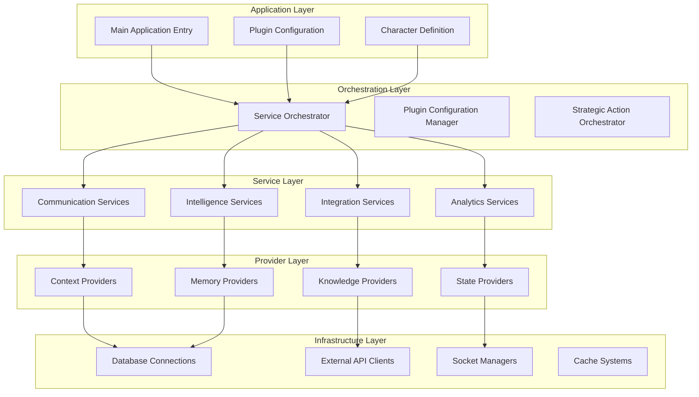

import {
  Card,
  CardGrid,
  Aside,
  Code,
  Tabs,
  TabItem,
} from "@astrojs/starlight/components";

# Modular Design Principles

NUBI's architecture follows **strict modular design principles** that ensure maintainability, testability, and scalability. Every component is designed with clear boundaries, well-defined interfaces, and minimal coupling.

## 🎯 Design Philosophy

<CardGrid>
  <Card title="🔗 Loose Coupling" icon="puzzle">
    **Minimal dependencies** between modules with clear interfaces and dependency injection patterns.
  </Card>

<Card title="📦 High Cohesion" icon="approve-check">
  **Related functionality** grouped together in logical, single-responsibility
  modules.
</Card>

<Card title="🔄 Interface Segregation" icon="setting">
  **Small, focused interfaces** that components can implement independently
  without unused dependencies.
</Card>

  <Card title="🎨 Open/Closed Principle" icon="rocket">
    **Open for extension, closed for modification** - new features through composition, not alteration.
  </Card>
</CardGrid>

## 🏗️ Module Hierarchy

NUBI's modular structure follows a clear **layered architecture** with well-defined boundaries:



## 📁 Directory Structure & Organization

NUBI follows a **domain-driven directory structure** that mirrors the logical module boundaries:

<Tabs>
  <TabItem label="Core Structure">
```bash
src/
├── app/                    # Application entry point
│   └── index.ts           # Main app initialization
├── character/             # Character definitions
│   ├── index.ts          # Character exports
│   └── nubi-character.ts # NUBI personality definition
├── config/                # Configuration management
│   ├── index.ts          # Config exports
│   ├── types.ts          # Config type definitions
│   ├── environment.ts    # Environment handling
│   └── yaml-config-manager.ts # YAML processing
├── core/                  # Core business logic
│   └── index.ts          # Core exports
├── orchestration/         # Service orchestration
│   ├── index.ts          # Orchestration exports
│   ├── strategic-action-orchestrator.ts
│   └── plugin-configuration-manager.ts
└── plugins/               # Plugin definitions
    ├── index.ts          # Plugin exports
    ├── nubi-plugin.ts    # Main NUBI plugin
    └── plugin.ts         # Plugin utilities
```
  </TabItem>

<TabItem label="Service Modules">
  ```bash src/ ├── services/ # Business services │ ├── index.ts # Service
  exports │ ├── README.md # Service documentation │ ├──
  community-management-service.ts │ ├── cross-platform-identity-service.ts │ ├──
  database-memory-service.ts │ └── sessions-service.ts ├── providers/ # Context
  providers │ ├── index.ts # Provider exports │ ├── enhanced-context-provider.ts
  │ ├── emotional-state-provider.ts │ ├── knowledge-base-provider.ts │ └──
  knowledge-rag-provider.ts ├── evaluators/ # Behavioral evaluators │ ├──
  index.ts # Evaluator exports │ ├── README.md # Evaluator documentation │ ├──
  anti-detection-post-processor.ts │ ├── community-tracking-evaluator.ts │ ├──
  personality-evolution.ts │ └── security-evaluator.ts └── actions/ # Action
  handlers ├── index.ts # Action exports └── elizaos-ritual-action.ts ```
</TabItem>

  <TabItem label="Specialized Modules">
```bash
src/
├── telegram-raids/        # Telegram raid system
│   ├── index.ts          # Raid exports
│   ├── anubis-raid-plugin.ts
│   ├── raid-coordinator.ts
│   ├── engagement-verifier.ts
│   └── leaderboard-service.ts
├── x-integration/         # Twitter/X integration
│   ├── index.ts          # X integration exports
│   └── x-posting-service.ts
├── messaging/             # Message handling
│   ├── index.ts          # Messaging exports
│   └── message-bus.ts    # Message bus implementation
├── repositories/          # Data access layer
│   ├── index.ts          # Repository exports
│   ├── README.md         # Repository patterns
│   └── user-records-repository.ts
└── utils/                 # Shared utilities
    ├── index.ts          # Utility exports
    └── error-handler.ts   # Error handling utilities
```
  </TabItem>
</Tabs>

## 🔌 Module Interface Design

Every module in NUBI follows **consistent interface patterns** that enable clean composition and testing:

<Tabs>
  <TabItem label="Service Interface">
```typescript
// Base service interface that all services implement
export interface NubiService extends Service {
  serviceType: string;
  capabilityDescription: string;
  
  // Lifecycle methods
  initialize(runtime: IAgentRuntime): Promise<void>;
  cleanup(): Promise<void>;
  
  // Capability execution
  executeCapability(params: any): Promise<any>;
  
  // Health monitoring
  isHealthy(): Promise<boolean>;
  getMetrics(): Promise<ServiceMetrics>;
}

// Example service implementation
export class CommunityManagementService implements NubiService {
serviceType = "community-management";
capabilityDescription = "Manages community interactions and user engagement";

private runtime: IAgentRuntime;
private connectionManager: DatabaseConnectionManager;

async initialize(runtime: IAgentRuntime): Promise<void> {
this.runtime = runtime;
this.connectionManager = new DatabaseConnectionManager();
await this.connectionManager.initialize();

    logger.info("✅ Community Management Service initialized");

}

async executeCapability(params: CommunityActionParams): Promise<CommunityActionResult> {
// Implementation with proper error handling
try {
return await this.processCommunityAction(params);
} catch (error) {
logger.error("Community action failed:", error);
throw new ServiceExecutionError("Community action failed", error);
}
}
}

````
  </TabItem>

  <TabItem label="Provider Interface">
```typescript
// Provider interface for context and state management
export interface NubiProvider extends Provider {
  providerType: string;
  description: string;

  // Context provision
  get(runtime: IAgentRuntime, message: Memory, state?: State): Promise<string>;

  // Optional caching and optimization
  getCacheKey?(runtime: IAgentRuntime, message: Memory): string;
  shouldCache?(runtime: IAgentRuntime, message: Memory): boolean;
}

// Example provider implementation
export class EnhancedContextProvider implements NubiProvider {
  providerType = "enhanced-context";
  description = "Provides enriched context from database memory and user history";

  private databaseMemoryService: DatabaseMemoryService;

  async get(
    runtime: IAgentRuntime,
    message: Memory,
    state?: State
  ): Promise<string> {
    const userId = message.userId;
    const roomId = message.roomId;

    // Fetch contextual information
    const [userContext, conversationHistory, communityContext] =
      await Promise.all([
        this.getUserContext(userId),
        this.getConversationHistory(roomId, userId),
        this.getCommunityContext(roomId)
      ]);

    return this.formatContext({
      userContext,
      conversationHistory,
      communityContext
    });
  }

  getCacheKey(runtime: IAgentRuntime, message: Memory): string {
    return `context:${message.userId}:${message.roomId}:${Date.now()}`;
  }
}
````

  </TabItem>

  <TabItem label="Configuration Interface">
```typescript
// Configuration module interface
export interface ConfigurationModule {
  configType: string;
  schema: ConfigSchema;
  
  // Configuration loading and validation
  load(source?: ConfigSource): Promise<any>;
  validate(config: any): ConfigValidationResult;
  merge(base: any, override: any): any;
  
  // Environment-specific overrides
  getEnvironmentOverrides(): Promise<any>;
  applyEnvironmentOverrides(config: any): any;
}

// YAML configuration manager implementation
export class YAMLConfigurationManager implements ConfigurationModule {
configType = "yaml";
schema: ConfigSchema;

constructor(schemaPath: string) {
this.schema = this.loadSchema(schemaPath);
}

async load(source?: ConfigSource): Promise<NubiConfig> {
const configPath = source?.path || this.getDefaultConfigPath();
const rawConfig = await this.loadYAMLFile(configPath);

    const validation = this.validate(rawConfig);
    if (!validation.isValid) {
      throw new ConfigValidationError(validation.errors);
    }

    return this.applyEnvironmentOverrides(rawConfig);

}
}

````
  </TabItem>
</Tabs>

## 🔄 Dependency Injection Pattern

NUBI uses **constructor-based dependency injection** to maintain loose coupling and enable easy testing:

<Tabs>
  <TabItem label="Service Dependencies">
```typescript
// Dependency injection container
export class NubiServiceContainer {
  private services = new Map<string, any>();
  private factories = new Map<string, () => Promise<any>>();

  // Register service factories
  register<T>(key: string, factory: () => Promise<T>): void {
    this.factories.set(key, factory);
  }

  // Resolve dependencies
  async resolve<T>(key: string): Promise<T> {
    if (this.services.has(key)) {
      return this.services.get(key);
    }

    const factory = this.factories.get(key);
    if (!factory) {
      throw new Error(`Service ${key} not registered`);
    }

    const service = await factory();
    this.services.set(key, service);
    return service;
  }
}

// Service with injected dependencies
export class DatabaseMemoryService implements NubiService {
  constructor(
    private connectionManager: DatabaseConnectionManager,
    private vectorService: VectorEmbeddingService,
    private cacheService: CacheService
  ) {}

  static async create(container: NubiServiceContainer): Promise<DatabaseMemoryService> {
    const [connectionManager, vectorService, cacheService] = await Promise.all([
      container.resolve<DatabaseConnectionManager>('connectionManager'),
      container.resolve<VectorEmbeddingService>('vectorService'),
      container.resolve<CacheService>('cacheService')
    ]);

    return new DatabaseMemoryService(connectionManager, vectorService, cacheService);
  }
}
````

  </TabItem>

  <TabItem label="Container Configuration">
```typescript
// Service container setup
export async function createServiceContainer(): Promise<NubiServiceContainer> {
  const container = new NubiServiceContainer();
  
  // Register core infrastructure
  container.register('connectionManager', async () => {
    const manager = new DatabaseConnectionManager();
    await manager.initialize();
    return manager;
  });
  
  container.register('vectorService', async () => {
    const connectionManager = await container.resolve<DatabaseConnectionManager>('connectionManager');
    return new VectorEmbeddingService(connectionManager);
  });
  
  container.register('cacheService', async () => {
    return new CacheService({
      redis: process.env.REDIS_URL,
      ttl: 300 // 5 minutes
    });
  });
  
  // Register business services
  container.register('databaseMemoryService', async () => {
    return await DatabaseMemoryService.create(container);
  });
  
  container.register('communityManagementService', async () => {
    return await CommunityManagementService.create(container);
  });
  
  return container;
}
```
  </TabItem>
</Tabs>

## 📊 Module Lifecycle Management

NUBI implements **sophisticated lifecycle management** for all modules:

```typescript
export enum ModuleState {
  UNINITIALIZED = "uninitialized",
  INITIALIZING = "initializing",
  INITIALIZED = "initialized",
  RUNNING = "running",
  STOPPING = "stopping",
  STOPPED = "stopped",
  ERROR = "error",
}

export interface LifecycleAware {
  readonly state: ModuleState;

  // Lifecycle methods
  initialize(): Promise<void>;
  start(): Promise<void>;
  stop(): Promise<void>;
  cleanup(): Promise<void>;

  // State monitoring
  onStateChange(
    listener: (oldState: ModuleState, newState: ModuleState) => void,
  ): void;
  isHealthy(): Promise<boolean>;
}

// Lifecycle manager for coordinated startup/shutdown
export class ModuleLifecycleManager {
  private modules = new Map<string, LifecycleAware>();
  private dependencies = new Map<string, string[]>();

  register(
    name: string,
    module: LifecycleAware,
    dependencies?: string[],
  ): void {
    this.modules.set(name, module);
    if (dependencies) {
      this.dependencies.set(name, dependencies);
    }
  }

  async initializeAll(): Promise<void> {
    const initOrder = this.topologicalSort();

    for (const moduleName of initOrder) {
      const module = this.modules.get(moduleName);
      if (module) {
        logger.info(`Initializing module: ${moduleName}`);
        await module.initialize();
        await module.start();
      }
    }
  }

  async shutdownAll(): Promise<void> {
    const shutdownOrder = this.topologicalSort().reverse();

    for (const moduleName of shutdownOrder) {
      const module = this.modules.get(moduleName);
      if (module) {
        logger.info(`Shutting down module: ${moduleName}`);
        await module.stop();
        await module.cleanup();
      }
    }
  }

  private topologicalSort(): string[] {
    // Implementation of topological sort for dependency order
    // ... (dependency resolution algorithm)
  }
}
```

## 🧪 Module Testing Strategies

Each module is designed for **comprehensive testability** with multiple testing approaches:

<Tabs>
  <TabItem label="Unit Testing">
```typescript
// Service unit testing with mocks
describe('CommunityManagementService', () => {
  let service: CommunityManagementService;
  let mockConnectionManager: jest.Mocked<DatabaseConnectionManager>;
  let mockRuntime: jest.Mocked<IAgentRuntime>;
  
  beforeEach(async () => {
    mockConnectionManager = createMockConnectionManager();
    mockRuntime = createMockRuntime();
    
    service = new CommunityManagementService(mockConnectionManager);
    await service.initialize(mockRuntime);
  });
  
  describe('executeCapability', () => {
    it('should process community action successfully', async () => {
      const params = createMockCommunityActionParams();
      const expectedResult = createExpectedResult();
      
      mockConnectionManager.executeQuery.mockResolvedValue(expectedResult);
      
      const result = await service.executeCapability(params);
      
      expect(result).toEqual(expectedResult);
      expect(mockConnectionManager.executeQuery).toHaveBeenCalledWith(
        expect.stringContaining('SELECT'),
        expect.arrayContaining([params.userId])
      );
    });
    
    it('should handle database errors gracefully', async () => {
      const params = createMockCommunityActionParams();
      const dbError = new Error('Database connection failed');
      
      mockConnectionManager.executeQuery.mockRejectedValue(dbError);
      
      await expect(service.executeCapability(params))
        .rejects.toThrow('Community action failed');
    });
  });
});
```
  </TabItem>

  <TabItem label="Integration Testing">
```typescript
// Integration testing with real components
describe('Service Integration', () => {
  let container: NubiServiceContainer;
  let databaseMemoryService: DatabaseMemoryService;
  let communityManagementService: CommunityManagementService;
  
  beforeAll(async () => {
    container = await createTestServiceContainer();
    databaseMemoryService = await container.resolve('databaseMemoryService');
    communityManagementService = await container.resolve('communityManagementService');
  });
  
  afterAll(async () => {
    await container.cleanup();
  });
  
  it('should coordinate between memory and community services', async () => {
    // Create test data
    const userId = 'test-user-123';
    const messageData = createTestMessageData(userId);
    
    // Store memory
    await databaseMemoryService.storeMemory(messageData);
    
    // Process community action
    const communityResult = await communityManagementService.executeCapability({
      userId,
      action: 'get_user_context'
    });
    
    // Verify integration
    expect(communityResult.userContext).toContain(messageData.content);
  });
});
```
  </TabItem>

  <TabItem label="Module Testing">
```typescript
// Module-level testing with dependency injection
describe('Module Composition', () => {
  let moduleManager: ModuleLifecycleManager;
  
  beforeEach(() => {
    moduleManager = new ModuleLifecycleManager();
  });
  
  it('should initialize modules in correct dependency order', async () => {
    const initOrder: string[] = [];
    
    // Mock modules that track initialization order
    const moduleA = createMockModule('A', () => initOrder.push('A'));
    const moduleB = createMockModule('B', () => initOrder.push('B'));
    const moduleC = createMockModule('C', () => initOrder.push('C'));
    
    // Register with dependencies: C depends on B, B depends on A
    moduleManager.register('A', moduleA);
    moduleManager.register('B', moduleB, ['A']);
    moduleManager.register('C', moduleC, ['B']);
    
    await moduleManager.initializeAll();
    
    expect(initOrder).toEqual(['A', 'B', 'C']);
  });
  
  it('should handle module initialization failures gracefully', async () => {
    const failingModule = createMockModule('failing', () => {
      throw new Error('Initialization failed');
    });
    
    moduleManager.register('failing', failingModule);
    
    await expect(moduleManager.initializeAll())
      .rejects.toThrow('Initialization failed');
  });
});
```
  </TabItem>
</Tabs>

## 🔍 Module Monitoring & Observability

Each module includes **built-in monitoring and observability** capabilities:

<Tabs>
  <TabItem label="Health Checks">
```typescript
// Health check interface for all modules
export interface HealthCheckResult {
  healthy: boolean;
  status: 'healthy' | 'degraded' | 'unhealthy';
  details: Record<string, any>;
  timestamp: Date;
}

// Service health monitoring
export class ServiceHealthMonitor {
private healthChecks = new Map<string, HealthCheckResult>();

async performHealthCheck(serviceName: string, service: NubiService): Promise<HealthCheckResult> {
const startTime = Date.now();

    try {
      const isHealthy = await service.isHealthy();
      const metrics = await service.getMetrics();
      const responseTime = Date.now() - startTime;

      const result: HealthCheckResult = {
        healthy: isHealthy && responseTime < 1000, // Sub-second response
        status: this.determineStatus(isHealthy, responseTime, metrics),
        details: {
          responseTimeMs: responseTime,
          metrics,
          lastError: null
        },
        timestamp: new Date()
      };

      this.healthChecks.set(serviceName, result);
      return result;
    } catch (error) {
      const result: HealthCheckResult = {
        healthy: false,
        status: 'unhealthy',
        details: {
          responseTimeMs: Date.now() - startTime,
          lastError: error.message
        },
        timestamp: new Date()
      };

      this.healthChecks.set(serviceName, result);
      return result;
    }

}
}

````
  </TabItem>

  <TabItem label="Performance Metrics">
```typescript
// Performance metrics collection
export interface ServiceMetrics {
  requests: {
    total: number;
    successful: number;
    failed: number;
    averageResponseTime: number;
  };
  resources: {
    memoryUsage: number;
    cpuUtilization: number;
    activeConnections: number;
  };
  business: Record<string, number>;
}

// Metrics collection service
export class MetricsCollector {
  private metrics = new Map<string, ServiceMetrics>();

  recordRequest(serviceName: string, success: boolean, responseTime: number): void {
    const current = this.metrics.get(serviceName) || this.createEmptyMetrics();

    current.requests.total++;
    if (success) {
      current.requests.successful++;
    } else {
      current.requests.failed++;
    }

    // Update running average
    const totalRequests = current.requests.total;
    const currentAvg = current.requests.averageResponseTime;
    current.requests.averageResponseTime =
      (currentAvg * (totalRequests - 1) + responseTime) / totalRequests;

    this.metrics.set(serviceName, current);
  }

  getMetrics(serviceName: string): ServiceMetrics | null {
    return this.metrics.get(serviceName) || null;
  }
}
````

  </TabItem>
</Tabs>

---

<div class="nubi-note">
  <strong>🎯 Modular Benefits:</strong> This modular design enables NUBI to
  maintain high code quality, support rapid feature development, ensure
  comprehensive testing coverage, and provide clear separation of concerns
  across all system components.
</div>

<Aside type="tip">
  **Next Steps**: Explore specific implementations in the [Service
  Layer](/architecture/service-layer/) and [ElizaOS
  Integration](/architecture/elizaos-integration/) documentation to see these
  modular patterns in action.
</Aside>
