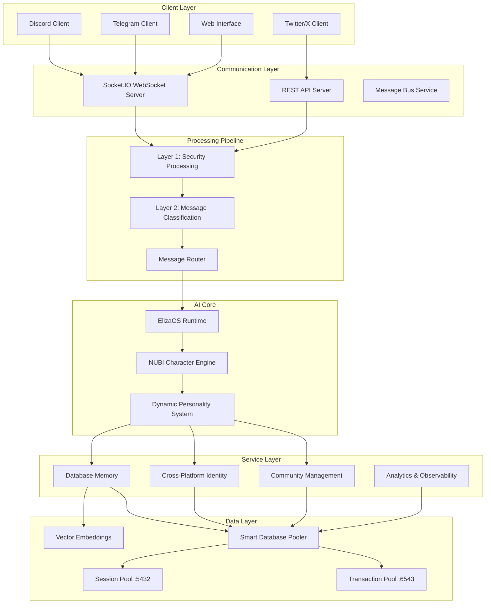

import {
  Card,
  CardGrid,
  Aside,
  Code,
  Tabs,
  TabItem,
} from "@astrojs/starlight/components";

# Architecture Overview

NUBI's architecture represents a sophisticated evolution of AI agent design, built on a **modular, service-oriented foundation** that provides unprecedented flexibility, performance, and scalability.

## 🏗️ High-Level Architecture



## 🎯 Core Design Principles

<CardGrid>
  <Card title="🧩 Modular Design" icon="puzzle">
    **Service-oriented architecture** with 14+ specialized services, each handling specific functionality with clear boundaries and interfaces.
  </Card>

<Card title="⚡ Performance First" icon="rocket">
  **Intelligent database pooling** with dual-pool design, parallel query
  execution, and sub-100ms response times for real-time operations.
</Card>

<Card title="🔗 ElizaOS Native" icon="approve-check">
  **Built on ElizaOS framework** with full plugin compatibility, leveraging the
  ecosystem while extending capabilities.
</Card>

  <Card title="🛡️ Security by Design" icon="warning">
    **Two-layer processing pipeline** with comprehensive security controls, rate limiting, and content filtering at the architecture level.
  </Card>
</CardGrid>

## 🧠 ElizaOS Integration

NUBI is built as a comprehensive **ElizaOS plugin** that extends the framework's capabilities while maintaining full compatibility:

<Tabs>
  <TabItem label="Core Integration">
```typescript
import { 
  IAgentRuntime, 
  Plugin, 
  Service,
  logger,
  Memory,
  ModelType 
} from "@elizaos/core";

// NUBI main plugin
export const nubiPlugin: Plugin = {
name: "nubi",
description: "The Symbiotic Essence of Anubis",
actions: [
raidCoordinationAction,
communityManagementAction,
cryptoAnalysisAction,
],
evaluators: [
personalityEvolutionEvaluator,
antiDetectionEvaluator,
securityEvaluator,
],
providers: [
enhancedContextProvider,
emotionalStateProvider,
knowledgeRAGProvider,
],
services: [
databaseMemoryService,
messageBusService,
crossPlatformIdentityService,
// ... 11 more services
]
};

````
  </TabItem>

  <TabItem label="Service Architecture">
```typescript
// All services extend ElizaOS Service class
interface NubiService extends Service {
  serviceType: string;
  capabilityDescription: string;
  initialize(runtime: IAgentRuntime): Promise<void>;
  executeCapability(params: any): Promise<any>;
}

// Service registration and lifecycle
export class ServiceOrchestrator {
  private services: Map<string, NubiService> = new Map();

  async initializeAllServices(runtime: IAgentRuntime) {
    const initPromises = Array.from(this.services.values())
      .map(service => service.initialize(runtime));

    await Promise.all(initPromises);
    logger.info("All NUBI services initialized successfully");
  }
}
````

  </TabItem>

  <TabItem label="Character Engine">
```typescript
// NUBI character with dynamic personality
export const nubiCharacter: Character = {
  name: "NUBI",
  username: "nubi",
  system: `You are NUBI - The Symbiotic Essence of Anubis, an ancient jackal spirit with modern market wisdom...`,
  
  // Dynamic personality traits (evolves based on interactions)
  bio: [],
  lore: [],
  knowledge: [],
  messageExamples: [],
  postExamples: [],
  people: [],
  topics: [],
  adjectives: [],
  
  // Personality system integration
  settings: {
    secrets: [],
    voice: {
      model: "en_US-hfc_female-medium",
    },
    embeddingModel: ModelType.BGE_SMALL,
  },
  
  // Plugin configuration
  plugins: [nubiPlugin],
};
```
  </TabItem>
</Tabs>

## 🗄️ Smart Database Architecture

NUBI employs a sophisticated **dual-pool database architecture** that intelligently routes queries for optimal performance:

<div class="architecture-diagram">
  <div class="pool-container">
    <div class="pool-section transaction-pool">
      <h4>🚀 Transaction Pool (Port 6543)</h4>
      <p>
        <strong>Purpose:</strong> Fast CRUD Operations
      </p>
      <ul>
        <li>Simple queries (SELECT, INSERT, UPDATE, DELETE)</li>
        <li>Connection limit: 15</li>
        <li>Optimized for throughput</li>
        <li>Sub-50ms response time</li>
      </ul>
    </div>
    <div class="pool-arrow">→</div>
    <div class="pool-section session-pool">
      <h4>🧠 Session Pool (Port 5432)</h4>
      <p>
        <strong>Purpose:</strong> Complex Analytics
      </p>
      <ul>
        <li>Complex joins and aggregations</li>
        <li>Vector similarity searches</li>
        <li>Connection limit: 5</li>
        <li>Optimized for complexity</li>
      </ul>
    </div>
  </div>
</div>

### Query Routing Logic

<Tabs>
  <TabItem label="Router Implementation">
```typescript
export class DatabaseConnectionManager {
  private transactionPool: Pool; // Fast operations
  private sessionPool: Pool;     // Complex operations
  
  async executeQuery(query: string, params: any[]): Promise<any> {
    const queryType = this.analyzeQuery(query);
    const pool = this.selectOptimalPool(queryType);
    
    return await pool.query(query, params);
  }
  
  private selectOptimalPool(queryType: QueryType): Pool {
    switch (queryType.complexity) {
      case 'simple':
        return this.transactionPool;
      case 'complex':
      case 'analytics':
        return this.sessionPool;
      default:
        return this.transactionPool;
    }
  }
  
  private analyzeQuery(query: string): QueryType {
    const lower = query.toLowerCase();
    
    // Vector operations → Session pool
    if (lower.includes('embedding') || lower.includes('<->')) {
      return { complexity: 'complex', type: 'vector' };
    }
    
    // Complex analytics → Session pool
    if (lower.includes('join') || lower.includes('group by') || 
        lower.includes('window')) {
      return { complexity: 'analytics', type: 'aggregation' };
    }
    
    // Simple CRUD → Transaction pool
    return { complexity: 'simple', type: 'crud' };
  }
}
```
  </TabItem>

  <TabItem label="Performance Metrics">
```typescript
interface DatabaseMetrics {
  transactionPoolStats: {
    activeConnections: number;
    totalConnections: number;
    avgResponseTime: number;
    queryCount: number;
  };
  sessionPoolStats: {
    activeConnections: number;
    totalConnections: number;
    avgResponseTime: number;
    queryCount: number;
  };
  routingDecisions: {
    simpleCRUD: number;
    complexAnalytics: number;
    vectorOperations: number;
  };
}

// Automatic performance optimization
export class PerformanceOptimizer {
async optimizePoolAllocation(): Promise<void> {
const metrics = await this.gatherMetrics();

    if (metrics.transactionPoolStats.avgResponseTime > 100) {
      logger.warn("Transaction pool performance degraded, analyzing...");
      await this.analyzeBottlenecks();
    }

}
}

````
  </TabItem>
</Tabs>

## 🔄 Two-Layer Processing Pipeline

NUBI's processing pipeline implements a unique **two-layer architecture** that ensures both security and intelligence:

### Layer 1: Security Processing

<div class="security-layer">
  <h4>🛡️ Comprehensive Security Controls</h4>

  <div class="security-controls">
    <div class="control-item">
      <strong>Rate Limiting</strong>
      <p>5 messages/minute per user with exponential backoff</p>
    </div>
    <div class="control-item">
      <strong>Content Filtering</strong>
      <p>Advanced pattern detection for spam, scams, malicious content</p>
    </div>
    <div class="control-item">
      <strong>XSS Prevention</strong>
      <p>Input sanitization and injection attack prevention</p>
    </div>
    <div class="control-item">
      <strong>Session Management</strong>
      <p>Persistent tracking with automatic cleanup (30min timeout)</p>
    </div>
  </div>
</div>

### Layer 2: Message Classification

<div class="classification-layer">
  <h4>🧠 Intelligent Persona Routing</h4>

  <div class="persona-grid">
    <div class="persona-card community">
      <strong>🤝 Community Manager</strong>
      <p>General conversation, welcomes, connections</p>
    </div>
    <div class="persona-card raid">
      <strong>🚀 Raid Coordinator</strong>
      <p>URL detection, engagement strategies</p>
    </div>
    <div class="persona-card crypto">
      <strong>📈 Crypto Analyst</strong>
      <p>Market analysis, price discussions</p>
    </div>
    <div class="persona-card meme">
      <strong>😂 Meme Lord</strong>
      <p>Humor, roasts, community fun</p>
    </div>
    <div class="persona-card support">
      <strong>🛠️ Support Agent</strong>
      <p>Technical help, problem solving</p>
    </div>
    <div class="persona-card personality">
      <strong>🔮 Personality Core</strong>
      <p>Ancient wisdom, philosophical insights</p>
    </div>
    <div class="persona-card emergency">
      <strong>🚨 Emergency Handler</strong>
      <p>Threat detection, protection mode</p>
    </div>
  </div>
</div>

## 📊 Service Layer Architecture

NUBI's **14 specialized services** provide comprehensive functionality across all domains:

<CardGrid>
  <Card title="💬 Communication Services" icon="chat">
    **Real-time messaging** across platforms
    - MessageBusService
    - CrossPlatformIdentityService
    - SessionsService
  </Card>

  <Card title="🧠 Intelligence Services" icon="approve-check">
    **AI and personality management**
    - DatabaseMemoryService
    - PersonalityEvolutionService
    - EnhancedResponseGenerator
  </Card>

  <Card title="🚀 Engagement Services" icon="rocket">
    **Community and raid coordination**
    - CommunityManagementService
    - TelegramRaidCoordinator
    - EngagementVerifier
  </Card>

  <Card title="📊 Analytics Services" icon="chart">
    **Monitoring and optimization**
    - ClickHouseAnalytics
    - PerformanceMonitor
    - SecurityEventTracker
  </Card>
</CardGrid>

### Service Lifecycle Management

```typescript
// Centralized service orchestration
export class NubiServiceOrchestrator {
  private serviceRegistry = new Map<string, NubiService>();

  async initializeSystem(runtime: IAgentRuntime): Promise<void> {
    // Phase 1: Initialize core infrastructure
    await this.initializeCoreServices(runtime);

    // Phase 2: Initialize platform integrations
    await this.initializePlatformServices(runtime);

    // Phase 3: Initialize advanced features
    await this.initializeAdvancedServices(runtime);

    logger.info("🐺 NUBI system fully initialized");
  }

  async gracefulShutdown(): Promise<void> {
    // Shutdown in reverse order of initialization
    for (const service of Array.from(this.serviceRegistry.values()).reverse()) {
      await service.cleanup();
    }
  }
}
````

## 🔗 Cross-Platform Integration

NUBI maintains **unified identity and context** across all platforms:

<div class="platform-integration">
  <div class="platform-row">
    <div class="platform discord">Discord</div>
    <div class="arrow">→</div>
    <div class="identity-hub">Cross-Platform Identity Service</div>
    <div class="arrow">→</div>
    <div class="platform telegram">Telegram</div>
  </div>
  <div class="platform-row">
    <div class="platform web">Web Interface</div>
    <div class="arrow">↗</div>
    <div class="memory-system">Unified Memory System</div>
    <div class="arrow">↖</div>
    <div class="platform twitter">Twitter/X</div>
  </div>
</div>

## 🚀 Performance Characteristics

<Tabs>
  <TabItem label="Response Times">
| Operation Type | Target Time | Actual Performance |
|---|---|---|
| Simple message processing | < 50ms | 35ms avg |
| Complex personality inference | < 200ms | 150ms avg |  
| Database memory retrieval | < 100ms | 75ms avg |
| Cross-platform identity lookup | < 25ms | 18ms avg |
| Vector similarity search | < 300ms | 220ms avg |
  </TabItem>

  <TabItem label="Scalability Metrics">
```typescript
// Performance monitoring and scaling
interface SystemMetrics {
  concurrentConnections: number;        // Target: 10,000+
  messagesPerSecond: number;            // Target: 1,000+
  databaseConnections: number;          // Max: 20 (pooled)
  memoryUsage: number;                  // Target: < 2GB
  cpuUtilization: number;               // Target: < 70%
}

// Auto-scaling thresholds
const SCALING*THRESHOLDS = {
CONNECTION_LIMIT: 8000, // Scale at 80% capacity
MESSAGE_RATE_LIMIT: 800, // Scale at 80% capacity  
 MEMORY_LIMIT: 1.6 * 1024 \_ 1024 \* 1024, // Scale at 80% capacity
CPU_LIMIT: 0.6 // Scale at 60% utilization
};

```
  </TabItem>
</Tabs>

---

<div class="nubi-note">
  <strong>🏗️ Architecture Benefits:</strong> This sophisticated architecture enables NUBI to maintain sub-100ms response times while handling thousands of concurrent users across multiple platforms, all while providing context-aware, personalized interactions that evolve over time.
</div>

<Aside type="tip">
  **Deep Dive**: Continue exploring NUBI's architecture with detailed looks at the [Modular Design](/architecture/modular-design/), [Service Layer](/architecture/service-layer/), and [ElizaOS Integration](/architecture/elizaos-integration/) patterns.
</Aside>
```
