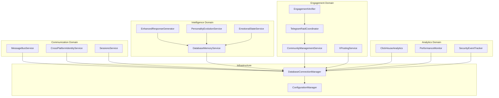

import {
  Card,
  CardGrid,
  Aside,
  Code,
  Tabs,
  TabItem,
} from "@astrojs/starlight/components";

# Service Layer Architecture

NUBI's service layer comprises **14 specialized services** organized into four functional domains. Each service is designed with clear responsibilities, well-defined interfaces, and robust error handling patterns.

## 🏗️ Service Domain Organization



## 💬 Communication Services

Communication services handle all real-time messaging, identity management, and session coordination across platforms.

<CardGrid>
  <Card title="📡 MessageBusService" icon="rocket">
    **Multi-transport messaging** with intelligent routing, delivery guarantees, and platform-specific adaptation.
  </Card>

<Card title="👤 CrossPlatformIdentityService" icon="user">
  **Unified user identity** linking across Discord, Telegram, Twitter, and web
  platforms with context preservation.
</Card>

  <Card title="🔄 SessionsService" icon="setting">
    **Session lifecycle management** with persistent state, timeout handling, and cross-platform session migration.
  </Card>
</CardGrid>

### MessageBusService Implementation

<Tabs>
  <TabItem label="Core Architecture">
```typescript
export interface Transport {
  name: string;
  isConnected(): boolean;
  send(message: TransportMessage): Promise<boolean>;
  onMessage(callback: MessageHandler): void;
  connect(): Promise<void>;
  disconnect(): Promise<void>;
}

export class MessageBusService implements NubiService {
  serviceType = "message-bus";
  capabilityDescription = "Multi-platform message routing and delivery";
  
  private transports = new Map<string, Transport>();
  private messageQueue = new Map<string, QueuedMessage[]>();
  private deliveryTracking = new Map<string, DeliveryStatus>();
  
  async registerTransport(transport: Transport): Promise<void> {
    await transport.connect();
    
    transport.onMessage(async (message) => {
      await this.routeIncomingMessage(message);
    });
    
    this.transports.set(transport.name, transport);
    logger.info(`✅ Transport registered: ${transport.name}`);
  }
  
  async broadcastMessage(
    message: BroadcastMessage,
    platforms?: string[]
  ): Promise<BroadcastResult> {
    const targetPlatforms = platforms || Array.from(this.transports.keys());
    const results: PlatformResult[] = [];
    
    // Send to all platforms in parallel
    const sendPromises = targetPlatforms.map(async (platform) => {
      const transport = this.transports.get(platform);
      if (!transport?.isConnected()) {
        return { platform, success: false, error: 'Transport not available' };
      }
      
      try {
        const platformMessage = this.adaptMessageForPlatform(message, platform);
        const success = await transport.send(platformMessage);
        
        return { platform, success, messageId: platformMessage.id };
      } catch (error) {
        logger.error(`Failed to send to ${platform}:`, error);
        return { platform, success: false, error: error.message };
      }
    });
    
    const platformResults = await Promise.all(sendPromises);
    
    return {
      messageId: message.id,
      timestamp: new Date(),
      results: platformResults,
      successCount: platformResults.filter(r => r.success).length,
      totalPlatforms: targetPlatforms.length
    };
  }
  
  private adaptMessageForPlatform(
    message: BroadcastMessage, 
    platform: string
  ): TransportMessage {
    switch (platform) {
      case 'discord':
        return this.adaptForDiscord(message);
      case 'telegram':
        return this.adaptForTelegram(message);
      case 'twitter':
        return this.adaptForTwitter(message);
      case 'websocket':
        return this.adaptForWebSocket(message);
      default:
        return message as TransportMessage;
    }
  }
}
```
  </TabItem>

  <TabItem label="Transport Implementations">
```typescript
// Discord transport implementation
export class DiscordTransport implements Transport {
  name = "discord";
  private client: Discord.Client;
  private messageHandlers: MessageHandler[] = [];
  
  constructor(token: string) {
    this.client = new Discord.Client({
      intents: [
        Discord.GatewayIntentBits.Guilds,
        Discord.GatewayIntentBits.GuildMessages,
        Discord.GatewayIntentBits.MessageContent
      ]
    });
  }
  
  async connect(): Promise<void> {
    await this.client.login(process.env.DISCORD_BOT_TOKEN);
    
    this.client.on('messageCreate', (discordMessage) => {
      if (discordMessage.author.bot) return;
      
      const message: TransportMessage = {
        id: discordMessage.id,
        content: discordMessage.content,
        userId: discordMessage.author.id,
        username: discordMessage.author.username,
        platform: 'discord',
        roomId: discordMessage.channel.id,
        timestamp: discordMessage.createdAt
      };
      
      this.messageHandlers.forEach(handler => handler(message));
    });
  }
  
  async send(message: TransportMessage): Promise<boolean> {
    try {
      const channel = await this.client.channels.fetch(message.roomId);
      if (channel?.isTextBased()) {
        await channel.send({
          content: message.content,
          embeds: message.embeds,
          components: message.components
        });
        return true;
      }
      return false;
    } catch (error) {
      logger.error('Discord send failed:', error);
      return false;
    }
  }
}

// Telegram transport implementation
export class TelegramTransport implements Transport {
name = "telegram";
private bot: TelegramBot;

constructor(token: string) {
this.bot = new TelegramBot(token, { polling: true });
}

async connect(): Promise<void> {
this.bot.on('message', (telegramMessage) => {
const message: TransportMessage = {
id: telegramMessage.message_id.toString(),
content: telegramMessage.text || '',
userId: telegramMessage.from?.id.toString() || '',
username: telegramMessage.from?.username || '',
platform: 'telegram',
roomId: telegramMessage.chat.id.toString(),
timestamp: new Date(telegramMessage.date \* 1000)
};

      this.messageHandlers.forEach(handler => handler(message));
    });

}

async send(message: TransportMessage): Promise<boolean> {
try {
await this.bot.sendMessage(message.roomId, message.content, {
parse_mode: 'Markdown',
reply_markup: message.replyMarkup
});
return true;
} catch (error) {
logger.error('Telegram send failed:', error);
return false;
}
}
}

````
  </TabItem>

  <TabItem label="Message Routing">
```typescript
// Intelligent message routing with priority and retry logic
export class MessageRouter {
  private routingRules = new Map<string, RoutingRule>();
  private priorityQueue = new PriorityQueue<QueuedMessage>();

  addRoutingRule(rule: RoutingRule): void {
    this.routingRules.set(rule.id, rule);
  }

  async routeMessage(message: IncomingMessage): Promise<RoutingResult> {
    // Apply routing rules to determine destination
    const applicableRules = this.findApplicableRules(message);

    if (applicableRules.length === 0) {
      // Default routing to all connected platforms
      return this.defaultRoute(message);
    }

    // Execute routing rules with priority
    const routingDecisions = await this.executeRoutingRules(
      message,
      applicableRules
    );

    return {
      messageId: message.id,
      destinations: routingDecisions.destinations,
      transformations: routingDecisions.transformations,
      priority: routingDecisions.priority
    };
  }

  private findApplicableRules(message: IncomingMessage): RoutingRule[] {
    return Array.from(this.routingRules.values()).filter(rule => {
      // Check platform conditions
      if (rule.conditions.sourcePlatform &&
          rule.conditions.sourcePlatform !== message.platform) {
        return false;
      }

      // Check content patterns
      if (rule.conditions.contentPattern) {
        const regex = new RegExp(rule.conditions.contentPattern, 'i');
        if (!regex.test(message.content)) {
          return false;
        }
      }

      // Check user conditions
      if (rule.conditions.userFilter) {
        return rule.conditions.userFilter(message.userId);
      }

      return true;
    }).sort((a, b) => b.priority - a.priority); // Higher priority first
  }
}
````

  </TabItem>
</Tabs>

### CrossPlatformIdentityService

<Tabs>
  <TabItem label="Identity Linking">
```typescript
export interface UserIdentity {
  primaryId: string;
  platformIdentities: Record<string, PlatformIdentity>;
  preferences: UserPreferences;
  metadata: UserMetadata;
  createdAt: Date;
  lastActive: Date;
}

export interface PlatformIdentity {
  platformId: string;
  username: string;
  displayName: string;
  verified: boolean;
  linkedAt: Date;
  lastSeen: Date;
}

export class CrossPlatformIdentityService implements NubiService {
  serviceType = "cross-platform-identity";
  capabilityDescription = "Unified user identity across all platforms";
  
  private identityCache = new Map<string, UserIdentity>();
  
  async linkIdentity(
    primaryId: string,
    platform: string,
    platformData: PlatformIdentity
  ): Promise<LinkResult> {
    const existingIdentity = await this.getIdentity(primaryId);
    
    if (existingIdentity) {
      // Update existing identity
      existingIdentity.platformIdentities[platform] = platformData;
      existingIdentity.lastActive = new Date();
    } else {
      // Create new identity
      const newIdentity: UserIdentity = {
        primaryId,
        platformIdentities: { [platform]: platformData },
        preferences: this.getDefaultPreferences(),
        metadata: {},
        createdAt: new Date(),
        lastActive: new Date()
      };
      
      await this.storeIdentity(newIdentity);
    }
    
    return {
      success: true,
      primaryId,
      platform,
      isNewUser: !existingIdentity
    };
  }
  
  async resolveIdentity(
    platform: string,
    platformId: string
  ): Promise<UserIdentity | null> {
    // Check cache first
    const cacheKey = `${platform}:${platformId}`;
    if (this.identityCache.has(cacheKey)) {
      return this.identityCache.get(cacheKey)!;
    }
    
    // Query database
    const query = `
      SELECT primary_id, platform_identities, preferences, metadata, 
             created_at, last_active
      FROM user_identities 
      WHERE platform_identities->>'${platform}' LIKE '%"platformId":"${platformId}"%'
    `;
    
    const result = await this.connectionManager.executeQuery(query, []);
    
    if (result.rows.length > 0) {
      const identity = this.deserializeIdentity(result.rows[0]);
      this.identityCache.set(cacheKey, identity);
      return identity;
    }
    
    return null;
  }
  
  async getUserContext(primaryId: string): Promise<UserContext> {
    const identity = await this.getIdentity(primaryId);
    if (!identity) {
      throw new Error(`User identity not found: ${primaryId}`);
    }
    
    // Gather context from all linked platforms
    const platformContexts = await Promise.all(
      Object.entries(identity.platformIdentities).map(
        async ([platform, platformIdentity]) => {
          return await this.getPlatformContext(platform, platformIdentity);
        }
      )
    );
    
    return {
      identity,
      platformContexts,
      aggregatedStats: this.aggregateUserStats(platformContexts),
      preferences: identity.preferences
    };
  }
}
```
  </TabItem>

  <TabItem label="Context Migration">
```typescript
// Cross-platform context migration
export class ContextMigrationService {
  async migrateUserContext(
    fromPlatform: string,
    toPlatform: string,
    userId: string
  ): Promise<MigrationResult> {
    const sourceContext = await this.getContextFromPlatform(fromPlatform, userId);
    
    const migration: ContextMigration = {
      sourceContext,
      targetPlatform: toPlatform,
      migrationStrategy: this.selectMigrationStrategy(fromPlatform, toPlatform),
      preservedElements: this.determinePreservedElements(sourceContext),
      transformationRules: this.getTransformationRules(fromPlatform, toPlatform)
    };
    
    const migratedContext = await this.applyMigration(migration);
    
    return {
      success: true,
      sourceContext,
      migratedContext,
      elementsPreserved: migration.preservedElements.length,
      transformationsApplied: migration.transformationRules.length
    };
  }
  
  private selectMigrationStrategy(
    from: string, 
    to: string
  ): MigrationStrategy {
    const strategies = {
      'discord->telegram': 'preserve_roles_as_tags',
      'telegram->discord': 'convert_tags_to_roles',
      'twitter->telegram': 'preserve_followers_as_contacts',
      'websocket->any': 'preserve_session_state'
    };
    
    return strategies[`${from}->${to}`] || 'basic_preservation';
  }
}
```
  </TabItem>
</Tabs>

## 🧠 Intelligence Services

Intelligence services power NUBI's AI capabilities, managing memory, personality evolution, and response generation.

<CardGrid>
  <Card title="🗄️ DatabaseMemoryService" icon="setting">
    **Advanced memory management** with semantic search, context retrieval, and intelligent memory consolidation.
  </Card>

<Card title="✨ EnhancedResponseGenerator" icon="approve-check">
  **Context-aware response generation** with personality-driven variations and
  anti-detection mechanisms.
</Card>

<Card title="🎭 PersonalityEvolutionService" icon="user">
  **Dynamic personality adaptation** based on community interactions and
  contextual triggers.
</Card>

  <Card title="😊 EmotionalStateService" icon="heart">
    **Emotional intelligence processing** with mood detection, empathy modeling, and emotional memory.
  </Card>
</CardGrid>

### DatabaseMemoryService Deep Dive

<Tabs>
  <TabItem label="Memory Architecture">
```typescript
export interface MemoryEntry {
  id: string;
  type: MemoryType;
  content: string;
  userId: string;
  roomId: string;
  platform: string;
  embedding?: number[];
  importance: number;
  emotional_context?: EmotionalContext;
  created_at: Date;
  accessed_count: number;
  last_accessed: Date;
}

export enum MemoryType {
  CONVERSATION = 'conversation',
  PERSONALITY = 'personality',
  KNOWLEDGE = 'knowledge',
  PREFERENCE = 'preference',
  RELATIONSHIP = 'relationship',
  EMOTIONAL = 'emotional'
}

export class DatabaseMemoryService implements NubiService {
  serviceType = "database-memory";
  capabilityDescription = "Advanced memory management with semantic search";
  
  private vectorService: VectorEmbeddingService;
  private memoryCache = new LRUCache<string, MemoryEntry>({ max: 1000 });
  
  async storeMemory(
    content: string,
    type: MemoryType,
    context: MemoryContext
  ): Promise<string> {
    const embedding = await this.vectorService.generateEmbedding(content);
    const importance = this.calculateImportance(content, type, context);
    
    const memoryEntry: MemoryEntry = {
      id: crypto.randomUUID(),
      type,
      content,
      userId: context.userId,
      roomId: context.roomId,
      platform: context.platform,
      embedding,
      importance,
      emotional_context: context.emotionalContext,
      created_at: new Date(),
      accessed_count: 0,
      last_accessed: new Date()
    };
    
    await this.insertMemory(memoryEntry);
    this.memoryCache.set(memoryEntry.id, memoryEntry);
    
    return memoryEntry.id;
  }
  
  async searchMemories(
    query: string,
    context: SearchContext,
    options: SearchOptions = {}
  ): Promise<MemorySearchResult[]> {
    const queryEmbedding = await this.vectorService.generateEmbedding(query);
    const { limit = 10, threshold = 0.7, types, userId, timeRange } = options;
    
    let sql = `
      SELECT id, type, content, user_id, room_id, platform, 
             importance, emotional_context, created_at, accessed_count,
             (embedding <-> $1::vector) as similarity
      FROM memories 
      WHERE (embedding <-> $1::vector) < $2
    `;
    
    const params: any[] = [JSON.stringify(queryEmbedding), 1 - threshold];
    let paramIndex = 2;
    
    // Add filters
    if (userId) {
      sql += ` AND user_id = $${++paramIndex}`;
      params.push(userId);
    }
    
    if (types && types.length > 0) {
      sql += ` AND type = ANY($${++paramIndex})`;
      params.push(types);
    }
    
    if (timeRange) {
      sql += ` AND created_at >= $${++paramIndex}`;
      params.push(timeRange.start);
    }
    
    sql += ` ORDER BY similarity ASC, importance DESC, created_at DESC LIMIT $${++paramIndex}`;
    params.push(limit);
    
    const result = await this.connectionManager.executeQuery(sql, params);
    
    return result.rows.map(row => ({
      memory: this.deserializeMemory(row),
      similarity: 1 - row.similarity,
      relevance: this.calculateRelevance(row, context)
    }));
  }
  
  async consolidateMemories(userId: string): Promise<ConsolidationResult> {
    // Find related memories for consolidation
    const relatedMemories = await this.findRelatedMemories(userId);
    const consolidationGroups = this.groupMemoriesForConsolidation(relatedMemories);
    
    const consolidatedMemories: MemoryEntry[] = [];
    
    for (const group of consolidationGroups) {
      if (group.memories.length >= 3) { // Minimum memories for consolidation
        const consolidated = await this.consolidateMemoryGroup(group);
        consolidatedMemories.push(consolidated);
        
        // Mark original memories as consolidated
        await this.markMemoriesAsConsolidated(group.memories);
      }
    }
    
    return {
      originalCount: relatedMemories.length,
      consolidatedCount: consolidatedMemories.length,
      consolidatedMemories,
      spaceSaved: this.calculateSpaceSaved(relatedMemories, consolidatedMemories)
    };
  }
}
```
  </TabItem>

  <TabItem label="Semantic Search">
```typescript
// Advanced semantic search with context awareness
export class SemanticSearchEngine {
  private vectorService: VectorEmbeddingService;
  
  async performSemanticSearch(
    query: string,
    context: SearchContext,
    options: SemanticSearchOptions
  ): Promise<SemanticSearchResult[]> {
    // Generate multi-dimensional query embedding
    const [queryEmbedding, contextEmbedding] = await Promise.all([
      this.vectorService.generateEmbedding(query),
      this.generateContextEmbedding(context)
    ]);
    
    // Combine query and context embeddings
    const combinedEmbedding = this.combineEmbeddings(
      queryEmbedding, 
      contextEmbedding, 
      options.contextWeight || 0.3
    );
    
    // Execute hybrid search (semantic + keyword)
    const [semanticResults, keywordResults] = await Promise.all([
      this.vectorSearch(combinedEmbedding, options),
      this.keywordSearch(query, options)
    ]);
    
    // Merge and rank results
    return this.mergeSearchResults(semanticResults, keywordResults, {
      semanticWeight: 0.7,
      keywordWeight: 0.3,
      diversityBoost: options.diversityBoost || 0.1
    });
  }
  
  private async generateContextEmbedding(
    context: SearchContext
  ): Promise<number[]> {
    const contextText = [
      context.currentConversation || '',
      context.userPersonality || '',
      context.emotionalState || '',
      context.platformSpecific || ''
    ].filter(Boolean).join(' ');
    
    return await this.vectorService.generateEmbedding(contextText);
  }
  
  private combineEmbeddings(
    query: number[], 
    context: number[], 
    contextWeight: number
  ): number[] {
    const queryWeight = 1 - contextWeight;
    
    return query.map((val, idx) => 
      val * queryWeight + context[idx] * contextWeight
    );
  }
  
  async performTemporalSearch(
    query: string,
    timeContext: TemporalContext,
    options: TemporalSearchOptions
  ): Promise<TemporalSearchResult[]> {
    const baseResults = await this.performSemanticSearch(query, timeContext, options);
    
    // Apply temporal scoring
    const temporalResults = baseResults.map(result => {
      const temporalScore = this.calculateTemporalRelevance(
        result.memory.created_at,
        timeContext.referenceTime,
        timeContext.decayFunction
      );
      
      return {
        ...result,
        temporalScore,
        combinedScore: result.similarity * 0.6 + temporalScore * 0.4
      };
    });
    
    return temporalResults.sort((a, b) => b.combinedScore - a.combinedScore);
  }
}
```
  </TabItem>
</Tabs>

## 🚀 Engagement Services

Engagement services manage community interactions, raid coordination, and social media campaigns.

<CardGrid>
  <Card title="🤝 CommunityManagementService" icon="chat">
    **Community engagement** with user onboarding, relationship tracking, and interaction optimization.
  </Card>

<Card title="⚔️ TelegramRaidCoordinator" icon="rocket">
  **Raid orchestration** with strategy selection, participant management, and
  performance tracking.
</Card>

<Card title="✅ EngagementVerifier" icon="approve-check">
  **Quality assurance** for engagement activities with AI-powered verification
  and scoring.
</Card>

  <Card title="🐦 XPostingService" icon="twitter">
    **Twitter integration** for automated posting, engagement tracking, and influence measurement.
  </Card>
</CardGrid>

### TelegramRaidCoordinator Implementation

<Tabs>
  <TabItem label="Raid Orchestration">
```typescript
export interface RaidConfiguration {
  id: string;
  target: RaidTarget;
  strategy: RaidStrategy;
  participants: RaidParticipant[];
  timeline: RaidTimeline;
  requirements: RaidRequirements;
  rewards: RewardStructure;
}

export class TelegramRaidCoordinator implements NubiService {
  serviceType = "telegram-raid-coordinator";
  capabilityDescription = "Advanced raid coordination and management";
  
  private activeRaids = new Map<string, ActiveRaid>();
  private strategyEngine = new RaidStrategyEngine();
  private verificationService = new EngagementVerifier();
  
  async initiateRaid(config: RaidConfiguration): Promise<RaidInitiationResult> {
    // Validate raid configuration
    const validation = await this.validateRaidConfig(config);
    if (!validation.isValid) {
      throw new RaidConfigurationError(validation.errors);
    }
    
    // Select optimal strategy based on target and participants
    const strategy = await this.strategyEngine.selectOptimalStrategy({
      target: config.target,
      participantCount: config.participants.length,
      participantCapabilities: this.analyzeParticipantCapabilities(config.participants),
      timeConstraints: config.timeline
    });
    
    const raid: ActiveRaid = {
      id: config.id,
      config,
      strategy,
      status: 'preparing',
      participants: new Map(),
      metrics: this.initializeRaidMetrics(),
      startedAt: new Date()
    };
    
    // Initialize participant tracking
    for (const participant of config.participants) {
      await this.initializeParticipant(raid.id, participant);
    }
    
    this.activeRaids.set(raid.id, raid);
    
    // Send raid briefing to participants
    await this.sendRaidBriefing(raid);
    
    return {
      raidId: raid.id,
      strategy: strategy.name,
      estimatedDuration: strategy.estimatedDuration,
      participantCount: config.participants.length,
      startTime: raid.startedAt
    };
  }
  
  async executeRaidPhase(
    raidId: string, 
    phase: RaidPhase
  ): Promise<PhaseExecutionResult> {
    const raid = this.activeRaids.get(raidId);
    if (!raid) {
      throw new Error(`Raid not found: ${raidId}`);
    }
    
    logger.info(`Executing raid phase: ${phase.name} for raid ${raidId}`);
    
    // Update raid status
    raid.status = 'executing';
    raid.currentPhase = phase;
    
    // Execute phase actions in parallel
    const phaseResults = await Promise.all(
      phase.actions.map(action => this.executeRaidAction(raid, action))
    );
    
    // Collect and analyze results
    const phaseResult = this.analyzePhaseResults(phaseResults);
    
    // Update raid metrics
    this.updateRaidMetrics(raid, phaseResult);
    
    // Determine next phase or completion
    const nextPhase = this.determineNextPhase(raid, phase, phaseResult);
    
    if (nextPhase) {
      // Schedule next phase
      setTimeout(() => {
        this.executeRaidPhase(raidId, nextPhase);
      }, phase.cooldownMs || 0);
    } else {
      // Raid complete
      await this.completeRaid(raidId);
    }
    
    return {
      phase: phase.name,
      success: phaseResult.success,
      participantResults: phaseResults,
      metrics: phaseResult.metrics,
      nextPhase: nextPhase?.name
    };
  }
  
  private async executeRaidAction(
    raid: ActiveRaid, 
    action: RaidAction
  ): Promise<ActionResult> {
    switch (action.type) {
      case 'like_posts':
        return await this.executeLikeAction(raid, action);
      case 'comment':
        return await this.executeCommentAction(raid, action);
      case 'retweet':
        return await this.executeRetweetAction(raid, action);
      case 'follow':
        return await this.executeFollowAction(raid, action);
      default:
        throw new Error(`Unknown action type: ${action.type}`);
    }
  }
  
  private async executeLikeAction(
    raid: ActiveRaid, 
    action: LikeAction
  ): Promise<ActionResult> {
    const participants = this.getAvailableParticipants(raid, action.requirements);
    const likeResults: ParticipantResult[] = [];
    
    // Execute likes in batches to avoid rate limiting
    const batchSize = 5;
    for (let i = 0; i < participants.length; i += batchSize) {
      const batch = participants.slice(i, i + batchSize);
      
      const batchPromises = batch.map(async (participant) => {
        try {
          const success = await this.performLike(participant, action.target);
          
          if (success) {
            await this.verificationService.verifyEngagement({
              participantId: participant.id,
              action: 'like',
              target: action.target,
              timestamp: new Date()
            });
          }
          
          return {
            participantId: participant.id,
            success,
            timestamp: new Date()
          };
        } catch (error) {
          return {
            participantId: participant.id,
            success: false,
            error: error.message,
            timestamp: new Date()
          };
        }
      });
      
      const batchResults = await Promise.all(batchPromises);
      likeResults.push(...batchResults);
      
      // Rate limiting delay between batches
      if (i + batchSize < participants.length) {
        await this.sleep(action.delayMs || 2000);
      }
    }
    
    return {
      action: action.type,
      target: action.target,
      results: likeResults,
      successCount: likeResults.filter(r => r.success).length,
      totalAttempts: likeResults.length
    };
  }
}
```
  </TabItem>

  <TabItem label="Strategy Engine">
```typescript
// Intelligent raid strategy selection and optimization
export class RaidStrategyEngine {
  private strategies = new Map<string, RaidStrategy>();
  private performanceHistory = new Map<string, StrategyPerformance>();
  
  constructor() {
    this.initializeStrategies();
  }
  
  async selectOptimalStrategy(
    context: StrategySelectionContext
  ): Promise<RaidStrategy> {
    const candidateStrategies = this.filterApplicableStrategies(context);
    
    // Score strategies based on context and historical performance
    const scoredStrategies = await Promise.all(
      candidateStrategies.map(async (strategy) => {
        const score = await this.scoreStrategy(strategy, context);
        return { strategy, score };
      })
    );
    
    // Select best strategy
    const bestStrategy = scoredStrategies
      .sort((a, b) => b.score - a.score)[0];
    
    // Optimize strategy for current context
    return await this.optimizeStrategy(bestStrategy.strategy, context);
  }
  
  private async scoreStrategy(
    strategy: RaidStrategy,
    context: StrategySelectionContext
  ): Promise<number> {
    const baseScore = strategy.baseEffectiveness;
    
    // Historical performance factor
    const performance = this.performanceHistory.get(strategy.id);
    const performanceFactor = performance 
      ? (performance.successRate * 0.5 + performance.averageEngagement * 0.3)
      : 0.5;
    
    // Context compatibility factor
    const compatibilityFactor = this.calculateCompatibility(strategy, context);
    
    // Participant capability factor
    const capabilityFactor = this.assessParticipantCapability(
      strategy.requirements,
      context.participantCapabilities
    );
    
    // Time constraint factor
    const timeFactor = this.assessTimeConstraints(
      strategy.estimatedDuration,
      context.timeConstraints
    );
    
    return baseScore * performanceFactor * compatibilityFactor * 
           capabilityFactor * timeFactor;
  }
  
  private async optimizeStrategy(
    strategy: RaidStrategy,
    context: StrategySelectionContext
  ): Promise<RaidStrategy> {
    const optimizedStrategy = { ...strategy };
    
    // Optimize timing based on target platform activity patterns
    const optimalTiming = await this.calculateOptimalTiming(
      context.target.platform,
      context.target.audience
    );
    
    optimizedStrategy.phases = optimizedStrategy.phases.map(phase => ({
      ...phase,
      timing: this.adjustPhaseTimingForOptimal(phase.timing, optimalTiming)
    }));
    
    // Optimize participant allocation
    optimizedStrategy.participantAllocation = this.optimizeParticipantAllocation(
      strategy.participantAllocation,
      context.participantCapabilities
    );
    
    // Adjust intensity based on target sensitivity
    const targetSensitivity = await this.assessTargetSensitivity(context.target);
    optimizedStrategy.intensity = this.adjustIntensityForSensitivity(
      strategy.intensity,
      targetSensitivity
    );
    
    return optimizedStrategy;
  }
  
  private initializeStrategies(): void {
    // Organic Growth Strategy
    this.strategies.set('organic_growth', {
      id: 'organic_growth',
      name: 'Organic Growth',
      description: 'Natural, human-like engagement over extended period',
      baseEffectiveness: 0.85,
      estimatedDuration: 3600000, // 1 hour
      intensity: 'low',
      phases: [
        {
          name: 'discovery',
          duration: 900000, // 15 minutes
          actions: ['browse', 'view_profiles', 'occasional_like'],
          timing: 'immediate'
        },
        {
          name: 'engagement',
          duration: 1800000, // 30 minutes
          actions: ['strategic_likes', 'quality_comments'],
          timing: 'staggered'
        },
        {
          name: 'amplification',
          duration: 900000, // 15 minutes
          actions: ['shares', 'follows', 'profile_visits'],
          timing: 'natural'
        }
      ],
      requirements: {
        minParticipants: 5,
        maxParticipants: 20,
        requiredCapabilities: ['commenting', 'liking', 'sharing']
      }
    });
    
    // Viral Boost Strategy
    this.strategies.set('viral_boost', {
      id: 'viral_boost',
      name: 'Viral Boost',
      description: 'Rapid engagement burst for maximum visibility',
      baseEffectiveness: 0.75,
      estimatedDuration: 1200000, // 20 minutes
      intensity: 'high',
      phases: [
        {
          name: 'initial_wave',
          duration: 300000, // 5 minutes
          actions: ['mass_likes', 'quick_shares'],
          timing: 'synchronized'
        },
        {
          name: 'comment_storm',
          duration: 600000, // 10 minutes
          actions: ['rapid_comments', 'reply_chains'],
          timing: 'cascading'
        },
        {
          name: 'sustain',
          duration: 300000, // 5 minutes
          actions: ['continued_engagement', 'profile_follows'],
          timing: 'maintained'
        }
      ],
      requirements: {
        minParticipants: 10,
        maxParticipants: 50,
        requiredCapabilities: ['rapid_action', 'commenting', 'coordination']
      }
    });
  }
}
```
  </TabItem>
</Tabs>

## 📊 Analytics Services

Analytics services provide comprehensive monitoring, performance tracking, and business intelligence capabilities.

<CardGrid>
  <Card title="📈 ClickHouseAnalytics" icon="chart">
    **Real-time analytics** with high-performance data ingestion, complex aggregations, and interactive dashboards.
  </Card>

<Card title="⚡ PerformanceMonitor" icon="rocket">
  **System performance tracking** with automatic alerting, bottleneck detection,
  and optimization recommendations.
</Card>

  <Card title="🔒 SecurityEventTracker" icon="warning">
    **Security monitoring** with threat detection, anomaly analysis, and incident response coordination.
  </Card>
</CardGrid>

---

<div class="nubi-note">
  <strong>🔧 Service Benefits:</strong> This comprehensive service layer enables
  NUBI to provide sophisticated functionality while maintaining clear separation
  of concerns, excellent testability, and high performance across all
  operational domains.
</div>

<Aside type="tip">
  **Implementation Details**: Explore the [ElizaOS
  Integration](/architecture/elizaos-integration/) to see how these services
  integrate with the ElizaOS framework and plugin system.
</Aside>
