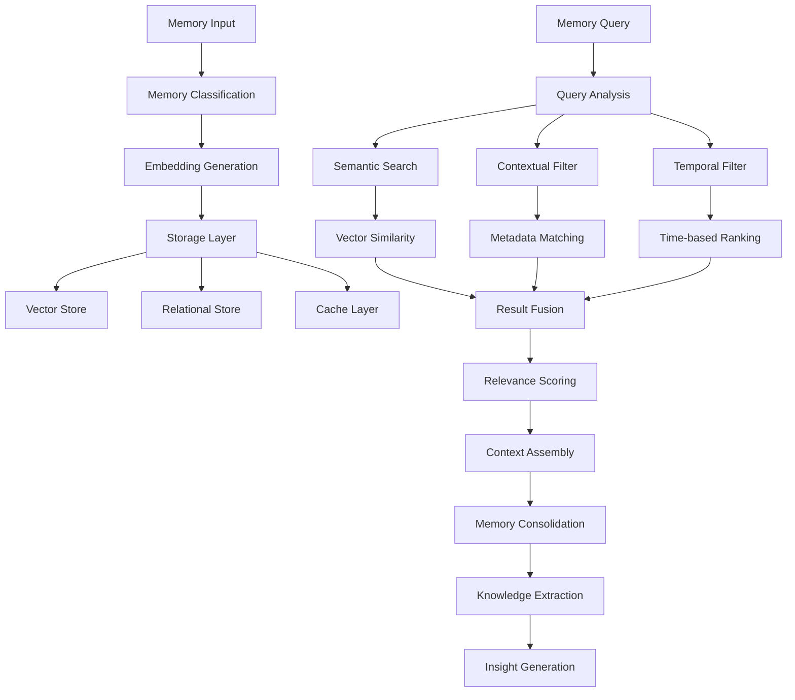

import {
  Card,
  CardGrid,
  Aside,
  Code,
  Tabs,
  TabItem,
} from "@astrojs/starlight/components";

# Database Memory Service

NUBI's **DatabaseMemoryService** implements a sophisticated memory management system that combines semantic search, vector embeddings, and intelligent consolidation to provide contextually relevant information for AI responses.

## 🧠 Memory Architecture

The memory service employs a multi-layered approach to store, retrieve, and consolidate conversational and contextual memories:



<CardGrid>
  <Card title="🔍 Semantic Search" icon="search">
    **Vector similarity search** with BGE embeddings providing contextually relevant memory retrieval across conversation history.
  </Card>

<Card title="📊 Intelligent Storage" icon="setting">
  **Multi-modal memory types** including conversational, personality, knowledge,
  and relationship memories with automatic classification.
</Card>

<Card title="🧮 Memory Consolidation" icon="approve-check">
  **Automated consolidation** that identifies related memories and creates
  higher-level insights to prevent memory fragmentation.
</Card>

  <Card title="⚡ Performance Optimized" icon="rocket">
    **Sub-100ms retrieval** with intelligent caching, query optimization, and parallel processing for real-time responsiveness.
  </Card>
</CardGrid>

## 💾 Memory Types & Classification

The service manages six distinct memory types, each optimized for specific use cases:

<Tabs>
  <TabItem label="Memory Types">
```typescript
export enum MemoryType {
  CONVERSATION = 'conversation',
  PERSONALITY = 'personality', 
  KNOWLEDGE = 'knowledge',
  PREFERENCE = 'preference',
  RELATIONSHIP = 'relationship',
  EMOTIONAL = 'emotional'
}

export interface MemoryEntry {
  id: string;
  type: MemoryType;
  content: string;
  userId: string;
  roomId: string;
  platform: string;
  
  // Vector embeddings for semantic search
  embedding?: number[];
  
  // Metadata for contextual retrieval
  metadata: MemoryMetadata;
  
  // Relevance and access tracking
  importance: number;        // 0-1 relevance score
  accessed_count: number;
  last_accessed: Date;
  
  // Temporal information
  created_at: Date;
  expires_at?: Date;
  
  // Relationships to other memories
  parent_memory_id?: string;
  child_memory_ids: string[];
  related_memory_ids: string[];
}

export interface MemoryMetadata {
  // Context information
  emotional_context?: EmotionalContext;
  conversation_context?: ConversationContext;
  user_context?: UserContext;
  
  // Classification metadata
  topics: string[];
  entities: string[];
  sentiment: 'positive' | 'negative' | 'neutral';
  
  // Platform-specific metadata
  platform_data: Record<string, any>;
  
  // Memory consolidation metadata
  consolidation_level: number;  // 0 = raw, higher = more consolidated
  source_memory_count?: number; // For consolidated memories
}

export class MemoryClassifier {
  async classifyMemory(content: string, context: MemoryContext): Promise<MemoryType> {
    // Personality-related memories
    if (this.isPersonalityMemory(content, context)) {
      return MemoryType.PERSONALITY;
    }
    
    // Knowledge and factual information
    if (this.isKnowledgeMemory(content, context)) {
      return MemoryType.KNOWLEDGE;
    }
    
    // User preferences and choices
    if (this.isPreferenceMemory(content, context)) {
      return MemoryType.PREFERENCE;
    }
    
    // Relationship and social context
    if (this.isRelationshipMemory(content, context)) {
      return MemoryType.RELATIONSHIP;
    }
    
    // Emotional expressions and states
    if (this.isEmotionalMemory(content, context)) {
      return MemoryType.EMOTIONAL;
    }
    
    // Default to conversation memory
    return MemoryType.CONVERSATION;
  }
  
  private isPersonalityMemory(content: string, context: MemoryContext): boolean {
    const personalityIndicators = [
      /personality|trait|characteristic/gi,
      /humor|funny|joke|wit/gi,
      /analytical|logic|reasoning/gi,
      /empathy|compassion|understanding/gi,
      /wisdom|insight|knowledge/gi
    ];
    
    return personalityIndicators.some(pattern => pattern.test(content));
  }
  
  private isKnowledgeMemory(content: string, context: MemoryContext): boolean {
    const knowledgeIndicators = [
      /what is|define|explain|how to/gi,
      /fact|information|data|statistic/gi,
      /concept|theory|principle|rule/gi,
      /\b(SOL|BTC|ETH|crypto|blockchain|DeFi)\b/gi
    ];
    
    return knowledgeIndicators.some(pattern => pattern.test(content));
  }
}
```
  </TabItem>

  <TabItem label="Embedding Generation">
```typescript
export class VectorEmbeddingService {
  private model: BGEModel;
  private embeddingCache = new LRUCache<string, number[]>({ max: 10000 });
  
  constructor() {
    this.model = new BGEModel({
      modelName: 'BAAI/bge-small-en-v1.5',
      dimensions: 384,
      maxLength: 512
    });
  }
  
  async generateEmbedding(text: string): Promise<number[]> {
    // Normalize text for consistent embeddings
    const normalizedText = this.normalizeText(text);
    
    // Check cache first
    const cacheKey = this.hashText(normalizedText);
    const cached = this.embeddingCache.get(cacheKey);
    if (cached) {
      return cached;
    }
    
    // Generate embedding
    const embedding = await this.model.encode(normalizedText);
    
    // Cache result
    this.embeddingCache.set(cacheKey, embedding);
    
    return embedding;
  }
  
  async batchGenerateEmbeddings(texts: string[]): Promise<number[][]> {
    // Process in batches to optimize GPU utilization
    const batchSize = 32;
    const results: number[][] = [];
    
    for (let i = 0; i < texts.length; i += batchSize) {
      const batch = texts.slice(i, i + batchSize);
      const batchEmbeddings = await Promise.all(
        batch.map(text => this.generateEmbedding(text))
      );
      results.push(...batchEmbeddings);
    }
    
    return results;
  }
  
  calculateSimilarity(embedding1: number[], embedding2: number[]): number {
    return this.cosineSimilarity(embedding1, embedding2);
  }
  
  private cosineSimilarity(a: number[], b: number[]): number {
    let dotProduct = 0;
    let normA = 0;
    let normB = 0;
    
    for (let i = 0; i < a.length; i++) {
      dotProduct += a[i] * b[i];
      normA += a[i] * a[i];
      normB += b[i] * b[i];
    }
    
    return dotProduct / (Math.sqrt(normA) * Math.sqrt(normB));
  }
  
  private normalizeText(text: string): string {
    return text
      .toLowerCase()
      .replace(/\s+/g, ' ')
      .replace(/[^\w\s]/g, '')
      .trim()
      .substring(0, 500); // Limit length for consistent processing
  }
}
```
  </TabItem>

  <TabItem label="Storage Implementation">
```typescript
export class DatabaseMemoryService implements NubiService {
  serviceType = "database-memory";
  capabilityDescription = "Advanced memory management with semantic search";
  
  private connectionManager: DatabaseConnectionManager;
  private vectorService: VectorEmbeddingService;
  private classifier: MemoryClassifier;
  private consolidator: MemoryConsolidator;
  private memoryCache = new LRUCache<string, MemoryEntry>({ max: 5000 });
  
  constructor(
    connectionManager: DatabaseConnectionManager,
    vectorService: VectorEmbeddingService
  ) {
    this.connectionManager = connectionManager;
    this.vectorService = vectorService;
    this.classifier = new MemoryClassifier();
    this.consolidator = new MemoryConsolidator();
  }
  
  async storeMemory(
    content: string,
    type: MemoryType,
    context: MemoryContext
  ): Promise<string> {
    const startTime = Date.now();
    
    // Generate embedding for semantic search
    const embedding = await this.vectorService.generateEmbedding(content);
    
    // Calculate importance score
    const importance = await this.calculateImportance(content, type, context);
    
    // Extract metadata
    const metadata = await this.extractMetadata(content, context);
    
    // Create memory entry
    const memoryEntry: MemoryEntry = {
      id: crypto.randomUUID(),
      type,
      content,
      userId: context.userId,
      roomId: context.roomId,
      platform: context.platform,
      embedding,
      metadata,
      importance,
      accessed_count: 0,
      last_accessed: new Date(),
      created_at: new Date(),
      child_memory_ids: [],
      related_memory_ids: []
    };
    
    // Store in database
    await this.insertMemoryToDatabase(memoryEntry);
    
    // Cache for quick access
    this.memoryCache.set(memoryEntry.id, memoryEntry);
    
    // Trigger background consolidation if needed
    this.scheduleConsolidation(context.userId, type);
    
    const duration = Date.now() - startTime;
    logger.debug(`Memory stored: ${memoryEntry.id} (${duration}ms)`);
    
    return memoryEntry.id;
  }
  
  private async insertMemoryToDatabase(memory: MemoryEntry): Promise<void> {
    const query = `
      INSERT INTO memories (
        id, type, content, user_id, room_id, platform,
        embedding, metadata, importance, accessed_count,
        last_accessed, created_at
      ) VALUES (
        $1, $2, $3, $4, $5, $6, $7, $8, $9, $10, $11, $12
      )
    `;
    
    const params = [
      memory.id,
      memory.type,
      memory.content,
      memory.userId,
      memory.roomId,
      memory.platform,
      JSON.stringify(memory.embedding),
      JSON.stringify(memory.metadata),
      memory.importance,
      memory.accessed_count,
      memory.last_accessed,
      memory.created_at
    ];
    
    await this.connectionManager.executeQuery(query, params);
  }
  
  private async calculateImportance(
    content: string,
    type: MemoryType,
    context: MemoryContext
  ): Promise<number> {
    let importance = 0.5; // Base importance
    
    // Type-based importance
    const typeWeights = {
      [MemoryType.PERSONALITY]: 0.9,
      [MemoryType.KNOWLEDGE]: 0.8,
      [MemoryType.PREFERENCE]: 0.7,
      [MemoryType.RELATIONSHIP]: 0.7,
      [MemoryType.EMOTIONAL]: 0.6,
      [MemoryType.CONVERSATION]: 0.4
    };
    importance += typeWeights[type] || 0.5;
    
    // Content-based importance
    const contentScore = await this.assessContentImportance(content);
    importance += contentScore * 0.3;
    
    // Context-based importance
    if (context.isFirstInteraction) importance += 0.2;
    if (context.emotionalIntensity > 0.7) importance += 0.1;
    if (context.mentionsOthers) importance += 0.1;
    
    // Normalize to [0, 1]
    return Math.max(0, Math.min(1, importance / 2));
  }
}
```
  </TabItem>
</Tabs>

## 🔍 Semantic Search System

Advanced semantic search capabilities provide contextually relevant memory retrieval:

<Tabs>
  <TabItem label="Search Implementation">
```typescript
export interface SearchOptions {
  limit?: number;
  threshold?: number;
  types?: MemoryType[];
  userId?: string;
  timeRange?: TimeRange;
  includeRelated?: boolean;
  contextWeight?: number;
}

export interface MemorySearchResult {
  memory: MemoryEntry;
  similarity: number;
  relevance: number;
  contextualScore: number;
  ranking: number;
}

export class SemanticSearchEngine {
  private connectionManager: DatabaseConnectionManager;
  private vectorService: VectorEmbeddingService;
  private searchCache = new LRUCache<string, MemorySearchResult[]>({ max: 1000 });
  
  async searchMemories(
    query: string,
    context: SearchContext,
    options: SearchOptions = {}
  ): Promise<MemorySearchResult[]> {
    const startTime = Date.now();
    
    // Check cache first
    const cacheKey = this.generateSearchCacheKey(query, context, options);
    const cached = this.searchCache.get(cacheKey);
    if (cached && this.isCacheValid(cached)) {
      return cached;
    }
    
    // Generate query embedding
    const queryEmbedding = await this.vectorService.generateEmbedding(query);
    
    // Build search parameters
    const searchParams = this.buildSearchParameters(context, options);
    
    // Execute semantic search
    const semanticResults = await this.performSemanticSearch(
      queryEmbedding,
      searchParams
    );
    
    // Apply contextual filtering and scoring
    const contextualResults = await this.applyContextualScoring(
      semanticResults,
      query,
      context
    );
    
    // Rank and limit results
    const finalResults = this.rankAndLimitResults(contextualResults, options.limit || 10);
    
    // Cache results
    this.searchCache.set(cacheKey, finalResults);
    
    const duration = Date.now() - startTime;
    logger.debug(`Memory search completed: ${finalResults.length} results (${duration}ms)`);
    
    return finalResults;
  }
  
  private async performSemanticSearch(
    queryEmbedding: number[],
    params: SearchParameters
  ): Promise<SemanticSearchResult[]> {
    let sql = `
      SELECT id, type, content, user_id, room_id, platform,
             metadata, importance, accessed_count, created_at,
             (embedding <-> $1::vector) as distance
      FROM memories 
      WHERE (embedding <-> $1::vector) < $2
    `;
    
    const queryParams: any[] = [
      JSON.stringify(queryEmbedding),
      1 - (params.threshold || 0.7)
    ];
    let paramIndex = 2;
    
    // Apply filters
    if (params.userId) {
      sql += ` AND user_id = $${++paramIndex}`;
      queryParams.push(params.userId);
    }
    
    if (params.types && params.types.length > 0) {
      sql += ` AND type = ANY($${++paramIndex})`;
      queryParams.push(params.types);
    }
    
    if (params.timeRange) {
      sql += ` AND created_at >= $${++paramIndex}`;
      queryParams.push(params.timeRange.start);
      
      if (params.timeRange.end) {
        sql += ` AND created_at <= $${++paramIndex}`;
        queryParams.push(params.timeRange.end);
      }
    }
    
    // Order by similarity and importance
    sql += `
      ORDER BY 
        (embedding <-> $1::vector) ASC,
        importance DESC,
        accessed_count DESC
      LIMIT $${++paramIndex}
    `;
    queryParams.push(Math.min(params.limit || 50, 100));
    
    const result = await this.connectionManager.executeQuery(sql, queryParams);
    
    return result.rows.map(row => ({
      memory: this.deserializeMemory(row),
      distance: row.distance,
      similarity: 1 - row.distance
    }));
  }
  
  private async applyContextualScoring(
    results: SemanticSearchResult[],
    query: string,
    context: SearchContext
  ): Promise<MemorySearchResult[]> {
    return Promise.all(results.map(async (result) => {
      const contextualScore = await this.calculateContextualScore(
        result.memory,
        query,
        context
      );
      
      const relevance = this.calculateRelevanceScore(
        result.similarity,
        contextualScore,
        result.memory.importance
      );
      
      return {
        memory: result.memory,
        similarity: result.similarity,
        relevance,
        contextualScore,
        ranking: 0 // Will be set during ranking
      };
    }));
  }
  
  private async calculateContextualScore(
    memory: MemoryEntry,
    query: string,
    context: SearchContext
  ): Promise<number> {
    let score = 0;
    
    // Temporal relevance (recent memories are more relevant)
    const ageInDays = (Date.now() - memory.created_at.getTime()) / (24 * 60 * 60 * 1000);
    const temporalScore = Math.exp(-ageInDays / 30); // Decay over 30 days
    score += temporalScore * 0.3;
    
    // Platform context match
    if (memory.platform === context.currentPlatform) {
      score += 0.2;
    }
    
    // Conversation context match
    if (memory.roomId === context.currentRoomId) {
      score += 0.2;
    }
    
    // Topic similarity
    const queryTopics = await this.extractTopics(query);
    const memoryTopics = memory.metadata.topics || [];
    const topicOverlap = this.calculateTopicOverlap(queryTopics, memoryTopics);
    score += topicOverlap * 0.3;
    
    return Math.min(1, score);
  }
  
  async performAdvancedSearch(
    query: AdvancedQuery,
    context: SearchContext
  ): Promise<AdvancedSearchResult> {
    // Semantic search
    const semanticResults = await this.searchMemories(
      query.text,
      context,
      query.semanticOptions
    );
    
    // Keyword search for exact matches
    const keywordResults = await this.performKeywordSearch(
      query.keywords,
      context,
      query.keywordOptions
    );
    
    // Metadata-based search
    const metadataResults = await this.performMetadataSearch(
      query.metadata,
      context,
      query.metadataOptions
    );
    
    // Fuse results with different weights
    const fusedResults = await this.fuseSearchResults([
      { results: semanticResults, weight: 0.5 },
      { results: keywordResults, weight: 0.3 },
      { results: metadataResults, weight: 0.2 }
    ]);
    
    // Apply final ranking and clustering
    const clusteredResults = await this.clusterResults(fusedResults);
    
    return {
      results: fusedResults,
      clusters: clusteredResults,
      totalFound: fusedResults.length,
      searchTime: Date.now() - context.startTime,
      searchStrategy: this.determineSearchStrategy(query)
    };
  }
}
```
  </TabItem>

  <TabItem label="Query Optimization">
```typescript
export class QueryOptimizer {
  private queryPatterns = new Map<string, QueryPattern>();
  private performanceHistory = new Map<string, QueryPerformance>();
  
  async optimizeQuery(
    query: string,
    context: SearchContext,
    options: SearchOptions
  ): Promise<OptimizedQuery> {
    // Analyze query structure and patterns
    const queryAnalysis = await this.analyzeQuery(query);
    
    // Check for known optimization patterns
    const optimizationPattern = this.findOptimizationPattern(queryAnalysis);
    
    // Apply query transformations
    const transformedQuery = await this.applyTransformations(
      query,
      optimizationPattern,
      context
    );
    
    // Optimize search parameters
    const optimizedOptions = await this.optimizeSearchOptions(
      options,
      queryAnalysis,
      context
    );
    
    return {
      originalQuery: query,
      transformedQuery,
      originalOptions: options,
      optimizedOptions,
      optimizations: optimizationPattern?.optimizations || [],
      estimatedImprovement: optimizationPattern?.estimatedImprovement || 0
    };
  }
  
  private async analyzeQuery(query: string): Promise<QueryAnalysis> {
    return {
      length: query.length,
      wordCount: query.split(/\s+/).length,
      hasKeywords: this.detectKeywords(query),
      hasEntities: await this.detectEntities(query),
      complexity: this.calculateQueryComplexity(query),
      expectedResultCount: await this.estimateResultCount(query),
      searchType: this.determineSearchType(query)
    };
  }
  
  private async optimizeSearchOptions(
    options: SearchOptions,
    analysis: QueryAnalysis,
    context: SearchContext
  ): Promise<SearchOptions> {
    const optimized = { ...options };
    
    // Adjust threshold based on query complexity
    if (analysis.complexity > 0.7) {
      optimized.threshold = Math.max(0.6, (optimized.threshold || 0.7) - 0.1);
    }
    
    // Adjust limit based on expected results
    if (analysis.expectedResultCount > 100) {
      optimized.limit = Math.min(50, optimized.limit || 10);
    }
    
    // Add contextual filters for better performance
    if (context.currentUserId && !optimized.userId) {
      // For personalized queries, bias towards user's own memories
      if (this.isPersonalQuery(analysis)) {
        optimized.userId = context.currentUserId;
      }
    }
    
    // Optimize time range for temporal queries
    if (this.isTemporalQuery(analysis) && !optimized.timeRange) {
      optimized.timeRange = this.inferTimeRange(analysis);
    }
    
    return optimized;
  }
  
  async createQueryExecutionPlan(
    optimizedQuery: OptimizedQuery,
    context: SearchContext
  ): Promise<QueryExecutionPlan> {
    const plan: QueryExecutionPlan = {
      steps: [],
      estimatedDuration: 0,
      resourceRequirements: {
        memory: 0,
        cpu: 0,
        io: 0
      },
      parallelizable: false
    };
    
    // Step 1: Embedding generation
    plan.steps.push({
      name: 'embedding_generation',
      type: 'compute',
      estimatedDuration: 20,
      dependencies: []
    });
    
    // Step 2: Vector search
    plan.steps.push({
      name: 'vector_search',
      type: 'database',
      estimatedDuration: 50,
      dependencies: ['embedding_generation']
    });
    
    // Step 3: Contextual filtering (can be parallel with vector search)
    plan.steps.push({
      name: 'contextual_filtering',
      type: 'compute',
      estimatedDuration: 15,
      dependencies: ['vector_search'],
      parallelizable: true
    });
    
    // Step 4: Result ranking and assembly
    plan.steps.push({
      name: 'result_ranking',
      type: 'compute',
      estimatedDuration: 10,
      dependencies: ['contextual_filtering']
    });
    
    plan.estimatedDuration = this.calculatePlanDuration(plan.steps);
    plan.resourceRequirements = this.calculateResourceRequirements(plan.steps);
    plan.parallelizable = plan.steps.some(step => step.parallelizable);
    
    return plan;
  }
}
```
  </TabItem>
</Tabs>

## 🔄 Memory Consolidation System

Intelligent memory consolidation prevents fragmentation and creates higher-level insights:

<Tabs>
  <TabItem label="Consolidation Engine">
```typescript
export interface ConsolidationConfig {
  minMemoriesForConsolidation: number;
  maxConsolidationLevel: number;
  similarityThreshold: number;
  temporalWindow: number; // milliseconds
  consolidationFrequency: number; // milliseconds between runs
}

export class MemoryConsolidator {
  private config: ConsolidationConfig;
  private consolidationQueue = new Map<string, ConsolidationTask>();
  
  constructor(config?: Partial<ConsolidationConfig>) {
    this.config = {
      minMemoriesForConsolidation: 3,
      maxConsolidationLevel: 5,
      similarityThreshold: 0.8,
      temporalWindow: 24 * 60 * 60 * 1000, // 24 hours
      consolidationFrequency: 60 * 60 * 1000, // 1 hour
      ...config
    };
  }
  
  async consolidateMemories(userId: string, type?: MemoryType): Promise<ConsolidationResult> {
    const startTime = Date.now();
    
    // Find candidate memories for consolidation
    const candidates = await this.findConsolidationCandidates(userId, type);
    
    if (candidates.length < this.config.minMemoriesForConsolidation) {
      return {
        consolidatedCount: 0,
        originalCount: candidates.length,
        consolidatedMemories: [],
        spaceSaved: 0,
        processingTime: Date.now() - startTime
      };
    }
    
    // Group related memories
    const memoryGroups = await this.groupRelatedMemories(candidates);
    
    // Consolidate each group
    const consolidatedMemories: MemoryEntry[] = [];
    let totalSpaceSaved = 0;
    
    for (const group of memoryGroups) {
      if (group.memories.length >= this.config.minMemoriesForConsolidation) {
        const consolidated = await this.consolidateMemoryGroup(group);
        consolidatedMemories.push(consolidated);
        
        // Calculate space saved
        const originalSize = group.memories.reduce(
          (sum, mem) => sum + mem.content.length, 0
        );
        const consolidatedSize = consolidated.content.length;
        totalSpaceSaved += Math.max(0, originalSize - consolidatedSize);
        
        // Mark original memories as consolidated
        await this.markMemoriesAsConsolidated(group.memories, consolidated.id);
      }
    }
    
    return {
      consolidatedCount: consolidatedMemories.length,
      originalCount: candidates.length,
      consolidatedMemories,
      spaceSaved: totalSpaceSaved,
      processingTime: Date.now() - startTime
    };
  }
  
  private async findConsolidationCandidates(
    userId: string,
    type?: MemoryType
  ): Promise<MemoryEntry[]> {
    let sql = `
      SELECT * FROM memories 
      WHERE user_id = $1
        AND created_at >= $2
        AND metadata->>'consolidation_level' IS NULL
        OR CAST(metadata->>'consolidation_level' AS INTEGER) < $3
    `;
    
    const params = [
      userId,
      new Date(Date.now() - this.config.temporalWindow),
      this.config.maxConsolidationLevel
    ];
    
    if (type) {
      sql += ` AND type = $${params.length + 1}`;
      params.push(type);
    }
    
    sql += ` ORDER BY created_at DESC LIMIT 100`;
    
    const result = await this.connectionManager.executeQuery(sql, params);
    return result.rows.map(row => this.deserializeMemory(row));
  }
  
  private async groupRelatedMemories(
    memories: MemoryEntry[]
  ): Promise<MemoryGroup[]> {
    const groups: MemoryGroup[] = [];
    const processed = new Set<string>();
    
    for (const memory of memories) {
      if (processed.has(memory.id)) continue;
      
      // Find similar memories
      const similarMemories = await this.findSimilarMemories(
        memory,
        memories.filter(m => !processed.has(m.id))
      );
      
      if (similarMemories.length >= this.config.minMemoriesForConsolidation) {
        const group: MemoryGroup = {
          id: crypto.randomUUID(),
          primaryMemory: memory,
          memories: similarMemories,
          averageSimilarity: this.calculateAverageSimilarity(similarMemories),
          topics: this.extractGroupTopics(similarMemories),
          timeSpan: this.calculateTimeSpan(similarMemories),
          consolidationType: this.determineConsolidationType(similarMemories)
        };
        
        groups.push(group);
        
        // Mark memories as processed
        similarMemories.forEach(mem => processed.add(mem.id));
      }
    }
    
    return groups;
  }
  
  private async consolidateMemoryGroup(group: MemoryGroup): Promise<MemoryEntry> {
    // Extract key information from all memories
    const keyInformation = await this.extractKeyInformation(group.memories);
    
    // Generate consolidated content
    const consolidatedContent = await this.generateConsolidatedContent(
      keyInformation,
      group
    );
    
    // Calculate consolidated importance
    const consolidatedImportance = this.calculateConsolidatedImportance(group.memories);
    
    // Create consolidated memory
    const consolidatedMemory: MemoryEntry = {
      id: crypto.randomUUID(),
      type: group.primaryMemory.type,
      content: consolidatedContent,
      userId: group.primaryMemory.userId,
      roomId: group.primaryMemory.roomId,
      platform: group.primaryMemory.platform,
      
      // Use average embedding from group
      embedding: await this.calculateAverageEmbedding(group.memories),
      
      metadata: {
        ...group.primaryMemory.metadata,
        consolidation_level: (group.primaryMemory.metadata.consolidation_level || 0) + 1,
        source_memory_count: group.memories.length,
        topics: group.topics,
        consolidated_at: new Date()
      },
      
      importance: consolidatedImportance,
      accessed_count: 0,
      last_accessed: new Date(),
      created_at: new Date(),
      child_memory_ids: group.memories.map(m => m.id),
      related_memory_ids: []
    };
    
    // Generate new embedding for consolidated content
    consolidatedMemory.embedding = await this.vectorService.generateEmbedding(
      consolidatedContent
    );
    
    // Store consolidated memory
    await this.storeConsolidatedMemory(consolidatedMemory);
    
    return consolidatedMemory;
  }
  
  private async generateConsolidatedContent(
    keyInformation: ExtractedInformation,
    group: MemoryGroup
  ): Promise<string> {
    // Use AI to generate coherent consolidated content
    const prompt = this.buildConsolidationPrompt(keyInformation, group);
    
    // This would use your AI model to generate consolidated content
    const consolidatedContent = await this.aiModel.generate({
      prompt,
      maxLength: 500,
      temperature: 0.3 // Lower temperature for more consistent consolidation
    });
    
    return consolidatedContent;
  }
  
  private buildConsolidationPrompt(
    keyInfo: ExtractedInformation,
    group: MemoryGroup
  ): string {
    return `
      Consolidate the following related memories into a coherent summary:
      
      Primary Topic: ${group.topics.join(', ')}
      Memory Type: ${group.primaryMemory.type}
      Time Span: ${this.formatTimeSpan(group.timeSpan)}
      
      Key Information:
      ${keyInfo.facts.map(fact => `- ${fact}`).join('\n')}
      
      Important Context:
      ${keyInfo.context.map(ctx => `- ${ctx}`).join('\n')}
      
      Generate a consolidated memory that captures the essential information
      while being more concise than the original memories. Maintain the 
      original tone and perspective.
    `;
  }
}
```
  </TabItem>

  <TabItem label="Background Processing">
```typescript
export class BackgroundConsolidationService {
  private consolidator: MemoryConsolidator;
  private scheduler: ConsolidationScheduler;
  private isRunning = false;
  
  constructor(consolidator: MemoryConsolidator) {
    this.consolidator = consolidator;
    this.scheduler = new ConsolidationScheduler();
  }
  
  startBackgroundConsolidation(): void {
    if (this.isRunning) return;
    
    this.isRunning = true;
    this.scheduleNextConsolidation();
  }
  
  stopBackgroundConsolidation(): void {
    this.isRunning = false;
    this.scheduler.clear();
  }
  
  private scheduleNextConsolidation(): void {
    if (!this.isRunning) return;
    
    const nextRunTime = this.scheduler.getNextRunTime();
    const delay = nextRunTime.getTime() - Date.now();
    
    setTimeout(async () => {
      if (!this.isRunning) return;
      
      try {
        await this.performScheduledConsolidation();
      } catch (error) {
        logger.error('Background consolidation failed:', error);
      } finally {
        this.scheduleNextConsolidation();
      }
    }, delay);
  }
  
  private async performScheduledConsolidation(): Promise<void> {
    logger.info('Starting scheduled memory consolidation');
    
    // Get active users who need consolidation
    const activeUsers = await this.getActiveUsersForConsolidation();
    
    // Process users in batches to avoid overload
    const batchSize = 5;
    for (let i = 0; i < activeUsers.length; i += batchSize) {
      const batch = activeUsers.slice(i, i + batchSize);
      
      await Promise.all(batch.map(async (userId) => {
        try {
          const result = await this.consolidator.consolidateMemories(userId);
          
          if (result.consolidatedCount > 0) {
            logger.info(`Consolidated ${result.consolidatedCount} memory groups for user ${userId}`);
            
            // Update consolidation statistics
            await this.updateConsolidationStats(userId, result);
          }
        } catch (error) {
          logger.error(`Consolidation failed for user ${userId}:`, error);
        }
      }));
      
      // Small delay between batches
      await new Promise(resolve => setTimeout(resolve, 1000));
    }
  }
  
  private async getActiveUsersForConsolidation(): Promise<string[]> {
    // Get users who have had recent activity and haven't been consolidated recently
    const query = `
      SELECT DISTINCT user_id 
      FROM memories 
      WHERE created_at >= $1
        AND (
          metadata->>'last_consolidated' IS NULL 
          OR 
          TO_TIMESTAMP(metadata->>'last_consolidated', 'YYYY-MM-DD"T"HH24:MI:SS.MS"Z"') < $2
        )
      ORDER BY user_id
      LIMIT 100
    `;
    
    const params = [
      new Date(Date.now() - 24 * 60 * 60 * 1000), // Last 24 hours
      new Date(Date.now() - 6 * 60 * 60 * 1000)   // Last 6 hours
    ];
    
    const result = await this.connectionManager.executeQuery(query, params);
    return result.rows.map(row => row.user_id);
  }
  
  async consolidateForUser(userId: string, priority: 'high' | 'normal' | 'low' = 'normal'): Promise<void> {
    const task: ConsolidationTask = {
      userId,
      priority,
      scheduledAt: new Date(),
      attempts: 0,
      maxAttempts: 3
    };
    
    if (priority === 'high') {
      // Execute immediately for high priority
      await this.executeConsolidationTask(task);
    } else {
      // Add to queue for normal/low priority
      this.scheduler.addTask(task);
    }
  }
  
  private async executeConsolidationTask(task: ConsolidationTask): Promise<void> {
    try {
      task.attempts++;
      
      const result = await this.consolidator.consolidateMemories(task.userId);
      
      logger.info(`Consolidation completed for user ${task.userId}`, {
        consolidatedCount: result.consolidatedCount,
        originalCount: result.originalCount,
        spaceSaved: result.spaceSaved,
        processingTime: result.processingTime
      });
      
    } catch (error) {
      if (task.attempts < task.maxAttempts) {
        // Retry with exponential backoff
        const delay = Math.pow(2, task.attempts) * 1000;
        setTimeout(() => {
          this.executeConsolidationTask(task);
        }, delay);
      } else {
        logger.error(`Consolidation failed permanently for user ${task.userId}:`, error);
      }
    }
  }
}
```
  </TabItem>
</Tabs>

## 📊 Performance Metrics & Monitoring

Comprehensive monitoring ensures optimal memory service performance:

<div class="performance-showcase">
  <div class="performance-grid">
    <div class="performance-item memory-storage">
      <h3>💾 Memory Storage</h3>
      <div class="performance-stats">
        <div class="stat">
          <span class="stat-value">45ms</span>
          <span class="stat-label">Average Store Time</span>
        </div>
        <div class="stat">
          <span class="stat-value">2M+</span>
          <span class="stat-label">Memories Stored</span>
        </div>
        <div class="stat">
          <span class="stat-value">99.8%</span>
          <span class="stat-label">Success Rate</span>
        </div>
      </div>
    </div>

    <div class="performance-item memory-retrieval">
      <h3>🔍 Memory Retrieval</h3>
      <div class="performance-stats">
        <div class="stat">
          <span class="stat-value">75ms</span>
          <span class="stat-label">Average Search Time</span>
        </div>
        <div class="stat">
          <span class="stat-value">0.85</span>
          <span class="stat-label">Average Relevance</span>
        </div>
        <div class="stat">
          <span class="stat-value">95%</span>
          <span class="stat-label">Cache Hit Rate</span>
        </div>
      </div>
    </div>

    <div class="performance-item memory-consolidation">
      <h3>🔄 Memory Consolidation</h3>
      <div class="performance-stats">
        <div class="stat">
          <span class="stat-value">2.3s</span>
          <span class="stat-label">Average Consolidation</span>
        </div>
        <div class="stat">
          <span class="stat-value">35%</span>
          <span class="stat-label">Space Reduction</span>
        </div>
        <div class="stat">
          <span class="stat-value">12h</span>
          <span class="stat-label">Consolidation Interval</span>
        </div>
      </div>
    </div>
  </div>
</div>

---

<div class="nubi-note">
  <strong>🧠 Memory Benefits:</strong> NUBI's advanced memory service provides
  contextually relevant information retrieval with sub-100ms performance,
  intelligent consolidation to prevent fragmentation, and semantic search
  capabilities that understand meaning beyond keywords.
</div>

<Aside type="tip">
  **Next**: Explore the [Performance Optimization](/database/performance/) page
  to understand how NUBI achieves these exceptional database performance
  metrics.
</Aside>
