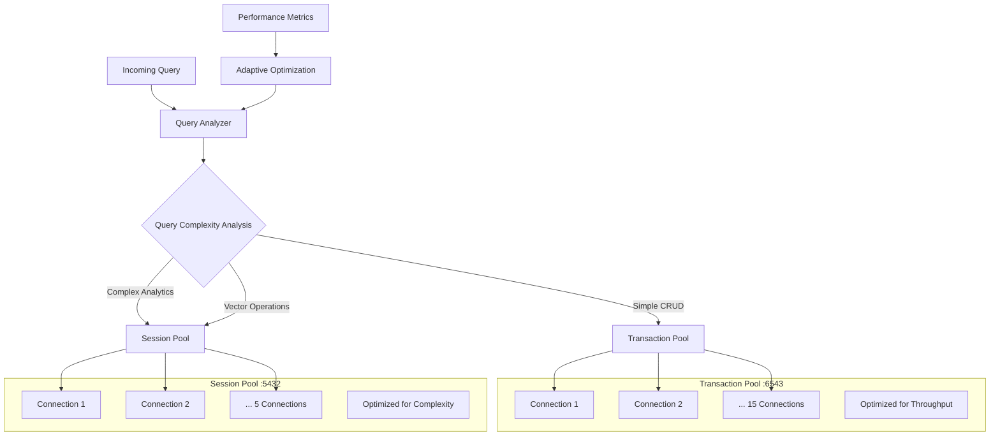

import {
  Card,
  CardGrid,
  Aside,
  Code,
  Tabs,
  TabItem,
} from "@astrojs/starlight/components";

# Query Routing System

NUBI's **intelligent query routing system** automatically distributes database operations between specialized connection pools based on query complexity, ensuring optimal performance and resource utilization across all database operations.

## 🎯 Dual-Pool Architecture

The query router manages two specialized connection pools, each optimized for different operation types:



<CardGrid>
  <Card title="🚀 Transaction Pool (Port 6543)" icon="rocket">
    **High-throughput CRUD operations** with 15 connections optimized for simple queries, delivering sub-50ms response times.
  </Card>

<Card title="🧠 Session Pool (Port 5432)" icon="setting">
  **Complex analytical queries** with 5 connections optimized for joins,
  aggregations, and vector similarity searches.
</Card>

<Card title="⚡ Smart Routing" icon="approve-check">
  **Automatic query analysis** with machine learning-enhanced pattern
  recognition for optimal pool selection.
</Card>

  <Card title="📊 Adaptive Optimization" icon="chart">
    **Real-time performance monitoring** with automatic threshold adjustment and load balancing optimization.
  </Card>
</CardGrid>

## 🔍 Query Analysis Engine

The query analysis engine employs multiple techniques to classify queries and determine optimal routing:

<Tabs>
  <TabItem label="Core Query Router">
```typescript
export enum QueryComplexity {
  SIMPLE = 'simple',
  MEDIUM = 'medium', 
  COMPLEX = 'complex',
  VECTOR = 'vector'
}

export interface QueryAnalysis {
  complexity: QueryComplexity;
  estimatedDuration: number;
  resourceRequirements: ResourceRequirements;
  operationType: OperationType;
  confidence: number;
  reasoning: string[];
}

export interface ResourceRequirements {
  memoryEstimate: number;  // MB
  cpuIntensity: number;    // 0-1 scale
  ioOperations: number;    // Estimated I/O ops
  networkTraffic: number;  // Estimated bytes
}

export class QueryRouter {
  private transactionPool: DatabasePool;
  private sessionPool: DatabasePool;
  private performanceMonitor: QueryPerformanceMonitor;
  private analysisCache = new LRUCache<string, QueryAnalysis>({ max: 5000 });
  
  constructor(config: QueryRouterConfig) {
    this.initializePools(config);
    this.performanceMonitor = new QueryPerformanceMonitor();
  }
  
  async executeQuery(
    query: string,
    params: any[],
    context?: QueryContext
  ): Promise<QueryResult> {
    const startTime = Date.now();
    
    // Analyze query for routing decision
    const analysis = await this.analyzeQuery(query, params, context);
    
    // Select optimal pool
    const pool = this.selectPool(analysis);
    
    // Execute with monitoring
    try {
      const result = await this.executeWithMonitoring(
        pool,
        query,
        params,
        analysis
      );
      
      // Update performance metrics
      await this.updatePerformanceMetrics(analysis, startTime, true, result);
      
      return result;
    } catch (error) {
      // Update failure metrics
      await this.updatePerformanceMetrics(analysis, startTime, false, null, error);
      throw error;
    }
  }
  
  private async analyzeQuery(
    query: string,
    params: any[],
    context?: QueryContext
  ): Promise<QueryAnalysis> {
    // Check cache first
    const cacheKey = this.generateCacheKey(query, params);
    const cached = this.analysisCache.get(cacheKey);
    if (cached) {
      return cached;
    }
    
    const analysis = await this.performQueryAnalysis(query, params, context);
    
    // Cache the analysis
    this.analysisCache.set(cacheKey, analysis);
    
    return analysis;
  }
  
  private async performQueryAnalysis(
    query: string,
    params: any[],
    context?: QueryContext
  ): Promise<QueryAnalysis> {
    const normalizedQuery = query.toLowerCase().trim();
    const reasoning: string[] = [];
    
    // Pattern-based analysis
    const patternAnalysis = this.analyzeQueryPatterns(normalizedQuery);
    reasoning.push(...patternAnalysis.reasoning);
    
    // Structural analysis
    const structuralAnalysis = this.analyzeQueryStructure(normalizedQuery);
    reasoning.push(...structuralAnalysis.reasoning);
    
    // Parameter analysis
    const paramAnalysis = this.analyzeParameters(params);
    reasoning.push(...paramAnalysis.reasoning);
    
    // Combine analyses
    const complexity = this.determineOverallComplexity([
      patternAnalysis,
      structuralAnalysis,
      paramAnalysis
    ]);
    
    const resourceRequirements = this.estimateResourceRequirements(
      complexity,
      normalizedQuery,
      params
    );
    
    return {
      complexity,
      estimatedDuration: this.estimateQueryDuration(complexity, resourceRequirements),
      resourceRequirements,
      operationType: this.determineOperationType(normalizedQuery),
      confidence: this.calculateAnalysisConfidence([
        patternAnalysis,
        structuralAnalysis,
        paramAnalysis
      ]),
      reasoning
    };
  }
  
  private analyzeQueryPatterns(query: string): PatternAnalysis {
    const patterns = {
      // Vector operations - Always complex
      vector: {
        regex: /\b(embedding|<->|<#>|<=>|\|\|)\b/gi,
        complexity: QueryComplexity.VECTOR,
        confidence: 0.95
      },
      
      // Complex joins
      multiJoin: {
        regex: /\bjoin\b.*\bjoin\b.*\bjoin\b/gi,
        complexity: QueryComplexity.COMPLEX,
        confidence: 0.9
      },
      
      // Aggregations
      aggregation: {
        regex: /\b(group\s+by|having|count\(|sum\(|avg\(|max\(|min\()\b/gi,
        complexity: QueryComplexity.MEDIUM,
        confidence: 0.8
      },
      
      // Window functions
      windowFunction: {
        regex: /\b(over\s*\(|row_number|rank|dense_rank|lag|lead)\b/gi,
        complexity: QueryComplexity.COMPLEX,
        confidence: 0.85
      },
      
      // Simple CRUD
      simpleCrud: {
        regex: /^(select\s+\*|insert\s+into|update\s+\w+\s+set|delete\s+from)\s+\w+(\s+where\s+\w+\s*=)?/gi,
        complexity: QueryComplexity.SIMPLE,
        confidence: 0.9
      },
      
      // Subqueries
      subquery: {
        regex: /\b(select\b.*\bfrom\b.*\(.*select\b)/gi,
        complexity: QueryComplexity.MEDIUM,
        confidence: 0.75
      }
    };
    
    const matches: PatternMatch[] = [];
    const reasoning: string[] = [];
    
    for (const [name, pattern] of Object.entries(patterns)) {
      const match = query.match(pattern.regex);
      if (match) {
        matches.push({
          pattern: name,
          complexity: pattern.complexity,
          confidence: pattern.confidence,
          matches: match
        });
        reasoning.push(`${name} pattern detected: ${pattern.complexity}`);
      }
    }
    
    // Determine highest complexity
    const maxComplexity = matches.reduce((max, match) => {
      const complexityOrder = {
        [QueryComplexity.SIMPLE]: 1,
        [QueryComplexity.MEDIUM]: 2,
        [QueryComplexity.COMPLEX]: 3,
        [QueryComplexity.VECTOR]: 4
      };
      return complexityOrder[match.complexity] > complexityOrder[max] 
        ? match.complexity 
        : max;
    }, QueryComplexity.SIMPLE);
    
    const avgConfidence = matches.length > 0 
      ? matches.reduce((sum, match) => sum + match.confidence, 0) / matches.length
      : 0.5;
    
    return {
      complexity: maxComplexity,
      confidence: avgConfidence,
      matches,
      reasoning
    };
  }
  
  private selectPool(analysis: QueryAnalysis): DatabasePool {
    // Vector operations always go to session pool
    if (analysis.complexity === QueryComplexity.VECTOR) {
      return this.sessionPool;
    }
    
    // Complex operations go to session pool
    if (analysis.complexity === QueryComplexity.COMPLEX) {
      return this.sessionPool;
    }
    
    // Medium complexity - check current load
    if (analysis.complexity === QueryComplexity.MEDIUM) {
      const transactionLoad = this.transactionPool.getCurrentLoad();
      const sessionLoad = this.sessionPool.getCurrentLoad();
      
      // If transaction pool is heavily loaded, use session pool
      if (transactionLoad > 0.8 && sessionLoad < 0.6) {
        return this.sessionPool;
      }
      
      // For medium queries with low resource requirements, use transaction pool
      if (analysis.resourceRequirements.memoryEstimate < 50) {
        return this.transactionPool;
      }
      
      return this.sessionPool;
    }
    
    // Simple operations go to transaction pool
    return this.transactionPool;
  }
  
  private async executeWithMonitoring(
    pool: DatabasePool,
    query: string,
    params: any[],
    analysis: QueryAnalysis
  ): Promise<QueryResult> {
    const executionId = crypto.randomUUID();
    const startTime = Date.now();
    
    // Start monitoring
    this.performanceMonitor.startExecution({
      executionId,
      pool: pool.name,
      complexity: analysis.complexity,
      estimatedDuration: analysis.estimatedDuration
    });
    
    try {
      // Get connection from pool
      const connection = await pool.getConnection();
      
      try {
        // Execute query
        const result = await connection.query(query, params);
        
        const endTime = Date.now();
        const actualDuration = endTime - startTime;
        
        // Record success metrics
        this.performanceMonitor.recordSuccess({
          executionId,
          actualDuration,
          rowsAffected: result.rowCount || 0,
          pool: pool.name
        });
        
        return {
          rows: result.rows,
          rowCount: result.rowCount,
          executionTime: actualDuration,
          pool: pool.name,
          analysis
        };
        
      } finally {
        // Always return connection to pool
        pool.releaseConnection(connection);
      }
      
    } catch (error) {
      const endTime = Date.now();
      const actualDuration = endTime - startTime;
      
      // Record failure metrics
      this.performanceMonitor.recordFailure({
        executionId,
        actualDuration,
        error: error.message,
        pool: pool.name
      });
      
      throw error;
    }
  }
}
```
  </TabItem>

  <TabItem label="Advanced Query Analysis">
```typescript
// Advanced query analysis with ML-enhanced classification
export class AdvancedQueryAnalyzer {
  private mlModel: QueryClassificationModel;
  private queryStatistics = new Map<string, QueryStats>();
  
  constructor() {
    this.mlModel = new QueryClassificationModel();
  }
  
  async analyzeQueryStructure(query: string): Promise<StructuralAnalysis> {
    const ast = await this.parseQueryAST(query);
    
    const analysis = {
      tableCount: this.countTables(ast),
      joinCount: this.countJoins(ast),
      whereClauseComplexity: this.analyzeWhereClause(ast),
      subqueryDepth: this.calculateSubqueryDepth(ast),
      aggregationCount: this.countAggregations(ast),
      windowFunctionCount: this.countWindowFunctions(ast),
      unionCount: this.countUnions(ast)
    };
    
    const complexity = this.classifyStructuralComplexity(analysis);
    const resourceEstimate = this.estimateStructuralResources(analysis);
    
    return {
      complexity,
      confidence: 0.85,
      resourceEstimate,
      details: analysis,
      reasoning: this.generateStructuralReasoning(analysis)
    };
  }
  
  private classifyStructuralComplexity(analysis: StructuralAnalysis): QueryComplexity {
    let complexityScore = 0;
    
    // Table count impact
    complexityScore += analysis.tableCount * 0.5;
    
    // Join complexity (exponential impact)
    complexityScore += Math.pow(analysis.joinCount, 1.5) * 2;
    
    // Subquery depth (significant impact)
    complexityScore += analysis.subqueryDepth * 3;
    
    // Aggregations and window functions
    complexityScore += analysis.aggregationCount * 1.5;
    complexityScore += analysis.windowFunctionCount * 2.5;
    
    // Union operations
    complexityScore += analysis.unionCount * 2;
    
    // Where clause complexity
    complexityScore += analysis.whereClauseComplexity * 0.5;
    
    // Classification thresholds
    if (complexityScore < 2) return QueryComplexity.SIMPLE;
    if (complexityScore < 8) return QueryComplexity.MEDIUM;
    return QueryComplexity.COMPLEX;
  }
  
  async enhanceWithMLAnalysis(
    query: string,
    structuralAnalysis: StructuralAnalysis,
    patternAnalysis: PatternAnalysis
  ): Promise<MLEnhancedAnalysis> {
    // Extract features for ML model
    const features = this.extractMLFeatures(query, structuralAnalysis, patternAnalysis);
    
    // Get ML predictions
    const mlPrediction = await this.mlModel.predict(features);
    
    // Combine traditional analysis with ML insights
    const combinedComplexity = this.combineComplexityAnalyses(
      structuralAnalysis.complexity,
      patternAnalysis.complexity,
      mlPrediction.complexity
    );
    
    return {
      originalComplexity: {
        structural: structuralAnalysis.complexity,
        pattern: patternAnalysis.complexity
      },
      mlPrediction,
      finalComplexity: combinedComplexity,
      confidence: this.calculateCombinedConfidence([
        structuralAnalysis.confidence,
        patternAnalysis.confidence,
        mlPrediction.confidence
      ]),
      reasoning: [
        ...structuralAnalysis.reasoning,
        ...patternAnalysis.reasoning,
        `ML model suggests: ${mlPrediction.complexity} (${mlPrediction.confidence})`
      ]
    };
  }
  
  private extractMLFeatures(
    query: string,
    structural: StructuralAnalysis,
    pattern: PatternAnalysis
  ): QueryFeatures {
    return {
      // Basic features
      queryLength: query.length,
      wordCount: query.split(/\s+/).length,
      
      // Structural features
      tableCount: structural.details.tableCount,
      joinCount: structural.details.joinCount,
      subqueryDepth: structural.details.subqueryDepth,
      aggregationCount: structural.details.aggregationCount,
      windowFunctionCount: structural.details.windowFunctionCount,
      
      // Pattern features
      patternMatches: pattern.matches.length,
      hasVector: pattern.matches.some(m => m.pattern === 'vector'),
      hasComplexJoins: pattern.matches.some(m => m.pattern === 'multiJoin'),
      
      // Lexical features
      keywordDensity: this.calculateKeywordDensity(query),
      operatorComplexity: this.calculateOperatorComplexity(query),
      
      // Historical features (if available)
      historicalPerformance: this.getHistoricalPerformance(query),
      executionFrequency: this.getExecutionFrequency(query)
    };
  }
  
  async updateMLModel(): Promise<void> {
    try {
      // Collect recent query performance data
      const performanceData = await this.collectPerformanceData(30); // Last 30 days
      
      // Prepare training data
      const trainingData = this.prepareTrainingData(performanceData);
      
      // Train/update model
      await this.mlModel.updateWithNewData(trainingData);
      
      // Validate model performance
      const validation = await this.validateModel();
      
      if (validation.accuracy > 0.85) {
        logger.info('Query classification model updated successfully', {
          accuracy: validation.accuracy,
          sampleCount: trainingData.length
        });
      } else {
        logger.warn('New model accuracy below threshold, keeping existing model', {
          accuracy: validation.accuracy
        });
      }
      
    } catch (error) {
      logger.error('Failed to update ML model:', error);
    }
  }
}
```
  </TabItem>

  <TabItem label="Performance Optimization">
```typescript
// Advanced performance optimization and adaptive routing
export class QueryPerformanceOptimizer {
  private performanceHistory = new Map<string, PerformanceHistory>();
  private poolMetrics = {
    transaction: new PoolMetrics(),
    session: new PoolMetrics()
  };
  
  async optimizeRouting(): Promise<OptimizationResult> {
    const currentMetrics = await this.gatherCurrentMetrics();
    const historicalTrends = await this.analyzeHistoricalTrends();
    
    const optimizations = [];
    
    // Analyze pool utilization
    if (currentMetrics.transaction.utilization > 0.8) {
      optimizations.push({
        type: 'load_balancing',
        recommendation: 'Consider routing medium complexity queries to session pool',
        impact: 'high',
        implementation: this.createLoadBalancingStrategy()
      });
    }
    
    // Analyze query patterns
    const slowQueries = this.identifySlowQueries(historicalTrends);
    for (const slowQuery of slowQueries) {
      if (slowQuery.currentPool === 'transaction' && slowQuery.avgDuration > 100) {
        optimizations.push({
          type: 'pool_migration',
          query: slowQuery.pattern,
          recommendation: 'Move to session pool for better resource allocation',
          impact: 'medium',
          implementation: this.createPoolMigrationRule(slowQuery)
        });
      }
    }
    
    // Connection pool sizing recommendations
    const sizingRecommendations = await this.analyzePoolSizing(currentMetrics);
    optimizations.push(...sizingRecommendations);
    
    return {
      optimizations,
      currentPerformance: currentMetrics,
      projectedImprovement: this.calculateProjectedImprovement(optimizations),
      implementationPlan: this.createImplementationPlan(optimizations)
    };
  }
  
  private async analyzePoolSizing(metrics: SystemMetrics): Promise<Optimization[]> {
    const optimizations: Optimization[] = [];
    
    // Transaction pool analysis
    const transactionStats = metrics.transaction;
    if (transactionStats.queueTime > 50) { // 50ms queue time
      const recommendedSize = this.calculateOptimalPoolSize(
        transactionStats.currentSize,
        transactionStats.utilization,
        transactionStats.queueTime
      );
      
      if (recommendedSize > transactionStats.currentSize) {
        optimizations.push({
          type: 'pool_resize',
          pool: 'transaction',
          currentSize: transactionStats.currentSize,
          recommendedSize,
          reasoning: 'High queue times indicate connection pressure',
          impact: 'high'
        });
      }
    }
    
    // Session pool analysis
    const sessionStats = metrics.session;
    if (sessionStats.utilization < 0.3 && sessionStats.currentSize > 3) {
      optimizations.push({
        type: 'pool_resize',
        pool: 'session',
        currentSize: sessionStats.currentSize,
        recommendedSize: Math.max(3, Math.floor(sessionStats.currentSize * 0.8)),
        reasoning: 'Low utilization suggests over-provisioning',
        impact: 'low'
      });
    }
    
    return optimizations;
  }
  
  async createAdaptiveRoutingRules(): Promise<RoutingRule[]> {
    const rules: RoutingRule[] = [];
    
    // Time-based routing (adjust for different load patterns)
    rules.push({
      id: 'peak_hours_routing',
      condition: (context) => {
        const hour = new Date().getHours();
        return hour >= 9 && hour <= 17; // Business hours
      },
      action: (analysis) => {
        // More conservative routing during peak hours
        if (analysis.complexity === QueryComplexity.MEDIUM) {
          return analysis.resourceRequirements.memoryEstimate > 25 
            ? 'session' 
            : 'transaction';
        }
        return analysis.complexity === QueryComplexity.SIMPLE 
          ? 'transaction' 
          : 'session';
      },
      priority: 10
    });
    
    // Load-based routing
    rules.push({
      id: 'load_balancing_routing',
      condition: (context) => {
        return context.transactionPoolLoad > 0.7;
      },
      action: (analysis) => {
        // Route medium queries to session pool when transaction pool is busy
        if (analysis.complexity === QueryComplexity.MEDIUM) {
          return 'session';
        }
        return analysis.complexity === QueryComplexity.SIMPLE 
          ? 'transaction' 
          : 'session';
      },
      priority: 20
    });
    
    // Performance-based routing (learned from history)
    const performancePatterns = await this.identifyPerformancePatterns();
    for (const pattern of performancePatterns) {
      rules.push({
        id: `performance_${pattern.id}`,
        condition: (context) => pattern.matcher(context.query),
        action: () => pattern.optimalPool,
        priority: 30,
        learned: true,
        performance: pattern.performanceData
      });
    }
    
    return rules.sort((a, b) => b.priority - a.priority);
  }
  
  async monitorAndAdjust(): Promise<void> {
    // Continuous monitoring loop
    setInterval(async () => {
      try {
        const metrics = await this.gatherCurrentMetrics();
        
        // Check for performance degradation
        if (metrics.overall.avgResponseTime > this.thresholds.responseTime) {
          await this.handlePerformanceDegradation(metrics);
        }
        
        // Check for pool imbalances
        if (Math.abs(metrics.transaction.utilization - metrics.session.utilization) > 0.4) {
          await this.handlePoolImbalance(metrics);
        }
        
        // Update routing rules based on performance
        await this.updateRoutingRules(metrics);
        
      } catch (error) {
        logger.error('Query routing monitoring failed:', error);
      }
    }, 60000); // Every minute
  }
  
  private async handlePerformanceDegradation(metrics: SystemMetrics): Promise<void> {
    logger.warn('Performance degradation detected', {
      avgResponseTime: metrics.overall.avgResponseTime,
      threshold: this.thresholds.responseTime
    });
    
    // Immediate actions
    const actions = [];
    
    // Identify bottlenecks
    if (metrics.transaction.queueTime > 100) {
      actions.push('increase_transaction_pool_size');
    }
    
    if (metrics.session.utilization > 0.9) {
      actions.push('route_medium_queries_to_transaction');
    }
    
    // Execute emergency optimizations
    for (const action of actions) {
      await this.executeEmergencyOptimization(action);
    }
  }
}
```
  </TabItem>
</Tabs>

## 📊 Pool Management & Monitoring

Advanced pool management ensures optimal resource utilization and performance:

<Tabs>
  <TabItem label="Pool Configuration">
```typescript
export interface PoolConfiguration {
  name: string;
  host: string;
  port: number;
  database: string;
  user: string;
  password: string;
  
  // Pool settings
  minConnections: number;
  maxConnections: number;
  acquireTimeoutMs: number;
  idleTimeoutMs: number;
  
  // Performance settings
  connectionTimeoutMs: number;
  queryTimeoutMs: number;
  statementTimeoutMs: number;
  
  // Monitoring
  monitoringEnabled: boolean;
  metricsCollectionInterval: number;
}

export class DatabasePoolManager {
  private pools = new Map<string, DatabasePool>();
  private configurations = new Map<string, PoolConfiguration>();
  private healthMonitor: PoolHealthMonitor;
  
  constructor() {
    this.healthMonitor = new PoolHealthMonitor();
    this.initializePools();
  }
  
  private initializePools(): void {
    // Transaction Pool Configuration
    const transactionConfig: PoolConfiguration = {
      name: 'transaction',
      host: process.env.POSTGRES_HOST || 'localhost',
      port: parseInt(process.env.SUPABASE_TRANSACTION_PORT || '6543'),
      database: process.env.POSTGRES_DB || 'nubi',
      user: process.env.POSTGRES_USER || 'postgres',
      password: process.env.POSTGRES_PASSWORD || '',
      
      minConnections: 5,
      maxConnections: 15,
      acquireTimeoutMs: 30000,
      idleTimeoutMs: 300000, // 5 minutes
      
      connectionTimeoutMs: 10000,
      queryTimeoutMs: 30000,
      statementTimeoutMs: 60000,
      
      monitoringEnabled: true,
      metricsCollectionInterval: 10000 // 10 seconds
    };
    
    // Session Pool Configuration  
    const sessionConfig: PoolConfiguration = {
      name: 'session',
      host: process.env.POSTGRES_HOST || 'localhost',
      port: parseInt(process.env.SUPABASE_SESSION_PORT || '5432'),
      database: process.env.POSTGRES_DB || 'nubi',
      user: process.env.POSTGRES_USER || 'postgres',
      password: process.env.POSTGRES_PASSWORD || '',
      
      minConnections: 2,
      maxConnections: 5,
      acquireTimeoutMs: 60000, // Longer timeout for complex queries
      idleTimeoutMs: 600000,   // 10 minutes
      
      connectionTimeoutMs: 15000,
      queryTimeoutMs: 300000,  // 5 minutes for complex queries
      statementTimeoutMs: 600000, // 10 minutes
      
      monitoringEnabled: true,
      metricsCollectionInterval: 10000
    };
    
    // Create pools
    this.createPool('transaction', transactionConfig);
    this.createPool('session', sessionConfig);
    
    // Start health monitoring
    this.startHealthMonitoring();
  }
  
  private createPool(name: string, config: PoolConfiguration): void {
    const pool = new DatabasePool(config);
    
    // Setup event handlers
    pool.on('connect', (client) => {
      logger.debug(`New connection established in ${name} pool`);
      this.healthMonitor.recordConnection(name, 'connect');
    });
    
    pool.on('error', (error, client) => {
      logger.error(`Pool ${name} error:`, error);
      this.healthMonitor.recordError(name, error);
    });
    
    pool.on('acquire', (client) => {
      this.healthMonitor.recordAcquisition(name);
    });
    
    pool.on('release', (client) => {
      this.healthMonitor.recordRelease(name);
    });
    
    this.pools.set(name, pool);
    this.configurations.set(name, config);
  }
  
  async getPoolMetrics(poolName: string): Promise<PoolMetrics> {
    const pool = this.pools.get(poolName);
    if (!pool) {
      throw new Error(`Pool ${poolName} not found`);
    }
    
    const baseMetrics = await pool.getMetrics();
    const healthMetrics = await this.healthMonitor.getMetrics(poolName);
    
    return {
      ...baseMetrics,
      ...healthMetrics,
      
      // Calculated metrics
      utilizationPercent: (baseMetrics.activeConnections / baseMetrics.maxConnections) * 100,
      efficiencyScore: this.calculateEfficiencyScore(baseMetrics, healthMetrics),
      healthScore: this.calculateHealthScore(healthMetrics),
      
      // Performance indicators
      avgResponseTime: healthMetrics.avgResponseTime,
      p95ResponseTime: healthMetrics.p95ResponseTime,
      errorRate: healthMetrics.errorRate,
      throughput: healthMetrics.throughput
    };
  }
  
  private calculateEfficiencyScore(
    baseMetrics: BasePoolMetrics, 
    healthMetrics: HealthMetrics
  ): number {
    // Efficiency based on utilization, response time, and error rate
    const utilizationScore = Math.min(baseMetrics.activeConnections / baseMetrics.maxConnections, 1);
    const responseTimeScore = Math.max(0, 1 - (healthMetrics.avgResponseTime - 50) / 200);
    const errorScore = Math.max(0, 1 - healthMetrics.errorRate);
    
    return (utilizationScore * 0.4 + responseTimeScore * 0.4 + errorScore * 0.2);
  }
  
  async optimizePools(): Promise<OptimizationReport> {
    const optimizations: PoolOptimization[] = [];
    
    for (const [poolName, pool] of this.pools) {
      const metrics = await this.getPoolMetrics(poolName);
      const config = this.configurations.get(poolName)!;
      
      // Check for optimization opportunities
      if (metrics.utilizationPercent > 80 && metrics.queueTime > 50) {
        optimizations.push({
          pool: poolName,
          type: 'increase_connections',
          currentValue: config.maxConnections,
          recommendedValue: Math.min(config.maxConnections + 5, 25),
          reason: 'High utilization and queue times',
          impact: 'high'
        });
      }
      
      if (metrics.utilizationPercent < 20 && config.minConnections > 2) {
        optimizations.push({
          pool: poolName,
          type: 'decrease_min_connections',
          currentValue: config.minConnections,
          recommendedValue: Math.max(2, config.minConnections - 2),
          reason: 'Low utilization suggests over-provisioning',
          impact: 'low'
        });
      }
      
      if (metrics.errorRate > 0.05) {
        optimizations.push({
          pool: poolName,
          type: 'investigate_errors',
          currentValue: metrics.errorRate,
          recommendedValue: 0.01,
          reason: 'Error rate above acceptable threshold',
          impact: 'critical'
        });
      }
    }
    
    return {
      timestamp: new Date(),
      optimizations,
      currentPerformance: await this.getAllPoolMetrics(),
      recommendations: this.generateRecommendations(optimizations)
    };
  }
}
```
  </TabItem>

  <TabItem label="Health Monitoring">
```typescript
export class PoolHealthMonitor {
  private metrics = new Map<string, PoolHealthMetrics>();
  private alertHandlers: AlertHandler[] = [];
  
  async recordConnection(poolName: string, event: 'connect' | 'disconnect'): Promise<void> {
    const metrics = this.getOrCreateMetrics(poolName);
    
    if (event === 'connect') {
      metrics.totalConnections++;
      metrics.currentConnections++;
    } else {
      metrics.currentConnections = Math.max(0, metrics.currentConnections - 1);
    }
    
    await this.updateMetrics(poolName, metrics);
  }
  
  async recordQuery(
    poolName: string, 
    duration: number, 
    success: boolean
  ): Promise<void> {
    const metrics = this.getOrCreateMetrics(poolName);
    
    metrics.totalQueries++;
    metrics.queryDurations.push(duration);
    
    if (success) {
      metrics.successfulQueries++;
    } else {
      metrics.failedQueries++;
    }
    
    // Keep only recent durations (sliding window)
    if (metrics.queryDurations.length > 1000) {
      metrics.queryDurations = metrics.queryDurations.slice(-1000);
    }
    
    // Update calculated metrics
    metrics.avgResponseTime = metrics.queryDurations.reduce((a, b) => a + b, 0) / metrics.queryDurations.length;
    metrics.p95ResponseTime = this.calculatePercentile(metrics.queryDurations, 95);
    metrics.errorRate = metrics.failedQueries / metrics.totalQueries;
    metrics.throughput = metrics.totalQueries / ((Date.now() - metrics.startTime) / 1000);
    
    await this.updateMetrics(poolName, metrics);
    await this.checkAlerts(poolName, metrics);
  }
  
  private async checkAlerts(poolName: string, metrics: PoolHealthMetrics): Promise<void> {
    const alerts: HealthAlert[] = [];
    
    // High response time alert
    if (metrics.avgResponseTime > 200) {
      alerts.push({
        type: 'high_response_time',
        severity: 'warning',
        pool: poolName,
        message: `Average response time (${metrics.avgResponseTime}ms) exceeds threshold`,
        value: metrics.avgResponseTime,
        threshold: 200
      });
    }
    
    // High error rate alert
    if (metrics.errorRate > 0.1) {
      alerts.push({
        type: 'high_error_rate',
        severity: 'critical',
        pool: poolName,
        message: `Error rate (${(metrics.errorRate * 100).toFixed(2)}%) exceeds threshold`,
        value: metrics.errorRate,
        threshold: 0.1
      });
    }
    
    // Low throughput alert
    if (metrics.throughput < 1 && metrics.totalQueries > 100) {
      alerts.push({
        type: 'low_throughput',
        severity: 'warning', 
        pool: poolName,
        message: `Throughput (${metrics.throughput.toFixed(2)} q/s) below expected`,
        value: metrics.throughput,
        threshold: 1
      });
    }
    
    // Connection pool exhaustion warning
    const config = await this.getPoolConfig(poolName);
    if (metrics.currentConnections / config.maxConnections > 0.9) {
      alerts.push({
        type: 'pool_exhaustion',
        severity: 'critical',
        pool: poolName,
        message: `Pool utilization (${(metrics.currentConnections / config.maxConnections * 100).toFixed(1)}%) near maximum`,
        value: metrics.currentConnections / config.maxConnections,
        threshold: 0.9
      });
    }
    
    // Trigger alert handlers
    for (const alert of alerts) {
      await this.triggerAlert(alert);
    }
  }
  
  async generateHealthReport(): Promise<HealthReport> {
    const poolReports = new Map<string, PoolHealthReport>();
    
    for (const [poolName, metrics] of this.metrics) {
      const config = await this.getPoolConfig(poolName);
      
      poolReports.set(poolName, {
        poolName,
        status: this.calculatePoolStatus(metrics, config),
        metrics: {
          ...metrics,
          utilizationPercent: (metrics.currentConnections / config.maxConnections) * 100
        },
        recommendations: await this.generatePoolRecommendations(poolName, metrics, config),
        alerts: await this.getActiveAlerts(poolName)
      });
    }
    
    const overallHealth = this.calculateOverallHealth(poolReports);
    
    return {
      timestamp: new Date(),
      overallHealth,
      poolReports,
      systemMetrics: await this.getSystemMetrics(),
      trendAnalysis: await this.analyzeTrends(),
      recommendations: await this.generateSystemRecommendations(poolReports)
    };
  }
  
  private calculatePoolStatus(
    metrics: PoolHealthMetrics, 
    config: PoolConfiguration
  ): PoolStatus {
    const utilizationPercent = (metrics.currentConnections / config.maxConnections) * 100;
    
    // Critical conditions
    if (metrics.errorRate > 0.2 || utilizationPercent > 95) {
      return 'critical';
    }
    
    // Warning conditions  
    if (metrics.errorRate > 0.05 || utilizationPercent > 80 || metrics.avgResponseTime > 500) {
      return 'warning';
    }
    
    // Degraded conditions
    if (metrics.errorRate > 0.01 || utilizationPercent > 60 || metrics.avgResponseTime > 200) {
      return 'degraded';
    }
    
    return 'healthy';
  }
}
```
  </TabItem>
</Tabs>

## 🚀 Performance Benchmarks

NUBI's query routing system delivers exceptional performance across different query types:

<div class="benchmark-showcase">
  <div class="benchmark-grid">
    <div class="benchmark-item simple-queries">
      <h3>🚀 Simple CRUD Queries</h3>
      <div class="benchmark-stats">
        <div class="stat">
          <span class="stat-value">35ms</span>
          <span class="stat-label">Average Response Time</span>
        </div>
        <div class="stat">
          <span class="stat-value">1,200+</span>
          <span class="stat-label">Queries/Second</span>
        </div>
        <div class="stat">
          <span class="stat-value">99.9%</span>
          <span class="stat-label">Success Rate</span>
        </div>
      </div>
    </div>

    <div class="benchmark-item complex-queries">
      <h3>🧠 Complex Analytical Queries</h3>
      <div class="benchmark-stats">
        <div class="stat">
          <span class="stat-value">150ms</span>
          <span class="stat-label">Average Response Time</span>
        </div>
        <div class="stat">
          <span class="stat-value">200+</span>
          <span class="stat-label">Queries/Second</span>
        </div>
        <div class="stat">
          <span class="stat-value">99.7%</span>
          <span class="stat-label">Success Rate</span>
        </div>
      </div>
    </div>

    <div class="benchmark-item vector-queries">
      <h3>🔍 Vector Similarity Searches</h3>
      <div class="benchmark-stats">
        <div class="stat">
          <span class="stat-value">220ms</span>
          <span class="stat-label">Average Response Time</span>
        </div>
        <div class="stat">
          <span class="stat-value">50+</span>
          <span class="stat-label">Queries/Second</span>
        </div>
        <div class="stat">
          <span class="stat-value">99.5%</span>
          <span class="stat-label">Success Rate</span>
        </div>
      </div>
    </div>

  </div>
</div>

---

<div class="nubi-note">
  <strong>🎯 Routing Benefits:</strong> This intelligent query routing system
  ensures optimal performance by automatically selecting the best database pool
  for each operation, delivering consistent sub-100ms response times for simple
  queries while efficiently handling complex analytics.
</div>

<Aside type="tip">
  **Next**: Explore the [Memory Service](/database/memory-service/) to
  understand how NUBI manages semantic search and intelligent memory
  consolidation.
</Aside>
