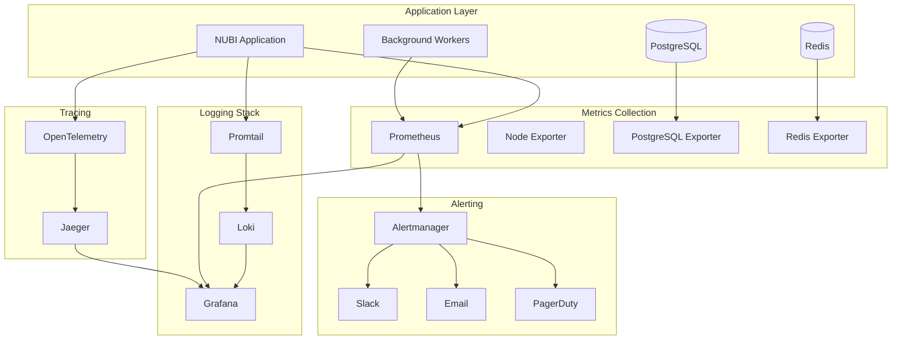

import { Tabs, TabItem } from '@astrojs/starlight/components';

Comprehensive monitoring and observability setup ensures your NUBI deployment maintains optimal performance, reliability, and user experience at scale.

## Observability Stack

### Core Monitoring Architecture

NUBI's monitoring system uses industry-standard tools for complete observability:



<Tabs>
  <TabItem label="Docker Compose Monitoring">
```yaml
# docker-compose.monitoring.yml
version: '3.8'

services:
  # Prometheus for metrics collection
  prometheus:
    image: prom/prometheus:latest
    container_name: nubi-prometheus
    restart: unless-stopped
    
    ports:
      - "9090:9090"
    
    volumes:
      - ./monitoring/prometheus/prometheus.yml:/etc/prometheus/prometheus.yml:ro
      - ./monitoring/prometheus/rules:/etc/prometheus/rules:ro
      - prometheus_data:/prometheus
    
    command:
      - '--config.file=/etc/prometheus/prometheus.yml'
      - '--storage.tsdb.path=/prometheus'
      - '--storage.tsdb.retention.time=30d'
      - '--web.console.libraries=/usr/share/prometheus/console_libraries'
      - '--web.console.templates=/usr/share/prometheus/consoles'
      - '--web.enable-lifecycle'
      - '--web.enable-admin-api'
      - '--log.level=info'
    
    networks:
      - nubi-monitoring

  # Grafana for visualization
  grafana:
    image: grafana/grafana:latest
    container_name: nubi-grafana
    restart: unless-stopped
    
    ports:
      - "3001:3000"
    
    environment:
      - GF_SECURITY_ADMIN_USER=admin
      - GF_SECURITY_ADMIN_PASSWORD=${GRAFANA_ADMIN_PASSWORD}
      - GF_INSTALL_PLUGINS=redis-datasource,postgres-datasource
    
    volumes:
      - grafana_data:/var/lib/grafana
      - ./monitoring/grafana/provisioning:/etc/grafana/provisioning:ro
      - ./monitoring/grafana/dashboards:/var/lib/grafana/dashboards:ro
    
    networks:
      - nubi-monitoring

  # Loki for log aggregation
  loki:
    image: grafana/loki:latest
    container_name: nubi-loki
    restart: unless-stopped
    
    ports:
      - "3100:3100"
    
    volumes:
      - ./monitoring/loki/loki.yml:/etc/loki/local-config.yaml:ro
      - loki_data:/loki
    
    command: -config.file=/etc/loki/local-config.yaml
    
    networks:
      - nubi-monitoring

  # Promtail for log shipping
  promtail:
    image: grafana/promtail:latest
    container_name: nubi-promtail
    restart: unless-stopped
    
    volumes:
      - ./monitoring/promtail/promtail.yml:/etc/promtail/config.yml:ro
      - ./logs:/var/log/nubi:ro
      - /var/lib/docker/containers:/var/lib/docker/containers:ro
    
    command: -config.file=/etc/promtail/config.yml
    
    networks:
      - nubi-monitoring

  # Alertmanager for alerting
  alertmanager:
    image: prom/alertmanager:latest
    container_name: nubi-alertmanager
    restart: unless-stopped
    
    ports:
      - "9093:9093"
    
    volumes:
      - ./monitoring/alertmanager/alertmanager.yml:/etc/alertmanager/alertmanager.yml:ro
      - alertmanager_data:/alertmanager
    
    networks:
      - nubi-monitoring

  # Node Exporter for system metrics
  node-exporter:
    image: prom/node-exporter:latest
    container_name: nubi-node-exporter
    restart: unless-stopped
    
    ports:
      - "9100:9100"
    
    volumes:
      - /proc:/host/proc:ro
      - /sys:/host/sys:ro
      - /:/rootfs:ro
    
    command:
      - '--path.procfs=/host/proc'
      - '--path.rootfs=/rootfs'
      - '--path.sysfs=/host/sys'
      - '--collector.filesystem.mount-points-exclude=^/(sys|proc|dev|host|etc)($$|/)'
    
    networks:
      - nubi-monitoring

  # PostgreSQL Exporter
  postgres-exporter:
    image: prometheuscommunity/postgres-exporter:latest
    container_name: nubi-postgres-exporter
    restart: unless-stopped
    
    ports:
      - "9187:9187"
    
    environment:
      DATA_SOURCE_NAME: ${DATABASE_URL}
    
    networks:
      - nubi-monitoring

  # Redis Exporter
  redis-exporter:
    image: oliver006/redis_exporter:latest
    container_name: nubi-redis-exporter
    restart: unless-stopped
    
    ports:
      - "9121:9121"
    
    environment:
      REDIS_ADDR: redis://redis:6379
    
    networks:
      - nubi-monitoring

  # Jaeger for distributed tracing
  jaeger:
    image: jaegertracing/all-in-one:latest
    container_name: nubi-jaeger
    restart: unless-stopped
    
    ports:
      - "16686:16686"
      - "14268:14268"
    
    environment:
      - COLLECTOR_OTLP_ENABLED=true
    
    networks:
      - nubi-monitoring

volumes:
  prometheus_data:
  grafana_data:
  loki_data:
  alertmanager_data:

networks:
  nubi-monitoring:
    driver: bridge
```
  </TabItem>
  
  <TabItem label="Kubernetes Monitoring">
```yaml
# k8s/monitoring/namespace.yaml
apiVersion: v1
kind: Namespace
metadata:
  name: nubi-monitoring

---
# k8s/monitoring/prometheus.yaml
apiVersion: apps/v1
kind: Deployment
metadata:
  name: prometheus
  namespace: nubi-monitoring
spec:
  replicas: 1
  selector:
    matchLabels:
      app: prometheus
  template:
    metadata:
      labels:
        app: prometheus
    spec:
      containers:
      - name: prometheus
        image: prom/prometheus:latest
        ports:
        - containerPort: 9090
        volumeMounts:
        - name: prometheus-config
          mountPath: /etc/prometheus
        - name: prometheus-storage
          mountPath: /prometheus
        args:
          - '--config.file=/etc/prometheus/prometheus.yml'
          - '--storage.tsdb.path=/prometheus'
          - '--storage.tsdb.retention.time=30d'
          - '--web.enable-lifecycle'
        resources:
          requests:
            memory: "2Gi"
            cpu: "1000m"
          limits:
            memory: "4Gi"
            cpu: "2000m"
      volumes:
      - name: prometheus-config
        configMap:
          name: prometheus-config
      - name: prometheus-storage
        persistentVolumeClaim:
          claimName: prometheus-pvc

---
apiVersion: v1
kind: Service
metadata:
  name: prometheus-service
  namespace: nubi-monitoring
spec:
  selector:
    app: prometheus
  ports:
  - port: 9090
    targetPort: 9090
  type: ClusterIP

---
# k8s/monitoring/grafana.yaml
apiVersion: apps/v1
kind: Deployment
metadata:
  name: grafana
  namespace: nubi-monitoring
spec:
  replicas: 1
  selector:
    matchLabels:
      app: grafana
  template:
    metadata:
      labels:
        app: grafana
    spec:
      containers:
      - name: grafana
        image: grafana/grafana:latest
        ports:
        - containerPort: 3000
        env:
        - name: GF_SECURITY_ADMIN_PASSWORD
          valueFrom:
            secretKeyRef:
              name: grafana-secret
              key: admin-password
        volumeMounts:
        - name: grafana-storage
          mountPath: /var/lib/grafana
        - name: grafana-config
          mountPath: /etc/grafana/provisioning
        resources:
          requests:
            memory: "1Gi"
            cpu: "500m"
          limits:
            memory: "2Gi"
            cpu: "1000m"
      volumes:
      - name: grafana-storage
        persistentVolumeClaim:
          claimName: grafana-pvc
      - name: grafana-config
        configMap:
          name: grafana-config

---
apiVersion: v1
kind: Service
metadata:
  name: grafana-service
  namespace: nubi-monitoring
spec:
  selector:
    app: grafana
  ports:
  - port: 3000
    targetPort: 3000
  type: LoadBalancer
```
  </TabItem>
</Tabs>

## Application Metrics

### Custom Metrics Implementation

NUBI exposes comprehensive application metrics for monitoring business and technical KPIs:

<Tabs>
  <TabItem label="Metrics Collector">
```typescript
// src/monitoring/metrics-collector.ts
import { Registry, Counter, Histogram, Gauge } from 'prom-client'
import { logger } from '@elizaos/core'

class NubiMetricsCollector {
  private registry: Registry
  private metrics: Map<string, any> = new Map()
  
  constructor() {
    this.registry = new Registry()
    this.initializeMetrics()
  }
  
  private initializeMetrics(): void {
    // HTTP Request Metrics
    this.metrics.set('http_requests_total', new Counter({
      name: 'nubi_http_requests_total',
      help: 'Total number of HTTP requests',
      labelNames: ['method', 'route', 'status_code'],
      registers: [this.registry]
    }))
    
    this.metrics.set('http_request_duration', new Histogram({
      name: 'nubi_http_request_duration_seconds',
      help: 'HTTP request duration in seconds',
      labelNames: ['method', 'route'],
      buckets: [0.001, 0.005, 0.01, 0.05, 0.1, 0.5, 1, 2, 5],
      registers: [this.registry]
    }))
    
    // Raid Metrics
    this.metrics.set('raids_total', new Counter({
      name: 'nubi_raids_total',
      help: 'Total number of raids',
      labelNames: ['status', 'platform'],
      registers: [this.registry]
    }))
    
    this.metrics.set('raid_participants', new Histogram({
      name: 'nubi_raid_participants',
      help: 'Number of participants per raid',
      labelNames: ['platform'],
      buckets: [1, 5, 10, 25, 50, 100, 200, 500],
      registers: [this.registry]
    }))
    
    this.metrics.set('raid_duration', new Histogram({
      name: 'nubi_raid_duration_seconds',
      help: 'Raid duration in seconds',
      labelNames: ['platform'],
      buckets: [60, 300, 600, 1800, 3600, 7200],
      registers: [this.registry]
    }))
    
    this.metrics.set('raid_effectiveness', new Histogram({
      name: 'nubi_raid_effectiveness_score',
      help: 'Raid effectiveness score (0-1)',
      buckets: [0.1, 0.2, 0.3, 0.4, 0.5, 0.6, 0.7, 0.8, 0.9, 1.0],
      registers: [this.registry]
    }))
    
    // User Engagement Metrics
    this.metrics.set('active_users', new Gauge({
      name: 'nubi_active_users',
      help: 'Number of active users',
      labelNames: ['timeframe'],
      registers: [this.registry]
    }))
    
    this.metrics.set('user_actions_total', new Counter({
      name: 'nubi_user_actions_total',
      help: 'Total user actions',
      labelNames: ['action_type', 'platform'],
      registers: [this.registry]
    }))
    
    this.metrics.set('engagement_quality', new Histogram({
      name: 'nubi_engagement_quality_score',
      help: 'Engagement quality score (0-1)',
      labelNames: ['platform'],
      buckets: [0.1, 0.2, 0.3, 0.4, 0.5, 0.6, 0.7, 0.8, 0.9, 1.0],
      registers: [this.registry]
    }))
    
    // WebSocket Metrics
    this.metrics.set('websocket_connections', new Gauge({
      name: 'nubi_websocket_connections',
      help: 'Current WebSocket connections',
      registers: [this.registry]
    }))
    
    this.metrics.set('websocket_messages_total', new Counter({
      name: 'nubi_websocket_messages_total',
      help: 'Total WebSocket messages',
      labelNames: ['direction', 'event_type'],
      registers: [this.registry]
    }))
    
    // Database Metrics
    this.metrics.set('database_queries_total', new Counter({
      name: 'nubi_database_queries_total',
      help: 'Total database queries',
      labelNames: ['operation', 'table'],
      registers: [this.registry]
    }))
    
    this.metrics.set('database_query_duration', new Histogram({
      name: 'nubi_database_query_duration_seconds',
      help: 'Database query duration',
      labelNames: ['operation', 'table'],
      buckets: [0.001, 0.005, 0.01, 0.05, 0.1, 0.5, 1, 2],
      registers: [this.registry]
    }))
    
    this.metrics.set('database_pool_size', new Gauge({
      name: 'nubi_database_pool_size',
      help: 'Database connection pool size',
      labelNames: ['state'],
      registers: [this.registry]
    }))
    
    // Cache Metrics
    this.metrics.set('cache_operations_total', new Counter({
      name: 'nubi_cache_operations_total',
      help: 'Total cache operations',
      labelNames: ['operation', 'result'],
      registers: [this.registry]
    }))
    
    this.metrics.set('cache_hit_ratio', new Gauge({
      name: 'nubi_cache_hit_ratio',
      help: 'Cache hit ratio',
      labelNames: ['cache_type'],
      registers: [this.registry]
    }))
    
    // AI Service Metrics
    this.metrics.set('ai_requests_total', new Counter({
      name: 'nubi_ai_requests_total',
      help: 'Total AI service requests',
      labelNames: ['provider', 'model', 'status'],
      registers: [this.registry]
    }))
    
    this.metrics.set('ai_request_duration', new Histogram({
      name: 'nubi_ai_request_duration_seconds',
      help: 'AI request duration',
      labelNames: ['provider', 'model'],
      buckets: [0.1, 0.5, 1, 2, 5, 10, 20, 30],
      registers: [this.registry]
    }))
    
    this.metrics.set('ai_token_usage', new Counter({
      name: 'nubi_ai_token_usage_total',
      help: 'Total AI tokens used',
      labelNames: ['provider', 'model', 'type'],
      registers: [this.registry]
    }))
  }
  
  // Metric recording methods
  recordHttpRequest(method: string, route: string, statusCode: number, duration: number): void {
    this.metrics.get('http_requests_total').inc({ method, route, status_code: statusCode })
    this.metrics.get('http_request_duration').observe({ method, route }, duration)
  }
  
  recordRaidCreated(platform: string, participants: number): void {
    this.metrics.get('raids_total').inc({ status: 'created', platform })
    this.metrics.get('raid_participants').observe({ platform }, participants)
  }
  
  recordRaidCompleted(platform: string, duration: number, effectiveness: number): void {
    this.metrics.get('raids_total').inc({ status: 'completed', platform })
    this.metrics.get('raid_duration').observe({ platform }, duration)
    this.metrics.get('raid_effectiveness').observe({}, effectiveness)
  }
  
  updateActiveUsers(timeframe: string, count: number): void {
    this.metrics.get('active_users').set({ timeframe }, count)
  }
  
  recordUserAction(actionType: string, platform: string): void {
    this.metrics.get('user_actions_total').inc({ action_type: actionType, platform })
  }
  
  recordEngagementQuality(platform: string, quality: number): void {
    this.metrics.get('engagement_quality').observe({ platform }, quality)
  }
  
  updateWebSocketConnections(count: number): void {
    this.metrics.get('websocket_connections').set(count)
  }
  
  recordWebSocketMessage(direction: 'in' | 'out', eventType: string): void {
    this.metrics.get('websocket_messages_total').inc({ direction, event_type: eventType })
  }
  
  recordDatabaseQuery(operation: string, table: string, duration: number): void {
    this.metrics.get('database_queries_total').inc({ operation, table })
    this.metrics.get('database_query_duration').observe({ operation, table }, duration)
  }
  
  updateDatabasePoolSize(available: number, used: number, idle: number): void {
    this.metrics.get('database_pool_size').set({ state: 'available' }, available)
    this.metrics.get('database_pool_size').set({ state: 'used' }, used)
    this.metrics.get('database_pool_size').set({ state: 'idle' }, idle)
  }
  
  recordCacheOperation(operation: string, result: 'hit' | 'miss'): void {
    this.metrics.get('cache_operations_total').inc({ operation, result })
  }
  
  updateCacheHitRatio(cacheType: string, ratio: number): void {
    this.metrics.get('cache_hit_ratio').set({ cache_type: cacheType }, ratio)
  }
  
  recordAIRequest(provider: string, model: string, status: string, duration: number, tokens: number): void {
    this.metrics.get('ai_requests_total').inc({ provider, model, status })
    this.metrics.get('ai_request_duration').observe({ provider, model }, duration)
    this.metrics.get('ai_token_usage').inc({ provider, model, type: 'total' }, tokens)
  }
  
  getMetrics(): Promise<string> {
    return this.registry.metrics()
  }
  
  getRegistry(): Registry {
    return this.registry
  }
}

export const metricsCollector = new NubiMetricsCollector()
```
  </TabItem>
  
  <TabItem label="Metrics Middleware">
```typescript
// src/monitoring/metrics-middleware.ts
import { Request, Response, NextFunction } from 'express'
import { metricsCollector } from './metrics-collector'
import { performance } from 'perf_hooks'

export const metricsMiddleware = (req: Request, res: Response, next: NextFunction): void => {
  const startTime = performance.now()
  
  // Track request start
  const originalSend = res.send
  
  res.send = function(body: any) {
    const endTime = performance.now()
    const duration = (endTime - startTime) / 1000 // Convert to seconds
    
    // Record metrics
    metricsCollector.recordHttpRequest(
      req.method,
      req.route?.path || req.path,
      res.statusCode,
      duration
    )
    
    return originalSend.call(this, body)
  }
  
  next()
}

// Database query metrics middleware
export const databaseMetricsMiddleware = {
  beforeQuery: (sql: string, params?: any[]) => {
    const startTime = performance.now()
    const operation = sql.split(' ')[0].toLowerCase()
    const table = extractTableName(sql)
    
    return {
      startTime,
      operation,
      table
    }
  },
  
  afterQuery: (context: any) => {
    const endTime = performance.now()
    const duration = (endTime - context.startTime) / 1000
    
    metricsCollector.recordDatabaseQuery(
      context.operation,
      context.table,
      duration
    )
  }
}

function extractTableName(sql: string): string {
  const match = sql.match(/(?:from|into|update|join)\s+([`"]?)(\w+)\1/i)
  return match ? match[2] : 'unknown'
}

// WebSocket metrics middleware
export const webSocketMetricsMiddleware = (socket: any) => {
  // Update connection count
  metricsCollector.updateWebSocketConnections(socket.engine.clientsCount)
  
  // Track incoming messages
  socket.onAny((eventName: string, ...args: any[]) => {
    metricsCollector.recordWebSocketMessage('in', eventName)
  })
  
  // Track outgoing messages
  const originalEmit = socket.emit
  socket.emit = function(eventName: string, ...args: any[]) {
    metricsCollector.recordWebSocketMessage('out', eventName)
    return originalEmit.apply(this, arguments)
  }
  
  socket.on('disconnect', () => {
    metricsCollector.updateWebSocketConnections(socket.engine.clientsCount - 1)
  })
}
```
  </TabItem>
  
  <TabItem label="Health Checks">
```typescript
// src/monitoring/health-checker.ts
import { DatabaseConnectionManager } from '../core/database-connection-manager'
import { MessageBusService } from '../messaging/message-bus'
import { logger } from '@elizaos/core'

interface HealthCheckResult {
  status: 'healthy' | 'unhealthy' | 'degraded'
  checks: {
    [service: string]: {
      status: 'up' | 'down' | 'slow'
      responseTime?: number
      error?: string
      details?: any
    }
  }
  timestamp: string
  uptime: number
}

class HealthChecker {
  private startTime: number = Date.now()
  
  async performHealthCheck(): Promise<HealthCheckResult> {
    const checks: any = {}
    
    // Database health check
    checks.database = await this.checkDatabase()
    
    // Redis health check
    checks.redis = await this.checkRedis()
    
    // External services health check
    checks.telegram = await this.checkTelegram()
    checks.discord = await this.checkDiscord()
    checks.twitter = await this.checkTwitter()
    
    // AI services health check
    checks.openai = await this.checkOpenAI()
    
    // Memory check
    checks.memory = this.checkMemory()
    
    // Disk space check
    checks.disk = await this.checkDiskSpace()
    
    // Determine overall status
    const overallStatus = this.determineOverallStatus(checks)
    
    return {
      status: overallStatus,
      checks,
      timestamp: new Date().toISOString(),
      uptime: Date.now() - this.startTime
    }
  }
  
  private async checkDatabase(): Promise<any> {
    const startTime = performance.now()
    
    try {
      const dbManager = DatabaseConnectionManager.getInstance()
      await dbManager.query('SELECT 1 as health_check')
      
      const responseTime = performance.now() - startTime
      
      return {
        status: responseTime > 1000 ? 'slow' : 'up',
        responseTime,
        details: {
          poolSize: dbManager.getPoolSize(),
          activeConnections: dbManager.getActiveConnections()
        }
      }
    } catch (error) {
      return {
        status: 'down',
        error: error.message,
        responseTime: performance.now() - startTime
      }
    }
  }
  
  private async checkRedis(): Promise<any> {
    const startTime = performance.now()
    
    try {
      // Assuming Redis client is available
      const redis = this.getRedisClient()
      await redis.ping()
      
      const responseTime = performance.now() - startTime
      
      return {
        status: responseTime > 500 ? 'slow' : 'up',
        responseTime,
        details: {
          memory: await redis.memory('usage'),
          connections: await redis.info('clients')
        }
      }
    } catch (error) {
      return {
        status: 'down',
        error: error.message,
        responseTime: performance.now() - startTime
      }
    }
  }
  
  private async checkTelegram(): Promise<any> {
    const startTime = performance.now()
    
    try {
      if (!process.env.TELEGRAM_BOT_TOKEN) {
        return { status: 'down', error: 'Telegram bot token not configured' }
      }
      
      // Check Telegram API
      const response = await fetch(
        `https://api.telegram.org/bot${process.env.TELEGRAM_BOT_TOKEN}/getMe`,
        { signal: AbortSignal.timeout(5000) }
      )
      
      const responseTime = performance.now() - startTime
      
      if (response.ok) {
        const data = await response.json()
        return {
          status: responseTime > 2000 ? 'slow' : 'up',
          responseTime,
          details: data.result
        }
      } else {
        return {
          status: 'down',
          error: `HTTP ${response.status}`,
          responseTime
        }
      }
    } catch (error) {
      return {
        status: 'down',
        error: error.message,
        responseTime: performance.now() - startTime
      }
    }
  }
  
  private checkMemory(): any {
    const memUsage = process.memoryUsage()
    const totalMem = require('os').totalmem()
    const freeMem = require('os').freemem()
    const usedMem = totalMem - freeMem
    const memoryUsagePercent = (usedMem / totalMem) * 100
    
    return {
      status: memoryUsagePercent > 90 ? 'down' : memoryUsagePercent > 80 ? 'slow' : 'up',
      details: {
        heapUsed: Math.round(memUsage.heapUsed / 1024 / 1024),
        heapTotal: Math.round(memUsage.heapTotal / 1024 / 1024),
        external: Math.round(memUsage.external / 1024 / 1024),
        systemMemoryUsage: Math.round(memoryUsagePercent),
        systemMemoryFree: Math.round(freeMem / 1024 / 1024),
        systemMemoryTotal: Math.round(totalMem / 1024 / 1024)
      }
    }
  }
  
  private async checkDiskSpace(): Promise<any> {
    try {
      const { execAsync } = require('child_process')
      const { promisify } = require('util')
      const exec = promisify(execAsync)
      
      const { stdout } = await exec('df -h /')
      const lines = stdout.split('\n')
      const data = lines[1].split(/\s+/)
      const usage = parseInt(data[4])
      
      return {
        status: usage > 90 ? 'down' : usage > 80 ? 'slow' : 'up',
        details: {
          filesystem: data[0],
          size: data[1],
          used: data[2],
          available: data[3],
          usage: `${usage}%`,
          mountPoint: data[5]
        }
      }
    } catch (error) {
      return {
        status: 'down',
        error: error.message
      }
    }
  }
  
  private determineOverallStatus(checks: any): 'healthy' | 'unhealthy' | 'degraded' {
    const statuses = Object.values(checks).map((check: any) => check.status)
    
    if (statuses.every(status => status === 'up')) {
      return 'healthy'
    }
    
    if (statuses.some(status => status === 'down')) {
      return 'unhealthy'
    }
    
    return 'degraded'
  }
  
  private getRedisClient(): any {
    // Implementation depends on Redis client setup
    // Return configured Redis client instance
    return null
  }
}

export const healthChecker = new HealthChecker()

// Express route for health check
export const healthCheckRoute = async (req: any, res: any) => {
  try {
    const healthResult = await healthChecker.performHealthCheck()
    
    const statusCode = {
      'healthy': 200,
      'degraded': 200,
      'unhealthy': 503
    }[healthResult.status]
    
    res.status(statusCode).json(healthResult)
  } catch (error) {
    logger.error('Health check failed:', error)
    res.status(503).json({
      status: 'unhealthy',
      error: 'Health check failed',
      timestamp: new Date().toISOString()
    })
  }
}
```
  </TabItem>
</Tabs>

## Logging Strategy

### Structured Logging Implementation

Comprehensive logging strategy with structured logs for easy searching and analysis:

<Tabs>
  <TabItem label="Winston Logger Setup">
```typescript
// src/monitoring/logger.ts
import winston from 'winston'
import 'winston-daily-rotate-file'

interface LogContext {
  userId?: string
  raidId?: string
  platform?: string
  action?: string
  metadata?: any
}

class NubiLogger {
  private logger: winston.Logger
  
  constructor() {
    this.logger = winston.createLogger({
      level: process.env.LOG_LEVEL || 'info',
      format: winston.format.combine(
        winston.format.timestamp(),
        winston.format.errors({ stack: true }),
        winston.format.json(),
        winston.format.printf((info) => {
          const { timestamp, level, message, ...rest } = info
          return JSON.stringify({
            timestamp,
            level,
            message,
            service: 'nubi',
            environment: process.env.NODE_ENV,
            version: process.env.APP_VERSION,
            ...rest
          })
        })
      ),
      defaultMeta: {
        service: 'nubi',
        environment: process.env.NODE_ENV,
        version: process.env.APP_VERSION
      },
      transports: this.createTransports()
    })
  }
  
  private createTransports(): winston.transport[] {
    const transports: winston.transport[] = []
    
    // Console transport (always enabled)
    transports.push(new winston.transports.Console({
      format: process.env.NODE_ENV === 'development' 
        ? winston.format.combine(
            winston.format.colorize(),
            winston.format.simple()
          )
        : winston.format.json()
    }))
    
    // File transports (production)
    if (process.env.NODE_ENV === 'production') {
      // Combined log file
      transports.push(new winston.transports.DailyRotateFile({
        filename: 'logs/nubi-%DATE%.log',
        datePattern: 'YYYY-MM-DD',
        maxSize: '100m',
        maxFiles: '30d',
        level: 'info'
      }))
      
      // Error log file
      transports.push(new winston.transports.DailyRotateFile({
        filename: 'logs/nubi-error-%DATE%.log',
        datePattern: 'YYYY-MM-DD',
        maxSize: '100m',
        maxFiles: '90d',
        level: 'error'
      }))
      
      // Audit log file
      transports.push(new winston.transports.DailyRotateFile({
        filename: 'logs/nubi-audit-%DATE%.log',
        datePattern: 'YYYY-MM-DD',
        maxSize: '100m',
        maxFiles: '365d',
        level: 'info',
        format: winston.format.combine(
          winston.format.timestamp(),
          winston.format.json()
        )
      }))
    }
    
    return transports
  }
  
  // Structured logging methods
  info(message: string, context?: LogContext): void {
    this.logger.info(message, context)
  }
  
  warn(message: string, context?: LogContext): void {
    this.logger.warn(message, context)
  }
  
  error(message: string, error?: Error, context?: LogContext): void {
    this.logger.error(message, {
      ...context,
      error: error ? {
        name: error.name,
        message: error.message,
        stack: error.stack
      } : undefined
    })
  }
  
  debug(message: string, context?: LogContext): void {
    this.logger.debug(message, context)
  }
  
  // Specialized logging methods
  logRaidAction(action: string, raidId: string, userId: string, metadata?: any): void {
    this.info(`Raid ${action}`, {
      action: `raid_${action}`,
      raidId,
      userId,
      metadata
    })
  }
  
  logUserAction(action: string, userId: string, platform?: string, metadata?: any): void {
    this.info(`User ${action}`, {
      action: `user_${action}`,
      userId,
      platform,
      metadata
    })
  }
  
  logAPICall(method: string, path: string, statusCode: number, duration: number, userId?: string): void {
    this.info('API call', {
      action: 'api_call',
      method,
      path,
      statusCode,
      duration,
      userId
    })
  }
  
  logSecurityEvent(event: string, userId?: string, ip?: string, metadata?: any): void {
    this.warn(`Security event: ${event}`, {
      action: 'security_event',
      event,
      userId,
      ip,
      metadata
    })
  }
  
  logPerformanceIssue(issue: string, duration: number, context?: any): void {
    this.warn(`Performance issue: ${issue}`, {
      action: 'performance_issue',
      issue,
      duration,
      context
    })
  }
  
  logSystemEvent(event: string, level: 'info' | 'warn' | 'error', metadata?: any): void {
    this.logger.log(level, `System event: ${event}`, {
      action: 'system_event',
      event,
      metadata
    })
  }
}

export const nubiLogger = new NubiLogger()
```
  </TabItem>
  
  <TabItem label="Loki Configuration">
```yaml
# monitoring/loki/loki.yml
auth_enabled: false

server:
  http_listen_port: 3100
  grpc_listen_port: 9096

common:
  path_prefix: /loki
  storage:
    filesystem:
      chunks_directory: /loki/chunks
      rules_directory: /loki/rules
  replication_factor: 1
  ring:
    instance_addr: 127.0.0.1
    kvstore:
      store: inmemory

query_scheduler:
  max_outstanding_requests_per_tenant: 2048

frontend:
  max_outstanding_per_tenant: 2048

schema_config:
  configs:
    - from: 2020-10-24
      store: boltdb-shipper
      object_store: filesystem
      schema: v11
      index:
        prefix: index_
        period: 24h

ruler:
  alertmanager_url: http://alertmanager:9093

analytics:
  reporting_enabled: false

limits_config:
  enforce_metric_name: false
  reject_old_samples: true
  reject_old_samples_max_age: 168h
  max_cache_freshness_per_query: 10m
  split_queries_by_interval: 15m
  max_query_parallelism: 32
  max_query_series: 1000000
  max_streams_per_user: 0
  max_line_size: 256000
  max_entries_limit_per_query: 5000
  max_global_streams_per_user: 5000
  unordered_writes: true
  max_chunks_per_query: 2000000
  max_query_length: 721h

chunk_store_config:
  max_look_back_period: 0s

table_manager:
  retention_deletes_enabled: true
  retention_period: 744h
```
  </TabItem>
  
  <TabItem label="Promtail Configuration">
```yaml
# monitoring/promtail/promtail.yml
server:
  http_listen_port: 9080
  grpc_listen_port: 0

positions:
  filename: /tmp/positions.yaml

clients:
  - url: http://loki:3100/loki/api/v1/push
    tenant_id: nubi

scrape_configs:
  # NUBI application logs
  - job_name: nubi-app
    static_configs:
      - targets:
          - localhost
        labels:
          job: nubi-app
          service: nubi
          environment: production
          __path__: /var/log/nubi/nubi-*.log

    pipeline_stages:
      # Parse JSON logs
      - json:
          expressions:
            timestamp: timestamp
            level: level
            message: message
            service: service
            userId: userId
            raidId: raidId
            platform: platform
            action: action
      
      # Set timestamp
      - timestamp:
          source: timestamp
          format: RFC3339
      
      # Add labels
      - labels:
          level:
          service:
          platform:
          action:
      
      # Output structured log
      - output:
          source: message

  # NUBI error logs
  - job_name: nubi-errors
    static_configs:
      - targets:
          - localhost
        labels:
          job: nubi-errors
          service: nubi
          log_type: error
          __path__: /var/log/nubi/nubi-error-*.log

    pipeline_stages:
      - json:
          expressions:
            timestamp: timestamp
            level: level
            message: message
            error: error
            stack: error.stack
      
      - timestamp:
          source: timestamp
          format: RFC3339
      
      - labels:
          level:
          service:

  # Docker container logs
  - job_name: docker-containers
    docker_sd_configs:
      - host: unix:///var/run/docker.sock
        refresh_interval: 5s
    
    relabel_configs:
      - source_labels: [__meta_docker_container_name]
        regex: '/nubi-(.*)'
        target_label: container
      
      - source_labels: [__meta_docker_container_label_com_docker_compose_service]
        target_label: service
    
    pipeline_stages:
      - docker: {}
      
      - multiline:
          firstline: '^\d{4}-\d{2}-\d{2}'
          max_wait_time: 3s
      
      - json:
          expressions:
            level: level
            message: message
            timestamp: timestamp
      
      - labels:
          level:
          service:

  # System logs
  - job_name: system
    static_configs:
      - targets:
          - localhost
        labels:
          job: system
          service: system
          __path__: /var/log/syslog

    pipeline_stages:
      - regex:
          expression: '^(?P<timestamp>\S+\s+\d+\s+\d+:\d+:\d+)\s+(?P<hostname>\S+)\s+(?P<service>\S+)(?:\[(?P<pid>\d+)\])?\s*:\s*(?P<message>.*)'
      
      - timestamp:
          source: timestamp
          format: 'Jan _2 15:04:05'
      
      - labels:
          service:
          hostname:

  # Nginx access logs
  - job_name: nginx-access
    static_configs:
      - targets:
          - localhost
        labels:
          job: nginx-access
          service: nginx
          log_type: access
          __path__: /var/log/nginx/access.log

    pipeline_stages:
      - regex:
          expression: '^(?P<remote_addr>\S+)\s+-\s+(?P<remote_user>\S+)\s+\[(?P<time_local>[^\]]+)\]\s+"(?P<method>\S+)\s+(?P<request_uri>[^"]*)\s+HTTP/[^"]*"\s+(?P<status>\d+)\s+(?P<body_bytes_sent>\d+)\s+"(?P<http_referer>[^"]*)"\s+"(?P<http_user_agent>[^"]*)"'
      
      - timestamp:
          source: time_local
          format: '02/Jan/2006:15:04:05 -0700'
      
      - labels:
          method:
          status:
```
  </TabItem>
</Tabs>

## Alerting Configuration

### Prometheus Alerting Rules

Comprehensive alerting rules for proactive monitoring:

<Tabs>
  <TabItem label="Alert Rules">
```yaml
# monitoring/prometheus/rules/nubi-alerts.yml
groups:
  - name: nubi.high_priority
    interval: 30s
    rules:
      # Application Health
      - alert: NubiServiceDown
        expr: up{job="nubi-app"} == 0
        for: 1m
        labels:
          severity: critical
          service: nubi
        annotations:
          summary: "NUBI service is down"
          description: "NUBI service {{ $labels.instance }} has been down for more than 1 minute"
          runbook_url: "https://wiki.company.com/nubi/alerts/service-down"

      - alert: NubiHighErrorRate
        expr: rate(nubi_http_requests_total{status_code=~"5.."}[5m]) / rate(nubi_http_requests_total[5m]) > 0.1
        for: 5m
        labels:
          severity: critical
          service: nubi
        annotations:
          summary: "High error rate in NUBI"
          description: "NUBI error rate is {{ $value | humanizePercentage }} over the last 5 minutes"

      - alert: NubiSlowResponse
        expr: histogram_quantile(0.95, rate(nubi_http_request_duration_seconds_bucket[5m])) > 5
        for: 5m
        labels:
          severity: warning
          service: nubi
        annotations:
          summary: "NUBI response time is slow"
          description: "95th percentile response time is {{ $value }}s over the last 5 minutes"

      # Database Alerts
      - alert: DatabaseConnectionPoolExhausted
        expr: nubi_database_pool_size{state="available"} / nubi_database_pool_size{state="total"} < 0.1
        for: 2m
        labels:
          severity: critical
          service: database
        annotations:
          summary: "Database connection pool exhausted"
          description: "Less than 10% of database connections are available"

      - alert: DatabaseSlowQueries
        expr: histogram_quantile(0.95, rate(nubi_database_query_duration_seconds_bucket[5m])) > 2
        for: 5m
        labels:
          severity: warning
          service: database
        annotations:
          summary: "Database queries are slow"
          description: "95th percentile query time is {{ $value }}s"

      # Memory and CPU
      - alert: HighMemoryUsage
        expr: (node_memory_MemTotal_bytes - node_memory_MemAvailable_bytes) / node_memory_MemTotal_bytes > 0.9
        for: 5m
        labels:
          severity: critical
          service: system
        annotations:
          summary: "High memory usage"
          description: "Memory usage is {{ $value | humanizePercentage }}"

      - alert: HighCPUUsage
        expr: 100 - (avg(irate(node_cpu_seconds_total{mode="idle"}[5m])) * 100) > 80
        for: 10m
        labels:
          severity: warning
          service: system
        annotations:
          summary: "High CPU usage"
          description: "CPU usage is {{ $value }}%"

  - name: nubi.business_metrics
    interval: 1m
    rules:
      # Raid Metrics
      - alert: LowRaidParticipation
        expr: avg_over_time(nubi_raid_participants[1h]) < 5
        for: 30m
        labels:
          severity: warning
          service: raids
        annotations:
          summary: "Low raid participation"
          description: "Average raid participation over the last hour is {{ $value }}"

      - alert: RaidFailureRate
        expr: rate(nubi_raids_total{status="failed"}[1h]) / rate(nubi_raids_total[1h]) > 0.2
        for: 15m
        labels:
          severity: warning
          service: raids
        annotations:
          summary: "High raid failure rate"
          description: "Raid failure rate is {{ $value | humanizePercentage }} over the last hour"

      - alert: LowEngagementQuality
        expr: avg_over_time(nubi_engagement_quality_score[30m]) < 0.6
        for: 30m
        labels:
          severity: warning
          service: engagement
        annotations:
          summary: "Low engagement quality"
          description: "Average engagement quality is {{ $value }} over the last 30 minutes"

      # User Activity
      - alert: LowUserActivity
        expr: nubi_active_users{timeframe="1h"} < 10
        for: 30m
        labels:
          severity: warning
          service: users
        annotations:
          summary: "Low user activity"
          description: "Only {{ $value }} active users in the last hour"

      - alert: UserActivityDrop
        expr: (nubi_active_users{timeframe="1h"} / nubi_active_users{timeframe="1h"} offset 24h - 1) < -0.3
        for: 15m
        labels:
          severity: warning
          service: users
        annotations:
          summary: "Significant drop in user activity"
          description: "User activity dropped by {{ $value | humanizePercentage }} compared to same time yesterday"

  - name: nubi.external_services
    interval: 2m
    rules:
      # Platform Integration
      - alert: TelegramAPIDown
        expr: up{job="telegram-health-check"} == 0
        for: 3m
        labels:
          severity: critical
          service: telegram
        annotations:
          summary: "Telegram API is down"
          description: "Cannot connect to Telegram API"

      - alert: DiscordAPIDown
        expr: up{job="discord-health-check"} == 0
        for: 3m
        labels:
          severity: critical
          service: discord
        annotations:
          summary: "Discord API is down"
          description: "Cannot connect to Discord API"

      # AI Services
      - alert: AIServiceHighLatency
        expr: histogram_quantile(0.95, rate(nubi_ai_request_duration_seconds_bucket[5m])) > 30
        for: 10m
        labels:
          severity: warning
          service: ai
        annotations:
          summary: "AI service high latency"
          description: "95th percentile AI request time is {{ $value }}s"

      - alert: AIServiceHighErrorRate
        expr: rate(nubi_ai_requests_total{status="error"}[10m]) / rate(nubi_ai_requests_total[10m]) > 0.1
        for: 5m
        labels:
          severity: warning
          service: ai
        annotations:
          summary: "High AI service error rate"
          description: "AI service error rate is {{ $value | humanizePercentage }}"

  - name: nubi.security
    interval: 1m
    rules:
      # Security Events
      - alert: SuspiciousActivity
        expr: rate(nubi_security_events_total[5m]) > 5
        for: 2m
        labels:
          severity: warning
          service: security
        annotations:
          summary: "Unusual security events"
          description: "{{ $value }} security events per second over the last 5 minutes"

      - alert: RateLimitExceeded
        expr: rate(nubi_rate_limit_exceeded_total[5m]) > 10
        for: 5m
        labels:
          severity: warning
          service: security
        annotations:
          summary: "Rate limit frequently exceeded"
          description: "Rate limit exceeded {{ $value }} times per second"

      - alert: FailedLogins
        expr: rate(nubi_auth_failures_total[10m]) > 2
        for: 5m
        labels:
          severity: warning
          service: auth
        annotations:
          summary: "High failed login rate"
          description: "{{ $value }} failed logins per second over the last 10 minutes"
```
  </TabItem>
  
  <TabItem label="Alertmanager Config">
```yaml
# monitoring/alertmanager/alertmanager.yml
global:
  smtp_smarthost: 'localhost:587'
  smtp_from: 'alerts@anubis.chat'
  smtp_auth_username: 'alerts@anubis.chat'
  smtp_auth_password: 'smtp-password'

# Alert routing tree
route:
  group_by: ['alertname', 'service']
  group_wait: 10s
  group_interval: 10s
  repeat_interval: 1h
  receiver: 'default'
  
  routes:
    # Critical alerts go to PagerDuty and Slack immediately
    - match:
        severity: critical
      receiver: 'critical-alerts'
      group_wait: 0s
      repeat_interval: 15m
    
    # Warning alerts go to Slack only
    - match:
        severity: warning
      receiver: 'warning-alerts'
      group_wait: 30s
      repeat_interval: 4h
    
    # Business metrics alerts
    - match:
        service: raids
      receiver: 'business-alerts'
    
    # Security alerts
    - match:
        service: security
      receiver: 'security-alerts'

# Alert receivers
receivers:
  - name: 'default'
    email_configs:
      - to: 'ops@anubis.chat'
        subject: '[NUBI] {{ .GroupLabels.alertname }}'
        body: |
          {{ range .Alerts }}
          Alert: {{ .Annotations.summary }}
          Description: {{ .Annotations.description }}
          Details: {{ range .Labels.SortedPairs }}{{ .Name }}: {{ .Value }}{{ end }}
          {{ end }}

  - name: 'critical-alerts'
    slack_configs:
      - api_url: 'https://hooks.slack.com/services/YOUR/SLACK/WEBHOOK'
        channel: '#alerts-critical'
        title: '🚨 CRITICAL: {{ .GroupLabels.alertname }}'
        text: |
          {{ range .Alerts }}
          *{{ .Annotations.summary }}*
          {{ .Annotations.description }}
          
          *Labels:* {{ range .Labels.SortedPairs }}`{{ .Name }}`: {{ .Value }} {{ end }}
          {{ if .Annotations.runbook_url }}*Runbook:* <{{ .Annotations.runbook_url }}|View Runbook>{{ end }}
          {{ end }}
        send_resolved: true
    
    pagerduty_configs:
      - routing_key: 'your-pagerduty-integration-key'
        description: '{{ .GroupLabels.alertname }}: {{ .GroupLabels.service }}'
        severity: 'critical'

  - name: 'warning-alerts'
    slack_configs:
      - api_url: 'https://hooks.slack.com/services/YOUR/SLACK/WEBHOOK'
        channel: '#alerts-warning'
        title: '⚠️ WARNING: {{ .GroupLabels.alertname }}'
        text: |
          {{ range .Alerts }}
          {{ .Annotations.summary }}
          {{ .Annotations.description }}
          {{ end }}
        send_resolved: true

  - name: 'business-alerts'
    slack_configs:
      - api_url: 'https://hooks.slack.com/services/YOUR/SLACK/WEBHOOK'
        channel: '#business-metrics'
        title: '📊 Business Metric Alert: {{ .GroupLabels.alertname }}'
        text: |
          {{ range .Alerts }}
          {{ .Annotations.summary }}
          {{ .Annotations.description }}
          {{ end }}

  - name: 'security-alerts'
    slack_configs:
      - api_url: 'https://hooks.slack.com/services/YOUR/SLACK/WEBHOOK'
        channel: '#security-alerts'
        title: '🔒 Security Alert: {{ .GroupLabels.alertname }}'
        text: |
          {{ range .Alerts }}
          *{{ .Annotations.summary }}*
          {{ .Annotations.description }}
          {{ end }}
    
    email_configs:
      - to: 'security@anubis.chat'
        subject: '[SECURITY] NUBI Alert: {{ .GroupLabels.alertname }}'

# Inhibit rules to prevent alert spam
inhibit_rules:
  - source_match:
      severity: 'critical'
    target_match:
      severity: 'warning'
    equal: ['alertname', 'service']

  - source_match:
      alertname: 'NubiServiceDown'
    target_match_re:
      alertname: 'Nubi.*'
    equal: ['instance']
```
  </TabItem>
</Tabs>

This comprehensive monitoring and observability setup provides enterprise-grade visibility into your NUBI deployment, enabling proactive issue detection, rapid troubleshooting, and continuous performance optimization.