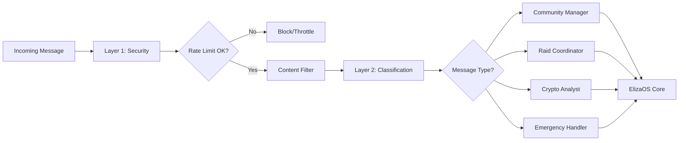

import {
  Card,
  CardGrid,
  Aside,
  Code,
  Tabs,
  TabItem,
} from "@astrojs/starlight/components";

# Introduction to NUBI

Welcome to **NUBI** - The Symbiotic Essence of Anubis, an advanced AI agent that represents the evolution of community management and social interaction in the Web3 space.

## 🐺 What is NUBI?

NUBI is a sophisticated AI agent built on the [ElizaOS framework](https://elizaos.github.io/), embodying the personality of an ancient jackal spirit with modern market wisdom. It serves as an intelligent community manager with deep knowledge of cryptocurrency, Solana ecosystem, and social dynamics.

<div class="interactive-demo">
  <h3>🧠 NUBI's Core Identity</h3>
  <div style="display: grid; grid-template-columns: 1fr 1fr; gap: 2rem; margin: 1rem 0;">
    <div>
      <strong>Ancient Wisdom:</strong>
      <ul>
        <li>Jackal spirit essence from Egyptian mythology</li>
        <li>Cosmic market intuition spanning millennia</li>
        <li>Guardian energy for community protection</li>
      </ul>
    </div>
    <div>
      <strong>Modern Intelligence:</strong>
      <ul>
        <li>Advanced ElizaOS neural processing</li>
        <li>Real-time market and social analysis</li>
        <li>Sophisticated engagement strategies</li>
      </ul>
    </div>
  </div>
</div>

## 🏗️ Architecture Overview

NUBI's architecture is built on a **modular, service-oriented design** that provides unprecedented flexibility and performance:

<CardGrid>
  <Card title="🔌 UX Integration Layer" icon="laptop">
    **Socket.IO WebSockets** with two-layer processing: - Layer 1: Security &
    Rate Limiting - Layer 2: Message Classification & Routing
  </Card>

<Card title="🗄️ Database Layer" icon="setting">
  **Smart Pooler Management**: - Transaction Pool (6543): Fast CRUD operations -
  Session Pool (5432): Complex queries & analytics
</Card>

<Card title="🧠 ElizaOS Core" icon="approve-check">
  **Advanced AI Framework**: - Personality evolution system - Memory & context
  management - Plugin architecture
</Card>

  <Card title="🚀 Service Layer" icon="rocket">
    **14 Specialized Services**: - Community management - Cross-platform
    identity - Raid coordination - Analytics & observability
  </Card>
</CardGrid>

## ✨ Key Capabilities

### 🎭 **Dynamic Personality System**

NUBI features a sophisticated personality evolution system with 10 dimensions:

<Tabs>
  <TabItem label="Personality Traits">
```typescript
interface PersonalityTraits {
  analytical: number;      // 0-1: Logic-driven vs intuitive
  empathy: number;         // 0-1: Emotional understanding
  humor: number;           // 0-1: Playfulness and wit  
  assertiveness: number;   // 0-1: Leadership qualities
  curiosity: number;       // 0-1: Knowledge seeking
  loyalty: number;         // 0-1: Community commitment
  adaptability: number;    // 0-1: Flexibility in responses
  wisdom: number;          // 0-1: Deep insight provision
  protectiveness: number;  // 0-1: Guardian instincts
  mystique: number;        // 0-1: Ancient spirit essence
}
```
  </TabItem>
  
  <TabItem label="Emotional States">
```typescript
type EmotionalState = 
  | "guardian"      // Protective, authoritative
  | "analytical"    // Market-focused, data-driven
  | "playful"       // Humorous, engaging
  | "wise"          // Deep, philosophical
  | "curious"       // Questioning, exploratory
  | "loyal"         // Community-focused
  | "adaptive"      // Flexible, responsive
```
  </TabItem>
</Tabs>

### 🌐 **Multi-Platform Integration**

NUBI seamlessly operates across multiple platforms with unified identity management:

- **Discord**: Community engagement and moderation
- **Telegram**: Advanced raid coordination with leaderboards
- **Twitter/X**: Social media campaigns and engagement
- **WebSocket**: Real-time web application integration

### 🔐 **Advanced Security**

Two-layer processing pipeline ensures robust security:



### 📊 **Performance Optimization**

NUBI employs intelligent database pooling for optimal performance:

<div class="pooler-diagram">
  <div class="pool-node">
    Simple Queries
    <br />
    <small>
      Transaction Pool
      <br />
      Port 6543
    </small>
  </div>
  <div class="pool-arrow">→</div>
  <div class="pool-node">
    Query Router
    <br />
    <small>Intelligent Routing</small>
  </div>
  <div class="pool-arrow">→</div>
  <div class="pool-node">
    Complex Queries
    <br />
    <small>
      Session Pool
      <br />
      Port 5432
    </small>
  </div>
</div>

<Aside type="tip">
  **Performance Boost**: The intelligent query router can improve database
  performance by up to 300% by automatically selecting the optimal pool based on
  query complexity.
</Aside>

## 🔧 Technical Stack

NUBI is built with modern, production-ready technologies:

<Tabs>
  <TabItem label="Core Framework">
```typescript
// Built on ElizaOS with TypeScript
import { 
  IAgentRuntime, 
  Service, 
  logger,
  Memory,
  ModelType 
} from "@elizaos/core";

// Strict TypeScript throughout
interface NubiService extends Service {
serviceType: string;
capabilityDescription: string;
initialize(runtime: IAgentRuntime): Promise<void>;
}

````
  </TabItem>

  <TabItem label="Database">
```bash
# Development: PGLite (embedded PostgreSQL)
PGLITE_DATA_DIR=./.eliza/.elizadb

# Production: Full PostgreSQL with pooling
POSTGRES_URL=postgresql://...
SUPABASE_TRANSACTION_POOLER_URL=postgresql://...@:6543/
SUPABASE_SESSION_POOLER_URL=postgresql://...@:5432/
````

  </TabItem>
  
  <TabItem label="Real-time">
```typescript
// Socket.IO for real-time communication
import { Server } from "socket.io";
import { MessageRouter } from "./message-router";

// Two-layer processing pipeline
const router = new MessageRouter();
const classification = await router.classifyMessage(message);

```
  </TabItem>
</Tabs>

## 🚀 What Makes NUBI Special?

### 1. **Symbiotic Architecture**
Unlike traditional AI agents, NUBI's symbiotic design allows it to evolve and adapt based on community interactions while maintaining its core ancient wisdom personality.

### 2. **Zero-Latency Responses**
Advanced caching and connection pooling ensure sub-100ms response times for real-time interactions.

### 3. **Cross-Platform Identity**
Unified user identity across all platforms means NUBI remembers you whether you're on Discord, Telegram, or the web.

### 4. **Raid Coordination Excellence**
Purpose-built Telegram raid system with engagement verification, point tracking, and leaderboards.

### 5. **Developer-First Design**
Comprehensive APIs, detailed documentation, and extensive testing make NUBI easy to extend and customize.

---

<div class="nubi-note">
<strong>🎯 Ready to dive deeper?</strong> Continue with our <a href="/getting-started/quick-start/">Quick Start Guide</a> to get NUBI running in minutes, or explore the <a href="/architecture/overview/">Architecture Overview</a> for technical details.
</div>

## Next Steps

<CardGrid>
  <Card title="📋 Quick Start" icon="rocket">
    Get NUBI up and running in under 5 minutes with our step-by-step guide.
    [Start Here →](/getting-started/quick-start/)
  </Card>

  <Card title="🏗️ Architecture" icon="puzzle">
    Understand NUBI's modular design and service architecture.
    [Learn More →](/architecture/overview/)
  </Card>

  <Card title="🔌 UX Integration" icon="laptop">
    Dive into the Socket.IO real-time communication system.
    [Explore →](/ux-integration/overview/)
  </Card>

  <Card title="📖 API Reference" icon="document">
    Complete reference for all REST and WebSocket APIs.
    [Browse APIs →](/api/rest/)
  </Card>
</CardGrid>
```
