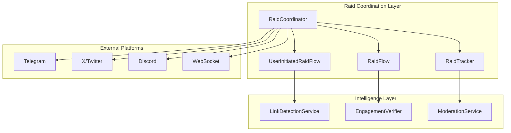

import { Tabs, TabItem } from '@astrojs/starlight/components';

NUBI's raid coordination system orchestrates complex multi-platform social media campaigns with intelligent target selection, engagement verification, and real-time performance tracking.

## System Architecture

The coordination system operates through multiple interconnected services that work together to execute sophisticated raid strategies:



## Core Components

### RaidCoordinator

The central orchestration service that manages all raid operations:

<Tabs>
  <TabItem label="TypeScript Interface">
```typescript
interface RaidCoordinator {
  // Raid lifecycle management
  initiateRaid(config: RaidConfiguration): Promise<RaidSession>
  pauseRaid(raidId: string): Promise<void>
  resumeRaid(raidId: string): Promise<void>
  terminateRaid(raidId: string): Promise<RaidResult>
  
  // Target selection and analysis
  analyzeTarget(url: string): Promise<TargetAnalysis>
  selectOptimalTiming(target: Target): Promise<TimingStrategy>
  calculateEngagementPotential(target: Target): Promise<number>
  
  // Multi-platform coordination
  coordinateAcrossPlatforms(raid: RaidSession): Promise<void>
  syncPlatformActions(platforms: Platform[]): Promise<SyncResult>
  
  // Real-time monitoring
  monitorRaidProgress(raidId: string): Promise<RaidMetrics>
  adjustStrategy(raidId: string, metrics: RaidMetrics): Promise<void>
}
```
  </TabItem>
  
  <TabItem label="Configuration">
```yaml
raid_coordination:
  max_concurrent_raids: 5
  default_duration_minutes: 30
  min_participants: 10
  max_participants: 500
  
  target_analysis:
    engagement_threshold: 0.7
    sentiment_analysis: true
    bot_detection: true
    spam_filtering: true
  
  timing_strategy:
    peak_hours: [10, 14, 18, 20]
    timezone_optimization: true
    competitor_avoidance: true
  
  platform_weights:
    telegram: 0.4
    twitter: 0.35
    discord: 0.2
    websocket: 0.05
```
  </TabItem>
  
  <TabItem label="Implementation">
```typescript
class RaidCoordinator implements Service {
  constructor(
    private messageBus: MessageBusService,
    private analytics: AnalyticsService,
    private database: DatabaseConnectionManager
  ) {}
  
  async initiateRaid(config: RaidConfiguration): Promise<RaidSession> {
    // 1. Validate raid configuration
    const validation = await this.validateRaidConfig(config)
    if (!validation.valid) {
      throw new Error(`Invalid raid config: ${validation.errors.join(', ')}`)
    }
    
    // 2. Analyze target and optimize timing
    const targetAnalysis = await this.analyzeTarget(config.target)
    const timing = await this.selectOptimalTiming(targetAnalysis)
    
    // 3. Create raid session with participants
    const session = await this.createRaidSession({
      ...config,
      analysis: targetAnalysis,
      timing,
      status: 'preparing'
    })
    
    // 4. Coordinate across platforms
    await this.coordinateAcrossPlatforms(session)
    
    // 5. Begin monitoring and execution
    await this.startRaidMonitoring(session.id)
    
    return session
  }
  
  private async coordinateAcrossPlatforms(session: RaidSession): Promise<void> {
    const platforms = session.config.platforms || ['telegram', 'twitter']
    const coordinationPromises = platforms.map(platform => 
      this.initiatePlatformRaid(session, platform)
    )
    
    await Promise.all(coordinationPromises)
  }
}
```
  </TabItem>
</Tabs>

### Target Analysis System

Advanced target analysis determines raid viability and optimal strategies:

#### Intelligence Gathering

```typescript
interface TargetAnalysis {
  url: string
  platform: string
  contentType: 'post' | 'profile' | 'thread' | 'space'
  
  // Engagement metrics
  currentEngagement: EngagementMetrics
  historicalPerformance: HistoricalData
  audienceInsights: AudienceProfile
  
  // Strategic assessment
  raidability: number // 0-1 score
  optimalStrategy: RaidStrategy
  riskFactors: RiskFactor[]
  
  // Timing optimization
  peakEngagementHours: number[]
  competitorActivity: CompetitorInsight[]
  platformSpecificFactors: PlatformFactors
}

class TargetAnalyzer {
  async analyzeTarget(url: string): Promise<TargetAnalysis> {
    const platformData = await this.extractPlatformData(url)
    const engagementHistory = await this.getEngagementHistory(platformData)
    const audienceProfile = await this.analyzeAudience(platformData)
    
    return {
      ...platformData,
      currentEngagement: await this.getCurrentMetrics(platformData),
      historicalPerformance: engagementHistory,
      audienceInsights: audienceProfile,
      raidability: this.calculateRaidability(platformData, engagementHistory),
      optimalStrategy: this.determineStrategy(platformData, audienceProfile),
      riskFactors: this.assessRisks(platformData),
      peakEngagementHours: this.findPeakHours(engagementHistory),
      competitorActivity: await this.analyzeCompetitors(platformData),
      platformSpecificFactors: this.getPlatformFactors(platformData.platform)
    }
  }
}
```

#### Strategic Decision Making

The system uses machine learning to optimize raid strategies:

```typescript
interface RaidStrategy {
  approach: 'aggressive' | 'moderate' | 'subtle'
  phasedExecution: Phase[]
  contentGuidelines: ContentGuide[]
  timingWindows: TimeWindow[]
  participantAllocation: ParticipantAllocation
}

class StrategyOptimizer {
  async optimizeStrategy(
    target: TargetAnalysis, 
    participants: Participant[]
  ): Promise<RaidStrategy> {
    // Machine learning model for strategy optimization
    const mlPrediction = await this.mlModel.predict({
      targetMetrics: target,
      participantProfiles: participants.map(p => p.profile),
      historicalSuccess: await this.getHistoricalSuccessData()
    })
    
    return {
      approach: this.determineApproach(mlPrediction),
      phasedExecution: this.createPhases(target, participants),
      contentGuidelines: this.generateContentGuides(target),
      timingWindows: this.calculateOptimalWindows(target),
      participantAllocation: this.allocateParticipants(participants, target)
    }
  }
}
```

## Multi-Platform Orchestration

### Platform-Specific Coordination

Each platform requires specialized coordination logic:

<Tabs>
  <TabItem label="Telegram">
```typescript
class TelegramRaidCoordinator {
  async coordinateRaid(session: RaidSession): Promise<void> {
    // 1. Create private coordination channel
    const coordChannel = await this.createCoordinationChannel(session.id)
    
    // 2. Invite verified participants
    await this.inviteParticipants(coordChannel, session.participants)
    
    // 3. Distribute raid instructions with timing
    await this.distributeInstructions(coordChannel, {
      target: session.target,
      strategy: session.strategy,
      timing: session.timing,
      contentGuidelines: session.contentGuidelines
    })
    
    // 4. Monitor participation and engagement
    this.startParticipationMonitoring(coordChannel, session)
  }
  
  private async createCoordinationChannel(raidId: string): Promise<ChatId> {
    const channel = await this.telegram.createGroup({
      title: `🎯 Raid ${raidId.slice(0, 8)}`,
      description: 'Temporary coordination channel - will be deleted after raid',
      permissions: {
        can_send_messages: true,
        can_send_media: false,
        can_add_web_page_previews: false
      }
    })
    
    // Schedule auto-deletion after raid completion
    this.scheduleChannelDeletion(channel.id, raidId)
    
    return channel.id
  }
}
```
  </TabItem>
  
  <TabItem label="X/Twitter">
```typescript
class TwitterRaidCoordinator {
  async coordinateRaid(session: RaidSession): Promise<void> {
    // 1. Create Twitter Space for live coordination (optional)
    const coordinationSpace = session.config.useSpaces ? 
      await this.createCoordinationSpace(session) : null
    
    // 2. Send DM instructions to participants
    await this.sendDMInstructions(session.participants, {
      target: session.target,
      hashtagStrategy: session.strategy.hashtags,
      mentionStrategy: session.strategy.mentions,
      timing: session.timing
    })
    
    // 3. Monitor tweet patterns and engagement
    this.startTwitterMonitoring(session)
  }
  
  private async sendDMInstructions(
    participants: Participant[], 
    instructions: TwitterInstructions
  ): Promise<void> {
    const dmPromises = participants.map(async participant => {
      const personalizedInstructions = this.personalizeInstructions(
        instructions, 
        participant
      )
      
      return this.twitter.sendDM(participant.twitterId, {
        text: this.formatInstructions(personalizedInstructions),
        quick_reply_options: [
          { label: '🎯 Ready', metadata: 'ready' },
          { label: '❓ Questions', metadata: 'questions' },
          { label: '🚫 Skip this raid', metadata: 'skip' }
        ]
      })
    })
    
    await Promise.all(dmPromises)
  }
}
```
  </TabItem>
  
  <TabItem label="Discord">
```typescript
class DiscordRaidCoordinator {
  async coordinateRaid(session: RaidSession): Promise<void> {
    // 1. Create temporary voice and text channels
    const raidCategory = await this.createRaidCategory(session.id)
    const textChannel = await this.createTextChannel(raidCategory, session)
    const voiceChannel = await this.createVoiceChannel(raidCategory, session)
    
    // 2. Set up raid dashboard with real-time updates
    const dashboard = await this.createRaidDashboard(textChannel, session)
    
    // 3. Coordinate through voice and text
    await this.startVoiceCoordination(voiceChannel, session)
    await this.startTextCoordination(textChannel, session)
  }
  
  private async createRaidDashboard(
    channel: TextChannel, 
    session: RaidSession
  ): Promise<Message> {
    const embed = new MessageEmbed()
      .setTitle(`🎯 Raid Dashboard: ${session.id.slice(0, 8)}`)
      .setDescription(`Target: ${session.target.url}`)
      .addFields([
        { name: '📊 Status', value: session.status, inline: true },
        { name: '👥 Participants', value: session.participants.length.toString(), inline: true },
        { name: '⏰ Phase', value: session.currentPhase || 'Preparing', inline: true },
        { name: '🎯 Strategy', value: session.strategy.approach, inline: true },
        { name: '📈 Progress', value: '0%', inline: true },
        { name: '⚡ Engagement', value: 'Calculating...', inline: true }
      ])
      .setColor('#FFD700')
      .setTimestamp()
    
    const dashboard = await channel.send({ embeds: [embed] })
    
    // Update dashboard every 30 seconds
    this.startDashboardUpdates(dashboard, session)
    
    return dashboard
  }
}
```
  </TabItem>
</Tabs>

### Cross-Platform Synchronization

Real-time synchronization ensures coordinated timing across all platforms:

```typescript
class CrossPlatformSynchronizer {
  private syncPoints: Map<string, SyncPoint> = new Map()
  
  async synchronizeRaidExecution(session: RaidSession): Promise<void> {
    const platforms = session.platforms
    const syncPoint = this.createSyncPoint(session.id, platforms)
    
    // 1. Prepare all platforms
    await this.prepareAllPlatforms(session, syncPoint)
    
    // 2. Wait for all platforms to be ready
    await this.waitForAllPlatformsReady(syncPoint)
    
    // 3. Execute synchronized countdown
    await this.executeCountdown(syncPoint, session.timing.countdown)
    
    // 4. Trigger simultaneous execution
    await this.triggerExecution(syncPoint)
    
    // 5. Monitor cross-platform coordination
    this.monitorCrossPlatformMetrics(session)
  }
  
  private async executeCountdown(
    syncPoint: SyncPoint, 
    countdownSeconds: number
  ): Promise<void> {
    for (let i = countdownSeconds; i > 0; i--) {
      await this.broadcastCountdown(syncPoint, i)
      await this.sleep(1000)
    }
    
    await this.broadcastCountdown(syncPoint, 0, 'GO! 🚀')
  }
  
  private async broadcastCountdown(
    syncPoint: SyncPoint, 
    count: number, 
    message?: string
  ): Promise<void> {
    const countdownMessage = message || `${count}...`
    
    const broadcasts = syncPoint.platforms.map(platform => 
      this.sendCountdownToPlatform(platform, countdownMessage)
    )
    
    await Promise.all(broadcasts)
  }
}
```

## Performance Monitoring

### Real-Time Metrics

The system tracks comprehensive metrics during raid execution:

```typescript
interface RaidMetrics {
  // Participation metrics
  totalParticipants: number
  activeParticipants: number
  participationRate: number
  
  // Engagement metrics
  totalEngagements: EngagementCounts
  engagementRate: number
  avgTimeToEngage: number
  
  // Platform-specific metrics
  platformMetrics: Map<string, PlatformMetrics>
  
  // Quality metrics
  contentQualityScore: number
  spamDetectionRate: number
  authenticityScore: number
  
  // Performance metrics
  executionEfficiency: number
  timingAccuracy: number
  coordinationScore: number
}

class RaidMetricsCollector {
  async collectRealTimeMetrics(raidId: string): Promise<RaidMetrics> {
    const [
      participation,
      engagement,
      platformData,
      quality,
      performance
    ] = await Promise.all([
      this.collectParticipationMetrics(raidId),
      this.collectEngagementMetrics(raidId),
      this.collectPlatformMetrics(raidId),
      this.collectQualityMetrics(raidId),
      this.collectPerformanceMetrics(raidId)
    ])
    
    return {
      ...participation,
      ...engagement,
      platformMetrics: platformData,
      ...quality,
      ...performance
    }
  }
}
```

## Advanced Features

### Adaptive Strategy Adjustment

The system can adjust strategies in real-time based on performance:

```typescript
class AdaptiveStrategyManager {
  async adjustStrategy(raidId: string, metrics: RaidMetrics): Promise<void> {
    const adjustments = await this.analyzeNeedForAdjustment(metrics)
    
    if (adjustments.length === 0) return
    
    for (const adjustment of adjustments) {
      switch (adjustment.type) {
        case 'increase_intensity':
          await this.increaseRaidIntensity(raidId, adjustment.factor)
          break
          
        case 'change_content_strategy':
          await this.updateContentStrategy(raidId, adjustment.newStrategy)
          break
          
        case 'redistribute_participants':
          await this.redistributeParticipants(raidId, adjustment.allocation)
          break
          
        case 'adjust_timing':
          await this.adjustTiming(raidId, adjustment.newTiming)
          break
      }
    }
  }
}
```

The coordination system represents NUBI's most sophisticated capability, orchestrating complex multi-platform campaigns with military precision while maintaining the authentic community engagement that drives successful raids.