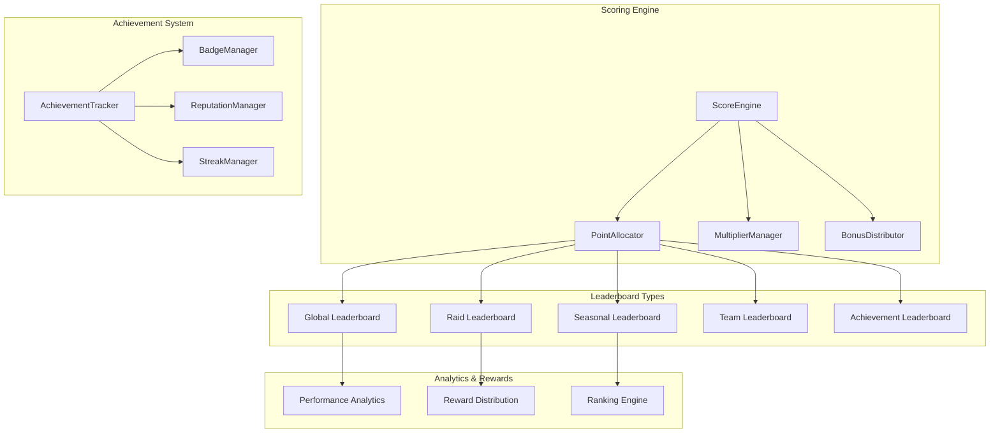

import { Tabs, TabItem } from '@astrojs/starlight/components';

NUBI's leaderboard system transforms raid participation into an engaging competitive experience through dynamic scoring, seasonal competitions, and multi-dimensional achievement tracking.

## Leaderboard Architecture

The gamification system operates through multiple interconnected scoring engines that create comprehensive competition frameworks:



## Core Scoring System

### LeaderboardService

The central service managing all leaderboard operations:

<Tabs>
  <TabItem label="Main Service">
```typescript
interface LeaderboardService {
  // Score management
  updateScore(userId: string, scoreData: ScoreUpdate): Promise<void>
  calculateRaidScore(raidParticipation: RaidParticipation): Promise<number>
  adjustScoreForQuality(baseScore: number, qualityMetrics: QualityMetrics): Promise<number>
  
  // Leaderboard queries
  getGlobalLeaderboard(options: LeaderboardOptions): Promise<LeaderboardEntry[]>
  getRaidLeaderboard(raidId: string): Promise<RaidLeaderboardEntry[]>
  getSeasonalLeaderboard(season: string): Promise<SeasonalEntry[]>
  getUserRanking(userId: string): Promise<UserRankingDetails>
  
  // Achievement tracking
  processAchievements(userId: string, activity: ActivityData): Promise<Achievement[]>
  awardBadge(userId: string, badgeId: string): Promise<void>
  updateStreak(userId: string, activityType: string): Promise<StreakUpdate>
  
  // Competition management
  createSeason(seasonConfig: SeasonConfig): Promise<Season>
  createTournament(tournamentConfig: TournamentConfig): Promise<Tournament>
  calculateRewards(leaderboardType: string, timeframe: string): Promise<RewardDistribution>
}
```
  </TabItem>
  
  <TabItem label="Configuration">
```yaml
leaderboard_system:
  # Global settings
  update_frequency_seconds: 30
  cache_duration_minutes: 5
  max_entries_per_board: 1000
  
  # Scoring configuration
  scoring:
    base_engagement_points: 10
    quality_multiplier_range: [0.5, 2.0]
    timing_bonus_percentage: 20
    streak_bonus_cap: 100
    team_collaboration_bonus: 15
    
  # Achievement system
  achievements:
    enable_dynamic_achievements: true
    achievement_point_multiplier: 1.5
    badge_rarity_scoring: true
    reputation_decay_days: 30
  
  # Seasonal competition
  seasons:
    duration_days: 30
    overlap_days: 7
    reward_tiers: [100, 50, 25, 10, 5]
    decay_factor: 0.1
  
  # Real-time updates
  realtime:
    enable_websocket_updates: true
    update_threshold_points: 5
    broadcast_top_n: 50
```
  </TabItem>
  
  <TabItem label="Implementation">
```typescript
class LeaderboardService implements Service {
  constructor(
    private database: DatabaseConnectionManager,
    private scoreCalculator: ScoreCalculator,
    private achievementTracker: AchievementTracker,
    private realtimeUpdater: RealtimeUpdater
  ) {}
  
  async updateScore(userId: string, scoreData: ScoreUpdate): Promise<void> {
    // 1. Calculate base score
    const baseScore = await this.scoreCalculator.calculateBaseScore(scoreData)
    
    // 2. Apply quality multipliers
    const qualityAdjustedScore = await this.applyQualityMultipliers(
      baseScore,
      scoreData.qualityMetrics
    )
    
    // 3. Apply contextual bonuses
    const finalScore = await this.applyContextualBonuses(
      qualityAdjustedScore,
      scoreData
    )
    
    // 4. Update user score in database
    await this.updateUserScore(userId, finalScore, scoreData.context)
    
    // 5. Process achievements
    const newAchievements = await this.achievementTracker.processActivity(
      userId,
      scoreData
    )
    
    // 6. Update real-time leaderboards
    await this.updateRealtimeBoards(userId, finalScore, newAchievements)
    
    // 7. Check for ranking changes and broadcast
    await this.checkAndBroadcastRankingChanges(userId)
  }
  
  private async applyQualityMultipliers(
    baseScore: number,
    quality: QualityMetrics
  ): Promise<number> {
    let multiplier = 1.0
    
    // Content quality multiplier
    multiplier *= 0.5 + (quality.contentQuality * 1.5)
    
    // Authenticity multiplier
    multiplier *= 0.7 + (quality.authenticityScore * 0.6)
    
    // Engagement quality multiplier
    multiplier *= 0.8 + (quality.engagementValue * 0.4)
    
    // Timing quality multiplier
    if (quality.optimalTiming) {
      multiplier *= 1.2
    }
    
    // Cap multiplier range
    multiplier = Math.max(0.5, Math.min(2.0, multiplier))
    
    return Math.round(baseScore * multiplier)
  }
}
```
  </TabItem>
</Tabs>

### Dynamic Scoring Algorithm

Sophisticated multi-factor scoring that rewards quality participation:

```typescript
interface ScoreFactors {
  // Base engagement factors
  engagementType: EngagementType
  engagementValue: number
  targetValue: number
  
  // Quality factors
  contentQuality: number
  originalityScore: number
  relevanceScore: number
  authenticityScore: number
  
  // Timing factors
  responseTime: number
  optimalTiming: boolean
  raidPhaseBonus: number
  
  // Social factors
  networkEffect: number
  viralityPotential: number
  communityResonance: number
  
  // Performance factors
  consistencyScore: number
  streakMultiplier: number
  achievementBonus: number
}

class AdvancedScoreCalculator {
  async calculateComprehensiveScore(
    participation: RaidParticipation,
    context: RaidContext
  ): Promise<DetailedScore> {
    // 1. Calculate base score from engagement
    const baseScore = this.calculateBaseEngagementScore(participation)
    
    // 2. Apply quality multipliers
    const qualityScore = await this.applyQualityFactors(baseScore, participation)
    
    // 3. Apply timing bonuses
    const timingScore = this.applyTimingFactors(qualityScore, participation, context)
    
    // 4. Apply social amplification
    const socialScore = await this.applySocialFactors(timingScore, participation)
    
    // 5. Apply performance bonuses
    const performanceScore = await this.applyPerformanceFactors(
      socialScore,
      participation.userId
    )
    
    // 6. Apply contextual adjustments
    const contextualScore = this.applyContextualAdjustments(
      performanceScore,
      context
    )
    
    return {
      finalScore: contextualScore,
      breakdown: {
        base: baseScore,
        quality: qualityScore - baseScore,
        timing: timingScore - qualityScore,
        social: socialScore - timingScore,
        performance: performanceScore - socialScore,
        contextual: contextualScore - performanceScore
      },
      multipliers: this.getAppliedMultipliers(),
      bonuses: this.getAppliedBonuses()
    }
  }
  
  private async applySocialFactors(
    currentScore: number,
    participation: RaidParticipation
  ): Promise<number> {
    // Network effect calculation
    const networkBonus = await this.calculateNetworkEffect(participation.userId)
    
    // Virality potential
    const viralityBonus = await this.calculateViralityPotential(
      participation.content,
      participation.targetMetrics
    )
    
    // Community resonance
    const resonanceBonus = await this.calculateCommunityResonance(
      participation.content,
      participation.communityContext
    )
    
    const socialMultiplier = 1 + (
      (networkBonus + viralityBonus + resonanceBonus) / 100
    )
    
    return Math.round(currentScore * socialMultiplier)
  }
  
  private async calculateViralityPotential(
    content: string,
    targetMetrics: TargetMetrics
  ): Promise<number> {
    // Analyze content for viral characteristics
    const viralFactors = {
      emotionalTrigger: this.analyzeEmotionalTrigger(content),
      shareability: this.analyzeShareability(content),
      memePotential: this.analyzeMemePotential(content),
      controversyLevel: this.analyzeControversyLevel(content),
      timeliness: this.analyzeTimeliness(content, targetMetrics.trendingTopics)
    }
    
    // Weight factors based on platform and context
    return this.weightViralFactors(viralFactors, targetMetrics.platform)
  }
}
```

## Multi-Dimensional Leaderboards

### Global Leaderboard System

Comprehensive ranking across all activities and timeframes:

<Tabs>
  <TabItem label="Global Rankings">
```typescript
interface GlobalLeaderboard {
  // Overall rankings
  overallRanking: LeaderboardEntry[]
  weeklyRanking: LeaderboardEntry[]
  monthlyRanking: LeaderboardEntry[]
  
  // Specialized rankings
  qualityLeaders: QualityLeaderEntry[]
  consistencyLeaders: ConsistencyLeaderEntry[]
  innovationLeaders: InnovationLeaderEntry[]
  
  // Achievement-based rankings
  achievementLeaders: AchievementLeaderEntry[]
  badgeCollectors: BadgeCollectorEntry[]
  streakMasters: StreakMasterEntry[]
  
  // Community impact rankings
  influenceLeaders: InfluenceLeaderEntry[]
  mentoshipLeaders: MentorshipLeaderEntry[]
  collaborationLeaders: CollaborationLeaderEntry[]
}

class GlobalLeaderboardManager {
  async generateGlobalLeaderboard(): Promise<GlobalLeaderboard> {
    // Run parallel queries for different ranking types
    const [
      overall,
      specialized,
      achievements,
      communityImpact
    ] = await Promise.all([
      this.generateOverallRankings(),
      this.generateSpecializedRankings(),
      this.generateAchievementRankings(),
      this.generateCommunityImpactRankings()
    ])
    
    return {
      ...overall,
      ...specialized,
      ...achievements,
      ...communityImpact
    }
  }
  
  private async generateOverallRankings(): Promise<OverallRankings> {
    // Complex query combining multiple scoring factors
    const query = `
      WITH user_scores AS (
        SELECT 
          user_id,
          SUM(CASE 
            WHEN created_at >= NOW() - INTERVAL '7 days' 
            THEN score * 1.5 
            ELSE score 
          END) as weighted_score,
          COUNT(DISTINCT raid_id) as raids_participated,
          AVG(quality_score) as avg_quality,
          MAX(streak_length) as max_streak,
          SUM(achievement_points) as total_achievement_points
        FROM user_scores 
        WHERE created_at >= NOW() - INTERVAL '30 days'
        GROUP BY user_id
        HAVING COUNT(*) >= 5  -- Minimum activity requirement
      ),
      ranked_users AS (
        SELECT 
          *,
          ROW_NUMBER() OVER (ORDER BY weighted_score DESC) as global_rank,
          PERCENT_RANK() OVER (ORDER BY weighted_score DESC) as percentile
        FROM user_scores
      )
      SELECT * FROM ranked_users 
      WHERE global_rank <= 1000
      ORDER BY weighted_score DESC
    `
    
    const results = await this.database.query(query)
    return this.formatLeaderboardResults(results)
  }
}
```
  </TabItem>
  
  <TabItem label="Raid-Specific">
```typescript
interface RaidLeaderboard {
  raidId: string
  participants: RaidParticipant[]
  mvpParticipant: RaidParticipant
  topPerformers: RaidParticipant[]
  
  // Performance categories
  fastestResponders: RaidParticipant[]
  highestQuality: RaidParticipant[]
  mostEngagement: RaidParticipant[]
  bestTeamPlayers: RaidParticipant[]
  
  // Raid statistics
  totalParticipants: number
  averageScore: number
  raidEffectiveness: number
  communityImpact: number
}

class RaidLeaderboardManager {
  async generateRaidLeaderboard(raidId: string): Promise<RaidLeaderboard> {
    // Get all raid participants with detailed metrics
    const participants = await this.getRaidParticipants(raidId)
    
    // Calculate comprehensive raid metrics
    const raidMetrics = await this.calculateRaidMetrics(raidId, participants)
    
    // Generate category-specific rankings
    const categoryRankings = this.generateCategoryRankings(participants)
    
    // Identify MVP based on overall contribution
    const mvp = this.identifyMVP(participants, raidMetrics)
    
    return {
      raidId,
      participants: participants.sort((a, b) => b.totalScore - a.totalScore),
      mvpParticipant: mvp,
      topPerformers: participants.slice(0, 10),
      fastestResponders: categoryRankings.fastest,
      highestQuality: categoryRankings.quality,
      mostEngagement: categoryRankings.engagement,
      bestTeamPlayers: categoryRankings.teamwork,
      totalParticipants: participants.length,
      averageScore: raidMetrics.averageScore,
      raidEffectiveness: raidMetrics.effectiveness,
      communityImpact: raidMetrics.communityImpact
    }
  }
  
  private identifyMVP(
    participants: RaidParticipant[], 
    metrics: RaidMetrics
  ): RaidParticipant {
    // Complex MVP calculation considering multiple factors
    const mvpScores = participants.map(participant => {
      const mvpScore = (
        participant.totalScore * 0.4 +                    // Raw performance
        participant.qualityScore * 0.25 +                 // Quality contribution
        participant.teamCollaboration * 0.15 +            // Team collaboration
        participant.leadershipMoments * 0.1 +             // Leadership moments
        participant.innovativeContributions * 0.1         // Innovation
      ) * (1 + participant.consistencyBonus)               // Consistency multiplier
      
      return {
        participant,
        mvpScore,
        breakdown: {
          performance: participant.totalScore * 0.4,
          quality: participant.qualityScore * 0.25,
          collaboration: participant.teamCollaboration * 0.15,
          leadership: participant.leadershipMoments * 0.1,
          innovation: participant.innovativeContributions * 0.1,
          consistency: participant.consistencyBonus
        }
      }
    })
    
    return mvpScores.sort((a, b) => b.mvpScore - a.mvpScore)[0].participant
  }
}
```
  </TabItem>
  
  <TabItem label="Seasonal Competitions">
```typescript
interface SeasonalCompetition {
  seasonId: string
  startDate: Date
  endDate: Date
  theme: string
  
  // Competition structure
  divisions: Division[]
  tournaments: Tournament[]
  specialEvents: SpecialEvent[]
  
  // Rewards system
  rewardTiers: RewardTier[]
  seasonalAchievements: SeasonalAchievement[]
  exclusiveRewards: ExclusiveReward[]
}

class SeasonalCompetitionManager {
  async createSeason(config: SeasonConfig): Promise<SeasonalCompetition> {
    // Create season structure
    const season = await this.database.transaction(async (tx) => {
      // Create base season
      const seasonData = await tx.query(`
        INSERT INTO seasons (theme, start_date, end_date, config)
        VALUES ($1, $2, $3, $4)
        RETURNING *
      `, [config.theme, config.startDate, config.endDate, config])
      
      // Create divisions based on user skill levels
      const divisions = await this.createDivisions(tx, seasonData.id, config)
      
      // Schedule tournaments throughout season
      const tournaments = await this.scheduleTournaments(tx, seasonData.id, config)
      
      // Create seasonal achievements
      const achievements = await this.createSeasonalAchievements(
        tx, 
        seasonData.id, 
        config
      )
      
      return {
        ...seasonData,
        divisions,
        tournaments,
        seasonalAchievements: achievements
      }
    })
    
    // Initialize real-time tracking
    await this.initializeSeasonalTracking(season.id)
    
    return season
  }
  
  private async createDivisions(
    tx: DatabaseTransaction,
    seasonId: string,
    config: SeasonConfig
  ): Promise<Division[]> {
    // Analyze user performance to create balanced divisions
    const userStats = await this.getUserPerformanceStats()
    const divisionBreakpoints = this.calculateDivisionBreakpoints(userStats)
    
    const divisions = []
    for (let i = 0; i < config.divisionCount; i++) {
      const division = await tx.query(`
        INSERT INTO divisions (season_id, name, min_score, max_score, tier)
        VALUES ($1, $2, $3, $4, $5)
        RETURNING *
      `, [
        seasonId,
        config.divisionNames[i],
        divisionBreakpoints[i].min,
        divisionBreakpoints[i].max,
        i + 1
      ])
      
      divisions.push(division)
    }
    
    return divisions
  }
  
  async processSeasonalRewards(seasonId: string): Promise<RewardDistribution> {
    // Get final season standings
    const standings = await this.getFinalStandings(seasonId)
    
    // Calculate rewards based on performance tiers
    const rewards = await this.calculateSeasonalRewards(standings)
    
    // Distribute rewards
    const distribution = await this.distributeRewards(rewards)
    
    // Generate season summary report
    await this.generateSeasonSummary(seasonId, standings, distribution)
    
    return distribution
  }
}
```
  </TabItem>
</Tabs>

## Achievement System

### Dynamic Achievement Tracking

Comprehensive achievement system that adapts to user behavior:

```typescript
interface Achievement {
  id: string
  name: string
  description: string
  category: AchievementCategory
  difficulty: 'bronze' | 'silver' | 'gold' | 'platinum' | 'legendary'
  
  // Requirements
  requirements: AchievementRequirement[]
  pointValue: number
  badgeReward?: BadgeReward
  
  // Progress tracking
  progress: AchievementProgress
  unlockDate?: Date
  rarity: number // Percentage of users who have unlocked
}

class DynamicAchievementSystem {
  private achievementTemplates: Map<string, AchievementTemplate> = new Map()
  private userProgressCache: Map<string, UserProgress> = new Map()
  
  async initializeAchievements(): Promise<void> {
    // Load base achievement templates
    await this.loadBaseAchievements()
    
    // Generate dynamic achievements based on community behavior
    await this.generateDynamicAchievements()
    
    // Initialize tracking for all users
    await this.initializeUserTracking()
  }
  
  private async generateDynamicAchievements(): Promise<void> {
    // Analyze community patterns to create relevant achievements
    const communityPatterns = await this.analyzeCommunityPatterns()
    
    for (const pattern of communityPatterns) {
      if (pattern.significance > 0.7) {
        const achievement = this.createAchievementFromPattern(pattern)
        await this.registerDynamicAchievement(achievement)
      }
    }
  }
  
  async trackUserActivity(userId: string, activity: ActivityData): Promise<Achievement[]> {
    // Get user's current progress
    const userProgress = await this.getUserProgress(userId)
    
    // Check all applicable achievements
    const applicableAchievements = await this.getApplicableAchievements(
      activity,
      userProgress
    )
    
    const unlockedAchievements: Achievement[] = []
    
    for (const achievement of applicableAchievements) {
      // Update progress
      const newProgress = await this.updateAchievementProgress(
        userId,
        achievement.id,
        activity
      )
      
      // Check if achievement is now unlocked
      if (this.isAchievementUnlocked(newProgress)) {
        const unlockedAchievement = await this.unlockAchievement(
          userId,
          achievement.id
        )
        unlockedAchievements.push(unlockedAchievement)
        
        // Trigger unlock celebration
        await this.triggerAchievementCelebration(userId, unlockedAchievement)
      }
    }
    
    return unlockedAchievements
  }
}
```

### Specialized Achievement Categories

<Tabs>
  <TabItem label="Performance Achievements">
```typescript
const PERFORMANCE_ACHIEVEMENTS = {
  // Score-based achievements
  SCORE_MILESTONES: {
    FIRST_HUNDRED: { threshold: 100, points: 50 },
    THOUSAND_CLUB: { threshold: 1000, points: 200 },
    TEN_THOUSAND: { threshold: 10000, points: 500 },
    SCORE_LEGEND: { threshold: 50000, points: 1000 }
  },
  
  // Streak achievements
  STREAK_MASTERS: {
    CONSISTENT_RAIDER: { streakDays: 7, points: 100 },
    DEDICATION: { streakDays: 30, points: 300 },
    UNSTOPPABLE: { streakDays: 100, points: 750 },
    LEGENDARY_STREAK: { streakDays: 365, points: 2000 }
  },
  
  // Quality achievements
  QUALITY_EXCELLENCE: {
    QUALITY_CONTRIBUTOR: { averageQuality: 0.8, minRaids: 50 },
    EXCELLENCE_STANDARD: { averageQuality: 0.9, minRaids: 100 },
    PERFECTION_SEEKER: { perfectScores: 25 },
    QUALITY_LEGEND: { perfectScores: 100, averageQuality: 0.95 }
  }
}

class PerformanceAchievementTracker {
  async checkPerformanceAchievements(
    userId: string,
    newScore: number,
    qualityScore: number
  ): Promise<Achievement[]> {
    const unlockedAchievements: Achievement[] = []
    
    // Check score milestones
    const totalScore = await this.getUserTotalScore(userId)
    const scoreMilestone = this.checkScoreMilestone(totalScore)
    if (scoreMilestone) {
      unlockedAchievements.push(scoreMilestone)
    }
    
    // Check quality achievements
    const qualityStats = await this.getUserQualityStats(userId)
    const qualityAchievement = this.checkQualityAchievement(qualityStats)
    if (qualityAchievement) {
      unlockedAchievements.push(qualityAchievement)
    }
    
    // Check streak achievements
    const currentStreak = await this.getUserStreak(userId)
    const streakAchievement = this.checkStreakAchievement(currentStreak)
    if (streakAchievement) {
      unlockedAchievements.push(streakAchievement)
    }
    
    return unlockedAchievements
  }
}
```
  </TabItem>
  
  <TabItem label="Social Achievements">
```typescript
const SOCIAL_ACHIEVEMENTS = {
  // Community building
  COMMUNITY_BUILDER: {
    WELCOMER: { newUsersHelped: 10, points: 150 },
    MENTOR: { newUsersHelped: 50, points: 400 },
    COMMUNITY_PILLAR: { newUsersHelped: 200, points: 1000 }
  },
  
  // Collaboration
  TEAM_PLAYER: {
    COLLABORATOR: { teamRaids: 25, points: 200 },
    TEAM_CAPTAIN: { leadershipMoments: 10, points: 300 },
    SYNERGY_MASTER: { collaborationScore: 0.9, teamRaids: 100 }
  },
  
  // Innovation
  INNOVATION_LEADER: {
    CREATIVE_CONTRIBUTOR: { uniqueStrategies: 5, points: 250 },
    TRENDSETTER: { strategiesCopied: 25, points: 500 },
    INNOVATION_GENIUS: { gameChangingStrategies: 3, points: 1000 }
  }
}
```
  </TabItem>
  
  <TabItem label="Special Event Achievements">
```typescript
const EVENT_ACHIEVEMENTS = {
  // Seasonal events
  SEASONAL_CHAMPIONS: {
    SPRING_WARRIOR: { seasonWins: 1, season: 'spring' },
    SUMMER_LEGEND: { seasonRank: 'top-10', season: 'summer' },
    AUTUMN_MASTER: { seasonPoints: 5000, season: 'autumn' },
    WINTER_CHAMPION: { seasonMVP: true, season: 'winter' }
  },
  
  // Tournament achievements
  TOURNAMENT_GLORY: {
    TOURNAMENT_PARTICIPANT: { tournamentsJoined: 1 },
    SEMI_FINALIST: { tournamentReached: 'semifinals' },
    FINALIST: { tournamentReached: 'finals' },
    TOURNAMENT_CHAMPION: { tournamentsWon: 1 },
    MULTI_CHAMPION: { tournamentsWon: 5 }
  },
  
  // Special raids
  SPECIAL_OPERATIONS: {
    NIGHT_RAIDER: { nightRaids: 10 },
    WEEKEND_WARRIOR: { weekendRaids: 25 },
    PRIME_TIME_PLAYER: { primeTimeRaids: 50 },
    GLOBAL_COORDINATOR: { multiPlatformRaids: 15 }
  }
}
```
  </TabItem>
</Tabs>

## Real-Time Updates & Visualization

### Live Leaderboard Updates

WebSocket-powered real-time leaderboard updates:

```typescript
class RealtimeLeaderboardUpdater {
  private wsConnections: Map<string, WebSocketConnection> = new Map()
  private updateQueues: Map<string, UpdateQueue> = new Map()
  
  async broadcastLeaderboardUpdate(update: LeaderboardUpdate): Promise<void> {
    // Determine affected leaderboards
    const affectedBoards = this.determineAffectedLeaderboards(update)
    
    // Generate update messages for each board
    const updateMessages = await Promise.all(
      affectedBoards.map(board => this.generateUpdateMessage(board, update))
    )
    
    // Broadcast to all connected clients
    for (const message of updateMessages) {
      await this.broadcastToBoard(message.boardId, message.data)
    }
    
    // Update cached leaderboard data
    await this.updateLeaderboardCache(affectedBoards, update)
  }
  
  private async broadcastToBoard(boardId: string, data: UpdateData): Promise<void> {
    const subscribers = this.getSubscribers(boardId)
    
    const broadcastPromises = subscribers.map(async connection => {
      try {
        await connection.send({
          type: 'leaderboard_update',
          boardId,
          data,
          timestamp: Date.now()
        })
      } catch (error) {
        // Handle disconnected clients
        this.handleConnectionError(connection, error)
      }
    })
    
    await Promise.all(broadcastPromises)
  }
}
```

The leaderboard and gamification system creates a compelling competitive environment that motivates sustained participation while maintaining focus on quality and authentic community engagement, making raids both effective and enjoyable for all participants.