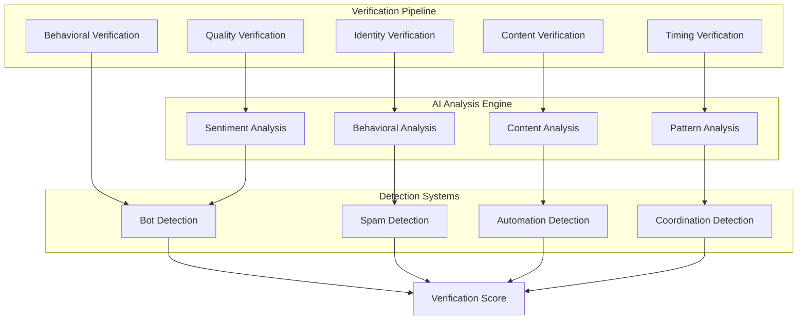

import { Tabs, TabItem } from "@astrojs/starlight/components";

NUBI's engagement verification system employs sophisticated AI-powered analysis to ensure authentic participation, detect bot behavior, and maintain high-quality community engagement during raids.

## Verification Architecture

The multi-layered verification system operates in real-time to validate every aspect of raid participation:



## Core Verification Components

### EngagementVerifier Service

The central verification service that orchestrates all validation processes:

<Tabs>
  <TabItem label="Main Interface">
```typescript
interface EngagementVerifier {
  // Real-time verification
  verifyEngagement(engagement: RaidEngagement): Promise<VerificationResult>
  batchVerifyEngagements(engagements: RaidEngagement[]): Promise<VerificationResult[]>
  
  // User verification
  verifyParticipant(userId: string, platform: string): Promise<UserVerificationResult>
  updateParticipantScore(userId: string, newScore: number): Promise<void>
  
  // Behavioral analysis
  analyzeEngagementPatterns(userId: string): Promise<BehavioralProfile>
  detectAnomalousActivity(engagement: RaidEngagement): Promise<AnomalyScore>
  
  // Quality assessment
  assessContentQuality(content: string): Promise<QualityScore>
  validateEngagementTiming(engagement: RaidEngagement): Promise<TimingScore>
  
  // Bot detection
  detectBotBehavior(userId: string): Promise<BotProbability>
  analyzeAutomationSignals(engagement: RaidEngagement): Promise<AutomationFlags>
}
```
  </TabItem>
  
  <TabItem label="Configuration">
```yaml
engagement_verification:
  # Scoring thresholds
  minimum_authenticity_score: 0.7
  minimum_quality_score: 0.6
  maximum_bot_probability: 0.3
  
  # Behavioral analysis
  behavioral_tracking:
    pattern_window_hours: 24
    min_historical_data: 10
    anomaly_threshold: 0.8
  
  # Content analysis
  content_analysis:
    sentiment_required: true
    originality_threshold: 0.5
    spam_detection: true
    language_validation: true
  
  # Bot detection
  bot_detection:
    response_time_analysis: true
    pattern_recognition: true
    metadata_analysis: true
    cross_platform_correlation: true
  
  # Real-time monitoring
  monitoring:
    verification_timeout_ms: 5000
    batch_size: 50
    retry_attempts: 3
```
  </TabItem>
  
  <TabItem label="Implementation">
```typescript
class EngagementVerifier implements Service {
  constructor(
    private aiService: AIAnalysisService,
    private database: DatabaseConnectionManager,
    private behaviorAnalyzer: BehaviorAnalyzer,
    private contentAnalyzer: ContentAnalyzer
  ) {}
  
  async verifyEngagement(engagement: RaidEngagement): Promise<VerificationResult> {
    // 1. Run parallel verification processes
    const [
      identityResult,
      behaviorResult,
      contentResult,
      timingResult,
      qualityResult
    ] = await Promise.all([
      this.verifyIdentity(engagement),
      this.verifyBehavior(engagement),
      this.verifyContent(engagement),
      this.verifyTiming(engagement),
      this.assessQuality(engagement)
    ])
    
    // 2. Calculate composite verification score
    const compositeScore = this.calculateCompositeScore({
      identity: identityResult,
      behavior: behaviorResult,
      content: contentResult,
      timing: timingResult,
      quality: qualityResult
    })
    
    // 3. Apply contextual adjustments
    const adjustedScore = await this.applyContextualAdjustments(
      compositeScore,
      engagement
    )
    
    // 4. Make final verification decision
    return {
      verified: adjustedScore.final >= this.config.minimum_authenticity_score,
      score: adjustedScore.final,
      confidence: adjustedScore.confidence,
      breakdown: adjustedScore.breakdown,
      flags: this.generateFlags(adjustedScore),
      recommendations: this.generateRecommendations(adjustedScore)
    }
  }
  
  private async verifyIdentity(engagement: RaidEngagement): Promise<IdentityScore> {
    // Cross-platform identity verification
    const identity = await this.identityService.resolveIdentity(
      engagement.userId,
      engagement.platform
    )
    
    return {
      accountAge: this.calculateAccountAgeScore(identity.accountCreated),
      platformActivity: await this.calculateActivityScore(identity),
      crossPlatformConsistency: await this.checkCrossPlatformConsistency(identity),
      verificationBadges: this.checkVerificationStatus(identity),
      reputation: await this.calculateReputationScore(identity)
    }
  }
}
```
  </TabItem>
</Tabs>

### Behavioral Analysis Engine

Advanced behavioral pattern analysis to detect authentic vs. automated engagement:

#### Pattern Recognition

```typescript
interface BehavioralProfile {
  // Timing patterns
  engagementTimingPattern: TimingPattern;
  responseTimeDistribution: TimeDistribution;
  activityPeakHours: number[];

  // Interaction patterns
  engagementTypes: EngagementTypeFrequency;
  contentInteractionStyle: InteractionStyle;
  platformUsagePattern: PlatformUsage;

  // Social patterns
  networkConnectivity: NetworkMetrics;
  communityParticipation: CommunityMetrics;
  influenceMetrics: InfluenceScore;

  // Authenticity indicators
  humanLikeVariation: VariationScore;
  naturalLanguageUse: LanguageNaturalness;
  contextualRelevance: RelevanceScore;
}

class BehavioralAnalyzer {
  async analyzeBehaviorPattern(userId: string): Promise<BehavioralProfile> {
    // Collect behavioral data over time window
    const behaviorData = await this.collectBehavioralData(userId, {
      windowHours: 24 * 7, // 7 days
      minDataPoints: 20,
    });

    // Analyze timing patterns
    const timingAnalysis = this.analyzeTimingPatterns(
      behaviorData.interactions,
    );

    // Analyze interaction patterns
    const interactionAnalysis = this.analyzeInteractionPatterns(behaviorData);

    // Analyze social patterns
    const socialAnalysis = await this.analyzeSocialPatterns(
      userId,
      behaviorData,
    );

    // Calculate authenticity indicators
    const authenticityScores = this.calculateAuthenticityScores(behaviorData);

    return {
      engagementTimingPattern: timingAnalysis.pattern,
      responseTimeDistribution: timingAnalysis.distribution,
      activityPeakHours: timingAnalysis.peakHours,
      engagementTypes: interactionAnalysis.types,
      contentInteractionStyle: interactionAnalysis.style,
      platformUsagePattern: interactionAnalysis.platformUsage,
      networkConnectivity: socialAnalysis.connectivity,
      communityParticipation: socialAnalysis.participation,
      influenceMetrics: socialAnalysis.influence,
      humanLikeVariation: authenticityScores.variation,
      naturalLanguageUse: authenticityScores.language,
      contextualRelevance: authenticityScores.relevance,
    };
  }

  private analyzeTimingPatterns(interactions: Interaction[]): TimingAnalysis {
    // Detect human-like timing variations
    const responseTimes = interactions.map((i) => i.responseTime);
    const timingVariation = this.calculateVariationScore(responseTimes);

    // Identify activity patterns
    const hourlyActivity = this.groupByHour(interactions);
    const peakHours = this.identifyPeakHours(hourlyActivity);

    // Check for automation signatures
    const automationSignals = this.detectAutomationTiming(responseTimes);

    return {
      pattern: this.classifyTimingPattern(timingVariation, automationSignals),
      distribution: this.createDistribution(responseTimes),
      peakHours,
      automationScore: automationSignals.score,
    };
  }
}
```

#### Anomaly Detection

The system uses machine learning to detect unusual patterns:

```typescript
class AnomalyDetector {
  private mlModel: AnomalyDetectionModel;

  async detectAnomalousActivity(
    engagement: RaidEngagement,
    userProfile: BehavioralProfile,
  ): Promise<AnomalyScore> {
    // Extract features for ML analysis
    const features = this.extractAnomalyFeatures(engagement, userProfile);

    // Run ML-based anomaly detection
    const mlScore = await this.mlModel.detectAnomalies(features);

    // Apply rule-based anomaly checks
    const ruleBasedScore = this.applyAnomalyRules(engagement, userProfile);

    // Combine scores with confidence weighting
    const combinedScore = this.combineAnomalyScores(mlScore, ruleBasedScore);

    return {
      anomalyProbability: combinedScore.probability,
      confidence: combinedScore.confidence,
      detectedAnomalies: combinedScore.anomalies,
      explanation: this.generateExplanation(combinedScore),
      severity: this.calculateSeverity(combinedScore),
    };
  }

  private extractAnomalyFeatures(
    engagement: RaidEngagement,
    profile: BehavioralProfile,
  ): AnomalyFeatures {
    return {
      // Timing anomalies
      responseTimeDeviation: this.calculateTimeDeviation(
        engagement.responseTime,
        profile.responseTimeDistribution,
      ),

      // Content anomalies
      contentSimilarityToProfile: this.calculateContentSimilarity(
        engagement.content,
        profile.contentInteractionStyle,
      ),

      // Behavioral anomalies
      engagementTypeDeviation: this.calculateEngagementDeviation(
        engagement.type,
        profile.engagementTypes,
      ),

      // Context anomalies
      contextualRelevance: this.calculateContextualFit(
        engagement,
        profile.contextualRelevance,
      ),
    };
  }
}
```

### Content Quality Assessment

Sophisticated content analysis to ensure meaningful engagement:

<Tabs>
  <TabItem label="Quality Metrics">
```typescript
interface ContentQuality {
  // Originality metrics
  originalityScore: number
  duplicateDetectionScore: number
  templateUsageScore: number
  
  // Relevance metrics
  contextualRelevance: number
  topicAlignment: number
  conversationalFit: number
  
  // Language quality
  grammarScore: number
  vocabularyRichness: number
  sentimentAppropriate: number
  
  // Engagement value
  discussionPotential: number
  informationalValue: number
  entertainmentValue: number
}

class ContentQualityAnalyzer {
async assessContentQuality(content: string): Promise<ContentQuality> {
// Run parallel quality assessments
const [
originalityAssessment,
relevanceAssessment,
languageAssessment,
valueAssessment
] = await Promise.all([
this.assessOriginality(content),
this.assessRelevance(content),
this.assessLanguageQuality(content),
this.assessEngagementValue(content)
])

    return {
      originalityScore: originalityAssessment.originality,
      duplicateDetectionScore: originalityAssessment.duplicateScore,
      templateUsageScore: originalityAssessment.templateScore,
      contextualRelevance: relevanceAssessment.contextual,
      topicAlignment: relevanceAssessment.topicAlignment,
      conversationalFit: relevanceAssessment.conversational,
      grammarScore: languageAssessment.grammar,
      vocabularyRichness: languageAssessment.vocabulary,
      sentimentAppropriate: languageAssessment.sentiment,
      discussionPotential: valueAssessment.discussion,
      informationalValue: valueAssessment.informational,
      entertainmentValue: valueAssessment.entertainment
    }

}
}

````
  </TabItem>

  <TabItem label="AI Analysis">
```typescript
class AIContentAnalyzer {
  async analyzeContentWithAI(content: string): Promise<AIContentAnalysis> {
    // Use multiple AI models for comprehensive analysis
    const [
      sentimentAnalysis,
      topicAnalysis,
      qualityAnalysis,
      authenticityAnalysis
    ] = await Promise.all([
      this.analyzeSentiment(content),
      this.analyzeTopics(content),
      this.analyzeQuality(content),
      this.analyzeAuthenticity(content)
    ])

    return {
      sentiment: sentimentAnalysis,
      topics: topicAnalysis.topics,
      topicConfidence: topicAnalysis.confidence,
      qualityScore: qualityAnalysis.overall,
      qualityBreakdown: qualityAnalysis.breakdown,
      authenticityScore: authenticityAnalysis.score,
      aiGeneratedProbability: authenticityAnalysis.aiProbability,
      humanLikeFeatures: authenticityAnalysis.humanFeatures
    }
  }

  private async analyzeAuthenticity(content: string): Promise<AuthenticityAnalysis> {
    // Detect AI-generated content
    const aiDetectionScore = await this.aiDetectionModel.predict(content)

    // Analyze human-like features
    const humanFeatures = {
      typos: this.countTypos(content),
      casualLanguage: this.detectCasualLanguage(content),
      personalTouches: this.detectPersonalTouches(content),
      emotionalExpression: this.detectEmotionalExpression(content),
      colloquialisms: this.detectColloquialisms(content)
    }

    // Calculate overall authenticity
    const authenticityScore = this.calculateAuthenticityScore(
      aiDetectionScore,
      humanFeatures
    )

    return {
      score: authenticityScore,
      aiProbability: aiDetectionScore,
      humanFeatures,
      confidence: this.calculateConfidence(aiDetectionScore, humanFeatures)
    }
  }
}
````

  </TabItem>
  
  <TabItem label="Spam Detection">
```typescript
class SpamDetector {
  async detectSpam(content: string, context: EngagementContext): Promise<SpamScore> {
    // Multiple spam detection approaches
    const [
      keywordBasedScore,
      patternBasedScore,
      contextBasedScore,
      behavioralScore
    ] = await Promise.all([
      this.checkSpamKeywords(content),
      this.checkSpamPatterns(content),
      this.checkContextualSpam(content, context),
      this.checkBehavioralSpam(context.userId)
    ])
    
    // Combine scores with weighted average
    const combinedScore = this.combineSpamScores({
      keyword: keywordBasedScore,
      pattern: patternBasedScore,
      contextual: contextBasedScore,
      behavioral: behavioralScore
    })
    
    return {
      isSpam: combinedScore.score > this.config.spamThreshold,
      spamScore: combinedScore.score,
      confidence: combinedScore.confidence,
      detectedTypes: combinedScore.types,
      explanation: this.generateSpamExplanation(combinedScore)
    }
  }
  
  private checkSpamPatterns(content: string): PatternSpamScore {
    const patterns = [
      // Excessive repetition
      this.checkExcessiveRepetition(content),
      
      // Promotional language
      this.checkPromotionalLanguage(content),
      
      // Generic responses
      this.checkGenericResponses(content),
      
      // Link spam
      this.checkLinkSpam(content),
      
      // Emoji spam
      this.checkEmojiSpam(content)
    ]
    
    return this.aggregatePatternScores(patterns)
  }
}
```
  </TabItem>
</Tabs>

## Bot Detection System

### Advanced Bot Detection

Multi-layered approach to identify automated accounts and behavior:

```typescript
class BotDetector {
  async detectBotBehavior(userId: string): Promise<BotDetectionResult> {
    // Collect comprehensive user data
    const userData = await this.collectUserData(userId);

    // Run parallel bot detection algorithms
    const [
      profileAnalysis,
      behaviorAnalysis,
      networkAnalysis,
      contentAnalysis,
      timingAnalysis,
    ] = await Promise.all([
      this.analyzeProfile(userData.profile),
      this.analyzeBehavior(userData.interactions),
      this.analyzeNetwork(userData.connections),
      this.analyzeContent(userData.content),
      this.analyzeTiming(userData.timestamps),
    ]);

    // Machine learning bot classification
    const mlPrediction = await this.mlBotClassifier.predict({
      profile: profileAnalysis,
      behavior: behaviorAnalysis,
      network: networkAnalysis,
      content: contentAnalysis,
      timing: timingAnalysis,
    });

    // Combine rule-based and ML approaches
    const finalScore = this.combineBotScores({
      ml: mlPrediction,
      profile: profileAnalysis.botScore,
      behavior: behaviorAnalysis.botScore,
      network: networkAnalysis.botScore,
      content: contentAnalysis.botScore,
      timing: timingAnalysis.botScore,
    });

    return {
      botProbability: finalScore.probability,
      confidence: finalScore.confidence,
      botType: finalScore.detectedBotType,
      evidence: finalScore.evidence,
      recommendation: this.generateBotRecommendation(finalScore),
    };
  }

  private analyzeProfile(profile: UserProfile): ProfileBotAnalysis {
    return {
      // Account characteristics
      suspiciousAccountAge: this.checkSuspiciousAge(profile.createdAt),
      genericProfilePicture: this.checkGenericAvatar(profile.avatar),
      incompleteProfile: this.checkProfileCompleteness(profile),

      // Username patterns
      generatedUsernamePattern: this.checkGeneratedUsername(profile.username),
      numberSuffixPattern: this.checkNumberSuffix(profile.username),

      // Bio analysis
      genericBio: this.checkGenericBio(profile.bio),
      promotionalBio: this.checkPromotionalBio(profile.bio),

      // Verification status
      lackOfVerification: this.checkVerificationStatus(profile),

      botScore: 0, // Calculated from above factors
    };
  }
}
```

### Real-Time Verification Pipeline

Continuous verification during raid execution:

```typescript
class RealTimeVerificationPipeline {
  private verificationQueue: VerificationQueue;
  private activeVerifications: Map<string, VerificationProcess> = new Map();

  async processEngagementStream(
    engagementStream: AsyncIterable<RaidEngagement>,
  ): Promise<void> {
    for await (const engagement of engagementStream) {
      // Queue engagement for verification
      await this.verificationQueue.enqueue({
        engagement,
        priority: this.calculateVerificationPriority(engagement),
        timestamp: Date.now(),
      });

      // Process verifications in parallel
      this.processVerificationBatch();
    }
  }

  private async processVerificationBatch(): Promise<void> {
    const batch = await this.verificationQueue.dequeueBatch(
      this.config.batchSize,
    );

    const verificationPromises = batch.map(async (item) => {
      const verificationId = `${item.engagement.userId}-${Date.now()}`;

      try {
        // Start verification process
        const process = this.startVerificationProcess(
          verificationId,
          item.engagement,
        );
        this.activeVerifications.set(verificationId, process);

        // Run verification
        const result = await this.verifyEngagement(item.engagement);

        // Handle result
        await this.handleVerificationResult(item.engagement, result);

        return result;
      } catch (error) {
        logger.error(`Verification failed for ${verificationId}:`, error);
        return this.createFailureResult(item.engagement, error);
      } finally {
        // Clean up
        this.activeVerifications.delete(verificationId);
      }
    });

    await Promise.all(verificationPromises);
  }

  private calculateVerificationPriority(engagement: RaidEngagement): number {
    let priority = 1.0;

    // Higher priority for suspicious patterns
    if (engagement.responseTime < 1000) priority += 0.5;
    if (engagement.content.length < 10) priority += 0.3;

    // Higher priority for high-value targets
    if (engagement.targetValue > 1000) priority += 0.2;

    // Higher priority for new users
    if (engagement.userAccountAge < 30) priority += 0.4;

    return Math.min(priority, 2.0); // Cap at 2.0
  }
}
```

## Quality Assurance

### Continuous Learning System

The verification system continuously improves through feedback loops:

```typescript
class VerificationLearningSystem {
  async updateVerificationModels(
    verificationResults: VerificationResult[],
    actualOutcomes: OutcomeData[],
  ): Promise<void> {
    // Analyze verification accuracy
    const accuracyMetrics = this.analyzeAccuracy(
      verificationResults,
      actualOutcomes,
    );

    // Identify improvement opportunities
    const improvements = this.identifyImprovements(accuracyMetrics);

    // Update ML models
    if (improvements.mlModelUpdate) {
      await this.updateMLModels(improvements.trainingData);
    }

    // Update rule-based systems
    if (improvements.ruleUpdates) {
      await this.updateVerificationRules(improvements.ruleUpdates);
    }

    // Update thresholds
    if (improvements.thresholdAdjustments) {
      await this.updateThresholds(improvements.thresholdAdjustments);
    }
  }
}
```

The engagement verification system represents the quality backbone of NUBI's raid operations, ensuring that every interaction maintains the authentic community engagement that makes raids effective while preventing abuse and maintaining platform relationships.
