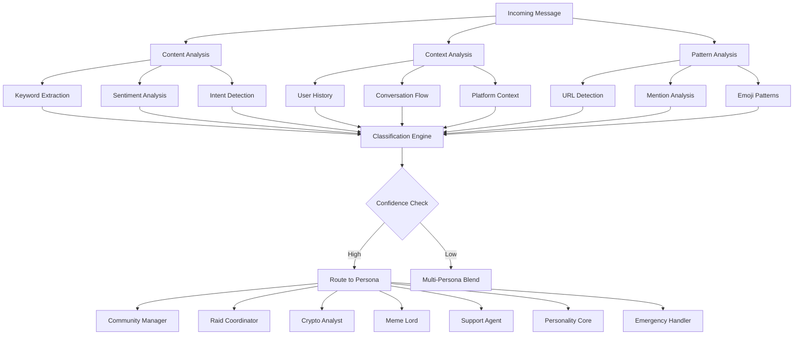

import {
  Card,
  CardGrid,
  Aside,
  Code,
  Tabs,
  TabItem,
} from "@astrojs/starlight/components";

# Message Classification System

NUBI's **Layer 2 processing** implements an advanced message classification system that intelligently routes messages to specialized AI personas. This system analyzes content, context, and user patterns to provide the most appropriate response type.

## 🧠 Classification Architecture

The classification system operates through multiple analysis stages to ensure accurate persona routing:



## 🎯 Seven Specialized Personas

NUBI's classification system routes messages to seven distinct personas, each optimized for specific interaction types:

<div class="persona-showcase">
  <div class="persona-grid">
    <div class="persona-item community-manager">
      <div class="persona-header">
        <span class="persona-emoji">🤝</span>
        <h3>Community Manager</h3>
      </div>
      <div class="persona-details">
        <p>
          <strong>Purpose:</strong> Default mode for general conversation, user
          onboarding, and relationship building
        </p>
        <p>
          <strong>Triggers:</strong> Greetings, questions, general chat, new
          user detection
        </p>
        <p>
          <strong>Characteristics:</strong> Welcoming, helpful, engaging, builds
          connections
        </p>
      </div>
    </div>

    <div class="persona-item raid-coordinator">
      <div class="persona-header">
        <span class="persona-emoji">🚀</span>
        <h3>Raid Coordinator</h3>
      </div>
      <div class="persona-details">
        <p>
          <strong>Purpose:</strong> Organizes engagement campaigns with
          strategic precision
        </p>
        <p>
          <strong>Triggers:</strong> URLs (Twitter, X), "raid", "engage",
          "attack", "coordinate"
        </p>
        <p>
          <strong>Characteristics:</strong> Strategic, commanding,
          results-focused, tactical
        </p>
      </div>
    </div>

    <div class="persona-item crypto-analyst">
      <div class="persona-header">
        <span class="persona-emoji">📈</span>
        <h3>Crypto Analyst</h3>
      </div>
      <div class="persona-details">
        <p>
          <strong>Purpose:</strong> Market oracle with cosmic intuition for
          portfolio analysis
        </p>
        <p>
          <strong>Triggers:</strong> Token names, prices, "analysis", amounts,
          market terms
        </p>
        <p>
          <strong>Characteristics:</strong> Analytical, insightful, data-driven,
          forward-looking
        </p>
      </div>
    </div>

    <div class="persona-item meme-lord">
      <div class="persona-header">
        <span class="persona-emoji">😂</span>
        <h3>Meme Lord</h3>
      </div>
      <div class="persona-details">
        <p>
          <strong>Purpose:</strong> Peak humor mode, roasts bad takes
          constructively
        </p>
        <p>
          <strong>Triggers:</strong> Emojis, "lol", "based", humor keywords,
          meme references
        </p>
        <p>
          <strong>Characteristics:</strong> Witty, playful, culturally aware,
          entertaining
        </p>
      </div>
    </div>

    <div class="persona-item support-agent">
      <div class="persona-header">
        <span class="persona-emoji">🛠️</span>
        <h3>Support Agent</h3>
      </div>
      <div class="persona-details">
        <p>
          <strong>Purpose:</strong> Patient problem solver with deep technical
          knowledge
        </p>
        <p>
          <strong>Triggers:</strong> "help", "support", "problem", "how to",
          "error", technical terms
        </p>
        <p>
          <strong>Characteristics:</strong> Patient, knowledgeable,
          solution-focused, clear
        </p>
      </div>
    </div>

    <div class="persona-item personality-core">
      <div class="persona-header">
        <span class="persona-emoji">🔮</span>
        <h3>Personality Core</h3>
      </div>
      <div class="persona-details">
        <p>
          <strong>Purpose:</strong> Ancient consciousness sharing profound
          cosmic insights
        </p>
        <p>
          <strong>Triggers:</strong> "wisdom", "ancient", "spirit", philosophy,
          deep questions
        </p>
        <p>
          <strong>Characteristics:</strong> Mystical, profound, ancient,
          philosophical
        </p>
      </div>
    </div>

    <div class="persona-item emergency-handler">
      <div class="persona-header">
        <span class="persona-emoji">🚨</span>
        <h3>Emergency Handler</h3>
      </div>
      <div class="persona-details">
        <p>
          <strong>Purpose:</strong> Protection mode when community is threatened
        </p>
        <p>
          <strong>Triggers:</strong> "hack", "scam", "emergency", threats,
          security alerts
        </p>
        <p>
          <strong>Characteristics:</strong> Protective, authoritative, decisive,
          alert
        </p>
      </div>
    </div>

  </div>
</div>

## 🔍 Classification Algorithm

The classification system uses a multi-stage analysis process with confidence scoring:

<Tabs>
  <TabItem label="Core Classification">
```typescript
export interface MessageClassification {
  intent: string;
  selectedPrompt: PromptType;
  confidenceScore: number;
  reasoning: string;
  variables: ExtractedVariables;
  fallbackOptions?: PromptType[];
}

export class MessageClassifier {
  private patterns = new Map<PromptType, ClassificationPattern>();
  private modelCache = new LRUCache<string, ClassificationResult>({ max: 1000 });
  
  constructor() {
    this.initializePatterns();
  }
  
  async classifyMessage(
    message: string,
    userId: string,
    platform: string,
    traceId: string,
    context?: ClassificationContext
  ): Promise<MessageClassification> {
    // Check cache first
    const cacheKey = this.generateCacheKey(message, userId, platform);
    const cached = this.modelCache.get(cacheKey);
    
    if (cached && cached.timestamp > Date.now() - 300000) { // 5 minute cache
      return cached.classification;
    }
    
    // Extract message variables
    const variables = await this.extractVariables(message);
    
    // Apply classification rules in priority order
    const classification = await this.performClassification(
      message,
      variables,
      context
    );
    
    // Validate and adjust confidence
    const finalClassification = await this.validateClassification(
      classification,
      context
    );
    
    // Cache result
    this.modelCache.set(cacheKey, {
      classification: finalClassification,
      timestamp: Date.now()
    });
    
    // Log analytics
    await this.logClassificationEvent({
      traceId,
      userId,
      platform,
      message: this.sanitizeForLogging(message),
      classification: finalClassification
    });
    
    return finalClassification;
  }
  
  private async performClassification(
    message: string,
    variables: ExtractedVariables,
    context?: ClassificationContext
  ): Promise<MessageClassification> {
    const lowerMessage = message.toLowerCase();
    
    // Emergency handler (highest priority)
    if (this.isEmergency(message, variables)) {
      return {
        intent: "emergency_response",
        selectedPrompt: "emergency-handler",
        confidenceScore: 0.95,
        reasoning: "Emergency keywords detected",
        variables,
        fallbackOptions: ["community-manager"]
      };
    }
    
    // Raid coordinator (high priority)
    if (this.isRaidRelated(message, variables)) {
      const confidence = this.calculateRaidConfidence(variables);
      return {
        intent: "raid_coordination",
        selectedPrompt: "raid-coordinator", 
        confidenceScore: confidence,
        reasoning: "Raid-related content detected",
        variables,
        fallbackOptions: confidence < 0.8 ? ["community-manager"] : []
      };
    }
    
    // Crypto analyst
    if (this.isCryptoRelated(message, variables)) {
      return {
        intent: "crypto_analysis",
        selectedPrompt: "crypto-analyst",
        confidenceScore: this.calculateCryptoConfidence(variables),
        reasoning: "Crypto/market content detected",
        variables,
        fallbackOptions: ["community-manager"]
      };
    }
    
    // Meme lord
    if (this.isMemeContent(message, variables)) {
      return {
        intent: "humor_engagement",
        selectedPrompt: "meme-lord",
        confidenceScore: this.calculateHumorConfidence(variables),
        reasoning: "Humorous content detected",
        variables,
        fallbackOptions: ["community-manager"]
      };
    }
    
    // Support agent
    if (this.isSupportRequest(message, variables)) {
      return {
        intent: "support_assistance",
        selectedPrompt: "support-agent",
        confidenceScore: this.calculateSupportConfidence(variables),
        reasoning: "Support request detected",
        variables,
        fallbackOptions: ["community-manager"]
      };
    }
    
    // Personality core
    if (this.isPhilosophicalContent(message, variables)) {
      return {
        intent: "wisdom_sharing",
        selectedPrompt: "personality-core",
        confidenceScore: this.calculateWisdomConfidence(variables),
        reasoning: "Philosophical/wisdom content detected",
        variables,
        fallbackOptions: ["community-manager"]
      };
    }
    
    // Default: Community manager
    return {
      intent: "general_conversation",
      selectedPrompt: "community-manager",
      confidenceScore: 0.6,
      reasoning: "General conversation (default)",
      variables,
      fallbackOptions: []
    };
  }
}
```
  </TabItem>

  <TabItem label="Variable Extraction">
```typescript
export interface ExtractedVariables {
  mentions: string[];      // @usernames
  cryptoTokens: string[];  // SOL, BTC, ETH, etc.
  amounts: string[];       // $100, 50 SOL, etc.
  urls: string[];          // https:// links
  usernames: string[];     // mentioned users
  keywords: string[];      // classified keywords
  sentiment: "positive" | "negative" | "neutral";
  urgency: "low" | "medium" | "high";
  context: string;         // key context phrases
  emojis: string[];        // extracted emojis
  platformSpecific: Record<string, any>; // platform-specific data
}

export class VariableExtractor {
  private patterns = {
    mentions: /@(\w+)/g,
    cryptoTokens: /\b(SOL|BTC|ETH|USDC|BONK|JUP|NUBI|WIF|PEPE|DOGE)\b/gi,
    amounts: /(\$|USD|SOL|BTC|ETH)\s*([\d,]+(?:\.\d+)?)/gi,
    urls: /(https?:\/\/[^\s]+)/g,
    emojis: /[\u{1F600}-\u{1F64F}]|[\u{1F300}-\u{1F5FF}]|[\u{1F680}-\u{1F6FF}]|[\u{1F1E0}-\u{1F1FF}]|[\u{2600}-\u{26FF}]|[\u{2700}-\u{27BF}]/gu,
    usernames: /(?:@(\w+)|user:(\w+))/gi
  };
  
  private keywordCategories = {
    raid: ['raid', 'attack', 'engage', 'coordinate', 'strategy', 'campaign'],
    crypto: ['price', 'market', 'analysis', 'trading', 'portfolio', 'chart', 'pump', 'dump'],
    humor: ['lol', 'lmao', 'based', 'cringe', 'chad', 'cope', 'seethe', 'cope'],
    support: ['help', 'support', 'problem', 'issue', 'error', 'bug', 'how to', 'tutorial'],
    wisdom: ['wisdom', 'ancient', 'spirit', 'philosophy', 'meaning', 'purpose', 'truth'],
    emergency: ['hack', 'scam', 'emergency', 'alert', 'warning', 'danger', 'threat']
  };
  
  async extractVariables(message: string): Promise<ExtractedVariables> {
    const variables: ExtractedVariables = {
      mentions: [],
      cryptoTokens: [],
      amounts: [],
      urls: [],
      usernames: [],
      keywords: [],
      sentiment: "neutral",
      urgency: "low",
      context: "",
      emojis: [],
      platformSpecific: {}
    };
    
    // Extract patterns
    variables.mentions = this.extractPattern(message, this.patterns.mentions);
    variables.cryptoTokens = this.extractPattern(message, this.patterns.cryptoTokens);
    variables.amounts = this.extractAmounts(message);
    variables.urls = this.extractPattern(message, this.patterns.urls);
    variables.emojis = this.extractPattern(message, this.patterns.emojis);
    variables.usernames = this.extractPattern(message, this.patterns.usernames);
    
    // Extract keywords by category
    variables.keywords = this.extractKeywords(message);
    
    // Analyze sentiment
    variables.sentiment = await this.analyzeSentiment(message);
    
    // Determine urgency
    variables.urgency = this.determineUrgency(message, variables.keywords);
    
    // Extract key context phrases
    variables.context = this.extractContext(message);
    
    return variables;
  }
  
  private extractAmounts(message: string): string[] {
    const amounts: string[] = [];
    let match;
    
    while ((match = this.patterns.amounts.exec(message)) !== null) {
      amounts.push(`${match[1]}${match[2]}`);
    }
    
    return amounts;
  }
  
  private extractKeywords(message: string): string[] {
    const lowerMessage = message.toLowerCase();
    const foundKeywords: string[] = [];
    
    for (const [category, keywords] of Object.entries(this.keywordCategories)) {
      for (const keyword of keywords) {
        if (lowerMessage.includes(keyword)) {
          foundKeywords.push(`${category}:${keyword}`);
        }
      }
    }
    
    return foundKeywords;
  }
  
  private async analyzeSentiment(message: string): Promise<"positive" | "negative" | "neutral"> {
    // Simple sentiment analysis - can be enhanced with ML models
    const positiveWords = ['good', 'great', 'awesome', 'love', 'amazing', 'excellent', 'fantastic'];
    const negativeWords = ['bad', 'terrible', 'hate', 'awful', 'horrible', 'suck', 'worst'];
    
    const lowerMessage = message.toLowerCase();
    const positiveCount = positiveWords.filter(word => lowerMessage.includes(word)).length;
    const negativeCount = negativeWords.filter(word => lowerMessage.includes(word)).length;
    
    if (positiveCount > negativeCount) return "positive";
    if (negativeCount > positiveCount) return "negative";
    return "neutral";
  }
  
  private determineUrgency(message: string, keywords: string[]): "low" | "medium" | "high" {
    const urgentKeywords = ['emergency', 'urgent', 'asap', 'immediately', 'help', 'problem'];
    const hasUrgentKeywords = urgentKeywords.some(keyword => 
      message.toLowerCase().includes(keyword)
    );
    
    const hasEmergencyKeywords = keywords.some(keyword => 
      keyword.startsWith('emergency:')
    );
    
    if (hasEmergencyKeywords) return "high";
    if (hasUrgentKeywords) return "medium";
    return "low";
  }
}
```
  </TabItem>

  <TabItem label="Confidence Scoring">
```typescript
// Sophisticated confidence scoring system
export class ConfidenceScorer {
  calculateRaidConfidence(variables: ExtractedVariables): number {
    let confidence = 0.0;
    
    // URL presence is strongest indicator
    if (variables.urls.length > 0) {
      const twitterUrls = variables.urls.filter(url => 
        url.includes('twitter.com') || url.includes('x.com')
      );
      confidence += twitterUrls.length > 0 ? 0.4 : 0.2;
    }
    
    // Raid keywords boost confidence
    const raidKeywords = variables.keywords.filter(k => k.startsWith('raid:'));
    confidence += raidKeywords.length * 0.15;
    
    // Strategic language patterns
    const strategicPatterns = /\b(coordinate|strategy|attack|engage|campaign|target)\b/gi;
    const matches = variables.context.match(strategicPatterns) || [];
    confidence += Math.min(matches.length * 0.1, 0.3);
    
    // Cap at maximum confidence
    return Math.min(confidence, 0.95);
  }
  
  calculateCryptoConfidence(variables: ExtractedVariables): number {
    let confidence = 0.0;
    
    // Token mentions
    confidence += variables.cryptoTokens.length * 0.2;
    
    // Amount mentions
    confidence += variables.amounts.length * 0.15;
    
    // Crypto keywords
    const cryptoKeywords = variables.keywords.filter(k => k.startsWith('crypto:'));
    confidence += cryptoKeywords.length * 0.1;
    
    // Market-related context
    const marketPatterns = /\b(price|market|chart|trading|analysis|portfolio)\b/gi;
    const matches = variables.context.match(marketPatterns) || [];
    confidence += Math.min(matches.length * 0.08, 0.25);
    
    return Math.min(confidence, 0.9);
  }
  
  calculateHumorConfidence(variables: ExtractedVariables): number {
    let confidence = 0.0;
    
    // Emoji presence
    confidence += Math.min(variables.emojis.length * 0.1, 0.3);
    
    // Humor keywords
    const humorKeywords = variables.keywords.filter(k => k.startsWith('humor:'));
    confidence += humorKeywords.length * 0.15;
    
    // Meme language patterns
    const memePatterns = /\b(based|cringe|chad|cope|seethe|moon|diamond hands|paper hands)\b/gi;
    const matches = variables.context.match(memePatterns) || [];
    confidence += Math.min(matches.length * 0.12, 0.35);
    
    // Internet slang boost
    const slangPatterns = /\b(lol|lmao|rofl|kek|poggers|sus)\b/gi;
    const slangMatches = variables.context.match(slangPatterns) || [];
    confidence += Math.min(slangMatches.length * 0.08, 0.2);
    
    return Math.min(confidence, 0.85);
  }
  
  calculateSupportConfidence(variables: ExtractedVariables): number {
    let confidence = 0.0;
    
    // Support keywords
    const supportKeywords = variables.keywords.filter(k => k.startsWith('support:'));
    confidence += supportKeywords.length * 0.2;
    
    // Question patterns
    const questionPatterns = /\b(how\s+to|how\s+do|what\s+is|why\s+does|can\s+you\s+help)\b/gi;
    const matches = variables.context.match(questionPatterns) || [];
    confidence += Math.min(matches.length * 0.15, 0.45);
    
    // Technical terms
    const technicalPatterns = /\b(error|bug|issue|problem|fix|solution|tutorial)\b/gi;
    const techMatches = variables.context.match(technicalPatterns) || [];
    confidence += Math.min(techMatches.length * 0.1, 0.3);
    
    // Urgency boost
    if (variables.urgency === "high") confidence += 0.1;
    if (variables.urgency === "medium") confidence += 0.05;
    
    return Math.min(confidence, 0.9);
  }
  
  calculateWisdomConfidence(variables: ExtractedVariables): number {
    let confidence = 0.0;
    
    // Wisdom keywords
    const wisdomKeywords = variables.keywords.filter(k => k.startsWith('wisdom:'));
    confidence += wisdomKeywords.length * 0.25;
    
    // Philosophical patterns
    const philPatterns = /\b(meaning|purpose|truth|wisdom|ancient|spirit|essence|consciousness)\b/gi;
    const matches = variables.context.match(philPatterns) || [];
    confidence += Math.min(matches.length * 0.15, 0.4);
    
    // Deep question patterns
    const deepQuestions = /\b(why\s+do\s+we|what\s+is\s+the\s+meaning|how\s+should\s+I\s+live)\b/gi;
    const deepMatches = variables.context.match(deepQuestions) || [];
    confidence += Math.min(deepMatches.length * 0.2, 0.35);
    
    return Math.min(confidence, 0.8);
  }
}
```
  </TabItem>
</Tabs>

## 🎭 Dynamic Persona Blending

For messages with low classification confidence or multiple strong signals, NUBI employs **dynamic persona blending**:

<Tabs>
  <TabItem label="Blending Algorithm">
```typescript
export interface PersonaBlend {
  primaryPersona: PromptType;
  secondaryPersonas: Array<{
    persona: PromptType;
    weight: number;
  }>;
  blendingStrategy: "weighted" | "sequential" | "contextual";
  confidence: number;
}

export class PersonaBlender {
  async createPersonaBlend(
    classifications: MessageClassification[],
    context: BlendingContext
  ): Promise<PersonaBlend> {
    // Sort by confidence score
    const sorted = classifications.sort((a, b) => b.confidenceScore - a.confidenceScore);
    
    // If top classification is highly confident, use single persona
    if (sorted[0].confidenceScore >= 0.8) {
      return {
        primaryPersona: sorted[0].selectedPrompt,
        secondaryPersonas: [],
        blendingStrategy: "weighted",
        confidence: sorted[0].confidenceScore
      };
    }
    
    // Create blend for ambiguous cases
    const primaryPersona = sorted[0].selectedPrompt;
    const secondaryPersonas = sorted
      .slice(1, 3) // Take top 2 additional personas
      .filter(c => c.confidenceScore >= 0.3)
      .map(c => ({
        persona: c.selectedPrompt,
        weight: c.confidenceScore / sorted[0].confidenceScore
      }));
    
    const blendingStrategy = this.selectBlendingStrategy(
      primaryPersona,
      secondaryPersonas,
      context
    );
    
    return {
      primaryPersona,
      secondaryPersonas,
      blendingStrategy,
      confidence: this.calculateBlendConfidence(sorted)
    };
  }
  
  private selectBlendingStrategy(
    primary: PromptType,
    secondary: Array<{ persona: PromptType; weight: number }>,
    context: BlendingContext
  ): "weighted" | "sequential" | "contextual" {
    // Raid + Community = Sequential (establish rapport, then coordinate)
    if (primary === "raid-coordinator" && 
        secondary.some(s => s.persona === "community-manager")) {
      return "sequential";
    }
    
    // Crypto + Personality = Weighted (analytical wisdom)
    if ((primary === "crypto-analyst" && secondary.some(s => s.persona === "personality-core")) ||
        (primary === "personality-core" && secondary.some(s => s.persona === "crypto-analyst"))) {
      return "weighted";
    }
    
    // Support + Meme = Contextual (helpful but fun)
    if ((primary === "support-agent" && secondary.some(s => s.persona === "meme-lord")) ||
        (primary === "meme-lord" && secondary.some(s => s.persona === "support-agent"))) {
      return "contextual";
    }
    
    // Default to weighted blending
    return "weighted";
  }
  
  async generateBlendedResponse(
    blend: PersonaBlend,
    message: string,
    variables: ExtractedVariables,
    context: ResponseContext
  ): Promise<string> {
    switch (blend.blendingStrategy) {
      case "weighted":
        return await this.generateWeightedResponse(blend, message, variables, context);
      case "sequential":
        return await this.generateSequentialResponse(blend, message, variables, context);
      case "contextual":
        return await this.generateContextualResponse(blend, message, variables, context);
      default:
        throw new Error(`Unknown blending strategy: ${blend.blendingStrategy}`);
    }
  }
  
  private async generateWeightedResponse(
    blend: PersonaBlend,
    message: string,
    variables: ExtractedVariables,
    context: ResponseContext
  ): Promise<string> {
    // Generate response segments from each persona
    const segments = await Promise.all([
      this.generatePersonaSegment(blend.primaryPersona, message, variables, 1.0),
      ...blend.secondaryPersonas.map(sp => 
        this.generatePersonaSegment(sp.persona, message, variables, sp.weight)
      )
    ]);
    
    // Weave segments together naturally
    return this.weaveSegments(segments, blend.blendingStrategy);
  }
  
  private async generateSequentialResponse(
    blend: PersonaBlend,
    message: string,
    variables: ExtractedVariables,
    context: ResponseContext
  ): Promise<string> {
    // Generate sequential response parts
    const parts = [];
    
    // Primary persona leads
    const primaryResponse = await this.generatePersonaSegment(
      blend.primaryPersona, 
      message, 
      variables, 
      1.0
    );
    parts.push(primaryResponse);
    
    // Secondary personas follow
    for (const secondary of blend.secondaryPersonas) {
      if (secondary.weight >= 0.4) { // Only include strong secondary signals
        const secondaryResponse = await this.generatePersonaSegment(
          secondary.persona,
          message,
          variables,
          secondary.weight
        );
        parts.push(secondaryResponse);
      }
    }
    
    // Join with natural transitions
    return this.joinWithTransitions(parts);
  }
}
```
  </TabItem>

  <TabItem label="Context Awareness">
```typescript
// Advanced context-aware classification
export class ContextualClassifier {
  private conversationMemory = new Map<string, ConversationContext>();
  private userPersonalities = new Map<string, UserPersonalityProfile>();
  
  async classifyWithContext(
    message: string,
    userId: string,
    roomId: string,
    platform: string,
    history: ConversationHistory
  ): Promise<EnhancedClassification> {
    // Get conversation context
    const conversationContext = this.getConversationContext(roomId, history);
    
    // Get user personality profile
    const userProfile = await this.getUserPersonalityProfile(userId);
    
    // Perform base classification
    const baseClassification = await this.baseClassifier.classifyMessage(
      message, userId, platform, crypto.randomUUID()
    );
    
    // Apply contextual adjustments
    const contextualAdjustments = await this.applyContextualAdjustments(
      baseClassification,
      conversationContext,
      userProfile
    );
    
    return {
      ...baseClassification,
      contextualAdjustments,
      conversationFlow: conversationContext.flow,
      userAdaptation: this.calculateUserAdaptation(userProfile, baseClassification)
    };
  }
  
  private async applyContextualAdjustments(
    classification: MessageClassification,
    conversationContext: ConversationContext,
    userProfile: UserPersonalityProfile
  ): Promise<ContextualAdjustments> {
    const adjustments: ContextualAdjustments = {
      confidenceModifier: 0,
      personaShifts: [],
      responseModifications: []
    };
    
    // Conversation flow adjustments
    if (conversationContext.recentPersonas.includes("raid-coordinator") && 
        classification.selectedPrompt === "community-manager") {
      // If we were just coordinating raids, maintain tactical tone
      adjustments.personaShifts.push({
        from: "community-manager",
        to: "raid-coordinator",
        reason: "Maintaining tactical conversation flow",
        weight: 0.3
      });
    }
    
    // User preference adjustments
    if (userProfile.preferredPersonas.includes(classification.selectedPrompt)) {
      adjustments.confidenceModifier += 0.1;
    }
    
    // Platform-specific adjustments
    if (conversationContext.platform === "telegram" && 
        classification.selectedPrompt === "personality-core") {
      // Telegram users prefer more direct communication
      adjustments.responseModifications.push({
        type: "tone",
        modification: "make_more_direct",
        weight: 0.2
      });
    }
    
    return adjustments;
  }
  
  private getConversationContext(
    roomId: string, 
    history: ConversationHistory
  ): ConversationContext {
    const recentMessages = history.messages.slice(-5);
    
    return {
      roomId,
      recentPersonas: this.extractPersonasFromHistory(recentMessages),
      dominantTopics: this.extractTopicsFromHistory(recentMessages),
      emotionalTone: this.analyzeEmotionalTone(recentMessages),
      flow: this.determineConversationFlow(recentMessages),
      platform: history.platform
    };
  }
  
  private async getUserPersonalityProfile(
    userId: string
  ): Promise<UserPersonalityProfile> {
    // Check cache first
    if (this.userPersonalities.has(userId)) {
      return this.userPersonalities.get(userId)!;
    }
    
    // Build profile from interaction history
    const profile = await this.buildUserPersonalityProfile(userId);
    this.userPersonalities.set(userId, profile);
    
    return profile;
  }
  
  private async buildUserPersonalityProfile(
    userId: string
  ): Promise<UserPersonalityProfile> {
    // Get user's interaction history
    const interactions = await this.getUserInteractionHistory(userId, 30); // Last 30 days
    
    // Analyze persona preferences
    const personaFrequency = this.analyzePersonaInteractions(interactions);
    const topicPreferences = this.analyzeTopicPreferences(interactions);
    const communicationStyle = this.analyzeCommunicationStyle(interactions);
    
    return {
      userId,
      preferredPersonas: this.getTopPreferences(personaFrequency, 3),
      preferredTopics: this.getTopPreferences(topicPreferences, 5),
      communicationStyle,
      responsePatterns: this.identifyResponsePatterns(interactions),
      lastUpdated: new Date()
    };
  }
}
```
  </TabItem>
</Tabs>

## 📊 Classification Analytics

NUBI tracks comprehensive metrics on classification performance and accuracy:

<Tabs>
  <TabItem label="Performance Metrics">
```typescript
export interface ClassificationMetrics {
  accuracy: {
    overall: number;
    byPersona: Record<PromptType, number>;
    byPlatform: Record<string, number>;
  };
  confidence: {
    average: number;
    distribution: Record<string, number>; // confidence ranges
    lowConfidenceRate: number;
  };
  usage: {
    personaFrequency: Record<PromptType, number>;
    blendingFrequency: number;
    fallbackRate: number;
  };
  performance: {
    avgClassificationTime: number;
    cacheHitRate: number;
    errorRate: number;
  };
}

export class ClassificationAnalytics {
  private metrics: ClassificationMetrics;
  private eventBuffer: ClassificationEvent[] = [];
  
  async recordClassificationEvent(event: ClassificationEvent): Promise<void> {
    this.eventBuffer.push(event);
    
    // Flush buffer periodically
    if (this.eventBuffer.length >= 100) {
      await this.flushEvents();
    }
  }
  
  async generateMetricsReport(timeRange: TimeRange): Promise<ClassificationMetrics> {
    const events = await this.getEventsInRange(timeRange);
    
    return {
      accuracy: await this.calculateAccuracy(events),
      confidence: await this.analyzeConfidence(events),
      usage: await this.analyzeUsage(events),
      performance: await this.analyzePerformance(events)
    };
  }
  
  private async calculateAccuracy(events: ClassificationEvent[]): Promise<any> {
    // Calculate accuracy based on user feedback and correction rates
    const totalEvents = events.length;
    const correctedEvents = events.filter(e => e.userCorrected);
    
    const overall = 1 - (correctedEvents.length / totalEvents);
    
    // Calculate per-persona accuracy
    const byPersona: Record<PromptType, number> = {};
    for (const persona of Object.values(PromptType)) {
      const personaEvents = events.filter(e => e.classification.selectedPrompt === persona);
      const personaCorrected = personaEvents.filter(e => e.userCorrected);
      byPersona[persona] = personaEvents.length > 0 
        ? 1 - (personaCorrected.length / personaEvents.length)
        : 0;
    }
    
    return { overall, byPersona };
  }
  
  async identifyImprovementOpportunities(): Promise<ImprovementRecommendation[]> {
    const metrics = await this.getCurrentMetrics();
    const recommendations: ImprovementRecommendation[] = [];
    
    // Low accuracy personas
    for (const [persona, accuracy] of Object.entries(metrics.accuracy.byPersona)) {
      if (accuracy < 0.8) {
        recommendations.push({
          type: "accuracy_improvement",
          persona: persona as PromptType,
          currentValue: accuracy,
          targetValue: 0.85,
          suggestion: `Improve ${persona} classification patterns`,
          priority: accuracy < 0.7 ? "high" : "medium"
        });
      }
    }
    
    // High low-confidence rate
    if (metrics.confidence.lowConfidenceRate > 0.2) {
      recommendations.push({
        type: "confidence_improvement",
        persona: null,
        currentValue: metrics.confidence.lowConfidenceRate,
        targetValue: 0.15,
        suggestion: "Enhance classification algorithms to reduce ambiguous cases",
        priority: "medium"
      });
    }
    
    return recommendations;
  }
}
```
  </TabItem>

  <TabItem label="Real-time Monitoring">
```typescript
// Real-time classification monitoring and alerting
export class ClassificationMonitor {
  private alerts: AlertConfig[] = [];
  private metricsCollector = new ClassificationAnalytics();
  
  constructor() {
    this.setupDefaultAlerts();
    this.startMonitoring();
  }
  
  private setupDefaultAlerts(): void {
    this.alerts = [
      {
        name: "high_error_rate",
        condition: (metrics) => metrics.performance.errorRate > 0.05,
        severity: "critical",
        action: "notify_developers"
      },
      {
        name: "low_confidence_spike",
        condition: (metrics) => metrics.confidence.lowConfidenceRate > 0.3,
        severity: "warning", 
        action: "review_classification_patterns"
      },
      {
        name: "persona_imbalance",
        condition: (metrics) => this.checkPersonaImbalance(metrics),
        severity: "info",
        action: "analyze_user_behavior"
      }
    ];
  }
  
  private startMonitoring(): void {
    setInterval(async () => {
      const currentMetrics = await this.metricsCollector.getCurrentMetrics();
      await this.checkAlerts(currentMetrics);
    }, 60000); // Check every minute
  }
  
  private async checkAlerts(metrics: ClassificationMetrics): Promise<void> {
    for (const alert of this.alerts) {
      if (alert.condition(metrics)) {
        await this.triggerAlert(alert, metrics);
      }
    }
  }
  
  private async triggerAlert(
    alert: AlertConfig, 
    metrics: ClassificationMetrics
  ): Promise<void> {
    logger.warn(`Classification alert triggered: ${alert.name}`, {
      alert: alert.name,
      severity: alert.severity,
      metrics: this.summarizeMetrics(metrics)
    });
    
    switch (alert.action) {
      case "notify_developers":
        await this.notifyDevelopers(alert, metrics);
        break;
      case "review_classification_patterns":
        await this.schedulePatternReview(metrics);
        break;
      case "analyze_user_behavior":
        await this.analyzeUserBehavior(metrics);
        break;
    }
  }
  
  async generateClassificationDashboard(): Promise<DashboardData> {
    const metrics = await this.metricsCollector.getCurrentMetrics();
    const trends = await this.calculateTrends();
    const recommendations = await this.metricsCollector.identifyImprovementOpportunities();
    
    return {
      currentMetrics: metrics,
      trends: trends,
      recommendations: recommendations,
      topIssues: await this.identifyTopIssues(),
      systemHealth: this.assessSystemHealth(metrics)
    };
  }
}
```
  </TabItem>
</Tabs>

---

<div class="nubi-note">
  <strong>🎯 Classification Benefits:</strong> This sophisticated classification
  system ensures that users receive the most appropriate and contextually
  relevant responses, while continuously learning and improving from
  interactions to provide better service over time.
</div>

<Aside type="tip">
  **Next**: Explore the [Security Processing](/ux-integration/security/) layer
  to understand how NUBI protects against threats while maintaining performance.
</Aside>
