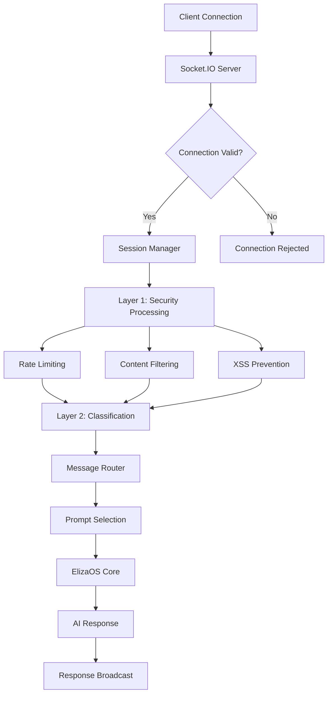

import {
  Card,
  CardGrid,
  Aside,
  Code,
  Tabs,
  TabItem,
} from "@astrojs/starlight/components";

# UX Integration System Overview

NUBI's UX Integration System represents a breakthrough in real-time AI communication, featuring a sophisticated **two-layer processing pipeline** that ensures both security and intelligence in every interaction.

## 🔌 System Architecture

The UX Integration System is built around **Socket.IO WebSockets** with a unique processing pipeline:



## 🛡️ Layer 1: Security Processing

The first layer focuses on **security and safety**, implementing multiple protection mechanisms:

<CardGrid>
  <Card title="🚦 Rate Limiting" icon="warning">
    **5 messages per minute** per user with exponential backoff for violations.
    
    ```typescript
    const rateLimiter = {
      messagesPerMinute: 5,
      timeWindow: 60000, // 1 minute
      backoffMultiplier: 2
    };
    ```
  </Card>
  
  <Card title="🔍 Content Filtering" icon="approve-check">
    **Advanced pattern detection** for spam, scams, and malicious content.
    
    - Spam detection algorithms
    - Scam URL filtering  
    - Malicious payload prevention
    - Custom blacklist management
  </Card>
  
  <Card title="🛡️ XSS Prevention" icon="setting">
    **Input sanitization** and validation to prevent code injection attacks.
    
    - HTML tag stripping
    - Script injection prevention
    - SQL injection protection  
    - Path traversal blocking
  </Card>
  
  <Card title="👥 Session Management" icon="user">
    **Persistent session tracking** across connections with automatic cleanup.
    
    - Session timeout (30 minutes)
    - Cross-platform identity linking
    - Connection state management
  </Card>
</CardGrid>

### Security Configuration

<Tabs>
  <TabItem label="Environment Variables">
```bash
# Security layer controls
SOCKET_PREPROCESSING_ENABLED=true
SOCKET_CONTENT_FILTERING=true
SOCKET_RATE_LIMITING=true
SOCKET_SECURITY_CHECKS=true

# Rate limiting configuration

SOCKET_RATE_LIMIT_MESSAGES=5
SOCKET_RATE_LIMIT_WINDOW=60000

# Session configuration

SOCKET_SESSION_TIMEOUT=1800000 # 30 minutes

````
  </TabItem>

  <TabItem label="Security Patterns">
```typescript
// Content filtering patterns
const securityPatterns = {
  spam: /\b(free money|click here|limited time)\b/gi,
  scam: /\b(send crypto|private key|seed phrase)\b/gi,
  xss: /<script|javascript:|on\w+=/gi,
  injection: /('|(\\|;|--|\/\*|\*\/)/gi
};

// Rate limiting implementation
interface UserStatus {
  messageCount: number;
  windowStart: number;
  violations: number;
  blockedUntil?: number;
}
````

  </TabItem>
</Tabs>

## 🧠 Layer 2: Message Classification

The second layer implements **intelligent message classification** to route messages to appropriate AI personas:

<div class="interactive-demo">
  <h3>🎯 7 Specialized Prompt Types</h3>
  <div style="display: grid; grid-template-columns: repeat(auto-fit, minmax(300px, 1fr)); gap: 1rem;">
    <div style="padding: 1rem; border: 2px solid var(--nubi-spirit-blue); border-radius: 8px;">
      <strong>🤝 Community Manager</strong>
      <p>
        Default mode for general conversation, welcomes new users, builds
        connections
      </p>
      <code>Pattern: General conversation, introductions</code>
    </div>
    <div style="padding: 1rem; border: 2px solid var(--nubi-jackal-gold); border-radius: 8px;">
      <strong>🚀 Raid Coordinator</strong>
      <p>
        Organizes engagement campaigns with military precision but keeps it fun
      </p>
      <code>Pattern: URLs, engagement keywords, "raid"</code>
    </div>
    <div style="padding: 1rem; border: 2px solid var(--nubi-ancient-bronze); border-radius: 8px;">
      <strong>📈 Crypto Analyst</strong>
      <p>Market oracle with cosmic intuition for portfolio analysis</p>
      <code>Pattern: Price, tokens, "analysis", amounts</code>
    </div>
    <div style="padding: 1rem; border: 2px solid var(--nubi-mystic-purple); border-radius: 8px;">
      <strong>😂 Meme Lord</strong>
      <p>Peak humor mode, roasts bad takes constructively</p>
      <code>Pattern: Emojis, "lol", "based", humor keywords</code>
    </div>
    <div style="padding: 1rem; border: 2px solid #4caf50; border-radius: 8px;">
      <strong>🛠️ Support Agent</strong>
      <p>Patient problem solver with deep technical knowledge</p>
      <code>Pattern: "help", "support", "problem", "how to"</code>
    </div>
    <div style="padding: 1rem; border: 2px solid #663399; border-radius: 8px;">
      <strong>🔮 Personality Core</strong>
      <p>Ancient consciousness sharing profound cosmic insights</p>
      <code>Pattern: "wisdom", "ancient", "spirit", philosophy</code>
    </div>
    <div style="padding: 1rem; border: 2px solid #f44336; border-radius: 8px;">
      <strong>🚨 Emergency Handler</strong>
      <p>Protection mode when community is threatened</p>
      <code>Pattern: "hack", "scam", "emergency", threats</code>
    </div>
  </div>
</div>

### Classification Algorithm

<Tabs>
  <TabItem label="Message Analysis">
```typescript
interface MessageClassification {
  intent: string;
  selectedPrompt: PromptType;
  confidenceScore: number;
  reasoning: string;
  variables: ExtractedVariables;
}

class MessageRouter {
async classifyMessage(
message: string,
userId: string,
platform: string,
traceId: string
): Promise<MessageClassification> {
// Extract variables (mentions, tokens, URLs, etc.)
const variables = this.extractVariables(message);

    // Determine intent and routing
    const { intent, selectedPrompt, confidenceScore, reasoning } =
      this.determineIntent(message, variables);

    // Log analytics
    await pipelineAnalytics.logRoutingEvent({
      traceId,
      userId,
      platform,
      classifiedIntent: intent,
      selectedPrompt,
      confidenceScore
    });

    return { intent, selectedPrompt, confidenceScore, reasoning, variables };

}
}

````
  </TabItem>

  <TabItem label="Variable Extraction">
```typescript
interface ExtractedVariables {
  mentions: string[];      // @usernames
  cryptoTokens: string[];  // SOL, BTC, ETH, etc.
  amounts: string[];       // $100, 50 SOL, etc.
  urls: string[];          // https:// links
  usernames: string[];     // mentioned users
  keywords: string[];      // classified keywords
  sentiment: "positive" | "negative" | "neutral";
  urgency: "low" | "medium" | "high";
  context: string;         // key context phrases
}

// Extraction patterns
const patterns = {
  mentions: /@(\w+)/g,
  cryptoTokens: /\b(SOL|BTC|ETH|USDC|BONK|JUP|NUBI)\b/gi,
  amounts: /(\$|USD|SOL|BTC|ETH)\s*([\d,]+(?:\.\d+)?)/gi,
  urls: /https?:\/\/[^\s]+/g
};
````

  </TabItem>
  
  <TabItem label="Prompt Selection">
```typescript
// Prompt selection logic with confidence scoring
private determineIntent(message: string, variables: ExtractedVariables) {
  const lowerMessage = message.toLowerCase();
  
  // Emergency handler (highest priority)
  if (this.isEmergency(message)) {
    return {
      intent: "emergency",
      selectedPrompt: "emergency-handler",
      confidenceScore: 0.95,
      reasoning: "Emergency keywords detected"
    };
  }
  
  // Raid coordinator
  if (this.isRaidRelated(message, variables)) {
    return {
      intent: "raid_coordination", 
      selectedPrompt: "raid-coordinator",
      confidenceScore: 0.9,
      reasoning: "Raid-related content detected"
    };
  }
  
  // Continue with other classifications...
}
```
  </TabItem>
</Tabs>

## 🔄 Real-time Communication Flow

<div class="interactive-demo">
  <h3>📡 Socket.IO Event System</h3>

  <div style="display: grid; grid-template-columns: 1fr 1fr; gap: 2rem;">
    <div>
      <strong>Client → Server Events</strong>
      <ul style="font-family: monospace; font-size: 0.9rem;">
        <li>
          <code>connect</code> - Initial connection
        </li>
        <li>
          <code>join-room</code> - Enter chat room
        </li>
        <li>
          <code>send-message</code> - Send message
        </li>
        <li>
          <code>request-world-state</code> - Get current state
        </li>
        <li>
          <code>start-session</code> - Begin AI session
        </li>
        <li>
          <code>disconnect</code> - Close connection
        </li>
      </ul>
    </div>
    <div>
      <strong>Server → Client Events</strong>
      <ul style="font-family: monospace; font-size: 0.9rem;">
        <li>
          <code>connection-ack</code> - Connection confirmed
        </li>
        <li>
          <code>message-received</code> - New message
        </li>
        <li>
          <code>user-joined</code> - User entered room
        </li>
        <li>
          <code>user-left</code> - User left room
        </li>
        <li>
          <code>world-state</code> - Current state data
        </li>
        <li>
          <code>error</code> - Error occurred
        </li>
      </ul>
    </div>
  </div>
</div>

### Connection Management

```typescript
// Socket.IO server setup with NUBI integration
const io = new Server(server, {
  cors: {
    origin: process.env.ALLOWED_ORIGINS?.split(",") || [
      "http://localhost:3000",
    ],
    methods: ["GET", "POST"],
  },
  transports: ["websocket", "polling"],
});

io.on("connection", async (socket) => {
  logger.info(`Client connected: ${socket.id}`);

  // Initialize session
  const sessionId = crypto.randomUUID();
  socket.data.sessionId = sessionId;

  // Setup message handling with two-layer processing
  socket.on("send-message", async (data) => {
    try {
      // Layer 1: Security processing
      const securityResult = await securityProcessor.process(data, socket);
      if (!securityResult.allowed) {
        socket.emit("error", { message: securityResult.reason });
        return;
      }

      // Layer 2: Message classification
      const classification = await messageRouter.classifyMessage(
        data.message,
        socket.data.userId,
        "websocket",
        sessionId,
      );

      // Route to appropriate AI persona
      const response = await nubiAgent.processMessage(
        data.message,
        classification,
      );

      // Broadcast response
      io.to(data.roomId).emit("message-received", {
        ...response,
        classification: classification.selectedPrompt,
      });
    } catch (error) {
      logger.error("Message processing error:", error);
      socket.emit("error", { message: "Processing failed" });
    }
  });
});
```

## 📊 Analytics & Monitoring

The UX Integration System includes comprehensive analytics:

<CardGrid>
  <Card title="📈 Real-time Metrics" icon="chart">
    - Connection count and duration - Message throughput and latency -
    Classification accuracy rates - Security event frequencies
  </Card>

<Card title="🎯 User Analytics" icon="user">
  - User engagement patterns - Conversation flow analysis - Prompt type
  preferences - Session duration tracking
</Card>

<Card title="🔍 Performance Monitoring" icon="setting">
  - Response time distribution - Database query performance - Memory usage
  patterns - Error rate tracking
</Card>

  <Card title="🛡️ Security Events" icon="warning">
    - Rate limiting violations - Content filter triggers - Suspicious activity
    detection - Attack pattern analysis
  </Card>
</CardGrid>

<Aside type="tip">
  **Analytics Integration**: All UX events are automatically logged to
  ClickHouse for advanced analytics and can be viewed in real-time dashboards.
</Aside>

## 🚀 Getting Started

Ready to integrate with NUBI's UX system? Here's a quick client example:

<Tabs>
  <TabItem label="JavaScript Client">
```javascript
import { io } from 'socket.io-client';

const socket = io('ws://localhost:3001', {
transports: ['websocket']
});

socket.on('connect', () => {
console.log('Connected to NUBI UX System');

// Join a room
socket.emit('join-room', {
roomId: 'general',
userId: 'user-123',
username: 'Alice'
});
});

socket.on('message-received', (data) => {
console.log(`NUBI [${data.classification}]:`, data.message);
});

// Send a message (will be processed through both layers)
socket.emit('send-message', {
roomId: 'general',
message: 'Hello NUBI! How are the markets today?'
});

````
  </TabItem>

  <TabItem label="React Hook">
```typescript
import { useEffect, useState } from 'react';
import { io, Socket } from 'socket.io-client';

export function useNubiSocket(serverPath: string) {
  const [socket, setSocket] = useState<Socket | null>(null);
  const [connected, setConnected] = useState(false);
  const [messages, setMessages] = useState<any[]>([]);

  useEffect(() => {
    const newSocket = io(serverPath);

    newSocket.on('connect', () => {
      setConnected(true);
      setSocket(newSocket);
    });

    newSocket.on('message-received', (message) => {
      setMessages(prev => [...prev, message]);
    });

    return () => newSocket.close();
  }, [serverPath]);

  const sendMessage = (roomId: string, message: string) => {
    if (socket) {
      socket.emit('send-message', { roomId, message });
    }
  };

  return { socket, connected, messages, sendMessage };
}
````

  </TabItem>
</Tabs>

---

<div class="nubi-note">
  <strong>🔍 Next Steps:</strong> Dive deeper into specific components: -{" "}
  <a href="/ux-integration/socketio/">Socket.IO Setup</a> - Detailed server
  configuration - <a href="/ux-integration/processing/">Two-Layer Processing</a>{" "}
  - Security and classification details -{" "}
  <a href="/ux-integration/classification/">Message Classification</a> - AI
  persona routing system
</div>
