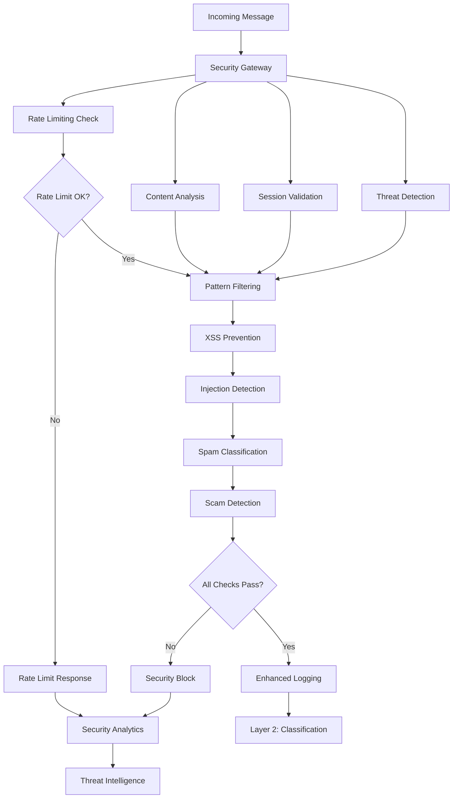

import {
  Card,
  CardGrid,
  Aside,
  Code,
  Tabs,
  TabItem,
} from "@astrojs/starlight/components";

# Security Processing Layer

NUBI's **Layer 1 security processing** implements a comprehensive defense system that protects against various threats while maintaining optimal performance. This layer processes all incoming messages before they reach the classification system.

## 🛡️ Security Architecture

The security layer employs a multi-stage defense strategy with parallel processing for optimal performance:



## 🚦 Rate Limiting System

NUBI implements a sophisticated **adaptive rate limiting** system that prevents abuse while allowing legitimate usage:

<CardGrid>
  <Card title="⏱️ Time Window Control" icon="clock">
    **5 messages per minute** per user with sliding window tracking and burst allowance for natural conversation flow.
  </Card>

  <Card title="📈 Exponential Backoff" icon="chart">
    **Progressive penalties** for violators with exponential backoff and reputation-based recovery mechanisms.
  </Card>

  <Card title="🎯 Adaptive Thresholds" icon="approve-check">
    **Dynamic adjustment** based on user behavior, platform context, and system load conditions.
  </Card>

  <Card title="🔄 Distributed Tracking" icon="setting">
    **Cross-platform coordination** ensuring consistent limits across Discord, Telegram, and web interfaces.
  </Card>
</CardGrid>

<Tabs>
  <TabItem label="Rate Limiter Implementation">
```typescript
export interface RateLimitConfig {
  messagesPerWindow: number;
  windowSizeMs: number;
  burstAllowance: number;
  backoffMultiplier: number;
  maxBackoffMs: number;
  recoveryRateMs: number;
}

export interface UserRateStatus {
  messageCount: number;
  windowStart: number;
  violations: number;
  blockedUntil?: number;
  lastMessageTime: number;
  burstUsed: number;
  reputationScore: number;
}

export class AdaptiveRateLimiter {
  private userStatuses = new Map<string, UserRateStatus>();
  private globalConfig: RateLimitConfig;
  private platformConfigs = new Map<string, RateLimitConfig>();
  
  constructor() {
    this.globalConfig = {
      messagesPerWindow: 5,
      windowSizeMs: 60000, // 1 minute
      burstAllowance: 2,   // Allow 2 extra messages in burst
      backoffMultiplier: 2,
      maxBackoffMs: 300000, // 5 minutes max
      recoveryRateMs: 3600000 // 1 hour reputation recovery
    };
    
    this.setupPlatformConfigs();
  }
  
  async checkRateLimit(
    userId: string,
    platform: string,
    message: string
  ): Promise<RateLimitResult> {
    const now = Date.now();
    const config = this.getConfigForPlatform(platform);
    const userStatus = this.getUserStatus(userId);
    
    // Check if user is currently blocked
    if (userStatus.blockedUntil && now < userStatus.blockedUntil) {
      return {
        allowed: false,
        reason: "rate_limit_exceeded",
        retryAfter: userStatus.blockedUntil - now,
        remainingQuota: 0,
        violationCount: userStatus.violations
      };
    }
    
    // Reset window if expired
    if (now - userStatus.windowStart >= config.windowSizeMs) {
      userStatus.messageCount = 0;
      userStatus.windowStart = now;
      userStatus.burstUsed = 0;
    }
    
    // Check message quota
    const totalAllowed = config.messagesPerWindow + 
      (this.canUseBurst(userStatus, config) ? config.burstAllowance : 0);
    
    if (userStatus.messageCount >= totalAllowed) {
      // Rate limit exceeded
      userStatus.violations++;
      userStatus.blockedUntil = this.calculateBackoffTime(userStatus, config);
      
      await this.logRateLimitViolation(userId, platform, userStatus);
      
      return {
        allowed: false,
        reason: "rate_limit_exceeded",
        retryAfter: userStatus.blockedUntil - now,
        remainingQuota: 0,
        violationCount: userStatus.violations
      };
    }
    
    // Message allowed - update counters
    userStatus.messageCount++;
    userStatus.lastMessageTime = now;
    
    if (userStatus.messageCount > config.messagesPerWindow) {
      userStatus.burstUsed++;
    }
    
    // Update reputation score
    this.updateReputationScore(userStatus, message, now);
    
    return {
      allowed: true,
      reason: null,
      retryAfter: 0,
      remainingQuota: totalAllowed - userStatus.messageCount,
      violationCount: userStatus.violations
    };
  }
  
  private canUseBurst(
    userStatus: UserRateStatus, 
    config: RateLimitConfig
  ): boolean {
    // High reputation users get burst allowance
    if (userStatus.reputationScore >= 0.8) return true;
    
    // No recent violations
    if (userStatus.violations === 0) return true;
    
    // Natural conversation flow (messages spaced appropriately)
    const timeSinceLastMessage = Date.now() - userStatus.lastMessageTime;
    if (timeSinceLastMessage >= 10000) return true; // 10 seconds
    
    return false;
  }
  
  private calculateBackoffTime(
    userStatus: UserRateStatus, 
    config: RateLimitConfig
  ): number {
    const baseDelay = config.windowSizeMs;
    const backoffDelay = Math.min(
      baseDelay * Math.pow(config.backoffMultiplier, userStatus.violations - 1),
      config.maxBackoffMs
    );
    
    // Reputation-based adjustment
    const reputationMultiplier = Math.max(0.5, 2 - userStatus.reputationScore);
    
    return Date.now() + (backoffDelay * reputationMultiplier);
  }
  
  private updateReputationScore(
    userStatus: UserRateStatus, 
    message: string, 
    now: number
  ): void {
    const messageQuality = this.assessMessageQuality(message);
    const timeFactor = this.calculateTimeFactor(userStatus.lastMessageTime, now);
    
    // Positive reputation for quality messages
    if (messageQuality > 0.7) {
      userStatus.reputationScore += 0.05 * timeFactor;
    }
    
    // Negative reputation for spam-like behavior
    if (messageQuality < 0.3) {
      userStatus.reputationScore -= 0.1;
    }
    
    // Natural decay towards neutral
    const decayRate = 0.001;
    userStatus.reputationScore += (0.5 - userStatus.reputationScore) * decayRate;
    
    // Clamp to [0, 1]
    userStatus.reputationScore = Math.max(0, Math.min(1, userStatus.reputationScore));
  }
  
  private assessMessageQuality(message: string): number {
    let quality = 0.5; // Start neutral
    
    // Length factors
    if (message.length < 5) quality -= 0.3; // Very short
    if (message.length > 10 && message.length < 100) quality += 0.1; // Good length
    if (message.length > 1000) quality -= 0.2; // Too long
    
    // Content quality indicators
    const hasCapitalization = /[A-Z]/.test(message);
    const hasPunctuation = /[.!?]/.test(message);
    const hasVariety = new Set(message.toLowerCase()).size / message.length > 0.3;
    
    if (hasCapitalization) quality += 0.1;
    if (hasPunctuation) quality += 0.1;
    if (hasVariety) quality += 0.1;
    
    // Spam indicators
    const repetitionRatio = this.calculateRepetitionRatio(message);
    if (repetitionRatio > 0.7) quality -= 0.4;
    
    const capsRatio = (message.match(/[A-Z]/g) || []).length / message.length;
    if (capsRatio > 0.3) quality -= 0.2; // Too much caps
    
    return Math.max(0, Math.min(1, quality));
  }
}
```
  </TabItem>

  <TabItem label="Platform-Specific Limits">
```typescript
// Platform-specific rate limiting configurations
export class PlatformRateLimitManager {
  private setupPlatformConfigs(): void {
    // Discord - More lenient due to real-time nature
    this.platformConfigs.set('discord', {
      messagesPerWindow: 8,
      windowSizeMs: 60000,
      burstAllowance: 3,
      backoffMultiplier: 1.5,
      maxBackoffMs: 120000, // 2 minutes
      recoveryRateMs: 1800000 // 30 minutes
    });
    
    // Telegram - Standard limits
    this.platformConfigs.set('telegram', {
      messagesPerWindow: 5,
      windowSizeMs: 60000,
      burstAllowance: 2,
      backoffMultiplier: 2,
      maxBackoffMs: 300000,
      recoveryRateMs: 3600000
    });
    
    // WebSocket - Stricter due to automation potential
    this.platformConfigs.set('websocket', {
      messagesPerWindow: 3,
      windowSizeMs: 60000,
      burstAllowance: 1,
      backoffMultiplier: 2.5,
      maxBackoffMs: 600000, // 10 minutes
      recoveryRateMs: 7200000 // 2 hours
    });
    
    // Twitter/X - Very strict due to API limits
    this.platformConfigs.set('twitter', {
      messagesPerWindow: 2,
      windowSizeMs: 300000, // 5 minutes
      burstAllowance: 0,
      backoffMultiplier: 3,
      maxBackoffMs: 1800000, // 30 minutes
      recoveryRateMs: 86400000 // 24 hours
    });
  }
  
  async getAdaptiveConfig(
    platform: string,
    systemLoad: number,
    userTier: string
  ): Promise<RateLimitConfig> {
    const baseConfig = this.platformConfigs.get(platform) || this.globalConfig;
    
    // Adjust for system load
    const loadMultiplier = Math.max(0.5, 1 - (systemLoad - 0.7) * 2);
    
    // Adjust for user tier
    const tierMultiplier = this.getTierMultiplier(userTier);
    
    return {
      ...baseConfig,
      messagesPerWindow: Math.floor(baseConfig.messagesPerWindow * loadMultiplier * tierMultiplier),
      burstAllowance: Math.floor(baseConfig.burstAllowance * tierMultiplier)
    };
  }
  
  private getTierMultiplier(userTier: string): number {
    switch (userTier) {
      case 'premium': return 2.0;
      case 'verified': return 1.5;
      case 'trusted': return 1.2;
      case 'new': return 0.5;
      default: return 1.0;
    }
  }
}
```
  </TabItem>
</Tabs>

## 🔍 Content Filtering System

Advanced content filtering protects against spam, scams, and malicious content while preserving legitimate communication:

<CardGrid>
  <Card title="📝 Pattern Recognition" icon="search">
    **Multi-layered filtering** with regex patterns, machine learning models, and behavioral analysis for comprehensive threat detection.
  </Card>

  <Card title="🎯 Contextual Analysis" icon="approve-check">
    **Context-aware filtering** that considers conversation history, user reputation, and platform norms to reduce false positives.
  </Card>

  <Card title="🔄 Dynamic Updates" icon="refresh">
    **Real-time pattern updates** from threat intelligence feeds and community reporting to stay ahead of evolving attacks.
  </Card>

  <Card title="⚖️ Balanced Approach" icon="balance">
    **Performance optimization** with tiered filtering stages and smart caching to maintain sub-millisecond processing times.
  </Card>
</CardGrid>

<Tabs>
  <TabItem label="Content Filter Engine">
```typescript
export interface FilterRule {
  id: string;
  name: string;
  category: FilterCategory;
  pattern: RegExp;
  severity: 'low' | 'medium' | 'high' | 'critical';
  action: FilterAction;
  confidence: number;
  enabled: boolean;
  lastUpdated: Date;
}

export enum FilterCategory {
  SPAM = 'spam',
  SCAM = 'scam',
  PHISHING = 'phishing',
  MALWARE = 'malware',
  HARASSMENT = 'harassment',
  INAPPROPRIATE = 'inappropriate',
  CRYPTO_SCAM = 'crypto_scam'
}

export enum FilterAction {
  BLOCK = 'block',
  QUARANTINE = 'quarantine',
  FLAG = 'flag',
  RATE_LIMIT = 'rate_limit',
  LOG_ONLY = 'log_only'
}

export class ContentFilterEngine {
  private filterRules: Map<FilterCategory, FilterRule[]> = new Map();
  private mlModel: ContentClassificationModel;
  private patternCache = new LRUCache<string, FilterResult>({ max: 10000 });
  
  constructor() {
    this.initializeFilterRules();
    this.mlModel = new ContentClassificationModel();
  }
  
  async filterContent(
    content: string,
    userId: string,
    platform: string,
    context: FilterContext
  ): Promise<FilterResult> {
    const startTime = Date.now();
    
    // Check cache first
    const cacheKey = this.generateCacheKey(content, platform);
    const cached = this.patternCache.get(cacheKey);
    if (cached && this.isCacheValid(cached, startTime)) {
      return cached;
    }
    
    // Stage 1: Fast pattern matching
    const patternResults = await this.applyPatternFilters(content, context);
    
    // Stage 2: ML-based classification (for ambiguous cases)
    const mlResults = patternResults.some(r => r.confidence < 0.8) 
      ? await this.mlModel.classify(content, context)
      : null;
    
    // Stage 3: Contextual analysis
    const contextualResults = await this.applyContextualAnalysis(
      content, 
      patternResults, 
      mlResults, 
      context
    );
    
    // Combine results and make final decision
    const finalResult = this.combineFilterResults(
      patternResults,
      mlResults,
      contextualResults,
      context
    );
    
    finalResult.processingTimeMs = Date.now() - startTime;
    
    // Cache result
    this.patternCache.set(cacheKey, finalResult);
    
    // Log if significant threat detected
    if (finalResult.severity === 'high' || finalResult.severity === 'critical') {
      await this.logSecurityEvent(userId, platform, content, finalResult);
    }
    
    return finalResult;
  }
  
  private async applyPatternFilters(
    content: string,
    context: FilterContext
  ): Promise<PatternFilterResult[]> {
    const results: PatternFilterResult[] = [];
    const lowerContent = content.toLowerCase();
    
    // Apply all filter categories in parallel
    const categoryPromises = Array.from(this.filterRules.entries()).map(
      async ([category, rules]) => {
        return await this.applyCategoryFilters(category, rules, lowerContent, context);
      }
    );
    
    const categoryResults = await Promise.all(categoryPromises);
    return categoryResults.flat();
  }
  
  private async applyCategoryFilters(
    category: FilterCategory,
    rules: FilterRule[],
    content: string,
    context: FilterContext
  ): Promise<PatternFilterResult[]> {
    const results: PatternFilterResult[] = [];
    
    for (const rule of rules) {
      if (!rule.enabled) continue;
      
      const matches = content.match(rule.pattern);
      if (matches) {
        const confidence = this.calculatePatternConfidence(
          rule, 
          matches, 
          content, 
          context
        );
        
        results.push({
          ruleId: rule.id,
          category,
          severity: rule.severity,
          confidence,
          matches,
          action: rule.action
        });
      }
    }
    
    return results;
  }
  
  private initializeFilterRules(): void {
    // Spam detection patterns
    this.filterRules.set(FilterCategory.SPAM, [
      {
        id: 'spam_repetition',
        name: 'Repetitive Content',
        category: FilterCategory.SPAM,
        pattern: /(.)\1{10,}/gi, // Same character repeated 10+ times
        severity: 'medium',
        action: FilterAction.FLAG,
        confidence: 0.8,
        enabled: true,
        lastUpdated: new Date()
      },
      {
        id: 'spam_caps',
        name: 'Excessive Capitals',
        category: FilterCategory.SPAM,
        pattern: /[A-Z]{20,}/g,
        severity: 'low',
        action: FilterAction.FLAG,
        confidence: 0.6,
        enabled: true,
        lastUpdated: new Date()
      },
      {
        id: 'spam_marketing',
        name: 'Marketing Spam',
        pattern: /\b(free money|guaranteed profit|limited time|click here|act now)\b/gi,
        severity: 'medium',
        action: FilterAction.QUARANTINE,
        confidence: 0.75,
        enabled: true,
        lastUpdated: new Date()
      }
    ]);
    
    // Crypto scam patterns
    this.filterRules.set(FilterCategory.CRYPTO_SCAM, [
      {
        id: 'crypto_seed_request',
        name: 'Seed Phrase Scam',
        category: FilterCategory.CRYPTO_SCAM,
        pattern: /\b(seed phrase|private key|recovery phrase|send.*sol|send.*btc)\b/gi,
        severity: 'critical',
        action: FilterAction.BLOCK,
        confidence: 0.95,
        enabled: true,
        lastUpdated: new Date()
      },
      {
        id: 'crypto_fake_support',
        name: 'Fake Support Scam',
        category: FilterCategory.CRYPTO_SCAM,
        pattern: /\b(official support|verify.*wallet|suspended.*account)\b/gi,
        severity: 'high',
        action: FilterAction.BLOCK,
        confidence: 0.85,
        enabled: true,
        lastUpdated: new Date()
      }
    ]);
    
    // Phishing patterns
    this.filterRules.set(FilterCategory.PHISHING, [
      {
        id: 'phishing_urgent',
        name: 'Urgent Action Required',
        category: FilterCategory.PHISHING,
        pattern: /\b(urgent.*action|account.*suspended|verify.*immediately)\b/gi,
        severity: 'high',
        action: FilterAction.BLOCK,
        confidence: 0.8,
        enabled: true,
        lastUpdated: new Date()
      },
      {
        id: 'phishing_links',
        name: 'Suspicious Links',
        category: FilterCategory.PHISHING,
        pattern: /https?:\/\/[^\s]*\b(secure|verify|update|confirm)\b[^\s]*/gi,
        severity: 'medium',
        action: FilterAction.FLAG,
        confidence: 0.7,
        enabled: true,
        lastUpdated: new Date()
      }
    ]);
  }
}
```
  </TabItem>

  <TabItem label="ML Classification">
```typescript
// Machine learning-based content classification
export class ContentClassificationModel {
  private model: TensorFlowModel;
  private tokenizer: Tokenizer;
  private isLoaded = false;
  
  constructor() {
    this.initializeModel();
  }
  
  async classify(
    content: string,
    context: FilterContext
  ): Promise<MLFilterResult> {
    if (!this.isLoaded) {
      await this.loadModel();
    }
    
    // Preprocess content
    const features = await this.extractFeatures(content, context);
    
    // Get model predictions
    const predictions = await this.model.predict(features);
    
    // Post-process results
    const classification = this.interpretPredictions(predictions, content);
    
    return {
      categories: classification.categories,
      overallThreat: classification.overallThreat,
      confidence: classification.confidence,
      reasoning: classification.reasoning,
      modelVersion: this.model.version
    };
  }
  
  private async extractFeatures(
    content: string,
    context: FilterContext
  ): Promise<FeatureVector> {
    // Tokenize content
    const tokens = await this.tokenizer.tokenize(content);
    
    // Extract linguistic features
    const linguisticFeatures = {
      length: content.length,
      wordCount: tokens.length,
      avgWordLength: tokens.reduce((sum, token) => sum + token.length, 0) / tokens.length,
      capsRatio: (content.match(/[A-Z]/g) || []).length / content.length,
      punctuationRatio: (content.match(/[.!?]/g) || []).length / content.length,
      numberRatio: (content.match(/\d/g) || []).length / content.length,
      urlCount: (content.match(/https?:\/\/[^\s]+/g) || []).length,
      emojiCount: (content.match(/[\u{1F600}-\u{1F64F}]/gu) || []).length
    };
    
    // Extract contextual features
    const contextualFeatures = {
      platform: this.encodePlatform(context.platform),
      timeOfDay: this.encodeTimeOfDay(context.timestamp),
      userReputation: context.userReputation || 0.5,
      conversationLength: context.conversationLength || 1,
      isReply: context.isReply || false
    };
    
    // Extract semantic features using embeddings
    const semanticFeatures = await this.generateSemanticEmbedding(content);
    
    return {
      linguistic: linguisticFeatures,
      contextual: contextualFeatures,
      semantic: semanticFeatures
    };
  }
  
  private interpretPredictions(
    predictions: ModelPredictions,
    content: string
  ): ClassificationResult {
    const categories: Map<FilterCategory, number> = new Map();
    
    // Map model outputs to filter categories
    categories.set(FilterCategory.SPAM, predictions.spam);
    categories.set(FilterCategory.SCAM, predictions.scam);
    categories.set(FilterCategory.PHISHING, predictions.phishing);
    categories.set(FilterCategory.HARASSMENT, predictions.harassment);
    categories.set(FilterCategory.INAPPROPRIATE, predictions.inappropriate);
    categories.set(FilterCategory.CRYPTO_SCAM, predictions.cryptoScam);
    
    // Calculate overall threat score
    const threatScores = Array.from(categories.values());
    const overallThreat = Math.max(...threatScores);
    
    // Determine confidence based on prediction distribution
    const entropy = this.calculateEntropy(threatScores);
    const confidence = 1 - entropy / Math.log(threatScores.length);
    
    // Generate reasoning
    const topCategory = Array.from(categories.entries())
      .sort((a, b) => b[1] - a[1])[0];
    
    const reasoning = this.generateReasoning(topCategory, predictions, content);
    
    return {
      categories,
      overallThreat,
      confidence,
      reasoning
    };
  }
  
  async updateModel(): Promise<void> {
    try {
      // Download latest model from secure endpoint
      const modelUrl = `${process.env.ML_MODEL_ENDPOINT}/content-filter/latest`;
      const modelData = await this.secureDownload(modelUrl);
      
      // Validate model integrity
      if (!await this.validateModelIntegrity(modelData)) {
        throw new Error('Model integrity validation failed');
      }
      
      // Load new model
      const newModel = await this.loadModelFromData(modelData);
      
      // Test new model with known samples
      const testResults = await this.testModel(newModel);
      if (testResults.accuracy < 0.85) {
        throw new Error('New model does not meet accuracy threshold');
      }
      
      // Replace current model
      this.model = newModel;
      this.isLoaded = true;
      
      logger.info('Content classification model updated successfully', {
        version: newModel.version,
        accuracy: testResults.accuracy
      });
      
    } catch (error) {
      logger.error('Failed to update ML model:', error);
      // Continue using existing model
    }
  }
}
```
  </TabItem>
</Tabs>

## 🔒 XSS & Injection Prevention

Comprehensive protection against cross-site scripting and injection attacks:

<Tabs>
  <TabItem label="XSS Prevention">
```typescript
export class XSSPrevention {
  private dangerousPatterns = [
    // Script injection
    /<script\b[^<]*(?:(?!<\/script>)<[^<]*)*<\/script>/gi,
    /javascript:/gi,
    /vbscript:/gi,
    /on\w+\s*=/gi,
    
    // HTML injection
    /<iframe\b[^>]*>/gi,
    /<object\b[^>]*>/gi,
    /<embed\b[^>]*>/gi,
    /<link\b[^>]*>/gi,
    /<meta\b[^>]*>/gi,
    
    // Style injection
    /expression\s*\(/gi,
    /@import\b/gi,
    /binding\s*:/gi,
    
    // Data URLs with scripts
    /data:\s*text\/html/gi,
    /data:\s*application\/javascript/gi
  ];
  
  async preventXSS(
    content: string,
    context: SecurityContext
  ): Promise<XSSPreventionResult> {
    const originalContent = content;
    let sanitizedContent = content;
    const detectedThreats: XSSThreat[] = [];
    
    // Step 1: Pattern-based detection and removal
    for (const pattern of this.dangerousPatterns) {
      const matches = sanitizedContent.match(pattern);
      if (matches) {
        detectedThreats.push({
          type: 'pattern_match',
          pattern: pattern.toString(),
          matches: matches,
          severity: this.assessPatternSeverity(pattern)
        });
        
        // Remove or neutralize dangerous content
        sanitizedContent = sanitizedContent.replace(pattern, (match) => {
          return this.neutralizeMatch(match);
        });
      }
    }
    
    // Step 2: HTML entity encoding
    sanitizedContent = this.htmlEncode(sanitizedContent);
    
    // Step 3: URL validation and sanitization
    sanitizedContent = await this.sanitizeUrls(sanitizedContent);
    
    // Step 4: Advanced parsing for complex attacks
    const advancedThreats = await this.detectAdvancedXSS(originalContent);
    detectedThreats.push(...advancedThreats);
    
    const isModified = originalContent !== sanitizedContent;
    const threatLevel = this.calculateThreatLevel(detectedThreats);
    
    return {
      originalContent,
      sanitizedContent,
      isModified,
      threatLevel,
      detectedThreats,
      action: this.determineAction(threatLevel, context)
    };
  }
  
  private htmlEncode(content: string): string {
    return content
      .replace(/&/g, '&amp;')
      .replace(/</g, '&lt;')
      .replace(/>/g, '&gt;')
      .replace(/"/g, '&quot;')
      .replace(/'/g, '&#x27;')
      .replace(/\//g, '&#x2F;');
  }
  
  private async sanitizeUrls(content: string): Promise<string> {
    const urlPattern = /(https?:\/\/[^\s]+)/gi;
    
    return content.replace(urlPattern, (url) => {
      try {
        const parsedUrl = new URL(url);
        
        // Block data URLs
        if (parsedUrl.protocol === 'data:') {
          return '[BLOCKED_DATA_URL]';
        }
        
        // Block javascript URLs
        if (parsedUrl.protocol === 'javascript:') {
          return '[BLOCKED_JS_URL]';
        }
        
        // Validate domain against blacklist
        if (this.isBlacklistedDomain(parsedUrl.hostname)) {
          return '[BLOCKED_DOMAIN]';
        }
        
        return url;
      } catch (error) {
        // Malformed URL, remove it
        return '[MALFORMED_URL]';
      }
    });
  }
  
  private async detectAdvancedXSS(content: string): Promise<XSSThreat[]> {
    const threats: XSSThreat[] = [];
    
    // Check for encoded attacks
    const decodedContent = this.decodeCommonEncodings(content);
    if (decodedContent !== content) {
      // Re-check decoded content for threats
      for (const pattern of this.dangerousPatterns) {
        if (pattern.test(decodedContent)) {
          threats.push({
            type: 'encoded_attack',
            pattern: pattern.toString(),
            matches: decodedContent.match(pattern) || [],
            severity: 'high'
          });
        }
      }
    }
    
    // Check for polyglot attacks
    if (this.detectPolyglotAttack(content)) {
      threats.push({
        type: 'polyglot_attack',
        pattern: 'polyglot_detection',
        matches: [content],
        severity: 'critical'
      });
    }
    
    return threats;
  }
  
  private decodeCommonEncodings(content: string): string {
    let decoded = content;
    
    // HTML entity decoding
    decoded = decoded
      .replace(/&lt;/g, '<')
      .replace(/&gt;/g, '>')
      .replace(/&quot;/g, '"')
      .replace(/&#x27;/g, "'")
      .replace(/&amp;/g, '&');
    
    // URL decoding
    try {
      decoded = decodeURIComponent(decoded);
    } catch (e) {
      // Invalid encoding, keep original
    }
    
    // Base64 decoding (simple cases)
    const base64Pattern = /[A-Za-z0-9+/]{20,}={0,2}/g;
    decoded = decoded.replace(base64Pattern, (match) => {
      try {
        const decodedBase64 = atob(match);
        // Only return if it contains suspicious patterns
        return this.containsSuspiciousPatterns(decodedBase64) ? decodedBase64 : match;
      } catch (e) {
        return match;
      }
    });
    
    return decoded;
  }
}
```
  </TabItem>

  <TabItem label="SQL Injection Prevention">
```typescript
export class SQLInjectionPrevention {
  private sqlPatterns = [
    // Union-based attacks
    /\bunion\b.*\bselect\b/gi,
    /\bselect\b.*\bunion\b/gi,
    
    // Boolean-based attacks
    /\b(and|or)\b\s*\d+\s*=\s*\d+/gi,
    /\b(and|or)\b\s*'[^']*'\s*=\s*'[^']*'/gi,
    
    // Time-based attacks
    /\bwaitfor\b\s+\bdelay\b/gi,
    /\bsleep\s*\(/gi,
    /\bbenchmark\s*\(/gi,
    
    // Comment-based attacks
    /\/\*.*\*\//gi,
    /--[^\r\n]*/gi,
    /#[^\r\n]*/gi,
    
    // System function calls
    /\bexec\s*\(/gi,
    /\bexecute\s*\(/gi,
    /\bsp_executesql\b/gi,
    /\bxp_cmdshell\b/gi,
    
    // Information gathering
    /\btable_name\b/gi,
    /\bcolumn_name\b/gi,
    /\binformation_schema\b/gi,
    /\bsysobjects\b/gi,
    /\bsyscolumns\b/gi
  ];
  
  async preventSQLInjection(
    input: string,
    context: SecurityContext
  ): Promise<SQLInjectionResult> {
    const detectedPatterns: SQLPattern[] = [];
    let threatLevel: ThreatLevel = 'none';
    
    // Check for SQL injection patterns
    for (const pattern of this.sqlPatterns) {
      const matches = input.match(pattern);
      if (matches) {
        const patternThreat = this.assessSQLPatternThreat(pattern, matches);
        detectedPatterns.push({
          pattern: pattern.toString(),
          matches,
          threat: patternThreat,
          description: this.getPatternDescription(pattern)
        });
        
        if (patternThreat > threatLevel) {
          threatLevel = patternThreat;
        }
      }
    }
    
    // Advanced analysis for obfuscated attacks
    const obfuscatedThreats = await this.detectObfuscatedSQL(input);
    detectedPatterns.push(...obfuscatedThreats);
    
    // Calculate final threat assessment
    const finalThreatLevel = this.calculateFinalThreat(detectedPatterns, context);
    
    return {
      input,
      threatLevel: finalThreatLevel,
      detectedPatterns,
      recommendation: this.getRecommendation(finalThreatLevel),
      sanitizedInput: this.sanitizeSQL(input, detectedPatterns)
    };
  }
  
  private sanitizeSQL(input: string, patterns: SQLPattern[]): string {
    let sanitized = input;
    
    // Remove or escape dangerous patterns
    for (const pattern of patterns) {
      if (pattern.threat === 'critical' || pattern.threat === 'high') {
        // Remove completely for high-risk patterns
        sanitized = sanitized.replace(new RegExp(pattern.pattern, 'gi'), '[FILTERED]');
      } else if (pattern.threat === 'medium') {
        // Escape for medium-risk patterns
        sanitized = this.escapeSQLCharacters(sanitized);
      }
    }
    
    return sanitized;
  }
  
  private escapeSQLCharacters(input: string): string {
    return input
      .replace(/'/g, "''")    // Escape single quotes
      .replace(/"/g, '""')    // Escape double quotes
      .replace(/\\/g, '\\\\') // Escape backslashes
      .replace(/;/g, '\\;')   // Escape semicolons
      .replace(/--/g, '\\--') // Escape SQL comments
      .replace(/\/\*/g, '\\/\\*') // Escape block comments
      .replace(/\*\//g, '\\*\\/');
  }
  
  private async detectObfuscatedSQL(input: string): Promise<SQLPattern[]> {
    const threats: SQLPattern[] = [];
    
    // Check for character encoding obfuscation
    const decodedInput = this.decodeVariousEncodings(input);
    if (decodedInput !== input) {
      // Re-scan decoded content
      for (const pattern of this.sqlPatterns) {
        if (pattern.test(decodedInput)) {
          threats.push({
            pattern: 'obfuscated_' + pattern.toString(),
            matches: decodedInput.match(pattern) || [],
            threat: 'high',
            description: 'Obfuscated SQL injection attempt'
          });
        }
      }
    }
    
    // Check for concatenation-based obfuscation
    if (this.detectConcatenationObfuscation(input)) {
      threats.push({
        pattern: 'concatenation_obfuscation',
        matches: [input],
        threat: 'high',
        description: 'String concatenation obfuscation detected'
      });
    }
    
    return threats;
  }
}
```
  </TabItem>
</Tabs>

## 🛡️ Advanced Threat Detection

NUBI employs sophisticated threat detection mechanisms for emerging attack patterns:

<Tabs>
  <TabItem label="Behavioral Analysis">
```typescript
export class BehavioralThreatDetector {
  private userBehaviorProfiles = new Map<string, UserBehaviorProfile>();
  private anomalyThresholds = {
    messageFrequency: 0.3,
    contentSimilarity: 0.8,
    platformSwitching: 0.4,
    timePatterns: 0.25
  };
  
  async analyzeBehavioralThreats(
    userId: string,
    message: string,
    context: BehaviorContext
  ): Promise<BehavioralThreatResult> {
    const profile = await this.getUserBehaviorProfile(userId);
    const currentBehavior = await this.extractCurrentBehavior(message, context);
    
    const anomalies = await this.detectAnomalies(profile, currentBehavior);
    const threatScore = this.calculateBehavioralThreatScore(anomalies);
    
    // Update profile with current behavior
    await this.updateBehaviorProfile(userId, profile, currentBehavior);
    
    return {
      userId,
      threatScore,
      anomalies,
      recommendations: this.generateRecommendations(anomalies),
      profileConfidence: profile.confidence
    };
  }
  
  private async detectAnomalies(
    profile: UserBehaviorProfile,
    current: CurrentBehavior
  ): Promise<BehavioralAnomaly[]> {
    const anomalies: BehavioralAnomaly[] = [];
    
    // Message frequency analysis
    if (this.isFrequencyAnomaly(profile.messageFrequency, current.messageFrequency)) {
      anomalies.push({
        type: 'frequency_anomaly',
        severity: this.calculateFrequencyAnomalySeverity(profile, current),
        description: 'Unusual messaging frequency detected',
        baseline: profile.messageFrequency,
        current: current.messageFrequency,
        zscore: this.calculateZScore(profile.messageFrequency, current.messageFrequency)
      });
    }
    
    // Content pattern analysis
    const contentSimilarity = await this.calculateContentSimilarity(
      profile.contentPatterns, 
      current.contentPattern
    );
    
    if (contentSimilarity < this.anomalyThresholds.contentSimilarity) {
      anomalies.push({
        type: 'content_anomaly',
        severity: this.calculateContentAnomalySeverity(contentSimilarity),
        description: 'Unusual content pattern detected',
        baseline: profile.contentPatterns,
        current: current.contentPattern,
        similarity: contentSimilarity
      });
    }
    
    // Time pattern analysis
    if (this.isTimePatternAnomaly(profile.activityPatterns, current.timeContext)) {
      anomalies.push({
        type: 'temporal_anomaly',
        severity: 'medium',
        description: 'Unusual activity timing detected',
        baseline: profile.activityPatterns,
        current: current.timeContext
      });
    }
    
    // Platform behavior analysis
    if (this.isPlatformBehaviorAnomaly(profile.platformBehaviors, current.platform)) {
      anomalies.push({
        type: 'platform_anomaly',
        severity: 'low',
        description: 'Unusual cross-platform behavior detected',
        baseline: profile.platformBehaviors,
        current: current.platform
      });
    }
    
    return anomalies;
  }
  
  private calculateBehavioralThreatScore(anomalies: BehavioralAnomaly[]): number {
    if (anomalies.length === 0) return 0;
    
    const severityWeights = {
      'low': 0.2,
      'medium': 0.5,
      'high': 0.8,
      'critical': 1.0
    };
    
    const weightedSum = anomalies.reduce((sum, anomaly) => {
      return sum + severityWeights[anomaly.severity];
    }, 0);
    
    // Normalize by number of anomalies and apply scaling
    const baseScore = weightedSum / anomalies.length;
    
    // Apply anomaly count multiplier (more anomalies = higher threat)
    const countMultiplier = Math.min(1.5, 1 + (anomalies.length - 1) * 0.1);
    
    return Math.min(1.0, baseScore * countMultiplier);
  }
  
  async detectCoordinatedAttacks(
    recentEvents: SecurityEvent[]
  ): Promise<CoordinatedAttackResult> {
    // Group events by time windows
    const timeWindows = this.groupEventsByTimeWindows(recentEvents, 300000); // 5-minute windows
    
    const suspiciousWindows = [];
    
    for (const window of timeWindows) {
      const coordination = await this.analyzeCoordination(window);
      
      if (coordination.suspicionScore > 0.7) {
        suspiciousWindows.push({
          timeWindow: window.timeRange,
          events: window.events,
          coordination,
          participants: this.extractParticipants(window.events),
          patterns: this.identifyAttackPatterns(window.events)
        });
      }
    }
    
    return {
      coordinatedAttackDetected: suspiciousWindows.length > 0,
      suspiciousWindows,
      overallThreatLevel: this.calculateOverallCoordinationThreat(suspiciousWindows),
      recommendations: this.generateCoordinationRecommendations(suspiciousWindows)
    };
  }
  
  private async analyzeCoordination(window: EventWindow): Promise<CoordinationAnalysis> {
    const events = window.events;
    
    // Analyze message similarity
    const contentSimilarity = await this.analyzeContentSimilarity(events);
    
    // Analyze timing patterns
    const timingPatterns = this.analyzeTimingPatterns(events);
    
    // Analyze source patterns
    const sourcePatterns = this.analyzeSourcePatterns(events);
    
    // Analyze network patterns (if available)
    const networkPatterns = await this.analyzeNetworkPatterns(events);
    
    const suspicionScore = this.calculateCoordinationScore({
      contentSimilarity,
      timingPatterns,
      sourcePatterns,
      networkPatterns
    });
    
    return {
      suspicionScore,
      contentSimilarity,
      timingPatterns,
      sourcePatterns,
      networkPatterns,
      confidence: this.calculateCoordinationConfidence(events.length)
    };
  }
}
```
  </TabItem>

  <TabItem label="Threat Intelligence">
```typescript
export class ThreatIntelligenceSystem {
  private threatFeeds = new Map<string, ThreatFeed>();
  private indicatorCache = new Map<string, ThreatIndicator>();
  private updateInterval = 3600000; // 1 hour
  
  constructor() {
    this.initializeThreatFeeds();
    this.startPeriodicUpdates();
  }
  
  async checkThreatIntelligence(
    content: string,
    metadata: ThreatContext
  ): Promise<ThreatIntelligenceResult> {
    const indicators = await this.extractIndicators(content, metadata);
    const threatMatches: ThreatMatch[] = [];
    
    for (const indicator of indicators) {
      const threats = await this.queryThreatFeeds(indicator);
      if (threats.length > 0) {
        threatMatches.push({
          indicator,
          threats,
          confidence: this.calculateMatchConfidence(indicator, threats),
          severity: this.calculateMaxSeverity(threats)
        });
      }
    }
    
    const overallRisk = this.calculateOverallRisk(threatMatches);
    
    return {
      riskLevel: overallRisk,
      threatMatches,
      recommendations: this.generateThreatRecommendations(threatMatches),
      indicators,
      lastUpdate: await this.getLastUpdateTime()
    };
  }
  
  private async extractIndicators(
    content: string,
    metadata: ThreatContext
  ): Promise<ThreatIndicator[]> {
    const indicators: ThreatIndicator[] = [];
    
    // Extract URLs
    const urlMatches = content.match(/https?:\/\/[^\s]+/g);
    if (urlMatches) {
      for (const url of urlMatches) {
        indicators.push({
          type: 'url',
          value: url,
          source: 'message_content',
          confidence: 0.9
        });
        
        // Also extract domain
        try {
          const domain = new URL(url).hostname;
          indicators.push({
            type: 'domain',
            value: domain,
            source: 'url_extraction',
            confidence: 0.95
          });
        } catch (e) {
          // Invalid URL, skip domain extraction
        }
      }
    }
    
    // Extract IP addresses
    const ipMatches = content.match(/\b(?:[0-9]{1,3}\.){3}[0-9]{1,3}\b/g);
    if (ipMatches) {
      for (const ip of ipMatches) {
        if (this.isValidIP(ip)) {
          indicators.push({
            type: 'ip',
            value: ip,
            source: 'message_content',
            confidence: 0.85
          });
        }
      }
    }
    
    // Extract email addresses
    const emailMatches = content.match(/\b[A-Za-z0-9._%+-]+@[A-Za-z0-9.-]+\.[A-Z|a-z]{2,}\b/g);
    if (emailMatches) {
      for (const email of emailMatches) {
        indicators.push({
          type: 'email',
          value: email,
          source: 'message_content',
          confidence: 0.8
        });
      }
    }
    
    // Extract crypto addresses
    const cryptoMatches = this.extractCryptoAddresses(content);
    indicators.push(...cryptoMatches);
    
    // Extract file hashes
    const hashMatches = this.extractFileHashes(content);
    indicators.push(...hashMatches);
    
    return indicators;
  }
  
  private async queryThreatFeeds(
    indicator: ThreatIndicator
  ): Promise<ThreatIntelligenceItem[]> {
    const threats: ThreatIntelligenceItem[] = [];
    
    // Check cache first
    const cacheKey = `${indicator.type}:${indicator.value}`;
    const cached = this.indicatorCache.get(cacheKey);
    if (cached && this.isCacheValid(cached)) {
      return cached.threats;
    }
    
    // Query all active threat feeds
    const feedPromises = Array.from(this.threatFeeds.values()).map(async (feed) => {
      if (feed.isActive && feed.supportsIndicatorType(indicator.type)) {
        try {
          return await feed.query(indicator);
        } catch (error) {
          logger.warn(`Threat feed ${feed.name} query failed:`, error);
          return [];
        }
      }
      return [];
    });
    
    const feedResults = await Promise.all(feedPromises);
    const allThreats = feedResults.flat();
    
    // Cache result
    this.indicatorCache.set(cacheKey, {
      threats: allThreats,
      timestamp: Date.now(),
      ttl: 3600000 // 1 hour
    });
    
    return allThreats;
  }
  
  private initializeThreatFeeds(): void {
    // Malware domain feed
    this.threatFeeds.set('malware_domains', new ThreatFeed({
      name: 'Malware Domains',
      url: process.env.MALWARE_DOMAINS_FEED,
      type: 'domain_blacklist',
      updateInterval: 3600000,
      isActive: true,
      supportedTypes: ['domain', 'url']
    }));
    
    // Phishing URL feed
    this.threatFeeds.set('phishing_urls', new ThreatFeed({
      name: 'Phishing URLs',
      url: process.env.PHISHING_URLS_FEED,
      type: 'url_blacklist',
      updateInterval: 1800000, // 30 minutes
      isActive: true,
      supportedTypes: ['url']
    }));
    
    // Crypto scam addresses
    this.threatFeeds.set('crypto_scams', new ThreatFeed({
      name: 'Crypto Scam Addresses',
      url: process.env.CRYPTO_SCAM_FEED,
      type: 'crypto_blacklist',
      updateInterval: 7200000, // 2 hours
      isActive: true,
      supportedTypes: ['crypto_address']
    }));
    
    // IP reputation feed
    this.threatFeeds.set('ip_reputation', new ThreatFeed({
      name: 'IP Reputation',
      url: process.env.IP_REPUTATION_FEED,
      type: 'ip_reputation',
      updateInterval: 3600000,
      isActive: true,
      supportedTypes: ['ip']
    }));
  }
  
  async generateThreatReport(): Promise<ThreatReport> {
    const recentThreats = await this.getRecentThreats(86400000); // Last 24 hours
    
    const report = {
      timeRange: {
        start: Date.now() - 86400000,
        end: Date.now()
      },
      summary: {
        totalThreats: recentThreats.length,
        blockedThreats: recentThreats.filter(t => t.action === 'blocked').length,
        flaggedThreats: recentThreats.filter(t => t.action === 'flagged').length,
        byCategory: this.groupThreatsByCategory(recentThreats),
        bySeverity: this.groupThreatsBySeverity(recentThreats)
      },
      trends: await this.calculateThreatTrends(),
      topThreats: this.getTopThreats(recentThreats, 10),
      emergingThreats: await this.identifyEmergingThreats(),
      feedHealth: await this.assessFeedHealth(),
      recommendations: await this.generateSecurityRecommendations(recentThreats)
    };
    
    return report;
  }
}
```
  </TabItem>
</Tabs>

## 📊 Security Analytics & Monitoring

Comprehensive monitoring and analytics for security events:

<Tabs>
  <TabItem label="Real-time Monitoring">
```typescript
export class SecurityMonitor {
  private eventBuffer: SecurityEvent[] = [];
  private alertConfigs: AlertConfiguration[] = [];
  private metricsCollector = new SecurityMetricsCollector();
  
  async processSecurityEvent(event: SecurityEvent): Promise<void> {
    // Add to buffer for batch processing
    this.eventBuffer.push(event);
    
    // Check for immediate alerts
    await this.checkImmediateAlerts(event);
    
    // Update real-time metrics
    await this.metricsCollector.updateMetrics(event);
    
    // Flush buffer if needed
    if (this.eventBuffer.length >= 100) {
      await this.flushEventBuffer();
    }
  }
  
  private async checkImmediateAlerts(event: SecurityEvent): Promise<void> {
    for (const config of this.alertConfigs) {
      if (this.eventMatchesAlertConfig(event, config)) {
        await this.triggerAlert(config, event);
      }
    }
  }
  
  async generateSecurityDashboard(): Promise<SecurityDashboard> {
    const metrics = await this.metricsCollector.getCurrentMetrics();
    
    return {
      overview: {
        threatsBlocked: metrics.threatsBlocked,
        activeUsers: metrics.activeUsers,
        systemHealth: this.calculateSystemHealth(metrics),
        alertLevel: this.calculateAlertLevel(metrics)
      },
      threatBreakdown: {
        byType: metrics.threatsByType,
        bySeverity: metrics.threatsBySeverity,
        byPlatform: metrics.threatsByPlatform,
        trending: await this.getTrendingThreats()
      },
      performance: {
        averageProcessingTime: metrics.avgProcessingTime,
        successRate: metrics.successRate,
        errorRate: metrics.errorRate,
        throughput: metrics.messagesPerSecond
      },
      alerts: {
        active: await this.getActiveAlerts(),
        recent: await this.getRecentAlerts(3600000), // Last hour
        escalated: await this.getEscalatedAlerts()
      }
    };
  }
}
```
  </TabItem>
</Tabs>

---

<div class="nubi-note">
  <strong>🛡️ Security Benefits:</strong> This comprehensive security layer ensures NUBI maintains robust protection against diverse threats while delivering optimal performance and user experience across all platforms.
</div>

<Aside type="tip">
  **Architecture Complete**: You've now explored NUBI's complete UX Integration system. Continue with the [Database System](/database/overview/) to understand the data layer architecture.
</Aside>